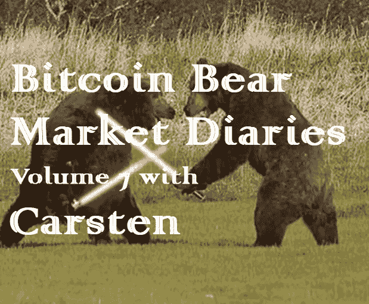
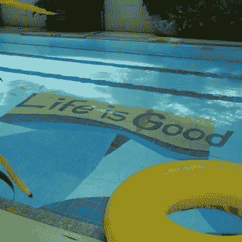

# 卡斯滕的比特币熊市日记第 7 卷

> 原文：<https://medium.com/hackernoon/bitcoin-bear-market-diaries-volume-7-with-carsten-afbe3a0dd6a9>

《比特币熊市日记》是一系列采访，讲述了比特币生态系统中各种重要的声音和观点。每个受访者都是经过精心挑选的，并被问及同一组问题。主要目标是为世界提供一个关于当前比特币和加密市场状况的评论和观点的集合。有些名字你会认识，而其他人不希望成为焦点，但有很好的洞察力和经验，我们都可以学习。

*这些采访是未经加工和过滤的，除了给每个人说出自己想法的机会之外，没有任何议程。如果你喜欢你所看到的，请分享给你的朋友。如果有什么冒犯了你，你可能应该 X 出来，找另一个给你温暖模糊的秘密绒毛片。*

*卡斯滕是我最喜欢的守旧派之一，他来这里不是为了引人注目或出名。他喜欢匿名潜伏在暗处，在 twitter 上发布有见地的评论。他坚持要做这次采访，但告诉他，我觉得在这个日记系列中包含他的见解和经历很重要。*

**姓名:**卡斯滕

**国家:**不想说。

**人家是怎么认识你的？**

有几个人在 Twitter 上关注我对比特币的随想 [@CarstenBKK](https://twitter.com/CarstenBKK) 。我尽量保持低调，我想保护我的隐私，所以我几乎从不参加比特币会议。

**你对比特币感兴趣多久了？**

我不记得我第一次听说比特币的确切时间，但我清楚地记得与一些大学的讨论，讨论亚当·贝克(Adam Back)关于抵制电子邮件垃圾邮件的 hashcash 提议，我对它没有被广泛采用感到多么失望。因此，当我听说比特币及其使用权力时，我一直忽视它，直到我参加了 28c3。后来，我尝试了新的版本 0.5.2。

**最佳比特币体验？**

当我意识到，人们真的会为电脑解谜付钱。

**最差的比特币体验？**

失去朋友，因为他们迫不及待地等待比特币价格回升。向朋友和同事兜售比特币时要小心。

**你认为比特币最大的威胁是什么？**

比特币过高的基尼指数，加上社区在政治和个人信仰上的进一步分裂，有可能对生态系统造成不可挽回的损害。

**你对比特币的各种分叉有什么看法？**

大多数叉子只是无用的尝试，从愿意为它们付钱的人那里赚几块钱。叉子只是另一种替代硬币。BCH 引领了潮流，但如今叉子似乎已成为过去。

你看好这个领域的什么？

我很高兴看到闪电网络社区的发展。技术发展和基于 LN 的早期商业理念将创造出一类新的应用。杰克·多西最近宣布 Square 将支持 Lightning，这是该技术及其应用的一项重大成就。LN 最重要的方面是它所激发的开发热情。我预计 LN 的开发者社区会比以太坊的更大。这将来会有好处的。已经有了第一个原型来创建一个 js 库，在 LN 上实现类似 web3 的应用程序。真的期待空间爆炸。

**上次牛市最大的遗憾？**

我没有把所有的叉子分开卖给 BTC。我忙着在 Twitter 上评论 altcoiners 的收购企图。

**在当前的熊市中，你学到了什么？**

永远不要相信自己。我太乐观了。

**熊市期间你见过的最大失败是什么？**

BSV 和 BCH。

你认为是什么引发了当前的熊市？

这只是一个正常的市场炒作周期。没有什么特别的触发了它，我们只是用完了愿意购买的人。

**你认为最近的价格下跌对买家情绪造成了什么样的损害？**

买家还没有回来。我们仍然是 2017 年 8 月的价格。

**你对闪电网的现状和未来有何感想？**

LN 仍处于早期阶段，仍有许多未解决的问题，但大多数都有解决方案。它还没有为数百万人的黄金时间做好准备，但它已经在工作了。LN 正在复兴比特币可以成为日常货币的想法。LN 的未来将是建立在它之上的应用。我真的很希望看到像 RBG 协议这样的想法得到实施，这将允许我们在比特币的基础上构建复杂和可扩展的应用程序。

**你对霍德林比特币有什么想法？**

我是一个偶然的霍德勒，这是我做过的最好的财务决策。我认为人类的性格特征永远不会改变，比特币正在利用我们贪婪之类的弱点进一步壮大。比特币是第一个去中心化的有效社会工程工具，类似于脸书、Twitter 和其他成熟的平台，这些平台也利用人类特征来发展。

你对另类硬币有什么想法？

另类硬币是比特币成功的一个结果，仍然对完全自愿货币的想法的整体成功构成威胁，因为它们反复表明，有可能出售第二次机会成为比特币 OG 并快速致富的梦想。我真的希望看到 alt-coin 空间的崩溃，但我怀疑这不会很快发生。Alt-coins 试图表明比特币无法生存，因为它没有目前大肆宣传的功能——比如图灵完整性，但他们忘了提到，仅凭这一功能并不能让比特币成为一个成功的故事。

你有吗？

是的。

**你认为另类硬币的大幅下跌会对他们的未来产生什么样的影响？**

他们中的一些将在下一轮牛市中恢复，新的将由 OGs 创造，以获得新的人的钱。但我也看到了一个机会，即下一轮牛市将在赔钱者的痛苦被遗忘之前到来，他们可能会警告他们的同行远离替代硬币。

**关于比特币化的想法？**

永远不要低估人的从众本能。

**你对哪些比特币创业公司感到兴奋？**

主要是关于使用先进比特币功能的初创公司，如 Hodlhodl、Abbra、Bisq，以及更大参与者的金融“初创公司”，如 Bakkt、Fidelity、ErisX、LedgerX。它们表明，比特币仍有很大的技术潜力，这种潜力得到了“大人物”的认可。

**你认为哪些“加密影响者”会弄错，为什么？**

大多数所谓的加密影响者只是在牛市期间出现，并试图为自己的利润兜售比特币以外的其他项目。那些影响者损害了比特币的声誉，并试图使其他项目合法化。零售商的巨大损失可能会导致严厉的监管，这也会损害比特币。这个领域还太年轻，仍有可能在成熟的金融机构面前失败。我预计，一些有影响的人会因为推销未注册证券而陷入严重的麻烦。现在他们中的一些人仍然在嘲笑 Bitconnect Trevon，但他们迟早会停止。

**你认为什么样的“加密影响因素”能让事情变得正确，为什么？**

谈到交易，Tone Vays 对价格预期作为新人主要动力的重要性以及他对另类硬币的立场的理解基本正确。我真的很欣赏他的坚持。我也很欣赏哈素福的工作，因为他试图理解比特币和其他硬币的非技术和社会方面。这是一项重要的工作，因为它有助于我们在进一步发展比特币时认识到自己的缺陷。

**如何才能扭转这一熊市？**

缓慢的情绪变化。我们跌得越低，比特币持有者持有的顽固比特币就越多，供应就会枯竭。对 BCH 友好的 OGs 会明白 BTC 已经步入正轨，他们需要停止出售，开始回购 BTC。

尽管比特币最近有所回落，你对它有多乐观？

比特币将再次发挥作用。下一轮牛市可能会将比特币推高至 10 万美元。这可能是最后一次超过 10 倍。

**你想给刚接触比特币的人一些建议吗？**

耐心点，不要投资超过你承受得起的损失。有足够的储备来度过熊市。

**储存比特币的最佳技巧？**

Glacier 协议创建的纸质钱包或硬件钱包。当你生病或死亡时，想想如何获得你的资金。卡萨可能是一种选择。

**说出一些你最喜欢的信息源和/或播客。**

最近，我对彼得·科马克关于比特币的工作印象深刻。

有什么至理名言吗？

保持谦逊的同时让人们对比特币充满好奇。把他们引向正确的方向。

[*敬请期待下一期熊市比特币日记。你可以在这里找到更多的卷和文章！*](https://hackernoon.com/@piratebeachbum)