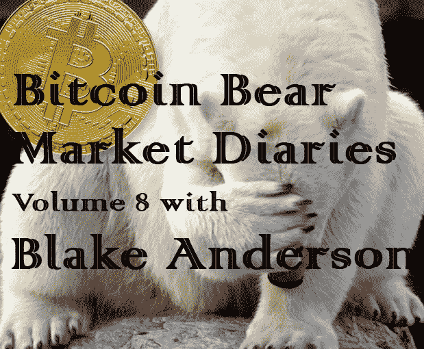

# 布莱克·安德森的比特币熊市日记第 8 卷

> 原文：<https://medium.com/hackernoon/bitcoin-bear-market-diaries-volume-8-with-blake-anderson-b3dccd3013f8>

《比特币熊市日记》是一系列采访，讲述了比特币生态系统中各种重要的声音和观点。每个受访者都是经过精心挑选的，并被问及同一组问题。主要目标是为世界提供一个关于当前比特币和加密市场状况的评论和观点的集合。有些名字你会认识，而其他人不希望成为焦点，但有很好的洞察力和经验，我们都可以学习。

*这些采访是未经加工和过滤的，除了给每个人说出自己想法的机会之外，没有任何议程。如果你喜欢你所看到的，请分享给你的朋友。如果有什么冒犯了你，你可能应该 X 出来，找另一个给你温暖模糊的秘密绒毛片。*

*布莱克·安德森是麻省理工学院毕业的加密经济学家和信息/计算机科学家，他对比特币的研究比大多数人都要久。布莱克的经验和观点是我们可以借鉴的。*

**名称**

[布莱克·安德森](http://MIT educated cryptographic economist and information/computer scientist)

**国家**

美利坚合众国

**别人是怎么认识你的？**

我很早就很活跃，后来放弃了我的假名，改用了我的真名。我在几个会议上发言，写文章，出现在各种节目中，包括定期出现在世界加密网络上大约 5 年。

**你对比特币感兴趣多久了？**

不是我谈论的话题。

**最佳比特币体验？**

利用利润再生一个孩子

**最差的比特币体验？**

被蝴蝶实验室骗了。

**你认为比特币最大的威胁是什么？**

目前，有太多人忽视 psudoanonimmity 最佳实践的风险，这使得那些希望保留该选项的人更难获得强大的隐私保护。

**你对比特币的各种分叉有什么看法？**

我希望那些离开的人能够离开他们离开的社区，专注于他们自己的工作。

你看好这个领域的什么？

我们在赋予人们保护和交易劳动成果的能力方面取得了如此惊人的进步。

**上次牛市期间最大的遗憾？**

没有和我母亲充分沟通，这导致她在顶部大量买入，而不是坚持一元成本平均策略。

在当前的熊市中，你学到了什么？

每一次熊市都向我强调，在低迷时期，重要的工作发生，事情得以完成。

**熊市期间你见过的最大失败是什么？**

凯文·范

**你认为是什么引发了当前的熊市？**

市场状况。

**你认为最近的价格下跌对买家情绪造成了什么样的损害？**

没有任何一种长期趋势会持续到未来的上升趋势。

**你对闪电网的现状和未来有什么感觉？**

我认为这是一个很棒的项目，也是将微支付与比特币强大的安全产品联系起来的有趣方式。

**你对霍德林比特币有什么想法？**

为了个人利益和人类利益，长期持有比特币是一个非常好的想法。

**你对另类硬币有什么想法？**

数字存储的价值膨胀旨在榨取低信息猪。

你有吗？如果没有，为什么？

不。我不认为在没有强有力的价值主张的情况下夸大数字存储的价值是一个好主意，对于许多试图使用“区块链”作为次等数据库的“项目”来说，这种强有力的价值主张是不存在的。

**你认为 alt-coins 的大幅下跌会对他们的未来产生什么样的影响？**

硬币有激进的下降，他们不会恢复，将酸味某一 calibur 投资者投机没有效用。

**关于比特币化的想法？**

以数学稀缺性衡量的比特币和价值的数字存储，将开启一个交易媒介竞争的时代，这种竞争被浪费的中央计划推迟了太久。

**你对哪些比特币创业公司感到兴奋？**

我是节点项目和创业公司的粉丝。

你认为哪些“潜在影响者”弄错了，为什么？

我认为，任何推动比特币的人都应该学习关于权利与义务的一切知识，应该能够在所有真实情况下论证存在主义的优越性，然后才能假设他们可以帮助赛弗朋克所从事的努力。

你认为什么样的“加密影响因素”能让事情变得正确，为什么？

Janine [@J9Roem](https://twitter.com/J9Roem) 是一个真正的记者，当她的发现很重要时，她会挖掘真相并努力将其公之于众。她不自视甚高，也不会无休止地寻求关注。她不会夸大事实，这让她能够在社区面临危险时发出有效的警报。

如何才能扭转这一熊市？

周期是市场的一部分，随着我们继续走向平静，对比特币的需求将会增加。

尽管比特币最近有所回落，你对它有多乐观？

我就像当初比特币一文不值的时候一样看好它。

**你想给刚接触比特币的人一些建议吗？**

找出为什么比特币是有价值的，并创建一个包括平均成本和长期投资的投资理论。避免日内交易和技术分析，以免被机器人、鲸鱼和犹大蜡烛活活吃掉。

**储存比特币的最佳技巧？**

多重签名冷藏。

**说出一些你最喜欢的信息源和/或播客。**

块摘要

有什么至理名言吗？

在信息时代，现代人的任务是从哲学上理解权利和伦理。相对于理解什么是正确和公正，我们向机器和软件教授理性，这些努力的重要性不可低估。

[*敬请期待下一期熊市比特币日记。你可以在这里找到更多的卷和文章！*](https://hackernoon.com/@piratebeachbum)