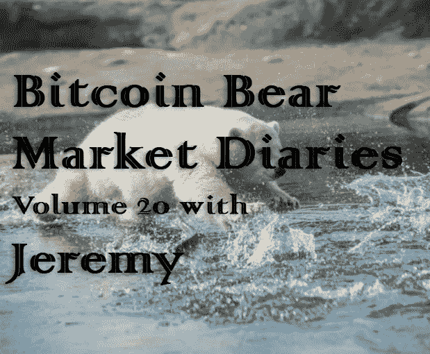
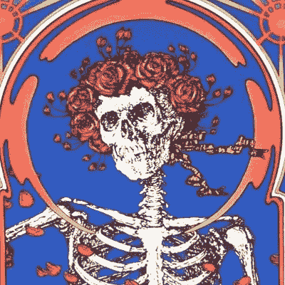

# 比特币熊市日记第 20 卷与杰里米

> 原文：<https://medium.com/hackernoon/bitcoin-bear-market-diary-volume-20-with-jeremy-74f79f5b610>

T 何[比特币熊市日记](https://hackernoon.com/@piratebeachbum)是一系列采访，讲述了比特币生态系统中各种重要的声音和观点。每个受访者都是经过精心挑选的，并被问及同一组问题。主要目标是为世界提供一个关于当前比特币和加密市场状况的评论和观点的集合。有些名字你会认识，而其他人不希望成为焦点，但有很好的洞察力和经验，我们都可以学习。

*这些采访是未经加工和过滤的，除了给每个人说出自己想法的机会之外，没有任何议程。如果你喜欢你所看到的，请分享给你的朋友。如果有什么冒犯了你，你可能应该 X 出来，找到另一个给你温暖模糊的秘密绒毛片。*

[*Jeremy*](https://twitter.com/________jeremy) *，原名*[*@ SeasideCrypto*](https://twitter.com/________jeremy)*，是一位低调的比特币创造者，他在俄勒冈州的海边创立了 Seaside crypto，人们可以去那里购买比特币。这家店已经关门了，但杰里米的实际经历是一个比特币企业家经历磨难的完美例子。杰里米目前正在筹备 2019 年 5 月 19 日的* [*波特兰比特币大会*](https://portlandbitcoinconference.com/) *，他有一个有趣的故事，我们都可以从中学习。*

**名称**

杰里米

**国家**

美国俄勒冈州海滨

人们是如何认识你的？

首先是@SeasideCrypto，现在是 [@________jeremy](https://twitter.com/________jeremy)

你对比特币感兴趣多久了？

第一次接触:2012 年初

首次购买:2013 年初

第一次投降:2013 年末

首笔付款接受时间:2014 年初

第一个节点:2015 年末

开始海边加密:2017 年年中

**最佳比特币体验？**

有几次，人们来到我的店里，带着一个怀疑者——通常是一个他们无法说服的家庭成员。我能够帮助他们以不同的方式构建他们的论点，让他们以更富有成效的方式与他们所爱的人交谈。那些对我来说是很好的经历。

**最差的比特币体验？**

在 Seaside Crypto 显然没有引起当地太多关注的情况下，我过度使用了它，并且坚持了太长时间。我不后悔，但我可能会找到一种更便宜的方式来实现我传播意识和教育的目标。

**你认为比特币最大的威胁是什么？**

气候变化。

**你对比特币的各种分叉有什么看法？**

我一直不明白其中的逻辑。比特币一直是关于它的用户网络，任何分叉都只是一个更小、更不安全的网络。我不明白这有什么吸引力。

**你看好这个领域的什么？**

监视的终极毁灭-法西斯主义。

**上次牛市期间最大的遗憾？**

实际上，我觉得上一次我处理得相当好。我之前彻底搞砸的那次。但是你活着并且(希望)学习。

**在当前的熊市中，你学到了什么？**

抛开对自己技术能力不足的恐惧，尽可能多地实现不同类型的软件，即使我犯了一个错误。在推特上更加公开和诚实地谈论我在这个过程中面临的挑战，即使这会让我看起来很傻。

**熊市期间你见过最大的败笔是什么？**

我对自己预测价格变动能力的自负。我很努力不再那样做了。

**你认为是什么引发了当前的熊市？**

我真的不知道那是什么意思。这是一只熊吗？换个角度看可能就是牛。自今年年初以来，比特币已经上涨了 30%以上。我不确定这些标签能提供什么真正的见解。我有一种感觉，它们仅仅是我们用来强化我们的自我和满足我们内心希望发生的事情的投射。

你认为最近的价格下跌对买家情绪造成了什么样的损害？

如果像我们去年看到的价格下跌影响了你的情绪，你就不是比特币的真正买家。你是一个投机者，交易的只是另一种金融工具。我觉得两者有本质区别。

**你对闪电网的现状和未来有什么感觉？**

我感到乐观。闪电非常聪明，许多聪明能干的人都在努力工作。前面有大量的挑战，有些我们才刚刚开始讨论，但我认为它们会在适当的时候得到解决。

**你对霍德林比特币有什么想法？**

为比特币确定一个合理的最终价值。我认为我们应该在 2030 年之前达到 2019 年的美元/日元平价。这是一个咄咄逼人的立场，但我有我的理由。但是要自己下决心。一旦你决定了一个最终价值/时间框架，获得你想要的数量，然后把它放入你选择的冷藏方法中。然后为了更好的测量，再做一次，放在不同的冷藏方法中。根据需要重复。一旦你对自己的冗余水平感到满意，那就获取更多，并用它来支持这个领域中有趣的项目和人。

你对另类硬币有什么看法？

自上世纪 90 年代末以来，我就对“数字货币”感兴趣。当时我在军队服役，是一个军事情报营的法律专家，负责调查一种名为“DMT”的原始隐私硬币，这种硬币是由一个海外团队在哥斯达黎加开发的，我对这个主题非常着迷。当我最终发现比特币时，这一经历让我在理解它的价值方面占据了优势(尽管我还是花了令人尴尬的很长时间才‘明白’)。所以在过去的 20 年里，我怀着极大的兴趣关注了许多不同的项目。在我像现在这样理解比特币之前，我认为培育一个由不同硬币组成的生态系统可能有一些价值。我现在认为它们无关紧要，效率低下。关键是创造一种对所有人都有效的新货币。那就是比特币。其他的都是不需要自己的钱/令牌就能工作的软件项目。其中一些项目可能真的很棒，但它们不是钱。

**你有吗？如果没有，为什么？**

没有。我确实在以太坊上市时买了一个，并试图同步一个 geth 节点进行实验，看看有什么大惊小怪的，但我没有成功，并很快卖了回去。

**你认为另类硬币的大幅下跌会对他们的未来产生什么样的影响？**

我真的没有考虑太多，但是我想象这会增加早期投资者对各自开发团队的压力，导致不切实际的期望和未满足的需求的恶性循环，从而导致项目被放弃。很少有人能超越业余爱好者的发展水平。

关于比特币化的想法？

1)不可避免。2)它代表了贵族的生存危机。这不会很美好，但如果我们挺过来了，并且在这个过程中没有烧毁地球，它将被视为一场与农业、工业和信息革命一样的革命。这将是一场货币革命。

**你对哪些比特币创业公司感到兴奋？**

我将从广义上理解“比特币创业公司”这个术语…

1)块流

2)正方形

3)芥末

4) Samourai

5) BTCPay 服务器

6)推特

7) Bisq

8)闪电实验室

9) Tor 项目

10) Zap 钱包

11)黑客日

12)纯粹主义

13) GoTenna

14) Nodl

15)密码节点

16)硬币

17)帕拉莱尼波利斯

18) Betterhash

19)库贝索斯

20) Cwtch

21)无限舰队

22)数据中心技术

23)特雷佐

24)比特笔芯

你认为哪些“潜在影响者”弄错了，为什么？

见下文。

**你认为哪些“加密影响者”做对了，为什么？**

我要把这两个一起拿走。忽略这些人，转而关注建造东西的人。

**如何才能扭转这场熊市？**

我不确定，也不在乎。该发生的时候就会发生，每个人都会有一个理论。

尽管比特币最近有所回落，你对它有多乐观？

我对比特币的最后一丝疑虑在 2017 年 8 月 1 日烟消云散。

**你想给刚接触比特币的人一些建议吗？**

去当地的社区大学报名参加“Linux 入门”课程。

**储存比特币的最佳技巧？**

用当铺的现金买一台便宜的电脑。安装比特币核心。把你的比特币发给它。拔掉计算机的电源。等 10 年。

**说出一些你最喜欢的信息源和/或播客。**

我喜欢过(排名不分先后)WorldCryptoNet，Block Digest，TFTC，Stephan Livera。我相信很多其他的也不错，但是我更喜欢阅读而不是播客，所以我听的不多。

有什么至理名言吗？

正在创造未来的比特币制造者远远多于试图阻止未来发生的人。不要让任何人欺骗你，让你相信并非如此。不要让白痴分裂我们，我们是强大的，我们将赢得一个新的世界，一个公平自由的世界。我期待在那里见到你们！

[*敬请期待下一期熊市比特币日记。你可以在这里找到更多的卷和文章！*](https://hackernoon.com/@piratebeachbum)