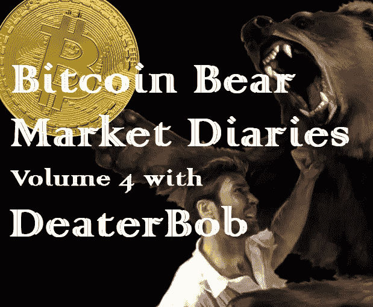
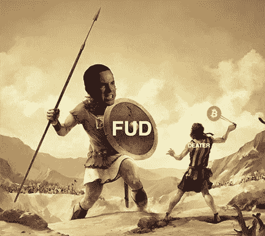

# 比特币熊市日记第 4 卷

> 原文：<https://medium.com/hackernoon/bitcoin-bear-market-diary-volume-4-with-deaterbob-c131a110cddd>

《比特币熊市日记》是一系列采访，讲述了比特币生态系统中各种重要的声音和观点。每个受访者都是经过精心挑选的，并被问及同一组问题。主要目标是为世界提供一个关于当前比特币和加密市场状况的评论和观点的集合。有些名字你会认识，而其他人不希望成为焦点，但有很好的洞察力和经验，我们都可以学习。

*这些采访是未经加工和过滤的，除了给每个人说出自己想法的机会之外，没有任何议程。如果你喜欢你所看到的，请分享给你的朋友。如果有什么冒犯了你，你可能应该 X 出来，找另一个给你温暖模糊的秘密绒毛片。*

*DeaterBob 是一位经验丰富的比特币创造者，他没有任何从属关系，也没有任何议程，并且是比特币的坚定捍卫者。他赢得了“野蛮的迪特尔”的绰号，因为他的史诗般的咆哮和反驳引出了许多该领域的顶级影响者。*

**名称:**消音

国家:美国

**人家是怎么认识你的？**

我活跃在 twitter 上，以 [@DeaterBob](https://twitter.com/DeaterBob) 的身份提供评论并与比特币爱好者交流。当我遇到骗子或骗子时，我会直取要害！

**你对比特币感兴趣多久了？**

我从 2013 年 3 月@ $47 开始玩这个游戏。

**最佳比特币体验？**

绝对是比特币打到 2 万美元的时候。我泪流满面！虽然我没有因为经济利益而哭泣。我被战胜怀疑者的感觉所征服。我忍受了 5 年的同行对我投资和相信比特币的贬低，我终于被证明是正确的！我非常关心比特币的总体成功，不管别人怎么说，价格确实很重要。

**最差的比特币体验？**

我在比特币基地的账户在 2017 年初被“随机”审计，在我无法证明两个两年前的小 BTC 付款是干什么的后，他们永久关闭了我的账户。我说终于摆脱了！

**你认为比特币最大的威胁是什么？**

比特币面临的最大威胁肯定是对一个漏洞的成功利用。在这点上，所有的代码推送都是极其危险的，这就是为什么所有的代码推送都会迎来一段很长的不确定期。最后一个 bug 在那里坐了两年都没人发现！紧随其后的是政府禁止使用比特币的严厉举措。这不会“杀死”比特币，但肯定会推迟“大规模采用”。

**你对比特币的各种分叉有什么看法？**

像 BSV 和 BCH 这样有争议的分叉不是比特币，也永远不可能成为比特币。称它们为“比特币”是一个骗局。此外，BCH 和 BSV 不是比特币项目或实验。BCH 和 BSV 是以“比特币”命名的新网络，通过现有的比特币 UTXO 空投了大量奖金。

你看好这个领域的什么？

比特币对社会最大的潜在附加值是作为一种不受审查的自由市场价格发现工具，对商业银行和央行不计后果的信贷扩张提供制衡。

总会有像银行和政府这样的精英富裕的“受信任”实体愿意相互发行和交易信贷，从而创造一个信贷市场。我不讨厌菲亚特/信用卡。我讨厌的是价格发现工具的审查或扭曲，这创造了一个有利于*信用扩张的环境。*

*黄金和石油是最接近可用的自由市场价格发现工具的东西，但这些资产无法提供准确或未经审查的价格发现，因为这些资产在现代大规模票据市场中太容易被操纵，这是由于实物交割的负担、缺乏对实物交割或持有的不可信确认，以及在石油的情况下由卡特尔操纵价格(石油输出国组织)。*

*比特币是有史以来最容易交割的硬资产。实物交付和持有可以在一个不可信的庄园中得到确认，由于比特币的供应上限和分散性质，没有卡特尔可以形成来控制供应扩张或收缩，以操纵供应或价格。*

*比特币的金融化(在 BTC 结算的期货合约的成熟，ETF 的，保险托管人)有可能将自由市场价格发现重新纳入全球经济，结束中央银行系统不受约束地统治全球经济！*

***上次牛市期间最大的遗憾？***

*当价格高于 15，000 美元时，不要用更多的 BTC 换美元。抛物线跑让我措手不及，毫无心理准备。我从来没有想到价格会涨得这么高这么快。学到的教训是要有一个计划，交易/消费你已经拥有多年的硬币是可以的。比特币终究只是钱……*

***在当前的熊市中，你学到了什么？***

*我发现了谁是先来革命的，谁是先来利益的。*

***熊市期间你见过最大的败笔是什么？***

*这必须是文尼林厄姆，没有竞争！他建议人们以 2000 美元左右的价格卖出 BTC，支持 Bcash 火车事故，并发行了价值缩水 95%的 ICO 代币。*

***你认为是什么引发了当前的熊市？***

*我认为抛物线跑得太高太快，造成了出口的恐慌。此外，对于像我这样的人来说，很难认为这是一个熊市，因为价格仍然是我购买第一批硬币时的 75 倍。*

*你认为最近的价格下跌对买家情绪造成了什么样的损害？*

*他们肯定很害羞，但仍然很感兴趣。当你看市值时，它只有 600 亿美元。真的是微不足道。投资者仍然看到了大量的增长机会。他们会回来的！*

***你对闪电网络的现状和未来有什么看法？***

*绝对惊艳！杰克·多西最近表示，Lightning 将在 CashApp 上推出。未来还会更光明吗？*

***你对比特币有什么看法？***

*每个负责任的人都应该有某种长期储蓄，还有什么比 BTC 更好的储蓄方式呢？*

*你对另类硬币有什么想法？*

*altcoins 没有错。我只是觉得都不值得投资。所有的替代币都是当下的特色，因为所有的替代币最终都会被比特币解决方案、另一种新的替代币淘汰，或者用例永远不会超越利基需求。此外，比特币是唯一一种可以长期存在的固定供应加密技术。所有其他的固定供应密码要么将分叉为更多的通货膨胀，要么遭受哈希死亡螺旋或紧急困难调整。*

*你有吗？如果没有，为什么？*

*我目前没有任何代用币。我在 FOMO 期间做交易。耐心等待再次交易！*

***你认为 alt-coins 的大幅下跌会对他们的未来产生什么样的影响？***

*也许当 BTC 开始下一轮牛市时，低价位会再次被抬高，但谁知道呢。*

***关于比特币化的想法？***

*我认为比特币化有点像推销。这意味着银行将基本上不复存在，法定货币将消失，我认为这不会发生。我很期待比特币的金融化，之后会怎么样我们拭目以待！*

***你对哪些比特币创业公司感到兴奋？***

*凯西和巴克特。两者都将有助于引领 BTC 的金融化。*

***你认为哪些“加密影响者”会弄错，为什么？***

*最近是凯文·范。他不明白为什么在区块链上存储视频之类的东西会导致网络的中心化，最重要的是，他不明白一个有争议的分叉不是比特币，也永远不可能成为比特币。他完全恢复了自己的品牌和声誉。伤心！*

***你认为什么样的“加密影响因素”能让事情变得正确，为什么？***

*我最喜欢的是吉米·宋、图尔·德米斯特和彼得·托德。他们非常坦率，真诚，有干净的脸。罕见！所有这些人都知道自己的事情，并且乐于提供信息，从来没有兜售过狗屎硬币。*

*如何才能扭转这场熊市？*

*采用的时间和基本消息，如富达推出托管服务或 Bakkt 获得监管批准。距离上次高峰已经过去了 14 个月。信心正在慢慢恢复。最终的看涨事件将是政府、银行或公司宣布正式长期持有 BTC。*

***尽管比特币最近有所回落，你对它有多乐观？***

*很牛。只要没有人在代码中放一个 bug，从长远的角度来看，前面的天空是晴朗的。*

***你想给刚接触比特币的人一些建议吗？***

*不要让“新闻”吓到你，慢慢积累 BTC，把它当成一个长期储蓄账户。千万不要 FOMO 买！中产阶级的一个伟大目标是拥有 2.1 BTC。拥有 2.1 BTC 是供应量的千万分之一，相当于今天价值 80 万美元的黄金。*

***储存比特币的最佳技巧？***

*存储比特币是一件严肃的事情。如果你不认真对待它，你最终会失败。我推荐 Trezor，因为你有自己的钥匙，而且设置非常简单，因为网站上有演示。不是你的钥匙，不是你的硬币！*

***说出一些你最喜欢的信息源和/或播客。***

*在 twitter 上关注 Jimmy Song、Tuur Demeester 和 Peter Todd。它们可以构成你的全部饲料，你会见多识广，学到超乎你想象的东西。*

*有什么至理名言吗？*

*当我还是个菜鸟的时候，我犯过的最大的错误就是盲目相信“有影响力的人”马克斯·凯瑟曾经兜售像 Startcoin 和 Maxcoin 这样的狗屎硬币。我买了它们，结果却丢失了许多本该继续保存的 BTC。坚持 BTC！*

*[*敬请期待下一期熊市比特币日记。你可以在这里找到更多的卷和文章！*](https://hackernoon.com/@piratebeachbum)*