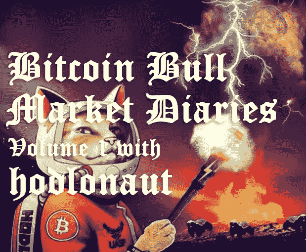
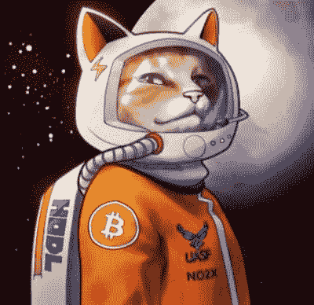

# 霍德洛纳特的比特币牛市日记第 1 卷

> 原文：<https://medium.com/hackernoon/bitcoin-bull-market-diaries-volume-1-with-hodlonaut-972ba806aead>

Thanks to [@CryptoScamHub](https://twitter.com/CryptoScamHub) for the awesome cover art meme.

在上一次比特币熊市的严寒黑暗中，我发起了一系列名为[比特币熊市日记](/@piratebeachbum)的采访。尽管比特币的价值已经大幅下跌，但仍有一群核心比特币创造者，他们不抱任何希望，并坚信比特币会反弹。

在这个动荡的时代，这些采访报道了许多这样的声音，以及他们的想法和市场观点。贯穿所有[比特币熊市日记](/@piratebeachbum)的共同主线是，尽管胡说“比特币将会消亡！”传言称比特币将会再次上涨。

**快进到我们今天的位置。比特币又回来了，婊子们，就像我们知道的那样！**

许多读过[比特币熊市日记](/@piratebeachbum)的人在比特币突破 8000 美元时将其扼杀后，敦促我开始一个新系列。说了这么多，我想给你介绍一下比特币牛市日记。这个新系列与旧格式相似，但有不同的问题和新的声音。

*霍德洛纳特是我的老朋友和热心的比特币爱好者，你们很多人都知道他是传说中的太空猫！霍德洛诺特是第一个* [*比特币熊市日记*](/hackernoon/bitcoin-bear-market-diaries-volume-1-with-hodlonaut-124c4467b05e) *，所以我认为他开始比特币牛市日记系列是再合适不过的了。霍德洛诺特以创造传递火炬的病毒式轰动而闻名，他的视角和洞察力是每个人都可以学习的。*

**名称:**霍德洛瑙特

**国家:**挪威

人们是如何认识你的？

可能来自我的推特账号@hodlonaut。

你对比特币感兴趣多久了？

我在 2013 年发现了比特币

**最佳比特币体验？**

在 CSW 追杀我之后，我得到了巨大的爱和支持。两人都充分证明了比特币社区的强大和支持。是的，我知道有些人声称没有所谓的比特币社区。对我来说，这仅仅是语义和单词分裂，因为我清楚地体验到了它的存在。

**最差的比特币体验？**

在秘密空间受到合法的骚扰和威胁。

**你认为比特币最大的威胁是什么？**

我仍然认为社交攻击媒介是最大的威胁。幸运的是，我们现在有了一支由极度活跃的有毒平民组成的军队来抵御这种威胁。似乎我们实际上已经从历史中吸取了教训，坏演员被无情地叫出来。

**你对比特币的各种分叉有什么看法？**

没有一个是建立在诚实的意图上的。它们是攻击。失败的攻击最终加强了蜜獾的盔甲。

**你看好这个领域的什么？**

我极其看好比特币。我每天都为那些努力推动比特币发展的聪明、冷静、勤奋和有原则的人感到谦卑。这真的感觉像是一生中一次深刻改变世界的机会，我相信这真的就发生在我们眼前。

慢慢地。然后一下子。

**上一次熊市中最大的遗憾是什么？你学到了什么？**

我真的不做后悔的事，但是在 2018 年初买 alts 企图拿回更多 btc 是很愚蠢的。

在上一次熊市中，你观察到的最大失败是什么？

人们通过使用各种叉子放弃了他们的信誉和正直。

你认为是什么帮助扭转了当前的牛市？

一部分只是市场周期。但在这背后，每一项基本指标都有所改善。Hashrate 现在是 2017 年 12 月价格到达 ATH 时的 5 倍。Lightning Network 已经得到验证，其生态系统已经成长和成熟。监管不确定性大大改善，托管解决方案、机构入口等..这波牛市将是史诗般的。

**上一次熊市的功臣是谁？**

所有的人都在不停地建造。

所有的人都不停地喊着。

所有坚持教育的人。

**你觉得 alt-coins 为什么还在挣扎？**

altcoin 用例叙事的消亡，结合不断出现的更明显、更成熟的比特币用例。

在整个熊市期间，新人的涌入量较低，有毒的比特币制造者设法阻止了诈骗。当这个牛市升温，我们获得一些欣快和成群结队的新人时，我们将看到低价竞标是否会(暂时)卷土重来。

对于那些宣称另类赛季即将到来的人，你有什么要说的？

你可能是对的。但在这一点上，我怀疑它会强大，也不会持久。

**你持有任何 alts 吗？如果没有，为什么？**

早在 2018 年初，我变得贪婪，装载了一些 alt 包。当时市场非常不理性，我想我可以增加我的 BTC 筹码。这种情况并没有发生，我反而减少了筹码。

我仍然拿着其中的一个包作为宠物，并提醒我不要购买 alts。

**如何看待即将到来的比特币减半，以及对比特币价格的影响？**

我认为，每天仅开采 900BTC 的影响，加上稳步增长的需求，将启动一个更高价格——更多需求——更高价格的加速良性循环。比特币到底有多稀缺的现实将开始显现。

你认为是什么让比特币优于其他任何东西？

它多年来一直默默无闻，这使得它成为一个真正的分散化现象，已经经受住了几次严厉的攻击。crypto 所有最聪明、最有动力、最有原则的人都在从事比特币的工作。在我看来，将它与其他任何东西进行比较都是荒谬的。

**你认为各国央行正在或将会积累比特币吗？**

我不认为他们是。我肯定他们会的。

**你对闪电网络的现状和未来有什么看法？**

LN 是极其令人兴奋的技术。这个星球上一些最聪明的人每天都在努力工作，推动它向前发展。即时微交易，本质上是流式支付，极具破坏性，很难理解。我认为 LN 将是世界交易的方式，而基础层是结算和价值储存。

**你对 HODLing 比特币有什么想法？**

霍德林是比特币的信念层。你无法理解比特币的前景，也无法理解 hodl 的前景。它是每个进入比特币兔子洞的人的自然归宿。最后手段的霍德勒形成了比特币估值的基石。要想变强，你必须掌握低时间偏好，这是性格的塑造。很难掌握，但就像呼吸一样容易。

**你对比特币极大主义有什么看法？**

我不认为每个人都同意比特币最大化意味着什么。我自己也不确定。但如果我们把它理解为拒绝其他加密项目，并相信比特币将是唯一一个站得住脚的东西，基于真正的去中心化和不变性，我认为这是大多数加密人员不可避免会最终成为的东西。对于这个领域来说，比特币最大化是自然、理性和健康的。不过，我不同意比特币之外的一切都是骗局的说法。

**现在对比特币化有什么想法？**

我绝对认为超比特币化会发生。这个世界迫切需要真实、稀缺的价值和永恒的真理。比特币是一个黑洞，劣币无处可逃。

**随着价格的上涨，你认为比特币的统治地位会怎样？**

我的猜测是，比特币的主导地位将会增加，直到我们到达 ATH，然后随着新人涌入这个领域并成为另类叙事的猎物，比特币将会出现短暂的小幅调整。

某人需要做些什么来证明他们是真正的中本聪？

就我个人而言，我甚至不会把与创世纪区块的签约作为决定性的证据，但我想这将是尽可能接近的。真正的中本聪永远不会试图证明他是谁。

**你对哪些比特币创业公司感到兴奋？**

我觉得 Lolli 真的很适合领养和堆积 sat。此外，作为一名挪威人，我期待着挪威大宗商品交易所今年推出。

**你认为哪些“加密影响者”弄错了，为什么？**

所有出售卡什、BSV、瑞波或以太的人。原因很明显。

**你认为什么样的“加密影响者”能让事情变得正确，为什么？**

外面有那么多很棒的声音，所以很难挑选。但是 Pierre Rochard 一直都是对的。他是一个有毒的比特币学者，也是一个绅士。

**你认为未来 5 年市场会走向何方？**

去月球。可能在月球之外。

**储存比特币的最佳技巧？**

像 Trezor 或 Coldcard 钱包这样的硬件钱包。然后有一个安全储存种子的好办法。

**你想给刚接触比特币的人一些建议吗？**

不断学习，不断叠加 sat。不过，这种情况会自行发生。比特币兔子洞最后不让任何人出来，把所有人都学校化了。

**说出一些你最喜欢的信息源和/或播客。**

比特币推特对我来说是最有价值的存在和信息来源。

有一些很棒的播客。我最喜欢的是 Stephan Livera 播客，来自地穴的故事和比特币的作用。

一些鲜为人知的比特币播客质量一流，值得更多的听众，如“底层比特币”、“加密乐趣”、“公民比特币”和“比特币和..”。

我非常尊重所有这些内容提供商，他们做了非常重要的工作，不断改善我们的集体地图和对比特币一切的理解。

**你对玉米卷的迷恋是什么？**

我从小就喜欢玉米卷。我特别喜欢他们辣，最好吃的是地摊上卖的。如果你做玉米卷时太努力，它们就不会那么好吃了。你可以在里面放任何你想要的东西，它们最适合与朋友和家人一起享用。有什么至理名言吗？

我会让马库斯·奥勒留完成这个。

“如果不对，就不要做。如果不是真的，就不说了。”

*敬请关注下期牛市比特币日记。我有一些令人敬畏的采访在排队，并将定期投放新的卷。特别感谢霍德洛纳特和我们所有的墨西哥玉米卷食肉动物比特币平民同胞！感谢*[*@ cryptoscaphub*](https://twitter.com/CryptoScamHub)*给力的封面艺术 meme。*