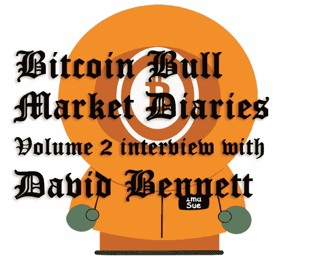
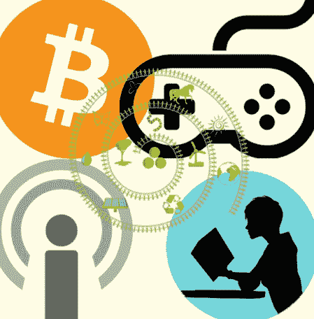

# 比特币牛市日记第 2 卷大卫·班尼特访谈

> 原文：<https://medium.com/hackernoon/bitcoin-bull-market-diaries-volume-2-interview-with-david-bennett-9b467ced660c>

自 2015 年以来，大卫·贝内特一直是比特币的公开支持者，他主持了“[比特币和…](https://podcasts.apple.com/us/podcast/bitcoin-and/id1438789088?mt=2) ”播客，其中他邀请了各种嘉宾讨论各种比特币话题。

我在比特币推特上认识了大卫，很多人都知道他的名字是[努纳娅·毕蒂斯](https://twitter.com/bennd77)。大卫的经验和视角使他成为比特币牛市日记第二卷的完美候选人。

*欲了解更多关于比特币牛市日记的背景和历史，请查看* [*《比特币牛市日记》第一卷采访霍德洛瑙特*](https://www.hackernoon.com/bitcoin-bull-market-diaries-volume-1-with-hodlonaut-ut1a643row) *。*

**名称**

大卫·贝内特

**国家**

美利坚合众国

**别人怎么认识你？**

主要靠我的推特账号 [@bennd77](https://twitter.com/bennd77) 和我的播客[比特币和。。。](https://podcasts.apple.com/us/podcast/bitcoin-and/id1438789088?mt=2)

你对比特币感兴趣多久了？

2015 年 9 月 11 日

**最佳比特币体验？**

2017 年牛市！

**最差的比特币体验？**

整个“缩放战争”在 BCH 福克达到高潮

**你认为比特币最大的威胁是什么？**

冷漠

**你对比特币的各种分叉有什么想法？**

所有这些都是对比特币的攻击，也是对发布比特币的人的名誉的攻击。我认为，这种声誉的丧失现在才刚刚开始被犯下这些罪行的各种个人所感觉到。这个领域的声誉极易燃烧，会在瞬间化为灰烬。

**你看好这个领域的什么？**

一切！但我最看好整个行业的快速增长。

上一次熊市中最大的遗憾是什么？你学到了什么？

当熊卖了一些比特币，恰逢一个改变生活的事件(搬到一个新的城市)，但后来意识到我并不真的需要太多，因为我家两年前做的一笔石油和天然气交易获得了回报。

拿走:永远不要出售你的比特币，只积累它，至少直到它实现接近最大的潜力，然后尝试只“出售”直接的商品和服务，而不是法定货币。

在上一次熊市中，你观察到的最大失败是什么？

凯文·范卖给了 BSV。空间中的许多名字也烧毁了他们的声誉，但他的逆转是我见过的最令人畏缩的事件之一。

你认为什么有助于扭转当前的牛市？

持续的“机构收养”标题是我最好的猜测，但我认为这不是正在发生的一切。说实话，我觉得没人真的知道。

**对于声称比特币将跌至 0 美元的人，你有什么要说的？**

在持续不死的 10 年里，比特币从未跌至 0 美元。它从那里开始，但它从来没有回到那里。。。一次都没有。10 年了。

**谁是上次熊市的英雄？**

无情无义的比特币最大化主义者。

**你觉得 alt-coins 为什么还在挣扎？**

它们是不必要的，越来越多的人意识到这一事实。

对于那些声称另类赛季即将到来的人，你有什么要说的？

“咩”？说真的，随着时间的推移，我越来越没有兴趣回应替代者了。这并不是说我不喜欢其中的一些。我关注许多另类投资者，因为他们太搞笑了，而且他们似乎对自己的地位有一种健康的尊重，不会真的把自己的包“先令”到自己团体之外。德根集团是我所描述的集团之一。

**你持有任何 alts 吗？如果没有，为什么？**

我有一大袋 Doge，一些 LTC 和非常少量的 ETC

**如何看待即将到来的比特币减半，以及对比特币价格的影响？**

"这还没算进去呢，老兄！"我只经历过一次 halvening，我不记得它做了这么多。从图表来看，这两次下跌都发生在熊市，并没有立即影响价格。不过，我预计这个数字不会马上上升。希望我是错的，它穿透了奥尔特云。

**你认为比特币优于其他任何东西的原因是什么？**

扎实，慢，笨，简单。因为有了这个基础架构，很多东西都可以在其上构建，而不会受到基础层的干扰。

**你认为各国央行正在或将会积累比特币吗？**

我相信，我认为他们会及时加速购买，但我没有这方面的证据。这只是一种直觉。

**你对闪电网的现状和未来有什么感觉？**

我对《走出大门》感到兴奋！作为建立在基础层上的第一个坚实的层，它显然有一些问题，但期望这个领域的任何东西，就技术而言，从一开始就完美无缺是非常短视的。随着 LN 的完善和所需功能的增加(如瞭望塔)，我们将看到它的到来，我认为这很快就会实现。

**你对 HODLing 比特币有什么想法？**

这是目前唯一的出路。向世界展示最初的稀缺性很重要，这样才能不断获得信任。由于选举或津巴布韦令人难以置信的金融管理不善，生活在菲亚特一夜之间下跌 20%的地方的人们的信任将成为价格的推动者，因为他们退出了非常糟糕的菲亚特系统。

**你对比特币极大主义有什么看法？**

总而言之，我认为最大化主义是好的。他们不是想抢劫你，而是想帮助你。这一领域的诈骗数量相当于 19 世纪美国的淘金热，新手们至少需要有人给他们指出正确的方向。

**关于比特币化的想法？**

完全的比特币化可能不会在我的有生之年发生，但这不会让我感到不安。菲亚特可能不会消失，但我不确定这有什么关系，因为世界上生活在严酷和管理不善的经济下的人比比特币还多。多几个数量级。我认为任何与比特币化的相似之处都将在很大程度上受到这些人的推动。

随着价格的上涨，你认为比特币的统治地位会如何？

它只会随着粪便蒸发到太空中而增加。

一个人要怎么做才能证明自己是真正的中本聪？

这个人必须在摄像头和屏幕截图的同时，登录与 Satoshi 相关的每个社交媒体账户，然后在这些账户上实时显示硬币的运动(或签署消息)，现场有多个目击者，其中没有一个人与该人直接相关。我指的是每一个原始账户，不是 5 个账户中的 2 个或者 6 个账户中的 3 个，而是每一个他发过邮件，发来邮件等等的账户。

**你对哪些比特币创业公司感到兴奋？**

Lolli、Fold、上游数据公司和 Nodl

**你认为哪些“加密影响因素”会出错，为什么？**

罗杰·维尔。他让自己对比特币的热情阻碍了自己，并被这种热情绊倒了。分叉比特币在我眼里稀释了比特币的价值，没有必要。他提出的每一个规模/效率论点都被证明是不正确的；稀缺性不仅与“钱”有关，还与区块大小有关。如果我们让块空间变得很大，我们也会让它变得不那么“有价值”。此外，大型建筑不如小型建筑灵活，更容易被政府的防火墙阻挡。

**你认为什么样的“加密影响因素”能让事情变得正确，为什么？**

马蒂·本特的超级粉丝。他做得很好，因为他不会让任何形式的狗屎故事影响他。这种形式的道德规范是必须的，这样新人就不会被炒鱿鱼。

你认为未来 5 年市场会走向何方？

更多的创新，更高的效率和我最兴奋的是所有我无法想象的事情。4 年前，我甚至不知道 GoTenna，而现在，通过网状网络传递来自 GoTenna 的交易已经成为可能。我希望我们能够从 GoTenna 向 HAMM 无线电接收器发射一个闪电交易，然后中继到 Blockstream 卫星，最后到达太平洋中部的卫星电话上。

**储存比特币的最佳技巧？**

好吧，你可以按照冰川协议去做，但如果做不到这一点，你就去拿一张冷卡和几根零钱。一定要确保你的种子短语已经存储好了，而不是在联网的电脑上。见鬼，我会把我写的 seed 短语埋在我财产的某个地方，放在一个密封的防火/防水的盒子里。如果你把种子放在保险箱里，你会被骗的。你必须把它存放在一个不能被关闭、关闭或以其他方式泄露的地方，并进行复制。

**你喜欢墨西哥卷饼和比特币的什么？**

两者都可以作为交换媒介，有时两者都在出售。玉米卷很好吃。。。比特币则不然。老实说，我在等闪电披萨店的伙计们把玉米卷加到他们的产品里。然后我可以用不好吃的比特币来买我经常渴望的美味。墨西哥人民万岁！

**你想给刚接触比特币的人一些建议吗？**

不要屈服于狗屎！永远不会。多买几个比特币等着出局就行了。

**说出一些你最喜欢的信息源和/或播客。**

Trace Mayer 的比特币知识，Marty Bent 的 TFTC，比特币 Optech 简讯，中本聪研究所，比特币做了什么播客，比特币和。。。播客(无耻插头)，比特币和市场播客，公民比特币播客，斯蒂芬利维拉的播客和加密经济播客。

有什么至理名言吗？

买比特币听比特币和。。。播客:[https://podcast . apple . com/us/podcast/bit coin-and/id 1438789088？mt=2](https://podcasts.apple.com/us/podcast/bitcoin-and/id1438789088?mt=2)

*敬请关注下一期比特币牛市日记。我有一些令人敬畏的采访在排队，并将定期投放新的卷。特别感谢大卫·班尼特和我们所有的墨西哥玉米卷食肉动物比特币平民同胞！*