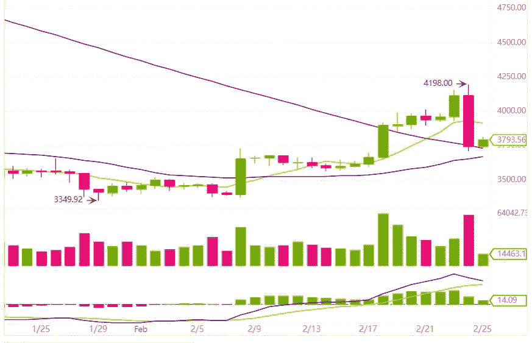
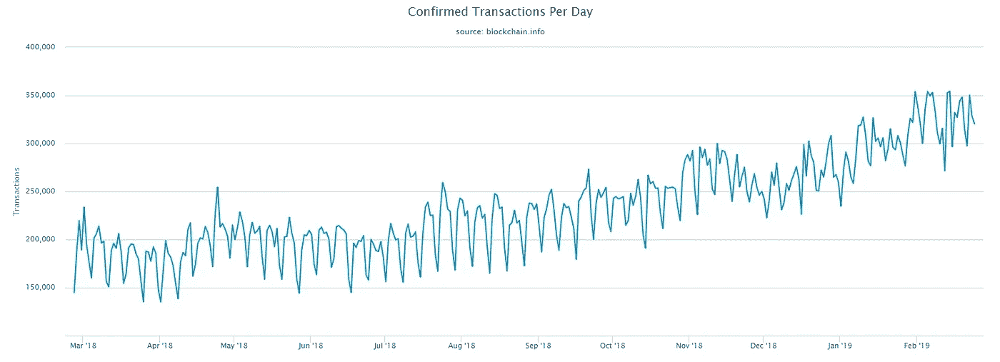

# 3 个迹象表明加密交易正在卷土重来

> 原文：<https://medium.com/hackernoon/bitcoin-crypto-trading-fx-brokers-comeback-16ba516263b9>

Photo by [André François McKenzie](https://unsplash.com/@silverhousehd?utm_source=medium&utm_medium=referral) on [Unsplash](https://unsplash.com?utm_source=medium&utm_medium=referral)

在经历了充满挑战的去年之后，我们看到了加密市场从极度兴奋到被遗忘的过程，许多怀疑论者撰写了关于比特币和加密货币的讣告，我们看到了加密市场起死回生的新迹象。以下是显示交易者重返市场的一些关键指标:

**仅 2 月份比特币价格就上涨近 25%:******比特币在币安的价格从 2019 年 1 月 29 日的 3350 美元涨到 2019 年 2 月 24 日的 4198 美元，不到一个月上涨近 25%。****

********

****BTC/USDT Price Chart. Source: Binance.com****

******比特币交易量稳步增长:**自过去几个月以来，交易的比特币数量一直在稳步增长。交易量的增长不仅出现在加密交易所，还出现在点对点(P2P)平台上，比如本地比特币。此外，比特币区块链记录的交易数量也在上升。****

********

******币安的交易活动创历史新高:**币安是加密货币交易的顶级交易所之一，拥有非常强大的交易基础设施。周日，当交易活动创下历史新高时，该公司经历了系统过载。这表明交易者正在重返市场。****

****这三个信号提供了交易者重返市场的综合证据。****

******外汇经纪商的机会:**大多数交易加密货币的交易所都不受监管，因此交易者面临很大的风险。受监管的外汇经纪商可以通过提供可信且受监管的加密货币交易渠道来弥合这一差距。外汇经纪人可以通过提供法定货币交易来进一步提高交易者的便利性，因为大多数加密交易所只支持加密对加密交易。****

****如果您是一名外汇经纪人，希望抓住快速增长的加密货币交易市场，我们 [Broctagon Nexus](http://www.go-nexus.io) 可以通过我们屡获殊荣的全套流动性和技术解决方案帮助您实现这一目标。以下是我们的合作伙伴对我们解决方案的评价。****

****了解更多今日联系[nirav.gala@broctagon.com](mailto:nirav.gala@broctagon.com)****