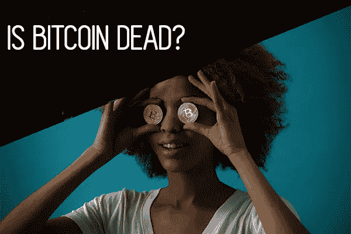

# 比特币已死？Localbitcoins 讲述了另一个故事

> 原文：<https://medium.com/hackernoon/bitcoin-is-dead-localbitcoins-tells-another-story-32703b8105db>

*D 克莱恩，2018 年 12 月 16 日*

## 任何关注全球加密交易所价格走势的人都知道，最近的形势看起来并不乐观。最近几个月，交易所的交易量或交易活动并不多，因此市场一直在可悲地蹒跚前行，萦绕心头的比特币之死再次重演。

但当谈到加密货币，尤其是比特币的流行和效用时，有一个隐藏的地下世界最容易被忽视。就像隐藏在安静的城市街道下，挤满了繁忙地铁系统熙熙攘攘人群的隧道和人行道一样，比特币正在被活跃地交易，并在表面下变得非常受欢迎。

今天，我们深入到比特币交易中经常被忽视的一面，通常被称为 OTC 或场外交易，特别是它的基层兄弟， [localbitcoins](https://localbitcoins.com/) 。

一般来说，在研究比特币的交易量和价格变动时，我们倾向于将其与比特币基地或 Bitfinex 等主要交易所的美元货币进行比较。这种货币在这些交易所中不断地与美元进行交易，无论是以法定货币的形式，还是与模拟美元法定货币相对稳定性的稳定货币进行交易。比特币期货，尤其是在由短期或长期押注组成的高风险杠杆交易中，也可以说是未来价格的非常强劲的指标。

# 场外交易

然而，所有这些价格“发现”并不能解释我们脚下忙碌的整个强健系统；场外交易和本地比特币交易。

举一个非常简单的例子:如果我想购买比特币，我可以从交易所购买，所有交易者都可以看到价格。然而，我可以从朋友、邻居或网上认识的人那里购买比特币，只需给他们现金，换取他们的比特币。在这种情况下，任何价格发现都不会发生。只有买卖双方知道商定的价格。我可以积累大量比特币，而不会对比特币的交易所定价造成任何直接影响，只要我持有比特币，并且不在交易所出售它们，也不卖给商家以换取商品。

场外交易也差不多，只是规模大得多。从本质上讲，经纪人安排买方和卖方进行比特币交易，反之亦然。然而，在场外交易中，这可能是价值数千、数十万或数百万美元的比特币。即便如此，价格不会导致任何“价格发现”，除非这些资产后来在交易所出售。

# 本地比特币交易量正在增加

现在我们来看看[本地比特币](https://localbitcoins.com/)。想想 Kijiji 或 Craigslist，除非交易的目的是专门针对当地法定货币买卖比特币。卖家发布他们的产品，然后买家与卖家联系，购买所需数量的比特币。这种高度活跃的市场并没有反映在交易所比特币的价值和交易量上。

在[币](https://coin.dance/volume/localbitcoins)上，我们可以通过世界各国的本地比特币观察比特币的交易量。有趣的是，人们可以观察到，许多国家的交易量大幅增加，甚至自去年的峰值以来也是如此。特别是在整个南美洲，许多公民最近遭受了货币贬值，在某些情况下，恶性通货膨胀，本地比特币显示出任何不是熊市的情况。例如，自去年一月泡沫破裂以来，阿根廷、哥伦比亚和秘鲁[的交易量已经翻了一番甚至两倍。](https://coin.dance/volume/localbitcoins/PEN)[经济异常糟糕的委内瑞拉](https://coin.dance/volume/localbitcoins/VES)，当地比特币交易呈抛物线状增长，至今仍保持巨大势头。

诚然，经济更加稳定并不意味着经济活动水平相同。美国的本地比特币交易量有所下降，但仍没有交易所交易量大幅下降那么严重。然而，人们也可以观察到，在打击交易所的国家，本地比特币交易激增。例如，在中国和伊朗，这两个国家一直在限制加密兑换交易，当地比特币交易量随着兑换禁令同步飙升。似乎加密货币的交易——即使是相对透明的比特币——也无法停止。

因此，任何感兴趣的买家都可以积累比特币，而不会在交易所市场引起轰动。规模较大的投资者可能会使用场外交易，而普通散户投资者则使用本地比特币等交易工具悄悄囤货。对比特币的长期价值有既得利益、但希望廉价积累藏品的实体，可以利用这些场外交易方式进行积累，同时保持更明显的交易所市场受到抑制且相对不活跃。

阳光法令在[这个](https://www.youtube.com/watch?v=YEBJ-jsnY24)优秀的视频里详细分解了这个问题。或者，看看在 [Coindance](https://coin.dance/volume/localbitcoins) 上的本地比特币交易，亲自看看交易量。

*本文由 D. Kleine 与 WeWriteCrypto 合作撰写。*[*WeWriteCrypto*](http://wewritecrypto.com)*通过*[*thenewpaper . io*](http://thenewpaper.io)*在加密货币空间&提供量身定制的代写服务。*

 [## the newpaper(@ the newpaper _ io)| Twitter

### thenewpaper 的最新推文(@thenewpaper_io)。新报纸在这里。加密货币，金融科技和区块链新闻…

twitter.com](https://twitter.com/thenewpaper_io) 

*来源*

[https://www.youtube.com/watch?v=YEBJ-jsnY24](https://www.youtube.com/watch?v=YEBJ-jsnY24)

[https://coin.dance/volume/localbitcoins](https://coin.dance/volume/localbitcoins)

[https://localbitcoins.com/](https://localbitcoins.com/)