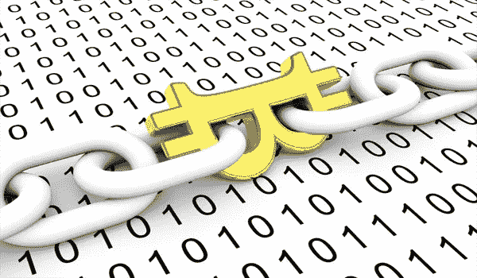
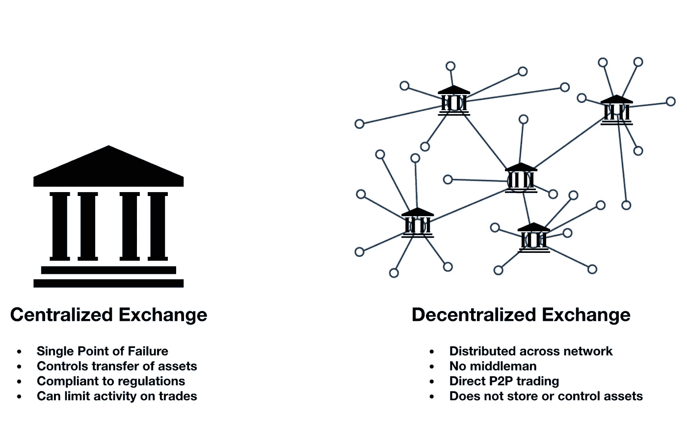
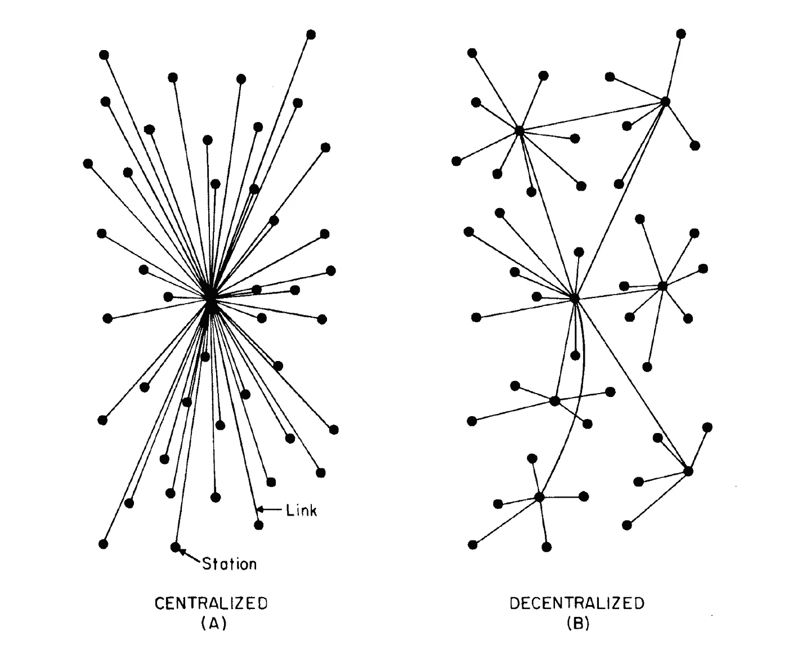
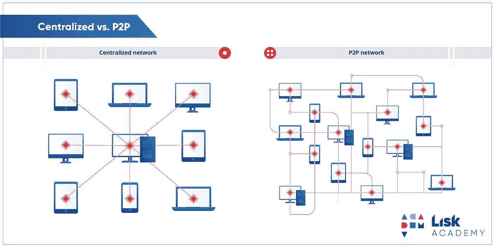

# 比特币不是区块链。

> 原文：<https://medium.com/hackernoon/bitcoin-is-not-the-blockchain-1c85c372332f>

Bitcoin as a Blockchain

> 欢迎来到我的**区块链世界系列**第一篇文章。我们开始吧！

在区块链这个词得到它的位置之前，比特币这个词就开始流行了。而这让大多数人认为*的比特币是* **的** *区块链*而不是*的比特币是****区块链。***

**比特币是在**区块链框架**上实现的，我们今天知道的大多数加密货币都是在区块链框架上创建的。既然加密货币成为区块链的**首个应用，并不意味着区块链只对加密货币有意义。它的应用比我们想象的要多。****

**在我们想到那些应用之前，我们先来了解一下区块链。**

## ***那么实际上什么是区块链呢？***

**这是一个块链，其中每个块都包含一些事务性数据和关于链中前一个块的信息。**

> **是的，我知道那只是外行人的定义。**

**好了，为了更好的理解区块链，我们来说说区块链框架。区块链框架由几个组件组成，例如，**

*   **交易**
*   **钱包**
*   **签名**
*   **内存池**
*   **网络**
*   **共识；一致**
*   **散列法**
*   **街区**
*   **区块链**

**我们将在一系列文章中逐一介绍它们，这是因为，区块链框架无法在一篇文章中解释，除非至少有 30 分钟的阅读时间。**

> **谁在这里读一篇 30 分钟的文章？没错。**

**所以让我们把这个分成几个部分，一步一步来。而到这个系列结束的时候，你就知道区块链的进出了。在这第一个系列中，让我们来谈谈一些历史以及对*对等网络的介绍。***

# **区块链的历史**

**区块链最早实现于比特币，这是一种由**中本聪提出的加密货币。他是利用区块链开发比特币的人。****

> **1 个比特币等于 1 亿个 satoshis，是比特币的最小单位。**

**他引入比特币作为现有中央银行系统的替代方案，因为比特币是去中心化的。**

****

**Centralized banking vs Decentralized banking**

## **传统的中央银行体系有什么问题？**

**顾名思义，集权是指控制权被赋予一个**单一实体**。分散的与集中的正好相反，集中的控制权不是给一个单独的实体，而是分布在一个网络上。**

**在中央银行系统中，假设你想给你的朋友汇些钱。如你所知，这笔交易首先通过*支付网关*，然后到*银行*，最后到你的*朋友*。所以这里的问题是，**

*   **你做的每一件事都会被你的银行记录下来，并且永远是你和你朋友之间的中间人。**
*   **您的交易总会收取一些交易费用。**
*   **由于您的所有信息都集中保存在一家银行，因此存在数据被意外删除或被盗的风险。**

**这就是比特币试图用区块链取代的东西。**

*   **比特币是分散的，这意味着没有像银行这样的中央机构。**
*   **比特币通过一个对等网络分发。**
*   **而且没有数据被盗或删除的风险，因为所有数据都分布在网络上。**

****

**Centralized vs Decentralized**

****什么是对等网络？****

**对等网络的一个典型例子是**洪流**。我们一生中都至少用过一次。**

**那么 Torrent 是如何工作的呢？**

**Torrent 的工作原理是从 Torrent 网络中的所有**节点/对等点**(使用 Torrent 的计算机)收集数据，并通过**互联网**为请求这些数据的其他节点提供服务。这就是为什么下载速度在 Torrent 中频繁波动的原因，因为为您提供这些数据的节点数量可能会减少或增加。**

> **节点数量越多，速度越快。节点数量越少，速度越慢。**

**假设您正在使用 Torrent 下载电影。您正在下载的电影不是从单一来源下载的，而是使用 Torrent 从其他节点(计算机)收集的电影数据。这些节点已经下载了该电影。**

> **向其他节点提供数据的节点称为**种子**，这个过程称为**播种**。下载结束后，您可以看到您的种子客户端播种。这是因为您现在将下载的数据提供给其他节点。**

**这就是在 Torrent 中下载文件的方式。我用这个例子是因为 Torrent 也像区块链一样是去中心化的。去中心化主要由上述*对等网络*机制提供动力。**

****

**Image credits: Lisk Academy**

****区块链中的对等网络****

**区块链的工作方式也与 torrent 一样，使用对等网络。由于比特币是在区块链开发的，比特币也使用相同的点对点网络。这就是为什么它是分散的。没有中央银行系统。相反，比特币交易被记录到区块链网络中的每个节点，类似于 torrent 网络。所以它是分布在网络上的。网络中的每个节点都有自己的在整个网络中完成的事务的副本。此外，每当发生新的事务时，网络中的每个节点都会得到更新。**

> ****网络中的每个节点能看到我的交易明细吗？****

**虽然像交易的发送者和接收者这样的数据对区块链中的所有节点都是可见的，但是交易中的敏感信息是使用公钥和私钥加密的，我们将在后面的文章中讨论这一点。所以只有交易的所有者可以用他的私钥解密信息。**

## **注意:**

**区块链网络中的交易一旦完成就无法更改。一旦数据被网络记录下来，即使是交易的所有者也无法更改。区块链是 ***不可变的*** 。**

**因此**比特币是一个区块链**和**而不是区块链**，因为区块链现在已经发展到除加密货币以外的许多其他应用。**

**我们现在已经经历了区块链框架的一个重要组成部分，即**点对点网络**。在后面的文章中，我们将逐一探索框架中的所有其他组件。到本系列的最后一篇文章，我们将把区块链框架的所有组件放在一起，完成区块链。**

**希望我有帮助。下一篇文章再见。**