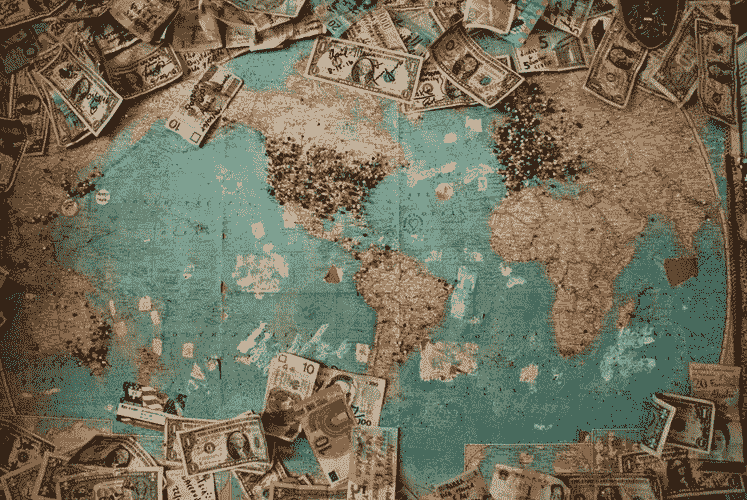
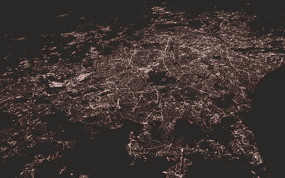
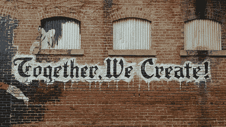

# 比特币和美第奇家族的共同起源

> 原文：<https://medium.com/hackernoon/bitcoin-medici-family-similarities-4096fa0ae3c9>

## 犯罪、去中心化、现有技术、贸易和革命

## &为什么美第奇家族不是我们想象的那样

Photo by [Christine Roy](https://unsplash.com/photos/ir5MHI6rPg0/) on [Unsplash](https://unsplash.com)

当我们想到文艺复兴时期的美第奇银行家族时，我们会想到他们的财富、王权以及米开朗基罗和伽利略的资助。

那些事情都是真的。但是我相信的关于美第奇家族的很多事情后来被证明是错误的:

**1。我相信美第奇家族是通过实施控制和秘密运作而声名鹊起的。**但这不完全正确。****

**2。我认为他们是通过放债出名的。**他们没有****

**3。我以为美第奇家族人一直都是贵族。**我错了。非常不对。****

阅读 [*金钱的崛起*](https://www.amazon.com/Ascent-Money-Financial-History-World/dp/0143116177) 通过[尼亚尔·费格森](https://medium.com/u/55d59a692896?source=post_page-----4096fa0ae3c9--------------------------------)，我了解到了美第奇家族的崛起。我不禁注意到了与比特币崛起的相似之处。

# 1.犯罪开端

Photo by [Rene Böhmer](https://unsplash.com/photos/WR7P60pbUzQ) on [Unsplash](https://unsplash.com)

何美第奇家族成了受人尊敬的人物。比特币正在路上。然而他们出生于社会的底层。

## **美第奇家族**

> “在 13 世纪 90 年代之前，可以合理地说，美第奇家族更多的是强盗而不是银行家:一个三流的家族，以低暴力而不是高金融而闻名。尼亚尔·费格森写道:“1343 年至 1360 年间，至少有五名美第奇家族成员因死罪被判死刑。”。

## **比特币**

2011 年初，比特币与美元平价。它值 1 美元。到 2013 年底，比特币价值 1000 美元。这种增长是由丝绸之路刺激的，丝绸之路是一个网上黑市，也是第一个现代暗网市场，最出名的是一个出售非法药物的平台。丝路用的是比特币。它们于 2011 年关闭，并于 2013 年关闭。

# 2.分散

Photo by [Anastasia Dulgier](https://unsplash.com/photos/OKOOGO578eo) on [Unsplash](https://unsplash.com)

D 去中心化增加信任，分散风险；金融系统的两个有价值的属性。我们知道去中心化是比特币的一个特征，但我们认为美第奇家族是一个拥有中央控制权的强大家族。虽然这是美第奇家族的现状，但他们发展成了一个分散的网络。

## **美第奇家族**

> “然而，美第奇家族成功的真正关键与其说是规模，不如说是多元化。早期的意大利银行结构庞大，很容易被一个违约的债务人拖垮，而美第奇银行实际上是多个相关的合伙企业，每个都基于一个特殊的、定期重新谈判的合同。分支机构的经理不是雇员，而是获得利润分成的初级合伙人。正是这种权力下放让美第奇银行变得如此有利可图，”尼亚尔·费格森写道。

## **比特币**

去中心化不是比特币的卖点，而是最重要的部分。中本聪[比特币白皮书](https://bitcoin.org/bitcoin.pdf)的*非常*的第一句话强调了比特币的去中心化*“一个纯粹的点对点版本的电子现金将允许在线支付直接从一方发送到另一方，而不经过金融机构。”*

# 3.基于现有技术构建

Photo by [“My Life Through A Lens”](https://unsplash.com/photos/bq31L0jQAjU) on [Unsplash](https://unsplash.com)

无论是美第奇家族还是比特币都是从零开始建立的。但他们确实比之前的任何人都更好地应用了现有的想法。虽然其他人创造了独立的部分，但美第奇家族和中本聪有远见将它们连接起来。

## **美第奇家族**

> 乔凡尼·德·梅第奇的《libro segreto》——字面意思是“秘密之书”——揭示了这个家族的崛起。在某种程度上，这只是一个精心记账的故事。以现代标准来看，的确有不完美之处。美第奇家族并没有系统地使用复式记账法，尽管这种方法早在 16 世纪 40 年代就在热那亚广为人知。
> 
> 然而，现代研究人员不能不对美第奇家族账目的整洁有序印象深刻。这些档案还包含了许多早期美第奇的资产负债表，储备和存款被正确地安排在一边(作为负债或 *vostro* )，给客户的贷款或商业票据在另一边(作为资产或 *nostro* )。
> 
> 尼亚尔·费格森写道:“美第奇家族并没有发明这些技术，但是他们在佛罗伦萨以前所未有的规模应用了这些技术。”。

## **比特币**

每个人都认为比特币是区块链的诞生。不是这样的。1991 年，W. Scott Stornetta 博士和 Stuart Harber 博士写了一份介绍“区块链”的白皮书；保护数字交易的分散加密数据库。中本聪采纳了这些想法并加以发展。事实上，他在[比特币白皮书](https://bitcoin.org/bitcoin.pdf)中多次提到他们的时间戳协议。

# 4.通过交易建立的声誉

Photo by [Chris Liverani](https://unsplash.com/photos/dBI_My696Rk) on [Unsplash](https://unsplash.com)

美第奇家族被视为银行家，而比特币被视为享有盛誉的数字货币。在这两种情况下，都是交易帮助他们建立了声誉。

## **美第奇家族**

> ”接着是乔凡尼·德·梅第奇。他的目标是让美第奇家族合法化。通过努力工作，清醒的生活和仔细的计算，他成功了。
> 
> 1385 年，乔瓦尼成为一家银行罗马分行的经理，这家银行由他的亲戚维耶里·迪·坎比奥·德·美第奇经营，他是佛罗伦萨的一个放债人。尼亚尔·费格森写道:“在罗马，乔瓦尼建立了自己作为外汇交易员的声誉。

## **比特币**

丝绸之路之后，比特币的名声并不好。尽管这大部分是不真实的，但许多比特币的局外人认为，那些持有比特币的人正在用比特币买卖毒品。正是比特币交易为比特币购买了进一步的流动性，提高了它的声誉。人群不再称他们为“毒贩”，而开始称他们为“投机者”。这种变化要归功于人们交易比特币。如今，人们把那些持有比特币的人称为“投资者”。

# 5.他们领导了一场金融革命

Photo by [Pierre Herman](https://unsplash.com/photos/Fw_2kaQZc90) on [Unsplash](https://unsplash.com)

美第奇家族和比特币的兴起引发了全球金融革命。

## **美第奇家族**

> 尼亚尔·费格森写道:“(由美第奇家族创建的)意大利银行体系成为了那些将在未来几个世纪取得最大商业成功的北欧国家的典范，尤其是荷兰和英国，但也包括瑞典。”。

## **比特币**

比特币及其区块链技术是许多加密货币的模型，包括以太币、Ripple、比特币现金和莱特币。

美第奇银行王朝的崛起和比特币有一些有趣的相似之处。美第奇家族的故事告诉我们比特币的未来了吗？也许是，也许不是。

美第奇家族的崛起延续到了权力的顶峰。正如教皇对科西莫·德·美第奇的描述，“除了名字，他什么都是国王。”但最终在法国入侵的混乱中，美第奇家族的所有财产被没收、清算或烧毁。

历史不会重复，但会回响。

## **您可以在** [**推特**](https://twitter.com/nfergus) **或** [**他的网站**](http://www.niallferguson.com) **上了解更多关于** [**尼亚尔·费格森**](https://medium.com/u/55d59a692896?source=post_page-----4096fa0ae3c9--------------------------------) **。**

**由** [**到**](https://medium.com/u/a310c6d8d670?source=post_page-----4096fa0ae3c9--------------------------------) **。感谢阅读。**