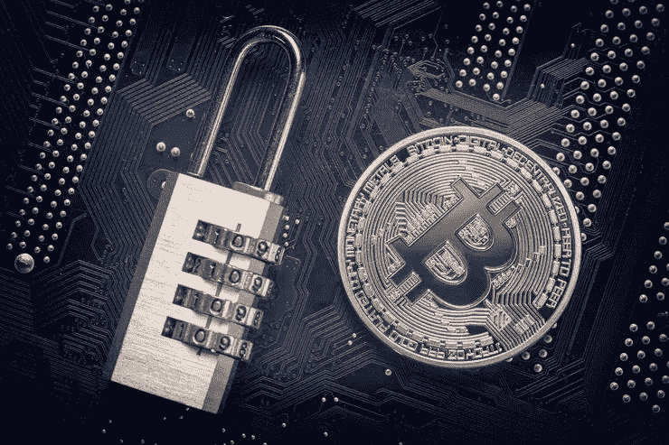

# 比特币安全:如何保证你的钱包和私人钥匙安全的指南

> 原文：<https://medium.com/hackernoon/bitcoin-safety-a-guide-on-how-to-keep-your-wallet-and-private-keys-secure-94cf7b7f4a00>

除了[区块链](https://www.investopedia.com/terms/b/blockchain.asp)，加密货币的高度隐秘和基础技术，还有其他工具被结合来保持令牌的安全。私钥、冗长的比特币地址和数字签名等功能对确保加密交易和存储安全大有帮助。

在这种情况下，熟悉这些安全功能是至关重要的，因为它们对您的加密安全至关重要，但它们也是骗子在试图窃取您的数字资产时认为易受攻击的网关。这些安全功能包括:

**一.私钥**

这是一个 64 个字符长的代码，包括字母 A-F 和数字 1-9 的任意组合。用户需要这个代码来访问他们账户中的比特币，因此应该保密以保证资产的安全。

**二世。公钥**

几乎类似于私钥，这是你在区块链上的账户的独特标识符，在交易过程中也作为你的比特币地址。私钥和公钥一起工作，允许您与其他用户进行交易。它们由区块链网络之外的复杂数学算法生成，并存储在一个名为钱包的文件中。

**三。数字签名**

这些是唯一的指纹，只能用有效的私钥生成。每笔交易都需要一个唯一的数字签名。

**通俗地说:**公钥可以看做类似于银行账号，私钥充当提供对账户的访问的秘密 PIN。换句话说，私钥用于证明一个地址的所有权，并签署将比特币发送到另一个地址的交易。地址/公钥通常位于区块链上，这使得它们对网络上的其他用户可见。

当向区块链网络上的另一个用户付款时，收款人的公钥被用作代表他/她的比特币地址的数字指纹，类似于你在银行支票上注明收款人姓名的方式。

# 密钥是如何生成的？

私钥是由区块链网络之外的复杂数学算法生成的。然后，在每次交易期间，从私钥自动生成公钥和地址。两个密钥都存储在钱包文件中，由钱包软件管理。

[加密货币钱包](https://www.coinschedule.com/blog/top-7-best-bitcoin-wallets-of-2019-rated-by-crypto-experts/)是一种安全的数字文件，用于存储、发送和接收比特币或其他替代货币，如莱特币和以太币。该钱包有一个复杂的软件程序，可以安全地存储你的加密货币，防止黑客攻击，直到你准备好将它发送到不同的地址。每当你发送比特币时，钱包软件还会用数学方法处理交易和正确的私钥。

所有交易都是在区块链上完成的，这是一项突破性的技术，允许流通的、不可篡改的数字记录存在，并验证比特币地址确实有发送的金额。

每次交易生成的公钥和地址都不同，但私钥永远不会改变。因此，人们将使用私钥来授权区块链网络将余额从与该私钥相关联的地址转移到另一个地址，该地址又由不同的私钥进行链接和控制。

# 保护您的比特币钱包安全

比特币交易的主要安全功能是上面讨论的 254 位私钥，当将比特币发送到不同的地址时，它允许您进行不可逆的交易。此外，私钥在您每次交易时都会创建一个唯一的数学签名，确保它无法被复制，并且用户将能够反复使用同一个私钥。

一旦用户建立了一个新的比特币钱包，其中的加密程序就会随机生成一个唯一的私钥。然后，用户必须记下私钥并将其存储在安全的地方，因为它是进入钱包的唯一入口，拥有它的任何人都可以访问所有数字资产。

# 保护您的私钥

一些密码爱好者更喜欢通过一些策略来记忆私钥，比如使用[长串或不太复杂的句子](https://bitcointalk.org/index.php?topic=52948.0)来记忆。虽然这可能被认为比将密钥放在可能被黑客攻击的在线纸质钱包上更安全，但存在用户忘记密钥、去世或精神丧失能力的真实危险，这将意味着与该地址关联的虚拟货币将永远丢失。

最近在 2019 年 2 月就发生了这种情况，当时加拿大最大的加密货币交易所的所有者[意外死亡](https://www.independent.co.uk/life-style/gadgets-and-tech/news/bitcoin-exchange-quadrigacx-password-cryptocurrency-scam-a8763676.html)，将 1.45 亿英镑的加密货币锁在了一个数字钱包中，他是唯一的密码持有者。

由于主要加密货币的离线存储似乎存在问题，加密存储的使用拯救了许多用户。该服务在安全的服务器中提供钱包私钥数据的在线备份存储，该服务器在需要时在浏览器中生成密钥，而数据不可能被任何第三方访问。加密存储的用户可以将密钥保存到安全文件中，或者直接打印纸质钱包。此外，用户可以选择用密码加密密钥。

对许多加密用户来说，真正的危险是那些旨在让他们自愿将自己的私钥导入第三方的巧妙伎俩。例如，2017 年，一个黑客团队实施了一个名为[“比特币支付”](https://www.livebitcoinnews.com/avoid-bitcoin-pay-scam-trying-steal-private-key/)的骗局，诱使用户与项目开发者分享他们的私钥，以申领新令牌。

从这类骗局中得到的教训很明显——当你使用自己的加密钱包时，千万不要和任何人分享这个密钥。你也应该备份你所有的钱包。

# 使用种子短语保护您的私钥

种子是钱包用来为您的地址生成私钥的一系列字符。管理钱包的软件程序通常会在设置加密帐户的初始阶段生成一个唯一的种子短语。然后，您需要写下这个种子短语并妥善保存。

万一您的智能手机、笔记本电脑、计算机硬盘或其他数据存储设备崩溃或被盗，您可以下载钱包软件并使用种子重新生成您的私钥。这种安全功能在存储比特币时绝对重要，通常是比特币现金钱包等大多数知名钱包的内置功能。