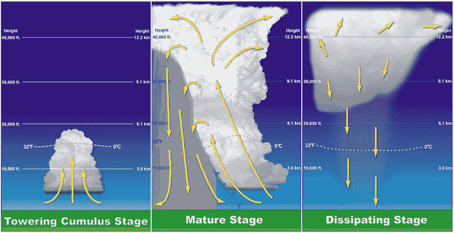
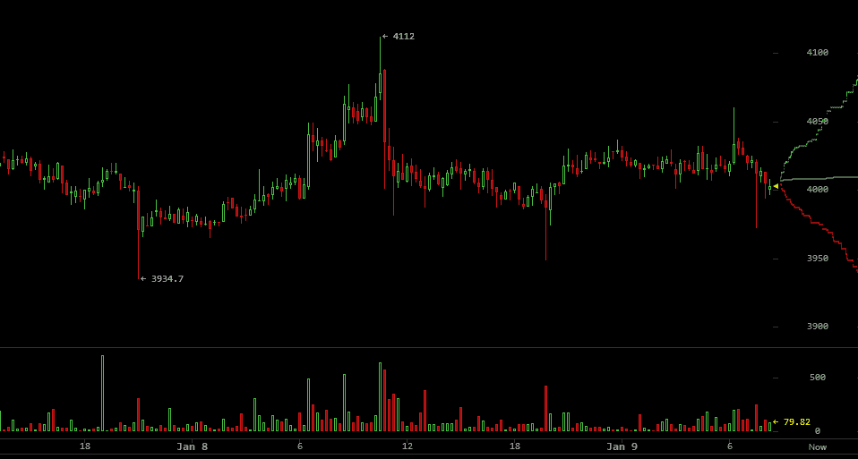

# 比特币:聚集的风暴

> 原文：<https://medium.com/hackernoon/bitcoin-the-gathering-storm-8000562c0adc>

## **类似比特币市场周期的雷暴动态**

驱动雷暴生命周期的大气动力学实际上与驱动比特币市场的动力学有一些相似之处。确切地说，从[开始加密。IQ](http://Crypto.IQ) 位于佛罗里达州萨拉索塔，让我们将比特币市场比作海风——雷暴周期是这里天气的一部分。

在佛罗里达典型的夏日，太阳升起并开始加热地面。这种太阳热量被转移到接近地表的大气的最低部分，基本上接近地面的空气开始获得能量和浮力。这可以与比特币采用率的增加相提并论，例如当数千台比特币自动取款机被部署，商店开始接受比特币时，比特币为比特币系统注入了能量。

地面附近的空气不会立即爆发成雷暴，因为在地面上几乎总是有一个稳定的空气层，称为逆温层。这阻止了地面附近的热空气上升，是由大气下沉产生的。这相当于卖空者对 BitMEX、Bitfinex、CME 和 CBoE 施加的下行压力。从本质上来说，即使比特币的应用越来越多，全世界的人都在购买更多的比特币，如果卖空者试图让市场下跌，反弹也可能受阻。

过去几天的比特币价格图表明了这种情况。一轮反弹开始于人们购买比特币，然后被某种更大的市场力量(可能是卖空者)踩灭。这可以比作早晨一些充满能量的地面空气上升到云中，但未能打破下沉逆温层，最终云消散了。

Image courtesy [Bitcoinwisdom.com](https://bitcoinwisdom.com/). Bitcoin price on Bitstamp in USD (top) and volume in Bitcoins (bottom).

下午早些时候，海风锋移动，这是一股冷空气向内陆扩散，与温暖的内陆空气发生碰撞。海风锋迫使高能表面空气向上，并突破下沉逆温层。现在高能的地表空气已经移动到逆温层之上，它发现自己处在一个可以一直上升到对流层顶部的环境中。

由于地表空气在上午和下午早些时候被下沉逆温层覆盖，这部分空气甚至更热，更有活力。因此，当海风穿过时，就像佛罗里达的大多数下午一样，它释放出所有的能量，空气猛烈爆发成雷暴。当来自大西洋或墨西哥湾的空气移动到内陆，取代被太阳加热的空气时，这里每天都有海风。

此外，当雷暴上升气流中形成的雨从水蒸气变成液态水时，会产生大量的热量。这种潜热使雷暴更加强烈，因为它增加了上升气流的浮力。

在比特币市场，海风相当于一场大规模做空，迅速推高比特币价格，消灭做空者。如果空头挤压带来的反弹足够大，并且卖空者获得 rekt，那么比特币市场可以继续反弹。

由于卖空者长期压制市场，比特币市场因被采用而变得越来越活跃，只是在等待反弹开始的那一刻。反弹像雷暴上升气流一样向上爆发。

雷暴上升气流中水蒸气形成的雨所释放的潜热可以比作新企业和新投资者 FOMO 在股市上涨时涌入市场。这形成了一个正反馈循环，推动比特币价格进一步上涨。

然后，比特币的价格会尽可能地上涨，就像 2013 年底和 2017 年一样，就像雷暴到达平流层底部一样。平流层是阻挡向上运动的终极下沉逆温层。

现在海风雷暴已经完全成熟，它将持续一段时间，但它将开始减弱，因为它与它的热表面空气源切断了。在这一点上，雷暴通过蒸发冷却产生大量的冷空气，这些冷空气撞击地表，将热的地表空气推离雷暴。

在比特币市场，这可以比作人们开始怀疑比特币是否会继续上涨，因为它已经很高了，因此人们不再向比特币投资。

佛罗里达州海风雷暴的另一种方式是通过一个更大规模的天气系统来迎接它的厄运，这个天气系统通过强高空风或强下沉气流来撕裂风暴。这可以与 2017 年 12 月比特币涨势如何被 CME 比特币期货的推出逆转相提并论。这些期货带来了巨大的卖空压力。这也可以与 2013 年末 Mt. Gox 如何崩溃相提并论，那次崩溃造成了比特币市场的恐慌和崩盘。

因此，当你在天堂这里拜访我们时，雷雨如往常一样在下午袭来，请记住它们与比特币市场周期类似，尽管这些是完全不同的系统。它反映了物理学的普遍规律如何导致自然界中的分形相似性，完全不同的系统可以有相似的可预测模式。尽管比特币是人造的，但它是自然的一部分，受宇宙物理定律的制约。