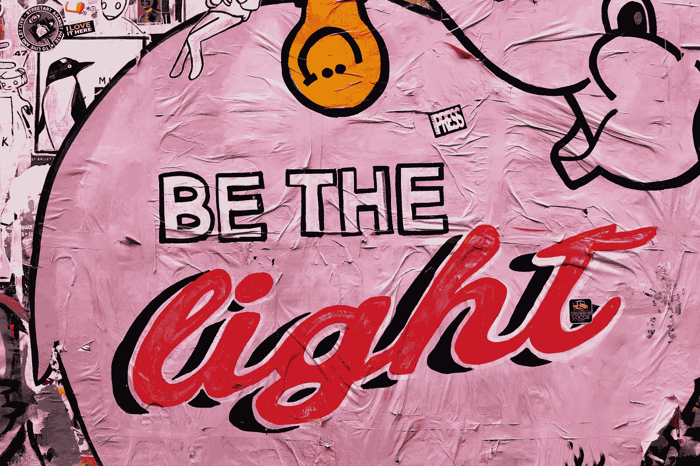
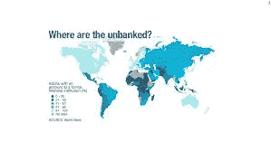

# 比特币:金钱的闪耀之光(抱歉，我指的是加密货币)

> 原文：<https://medium.com/hackernoon/bitcoin-the-shining-light-of-money-sorry-i-meant-cryptocurrency-6bd8d80643af>

## 那些主张未来与金融世界过去的邪恶、谎言和虚假决裂的人，支持比特币一路走好。对他们来说，是光，新的王子，一种改变世界的商业交易方式

Photo by [Cody Chan](https://unsplash.com/@cceee?utm_source=unsplash&utm_medium=referral&utm_content=creditCopyText) on [Unsplash](https://unsplash.com/search/photos/graffiti-money?utm_source=unsplash&utm_medium=referral&utm_content=creditCopyText)

# 防鲨笼

这是一个有争议的话题。自从 2018 年初[比特币价格从前一年的创纪录高位](https://en.wikipedia.org/wiki/2018_cryptocurrency_crash)大幅下跌以来，情况更是如此，当时从亚洲到南美、从印度到日本，所有人都在购买比特币。这是一场有趣的自由交易，疯狂的价格和疯狂的人嗅到了一场杀戮，被欺诈者和糟糕的玩家包围着，ico 到处都是。

然后就这样发生了。监管者介入了。规则被创造出来，比特币的价格下滑。街上到处都是血。投资者损失惨重。对数字货币的批评就像鲨鱼围着密友一样。

Photo by [Jakob Owens](https://unsplash.com/@jakobowens1?utm_source=unsplash&utm_medium=referral&utm_content=creditCopyText) on [Unsplash](https://unsplash.com/search/photos/shark-cage?utm_source=unsplash&utm_medium=referral&utm_content=creditCopyText)

> 笼子在这种环境下没用。

他们成了聪明人。他们认为法定货币是王道，加密货币只是昙花一现。华尔街、伦敦和全球所有其他金融中心都在呼喊*‘我们早就告诉过你了’*。

他们觉得被证明是正确的。

## 谁能责怪他们呢？

这在商业中是很自然的。有人赢有人输。

然而，他们对即将到来的潮流一无所知，金融领域的技术变革将永远改变我们对货币兑换的看法。

## 那么，为什么比特币和法定货币一样好，不，不好意思，甚至更好？

# （从）历史的视角

首先，我们必须认识到，自远古以来，从石器时代的牙齿、贝壳和鱼的贸易，直到西非的黑曜石使事情变得复杂，到欧洲的新石器时代，当人类开始与他们在黎凡特的邻居进行珠宝和毛皮等其他材料的贸易和交换时，商业已经发生了。从古代美索不达米亚到埃及、希腊、罗马，再到黑暗时代，贸易和商业一直处于人类历史的中心。在那段时间的大部分时间里，黄金被用作标准货币，直到 1971 年菲亚特取代了金本位制。

**然而，纸币和硬币种类的已发行货币进入和退出流通，失去其价值，可被熔化或焚烧，被政府操纵价格，被过度印刷，这可导致通货膨胀和人民不可避免的痛苦。**

这就是比特币以及其他加密货币远胜于法定货币的地方。

## 为什么？

# 聪智

这里将永远只有 2100 万比特币在流通，这意味着恶性通货膨胀永远不会成为腐败或不负责任的政府的工具。此外，尽管比特币的数量有限，但你可以随意分割。一个比特币有 9700 个 0.0000001฿，所以一个比特币只有 9700 美元(至少在我写这篇文章的时候是这样，但我相信明天会有所不同)。谈谈可分性。此外，与法定货币不同，比特币永远无法被复制、伪造、再造，也无法像黄金那样添加金属杂质以增加其体积并提升其价值。

*与法定货币和金银等贵金属相比，它的另一个优势是，它可以被即时、廉价地发送到全球任何地方，几乎没有或根本没有什么大惊小怪，打破了国界，因为与它想要取代的交易类型相比，它是一种无形资产，一行代码，如果你愿意的话，它不能被没收或征税——感谢上帝。*

长期以来，第三方从法定货币转移中赚得太多。有了比特币，就没有任何费用(或者很少)，因为一切都是在两方或两个节点之间完成的，不需要中介、央行或政府等牵头机构来进行、监督或评估交易。它完全没有这些。

> 枷锁已经被打破，永远摆脱了。

> 那不是很棒吗？

# 第三世界收养

你可以拒绝这种想法。但让我告诉你:如果我们，我现在说的是西方世界的人们，不普遍采用比特币作为交换工具的媒介，那么发展中国家和第三世界的人们肯定会。正是在那里，在那些大多数人没有银行账户的地理位置，比特币和其他加密货币将取得最大的成功。由于他们没有什么可失去的，他们会对其事业充满热情。

Source: garrickhillman.com

**在委内瑞拉，这个因查韦斯·尼古拉斯·马杜罗的傲慢、愚蠢和总体笨拙态度而饱受政治恶行和灾难性经济折磨的国家，** [**我们看到比特币被一部分人使用和认可，他们看到自己的国家货币因恶性通货膨胀而士气低落。**](https://www.bbc.co.uk/news/business-47553048)

现在，目前比特币的批评者说它只是一种数字资产，而且是一种非常不稳定的资产，我知道，但他们没有看到这一点，就像黄金在几千年前成为一种矿物后，人们发现了它，开始升值，然后将其作为一种商品进行估价，然后主观地将其作为价值储存手段进行分配。

***从心理学上讲，价值只是旁观者的看法，它是一种主观选择，受群体或社会内部的共识约束。***

> 资产。
> 
> 价值储存。
> 
> 交换的媒介。
> 
> 记账单位。

这些是任何经济体系的基石。今天，黄金是所有这些。法定货币也是如此(除了委内瑞拉玻利瓦尔和古巴比索之外)。比特币肯定是第一个和第三个，至少在区块链的用户中是这样，它越来越成为第三个，我希望随着时间的推移，它也会成为第四个。

***至于比特币的未来，谁知道呢？***

# 主流使用

我们当中有一个人是算命师，不管华尔街和伦敦金融城的卑鄙白痴(尽管不总是如此)如何看待他们自我吹嘘的金融头脑。但是，如果比特币被主流接受，根据其在商业和技术领域成功实施的无数案例，证明它是一种可靠的“货币”(我应该说这个词吗？)，那么我只能看到它在全球范围内扩大自己的存在和影响力。是否如此仍有待讨论。早天就是早天。尽管我们已经迎来了比特币诞生 10 周年，但实际上我们几乎还没有开始。

这既令人兴奋又有点令人沮丧。令人兴奋，因为我们可以从头开始建立它的遗产，创造它的效用，最好地服务于人类。然而，另一方面，在它成为我们日常生活的一部分，被接受为主流的交换和价值储存媒介之前，在执行和性能的实际用例方面几乎处于其初始阶段，可以让我们采取更多的步骤。

所以，坐好，给自己倒一杯硬的，点上一支雪茄，看表演。

> 因为这将是一场精彩的比赛，相信我。