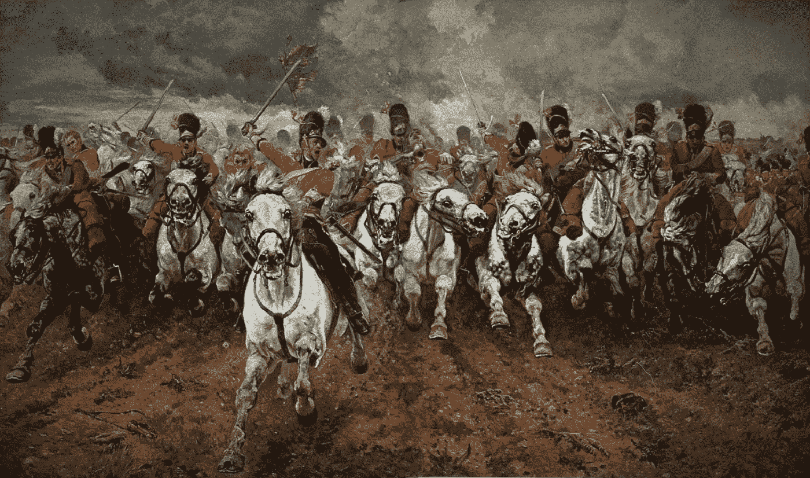
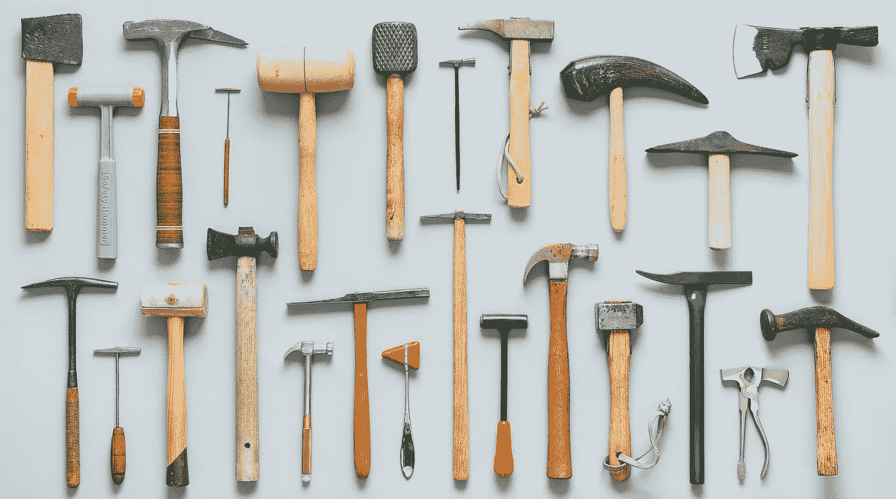
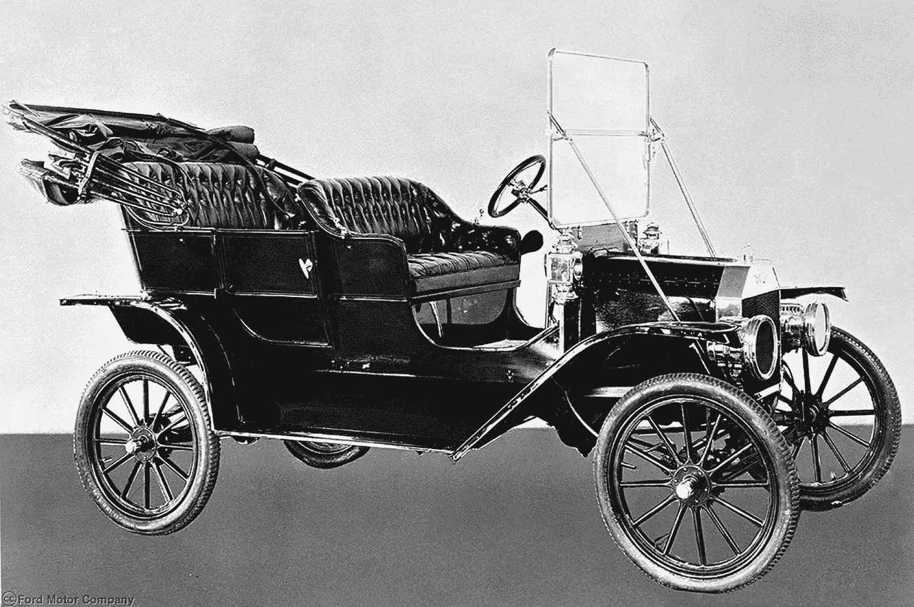

# 比特币 vs 区块链:为什么谁重要并不重要

> 原文：<https://medium.com/hackernoon/bitcoin-vs-blockchain-why-it-doesnt-matter-who-matters-33c47fc41127>

Because of cavalry

最初的大胆想法是创建一个替代当前货币体系的方案，现在开始变成一个行业，有其主要参与者、基本想法、规则、笑话和关于未来发展的辩论。追随者大军逐渐壮大，平庸的演员和想法开始退后一步，一个更认真对待这个想法的社群继续形成。

然而，两个主要阵线已经形成——那些试图用区块链解决方案改善当前现实的人；那些看到加密货币胜利和新现实形成的人。在后者中，挑出比特币最大主义者很重要，他们是这一类别中最有影响力的代表之一。

所以，这是重点。退伍军人和士兵的目光经常从为他们选择的胜利创造工具和解决方案上转移，而看着他们的盟友批评他们的方法和意识形态。有一些[软文](https://hackernoon.com/why-blockchain-matters-21daa15aa6a8)并不试图诋毁对方。有[更具攻击性的文章](https://hackernoon.com/why-bitcoin-matters-c8bf733b9fad)已经在试图证明他们的方法更重要、更有意义。还有一些人[试图揭露另一位作者的狡猾](https://hackernoon.com/why-blockchain-matters-d8f0cc5f7c8b)来传达个人对这种情况的看法。我特意选择了标题几乎相同的文章，来展示只有一句话“谁重要”可以有不同的表达方式。

在这篇文章中，我不打算加入任何一方，而是表明这场争论的无意义性。好吧，我已经停止了这些前奏。让我们从那些由于某种原因被许多人遗忘的论题开始。

# 比特币不是一项技术，而是一种经济理念

是的，比特币有像区块链一样的技术基础，大量的限制，嵌入式算法，加密功能和其他东西。比特币的进一步改进可能是技术性的(第二层解决方案的出现，Schnorr 签名的引入)，而不是经济性的(可以生产的硬币数量的变化，调整平均块生成率的强大难度变化)。这就是比特币的网络特征和它存在的条件。

但比特币本身作为加密货币，是一个经济范畴。比特币的概念最初是作为一种不需要集中审核的替代电子交易系统而产生的。根据这一概念建立和实施了各种基础。

因此，我们有一个系统可以解决对第三方的信任问题。那么，我们在哪里最依赖中间商，最需要信任他们呢？在金融市场上，当我们谈到政府时。

如果政府奉行一种无效率的货币政策，将“钱”变成一张废纸，那么这样的政府将失去用户的支持，他们将开始寻找其他方式来节省资金。

比特币挑战了现有的体系，为寻找它的人提供了部分替代方案——这就是比特币有价值的原因。我不想深究这个问题，因为这不是本文的主题，你可以找到大量的相关文章。但是有一点很重要。

# 区块链不是万能的

我想每个人都读过这样的文章，“区块链可以改变 X 行业，因为它可以让 Y 变得更……无论如何”。区块链将如何改变我们的生活、世界、交通、科学、医学、会计、内容制作、汽车工业等。这是我通过谷歌搜索“区块链将如何…”得到的第一件事。

读过这样的文章后，有些人有时会开始想象区块链是一个奇迹，能够改写我们的生活。或者他们开始认为这是试图看起来像魔术的胡说八道。

事实上，许多提出的区块链解决方案可以使用一个集中的系统来实现；甚至可以更有效率。有些项目类似于现有集中式解决方案的区块链。“只在区块链实施区块链”看起来是个愚蠢的想法。没什么革命性的。

有时区块链会成为一个问题，变成戈德堡机器。

Traffic light on the blockchain

我不是说区块链是无用的技术。只是不需要从中提取阿司匹林。至少，区块链通过成为创造比特币的基地展示了其可行性。多亏了区块链，这是一种可以被创造出来的应用。在这种情况下，这是比特币工作和确保其概念的必要技术，而不是实施来看看会发生什么。

区块链不仅适合生产各种各样的加密货币。它也可以用来创建其他应用程序，但只有在真正必要的时候。

现在让我们仔细看看区块链和比特币之间的对比。

# 汽车和变速箱

区块链和比特币是两个不同的范畴，两者之间比较谁更重要没有意义。例如，你能说出汽车和变速箱哪个发明更重要吗？个人觉得很难回答。

比特币不是一种技术，它是多种技术的结合，形成了一个新的类别——替代货币系统。汽车也是创造替代交通工具的技术组合。区块链是一个变速箱，因为它是一种帮助设备(应用程序)根据某种原理工作的技术。

如果你把变速箱从车里拿出来，那就没必要说车是一堆没用的螺栓，没有变速箱它哪儿也去不了。车外变速箱也没有价值。你家阳台上有它有什么用？因此，它们在一起工作时很有价值，而不是单独工作。

但这并不意味着他们不能离开彼此而存在。你可以创造一辆没有变速箱的汽车，就像只有一个档位的电动汽车。所以，我们只是改变方法。如果一辆车没有使用变速箱原理，这并不意味着它不再是一辆车。这只是另一种类型的汽车。

没有人会打扰你创建一个没有区块链的加密货币。首先想到的是有向无环图(DAG)。一些开发者试图创建“区块链上的物联网”，但区块链不是为物联网而设计的(尽管我不否认有人成功)。DAG 已经更适合创建加密物联网，但它可能需要一些特定的区块链功能。

同时，变速箱原理不仅仅用在汽车或者其他车辆上。你可以在工厂的各种机器中找到它。我从未在工厂工作过，所以我无法完全描述变速箱对这些机器的重要性及其对制成品质量的影响。我只是认为它对不同行业的制造商起着重要的作用，因为你不能只在一个速度水平上走得很远，这大大限制了机器的能力。

因此，区块链不仅可以用于加密货币。区块链积极分子正试图将其推入一些行业的“机器”中，他们的座右铭是:“看看这些可能性——它增加了工作流程的透明度，更安全，可以降低存储和处理信息的成本，你不再需要有 5 台不同速度的“机器”，你可以使用一台通用的“机器”。

时间会告诉我们这些“机器”真正有用的地方，以及它们的用途。

# 比特币小孩

你还记得阳台上的变速箱吗？当前关于其实用性的一个主要论点是，它可以在其他类似的汽车中使用和实现。我的意思是，今天的许多区块链非常类似于比特币区块链，因为它被用作模板。

比特币擅长做什么？大约每 10 分钟生成一次分散的块，进行不变的交易，忽略国际边界和监管机构。从某种意义上说，这就是它所做的一切。

有人说，仅仅被称为革命性的技术或想法是不够的。这对其他人来说已经足够了，因为几乎没有什么能提供同样的东西。

这里我们需要一个锤子和钉子的例子。比特币将是一把标准的锤子，将钉子钉进墙壁——传导不变的交易。

有人可以说比特币太简单，功能“差”，或者形状不规则。他们做什么？他们为各种口味生产不同的锤子:有人改变“头”或手柄大小(你好，比特币…用第二个字)；有人为某些工作制造专门的锤子；有人在另一边的锤子上附上斧头或拔钉器，试图让它更有功能性；有人只是添加了莱茵石，因为哈默对他来说似乎有点闷闷不乐。而且大家都说他的锤子是最好的，最进步的。

What you can see when you on Coinmarketcap

有时候这变得很可笑，尤其是当钉子被用铲子(你好，乙醚)敲打时，铲子骑士声称他们的工具还可以做许多其他事情。

嗯，伙计们，没人打扰你们用铲子钉钉子，但它不是为此而生的。

当你需要构建一些新的东西时，它真的很有用，但是，请不要因为简单就宣称标准的 hammer 有缺陷。让每一个工具都发挥它的作用。我想每个人都会选择对他来说更方便更重要的。

一些开发者只是将比特币视为一种独特的原理，而不是一种解决方案。我认为这是一种两难的选择。

比特币是一种特定的思想，是一种特定的实现方式。而有些开发者只是制造自己的“比特币”，而不是创造自己的想法和自己的方式。当你有选择的时候，这很好，但是我们真的需要这么多“自己的比特币”解决方案吗？

对我来说,“从比特币中汲取精华”的方法将视角局限于加密货币和区块链技术本身。虽然也许我错了。

# 为什么比特币是 T 型

但如果加密社区或多或少地确定了加密货币应该是什么样子的基本概念，那么可以说比特币是一种福特 t 型车。尽管它不能被称为第一辆车，但它首先解决了阻止最初大规模采用的主要问题——价格。

I came to free horses!

加密货币的想法存在于 90 年代。有 Bit Gold、B-Money、Hashcash 等尝试，但都有一个问题——集权。比特币解决了这个问题，并在认为它很重要的人中获得了初步支持。

有人见过 T 型车在街上行驶吗？我认为我们中没有多少人见过这些机器中的至少一台。我知道你在想什么，但这并不是说比特币将与时间无关。

我们在现代汽车中奠定的那些概念和原则是 T 型车理念和设计的演变。众所周知，比特币可以靠边站。许多基础可能会被修改或替换，未来的比特币可能会与当前的比特币有很大不同。它可能会失去一些现代的缺陷，但它可能会有新的缺陷，这是我们目前还没有想到的。即使是今天的比特币，也和 10 年前不可同日而语。

我们不知道比特币会有什么样的进化。也许基础将几乎保持不变，其第二层和第三层网络将已经受到变化和发展。或者，它将仍然是古老的 T 型车，将被收集和用作价值储存。

这就是为什么没有必要预测比特币会被遗忘还是会成功。批评比特币和区块链很容易，如果你是这些喜欢写比特币讣告的人之一，[这里有一个关于如何正确做这件事的指南](/castle-island-ventures/how-to-critique-bitcoin-a-guide-3e36b26f9642)。希望对你有帮助，简化你的工作。

最主要的是，对比特币及其理念的批判，不应该归结为一个简单的思想:“这个 brougham 没有马”。

Yay!

我们如何确定它会把我们带向正确的方向，我们将如何控制它？如果我们可以骑马，为什么要发明一个复杂而难以理解的机械装置来移动呢？你凭什么认为我们骑马千百年也会开这个？如果它坏了呢？这些都是重要的问题。

如果不只是看引擎盖下面，而是试图理解“它”是如何工作的以及它最终会给出什么，也许有人能够部分地回应它们。

**是的，horse 是一个优秀且方便的集中式解决方案，但这并不意味着我们将永远利用它。**

# 一点关于前景

由于区块链是一种技术，它更容易接管世界。它可以被实现，然后你就会明白它会给出什么样的结果。你可以不断尝试和重新检查，直到你找到最佳选择，或者你可以把它作为不必要的。没有必要创造一个新的现实，并彻底改变人们的看法，你可以简单地修改一些已经存在的东西。区块链也因此显得更真实，更有前途。

对于比特币之类的想法来说，这就更复杂了。如果技术是客观的，那么思想就是主体间性的。随着越来越多的支持者认为 Idea 有道理，它的影响力和可信度也在增加。金钱、国家、宗教、人权——这些都是主体间的想法和神话，围绕它们建立的系统比任何技术都更强大。

**想法总是比技术强大，但并不总是更有前途。这个想法可以通过各种技术实现，我们只是选择了方法。这让我想起了纳西姆·塔勒布的话:**

> “比特币会经历 hick-ups(打嗝)。它可能会失败；但是，由于我们现在知道它是如何工作的，它将很容易被重新发明”。

是的，比特币现在可以成为一种保险政策，但我不认为有人会愿意陷入一个人被迫使用比特币的境地，就像在委内瑞拉一样。一个人*想用*的时候就好多了。而你需要为此而努力，亲爱的比特币无政府主义者们。

区块链和比特币虽然起点相同，但发展路径不同。请不要和更优秀更重要的盟友争论。更好的做法是将这种能量导向解决方案的发展，让每个人不是在口头上而是在行动上取得胜利。

大家和平，不要伤马。不要因为骑兵使用他们的方式而责怪他们。