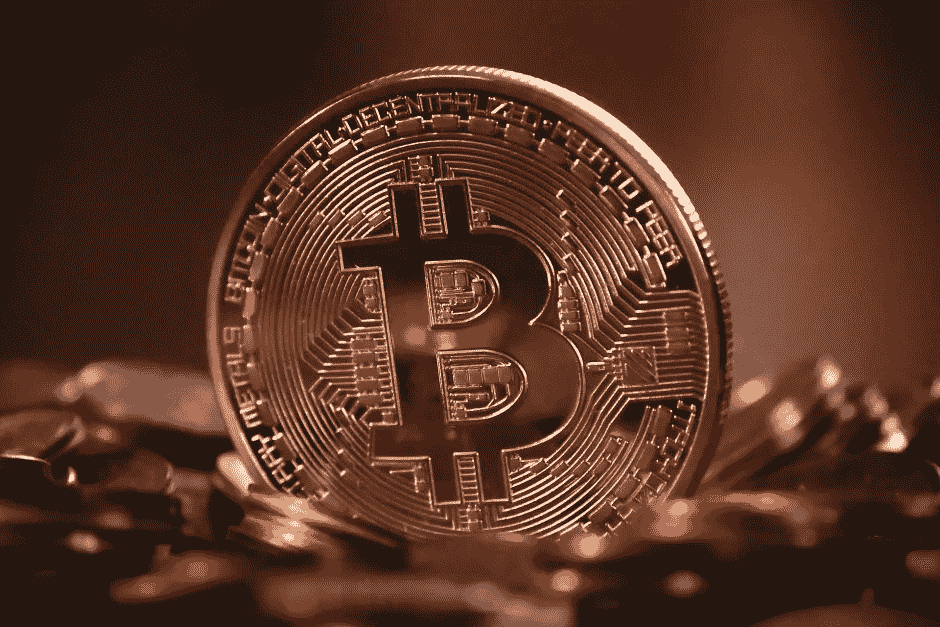

# 比特大陆报告亏损 5 亿美元，IOST 将于 2 月 25 日推出直播主网

> 原文：<https://medium.com/hackernoon/bitmain-reports-500-million-loss-and-iost-to-live-stream-main-net-launch-on-february-25-d23aac57ee8f>

**市场状况—2019 年 2 月 19 日** [**BTC**](https://berminal.com/coins/Bitcoin-BTC)**:＄3982.89(+4.15%)** [**ETH**](https://berminal.com/coins/Ethereum-ETH)**:＄148.40(+2.92%)** [**XRP**](https://berminal.com/coins/XRP-XRP)**:＄0.337637(+7)**

市场昨天继续大幅上涨，比特币目前正在测试 4000 美元的阻力。同样，以太坊正在测试其在 150 美元的阻力。如果比特币本周成功突破 4200 美元，甚至测试 4800 美元的下一个阻力，比特币将保持在 4000 美元以上。总市值在过去 24 小时内增加了 70 亿美元，自周日以来增加了 150 多亿美元。所有排名前 25 位的加密货币现在都闪着绿光，有些甚至实现了两位数的涨幅。

在其他新闻中，[比特大陆展示了一款新的 7 纳米 ASIC 芯片，专为挖掘加密货币而设计，该芯片使用 SHA256 算法进行工作证明(PoW)](https://berminal.com/news/179476/Bitmain-Reveals-New-7nm-ASIC-Chip-for-Bitcoin-and-Bitcoin-Cash-Mining) 。根据比特大陆的说法，BM1397 芯片“在性能、芯片面积和能效方面实现了新的壮举，并且它需要更低的功率，可以提供低至 30J/TH 的能耗计算比”。比特大陆表示，与之前的 7 纳米 BM1391 芯片相比，这代表了 28.6%的改进。这家矿业巨头还宣布，它将推出两款新的 Antminer 型号 S17 和 T17，这两款型号都将采用新的 BM1397 芯片。此外， [Blockstream 在其测试加密库中添加了一项名为“MuSig”的新技术，该版本允许开发人员试验 Schnorr 签名，并搜索漏洞](https://berminal.com/news/179623/Blockstream-Releases-Test-Code-for-Proposed-Bitcoin-Schnorr-Upgrade)。Schnorr 可以提高比特币的可扩展性和隐私性，这项技术已经让许多开发者兴奋了很长时间。这是该代码首次用于测试，许多比特币开发者认为这可能是比特币网络的积极升级。Schnorr 签名也可以促进闪电交易的匿名化，开发人员已经在头脑风暴其他可以建立在它之上的技术。

**1)统治该领域多年的加密货币采矿硬件制造商比特大陆最近透露，由于加密货币市场整体看跌，该公司在 2018 年第三季度损失了约 5 亿美元。在港交所审查比特大陆的首次公开募股申请之际，该公司向港交所更新了财务业绩。更新中提供的数据是第一个精确的数据，显示了熊市对这家曾经占据主导地位的公司的影响，导致财富逆转，导致裁员和公司重组。([阅读更多](https://berminal.com/news/179887/Bitmain-Reveals-500-Million-Loss-in-Update-to-IPO-Financial-Filing))**

**2)IOST mainnet 发布会计划在 7 天后举行，该活动将于太平洋标准时间 2 月 25 日(星期一)晚上 8 点/新加坡时间 2 月 26 日(星期二)中午 12 点开始直播。**本次活动将推出各种分散式应用(dApps)、分散式交易所(dex)、加密钱包、stablecoins、区块链探索者等等。IOST 是继以太坊、EOS 和 Tron 之后排名第四的游戏平台。首席执行官 Jimmy Zhong 将出席，并鼓励支持者通过 Twitter 收听。([阅读更多](https://berminal.com/news/179636/IOSTs-Mainnet-Global-Launch-Event-will-Live-Stream-in-7-Days))

上周，印度尼西亚颁布了一项备受争议的加密法，此后，当地比特币出现了大幅飙升。根据新的法律，在中国开办交易所将需要巨额的前期成本和监管。交易商和交易所都对这一规定不满意，交易转向了点对点比特币交易所 LocalBitcoins。交易员上周兑换了超过 103 亿印尼盾(73 万美元)，较上周上涨了 300%。也远高于此前 45 亿印尼盾(31.9 万美元)的高点。比特币(BTC)价格为 3747.67 美元，在最近 24 小时内上涨 2.81%。([阅读更多](https://berminal.com/news/179306/LocalBitcoins-Volume-Surges-300-In-Indonesia))

[***订阅百慕达简讯***](https://visitor.r20.constantcontact.com/d.jsp?llr=myyhdl6ab&p=oi&m=1131022639884&sit=9ar6aztmb&f=776989ec-8460-43a4-b86a-bcf8f2f1bca7)

[***免费下载百慕大 App***](https://berminal.app.link/medium-post)

**

**[***百慕大推特***](https://twitter.com/berminalapp)**

****