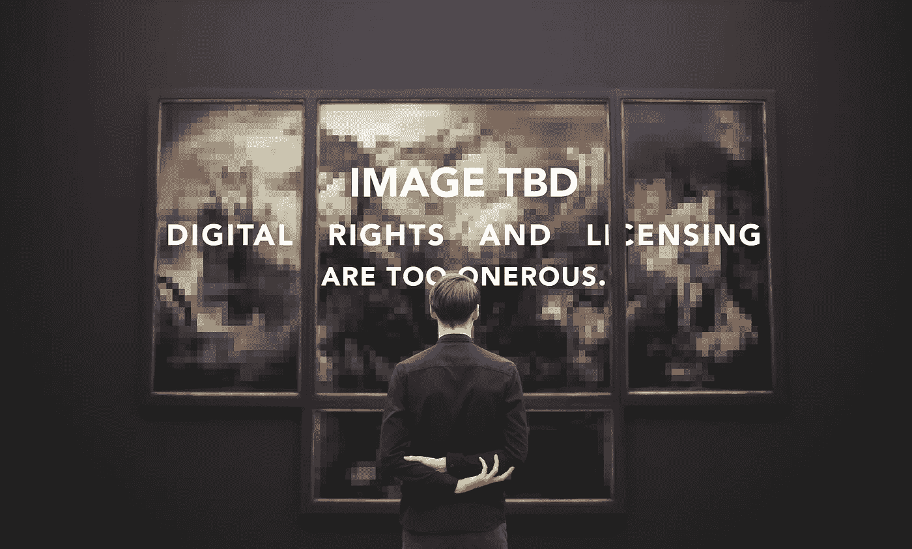

# 如何使用区块链来复制艺术品、出售 pdf，以及以其他方式获得对您财产的经济控制

> 原文：<https://medium.com/hackernoon/bitmark-how-to-use-the-blockchain-for-property-rights-ecf9f5e67e77>

每个人都认识巴拉克·奥巴马标志性的红白蓝模板肖像。但众所周知，这个已经被大量复制和模仿的著名形象是一场艰难的产权法律战的主题。

故事是这样的:

2007 年末，艺术家谢泼德·费尔雷创作了 21 世纪最具标志性的政治海报:一张巴拉克·奥巴马的蜡纸肖像，下面写着“希望”。然而，这并不完全是原创作品:Fairey 通过谷歌图片搜索找到了一张奥巴马的照片，这张照片是美联社自由摄影师 Mannie Garcia 在 2006 年拍摄的，并以此作为他的历史性海报的基础。他没有授权拍摄这张照片，事实上他可能不知道该怎么做。随后，在 Fairey 使用照片的权利上出现了分歧，随后发生了一场诉讼，最终达成了秘密和解。费尔雷后来承认销毁文件试图隐藏肖像的来源。

还有许多类似的故事，都显示了主张数字财产所有权和授权他人使用这些财产的困难。比如，你真的拥有你在*魔兽世界中获得的战利品吗？*你是否有权在 WOW 市场上出售它？这同样适用于您购买的 PDF 吗？看完能不能卖给二手 PDF 店？如果你买了一件数码艺术品，你能证明它是真品吗？你能充分控制你的在线医疗记录，以便将它们转移给新的医生吗？

> 产权登记可以让社区团结起来。它规范了分享和同意的做法，并有助于促进创新和创造的机会。

当我们进入一个越来越多的财产只存在于数字世界的时代时，这些都是我们需要解决的问题。如果曼尼·加西亚(或美联社)能够在一个无处不在的数字市场上记录他的照片所有权，那么谢泼德·费尔雷就能够轻而易举地联系到权利持有人。他可以先发制人地证实他对原作的重复片段属于合理使用范围，或者获得了这种使用的权利。在这种情况下，产权登记可以将社区聚集在一起，允许像 Fairey 和 Garcia 这样的创作者以他们认为合适的方式分享、交换、转让和许可他们的权利。

类似地，如果你的 MMORPG 物品、你的 pdf 文件和你的数字艺术品有市场，如果你的数字数据有交易，那么你也可以转让、出售或交换它们。

我们如何创建这些 21 世纪的市场？数字问题需要数字解决方案，有一种新兴的数字技术为创造这种永久记录提供了很好的解决方案:T2 区块链 T3。

(如果你已经熟悉区块链技术的基本原则，你应该跳过接下来的两个部分，转而阅读“Bitmark Blockchain ”,它解释了 Bitmark 自己专门为产权构建的公共区块链如何使每个人都能访问数字资产和数据的市场。)

# 关于区块链的一切

区块链是 21 世纪最具创新性的计算机技术之一。这是一个分散的分类帐，允许来自世界各地的人们在一个永久的注册表中共同记录信息。换句话说，这是一个世界范围的数据库，人们可以合作写作。

区块链是由精心构建的共识算法创建的，用户创建信息并将其发送给“矿工”，矿工将信息收集到“块”中，然后添加到“链”中。许多文章都详细描述了这项技术的细节，但是这项技术创造的 ***属性*** 尤其引人注目:

放入区块链分类账的任何信息是:

*   ***有序*** ，是按时间顺序排列的，显示的是开头和结尾；
*   ***不可变*** ，写了就不能改了；
*   ***分布式*** ，它存储在许多不同的计算机上；和
*   通常 ***分散*** ，它不受任何一个人的控制。

这些特殊的 ***属性*** 允许一群人(或企业)合作管理信息，而不需要彼此信任。他们每个人都可以向区块链添加他们自己的信息，并且他们可以确定其他人正在使用相同的规则添加信息，并且对总分类帐的状态有相同的理解，所有这些都没有任何中央权威机构来规定参与的条款和条件。

这被证明对许多不同的应用是有用的。

# 关于比特币的一切

比特币既是区块链技术的起源，也是其最著名的例子。它使用区块链不变的分散式账本来记录比特币这种数字货币的交易。这使得人们可以使用只作为数字资产存在的货币来买卖商品和服务。

数字货币交易是受益于区块链特定优势的任务的一个例子。它要求对交易进行排序，以便始终知道比特币的当前所有者，它要求交易不可改变，以便这些交易永远不会被删除，它要求交易被分配，以便即使一个网站或公司消失，交易列表也是永恒的，它要求交易分散，以便没有人控制这些记录。比特币持有者不必相互信任，也不必信任任何中央权威机构:区块链技术会为他们做好一切。

但正如你可能猜到的，还有另一个数字问题的解决方案与区块链的优势相一致:记录和利用产权。

# Bitmark 区块链

Bitmark 考虑使用比特币区块链本身来记录产权；它尝试了众所周知的技术，如彩色硬币，可以用来标记特定的资产。然而，Bitmark 很快意识到，数字版权需要特定的功能，这与为比特币区块链做出的实施决定背道而驰。

> “Bitmark 创建了一个新的区块链…以更好地支持数字资产和数据的创建和交换。”

Bitmark 需要一个禁止财产合并和分割的系统，因为这与资产来源不一致。它需要一个允许无限硬币生产的系统，因为有限的硬币可以限制财产数量。它需要一个支持元数据的系统，因为这对属性描述至关重要。最后，它需要一个承认公有制可能性的体系，因为这给了财产所有者公开申报财产的选择。比特币是围绕可替代和有限资产、受约束的元数据和假名身份的理想而建立的，而财产权受到这些目标的损害。因此，Bitmark 创建了一个新的区块链——一个专门面向产权的——以更好地支持数字资产和数据的创建和交换。

在 Bitmark 区块链上，资产由三种记录表示:资产记录、发行记录和转移记录。它们一起记录了资产的存在、来源和当前所有者:

*   一条 ***资产记录*** 登记一项资产。它包括资产的指纹和注册人的公钥。
*   一条 ***出库记录*** 创建一个资产的具体实例。一个资产记录可能只链接到一个问题记录(如果它是唯一的)，也可能链接到多个问题记录(如果它们是限量版的一部分)。发行记录包括所有者的公钥，并由注册者的私钥签名。其结果是一个“比特标记”:财产所有权的数字证明。
*   ***转移记录*** 将资产的特定实例从一个所有者转移到另一个所有者。这些是位标区块链的核心，因为一系列的转移可以用来追踪一个物体的来源，一直追溯到它的起源。每个记录都记录了新所有者的公钥，并由旧所有者的私钥签名。

和任何区块链一样，Bitmark 的物流有点复杂。还有少量交易费，发行记录用工作证明支付，转账记录用加密货币区块链交易支付。记录者(矿工)的工作报酬有具体的规则，无论是加密货币支付还是比特币支付。Bitmark 的[技术页面](https://bitmark.com/property-blockchain/bitmark-blockchain)详细介绍了这些细节。

然而，Bitmark 使用区块链技术来证明所有权和支持数字财产的转移是非常简单的。而且，简单带来力量。

回到我们最初的历史例子，想象一个世界，曼尼·加西亚(或美联社)在巴拉克·奥巴马 2006 年的照片上做了点标记。如果他们公开了自己的 bitmark，斯蒂芬·费尔雷(Stephen Fairey)可能会就使用问题联系他们，如果他们在数字市场上提供照片，费尔雷可能会选择授权。所有这些都不是数字梦想:KKBOX 已经使用 Bitmark 区块链透明地记录音乐所有权，确保艺术家及时获得版税。这是 Bitmark 的第一个主要用途，它让原创者和那些想要重复或重用他们作品的人都有能力。

比特币区块链正在迅速成为数字经济的核心，音乐版权、硬件保修、艺术品和健康数据的个人市场已经存在。使用这些不同的市场，数字公民不仅可以证明他们的数字财产的所有权，还可以许可和交换它们。这一切都与现实世界的合同法有关:音乐权利维护付费艺术家的行业标准，健康数据具有符合 HIPPA 的可移植性和转移渠道，而其他财产的注册和转移反映了当前的版权和许可法律。

我们的生活和财产越来越多地存在于数字世界中。比特马克区块链帮助我们更好地控制这个新领域。