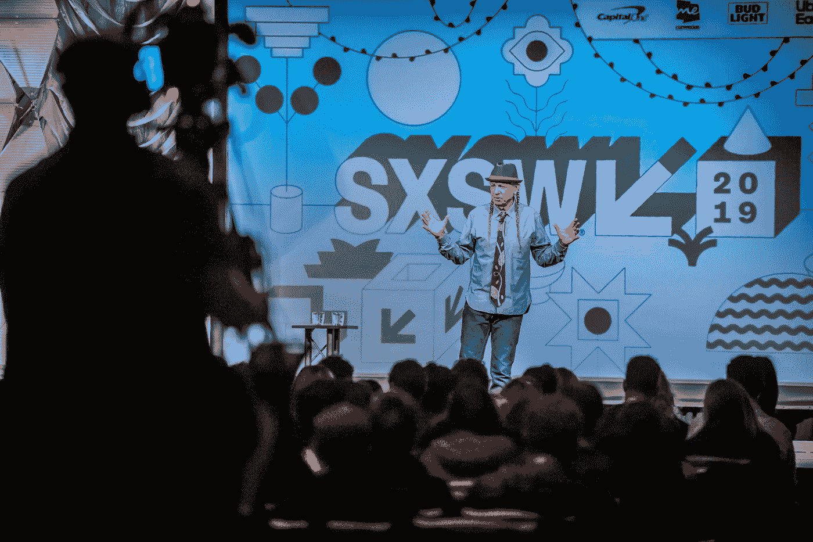
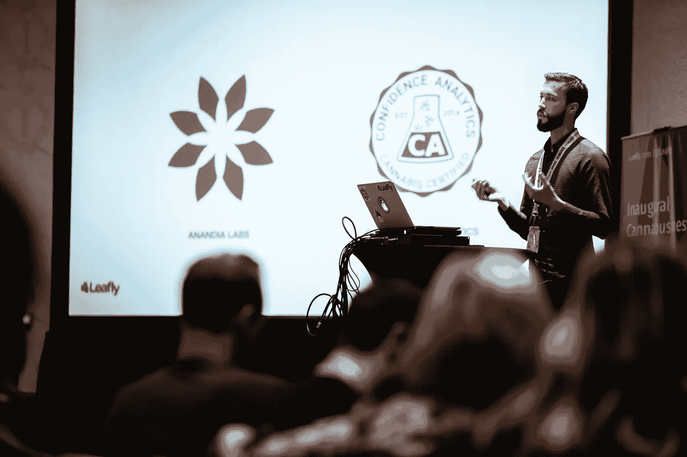
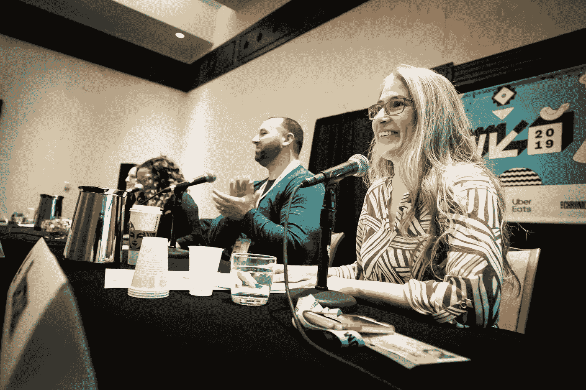

# 荣耀之火:SXSW 最火的大麻生意时刻

> 原文：<https://medium.com/hackernoon/blaze-of-glory-the-hottest-cannabusiness-moments-of-sxsw-15099f23ca9e>

(photo credit @[aaronrogosin](https://www.instagram.com/aaronrogosin/) of @[outer_elements](https://www.instagram.com/outer_elements))

2019 年标志着 all things Cannabusiness 作为世界领先的互动节日之一的 SXSW 的[官方赛道首次亮相。](https://www.sxsw.com/conference/cannabusiness/)

那么今年有什么值得一看的大事件呢？看看他们:

[**史蒂夫·迪安杰罗**](https://www.stevedeangelo.com/) 是一位引人入胜的主题演讲人，他的专题演讲是[大麻复兴:科学验证传统](https://schedule.sxsw.com/2019/events/PP101175)——将大麻的历史展现到现代。

(photo credit @[aaronrogosin](https://www.instagram.com/aaronrogosin/) of @[outer_elements](https://www.instagram.com/outer_elements))

****有一个引人注目的存在，包括一个赞助的 44-talk 大麻商业赛道，其中包括一个树叶休息室，成千上万的人来这里喝基于不同口味的大麻(称为萜烯)的冰沙。)叶子科学家 Nick Jikomes 做了一个关于大麻品系鉴定的下一次进化的演讲——远离“印度大麻杂交品种”。在与 David Downs 的直播采访中，ArcView Group 的主题发言人 Troy Dayton 要求大麻公司重新投资合法化，以释放所有大麻囚犯。发言人约翰·博纳——现在是一家大麻公司的董事会成员——说他希望今年晚些时候通过州法案使大麻合法化。****

********

****(photo credit @[aaronrogosin](https://www.instagram.com/aaronrogosin/) of @[outer_elements](https://www.instagram.com/outer_elements))****

****[**CitizenGrown**](https://www.citizengrown.com/)**举办了一个私人阿姆斯特丹主题休闲酒廊，供应咖啡、浓缩咖啡和薄荷绿茶。与投资者和大麻行业高管一起度过了一段美好的时光。******

******他们在白天也有 DJ 答谢会。SXSW 的 DJ 们放松下来，演奏“他们”想要的东西，放松下来，与来自 Wu-Tang 的 Raekwon 一起演奏。******

************

******(image credit Bryan Gonzalez)******

********[**Ellementa**](https://ellementa.com/)的 Aliza Sherman 是日历上的一个亮点，教育公众大麻客户是如何演变的，并更深入地了解新的大麻消费者的细微差别。********

********

****(photo credit @[aaronrogosin](https://www.instagram.com/aaronrogosin/) of @[outer_elements](https://www.instagram.com/outer_elements))****

*****感谢* [*的 Shayna Goldstein 和 Aaron rogo sin*](https://www.outerelementsphotography.com)*[*Leafly 的 David Downs*](https://twitter.com/davidrdowns) *和 Redg Snodgrass 对本文的帮助。******