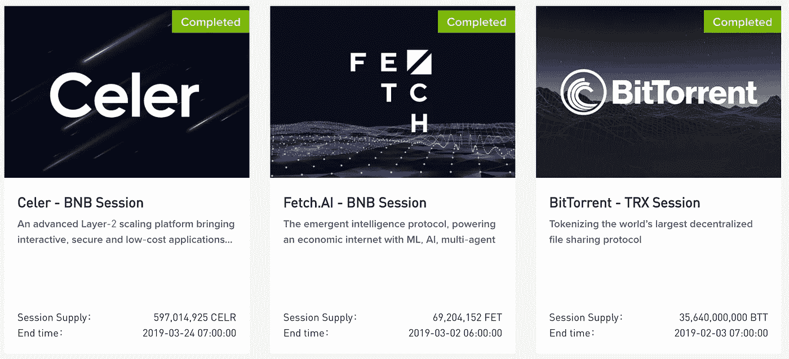
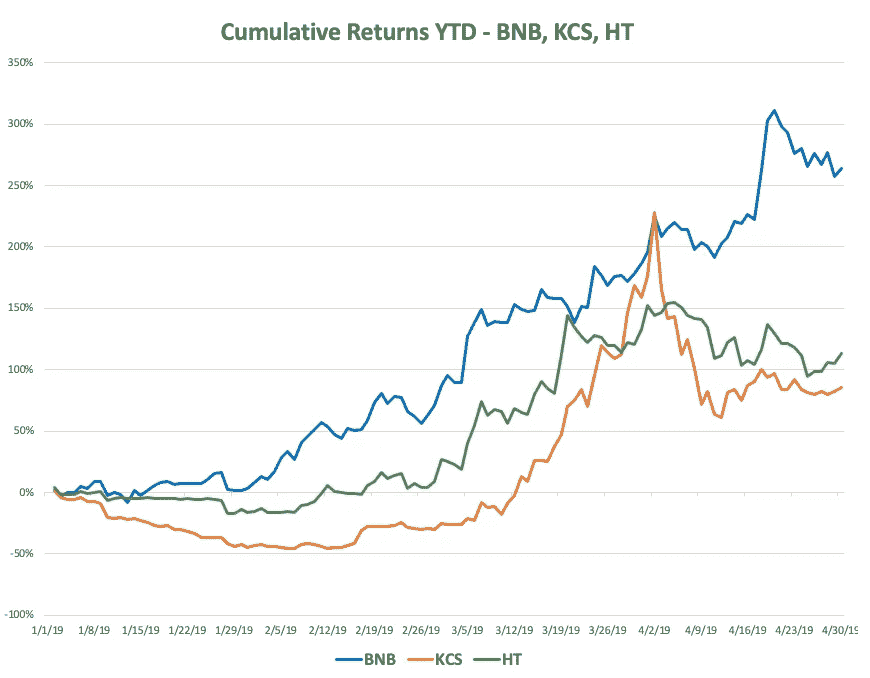
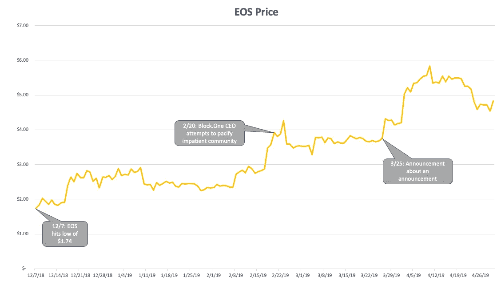

# “[区块]事件链”——3 月/4 月版

> 原文：<https://medium.com/hackernoon/block-chain-of-events-march-april-edition-b1cbd14477df>

*关于 4 月份的一个注意事项:由于比特币在 4 月份的复苏和市场主导地位，我们发现与 BTC 交易持平或窄幅波动的月份相比，事件驱动头寸的影响实际上是温和的。我们计划在未来的某个时候探索这个问题。与此同时，这里是我们对三月份有效措施的分析。Arca 研究团队*

# **背驮式——为什么要再造轮子？**

区块链项目都基于开源代码和开源社区精神。因此，大多数项目和公司都相当公开其业务方向和长期愿景。事实上，我们已经从这些项目的确切里程碑中获得了书面证据——白皮书。项目之间相互借鉴不足为奇——它们借鉴他人的成功。在过去的几个月里，我们看到这种情况在加密交换令牌中非常突出。

币安在过去的几个月里成为头条新闻，因为它开始扩大其币安硬币(BNB)的使用案例。此外，该公司推出了期待已久的分散式交易所(DEX)产品，该产品在 2017 年的白皮书中有所概述。BNB 是现存的为数不多的能为其代币提供实际效用的代币之一:

*   代币可以用来支付币安平台上的交易费用，并为用户提供交易费用折扣。
*   充当交易所中每种资产的交易对，使其成为许多交易者拥有和持有的资产，就像比特币和以太坊一样。
*   代币具有类似于股票的特征——一部分代币按季度回购，并与交易所的交易收入成比例。

2017 年底发布的最初的币安白皮书承诺，随着 DEX 的推出和平台的发展，将引入额外的令牌实用程序。这些额外的令牌使用案例在 2019 年第一季度取得了成果。

除了[增加了接受币安作为支付形式的商家数量](https://www.binance.com/en/use-bnb)，币安还重新推出了他们的币安 Launchpad 产品，这是一个代币项目在首次交易所发行(IEO)中筹集资金的平台，这是 ICO 的下一个发展。购买这些新发行的债券必须使用 BNB 代币。在之前的 ICO 发行中，投资者可以主要在 BTC 和瑞士联邦理工学院(ETH)进行支付，项目自己负责发行，与此不同，币安承担了这些责任，为项目提供发行，并为其客户提供使用交易所令牌参与的机会。

在完成了三个几分钟内销售一空的高调 ieo 后，币安找到了另一种激励用户和增加 BNB 需求的方法。该平台没有采用“先到先得”的原则，而是选择[整合一个抽奖系统](https://www.binance.com/en/blog/316491046311071744/Update-to-the-Binance-Launchpad-Token-Sale-Format)，用户可以在销售过程中收到兑换的门票。根据用户帐户前 20 天持有的 BNB 数量来分配门票。这些要求进一步增加了对 BNB 的需求，并推高了价格，因为希望参与 IEO 的用户被鼓励购买和持有他们的令牌。到这个时候，BNB 的回报率已经是年初的 200%了。

## **跟风者**

币安的策略和分布展示了该交易所的主导地位和能力，即在其生态系统内为代币创造更多用途。如果没有跟随币安的脚步，其它拥有类似代币的交易所可能会出问题。

总部位于香港的交易所 KuCoin 于 2017 年底开业，在币安进行 ICO 两个月后，于 2017 年 9 月发行了交易所令牌。库币股份(KCS)通过类似于币安模式的季度回购和烧钱机制向用户提供交易折扣。此外，该交易所还实施了“ku coin Bonus”——根据交易所的每日交易费用，每天向持有 KCS 的用户空投一次。为了在竞争中保持领先，KuCoin [宣布将于 3 月 20 日推出 IEO 平台](https://www.kucoin.com/news/en-introducing-kucoin-spotlight)。这导致 KCS 股票上涨了 54%,与 BNB 的回报相比显得微不足道。

KCS 并不是一个孤立的案例，因为这种模式在 Huobi Token (HT)、BitMax (BMT)、OkEx (OKB)和 Bittrex 等公司都出现过。所有这些交易所(除了没有自己令牌的 Bittrex)都是 BNB 的模仿者，它们推出了自己版本的初始交易所提供平台，与币安的平台竞争。当投资者看到像 BNB 这样成功的代币提供超额回报时，他们继续在交易所行业寻找有潜力的表现不佳者。

*Source: CoinMarketCap. Data for BTMX and OKB were excluded as they only recently began trading.*

尽管许多人可能认为，这些交易所正借助币安的成功，但这些交易所如何能够改变商业模式，并保持产品供应的灵活性，这一点令人瞩目。数字资产市场每秒移动一英里，跟不上的代币和产品将被远远甩在身后。当整体市场低迷时，这些交易所在 Q1 加速发展，借他人的成功为持有者提供回报。

# **关于一个公告的公告**

可以使用基本面分析对 Crypto 进行估值，但代币的日常市场价格在很大程度上仍受社区情绪的驱动。出于这个原因，能够推销自己的项目总是能够推动其令牌的价格升值。我们在过去几个月里看到的最新策略是“关于公告的公告”。虽然这是一个乏味的策略，但它奏效了。项目用诸如“重大新闻即将到来”、“我们下周将公布一个重要的合作伙伴关系”、“我们有重大的技术更新要与你分享”这样的话来戏弄他们的追随者社区。社区通常极度渴望好消息，会抓住一切。

这是一个新现象，因为私人和公共股票市场的运作方式不同。在公共股票领域，公司在发布重大公告时必须提交 8-K 表格。在私人市场，公司公开宣布任何进展都不会有什么得失，所以除了融资之外，他们通常会保持沉默。然而，加密项目没有这样的规定，他们可以说他们喜欢的话，并在他们的令牌价格被操纵时观看。这一趋势在过去几个月中最显著的例子是 EOS。

自去年秋季以来，EOS 经历了一段坎坷，负面新闻不断。在 mainnet 发布后，问题百出，该平台遭遇了许多黑客攻击，four Block 的大批退出。一名高管、[与制作人](https://www.trustnodes.com/2018/09/29/rampant-collusion-in-eos-exposed-by-huobi-leak)串通一气，最后是创作者[丹·拉里默可能离开该项目的威胁](https://cryptovest.com/news/dan-larimer-hints-at-new-project-suspected-of-leaving-eos/)。更糟糕的是，该项目没有发布任何实质性的更新或进度报告，只是向不耐烦的社区提供了微弱的保证。正如我们之前所讨论的，在令牌项目的情况下，[没有消息就是坏消息](https://www.ar.ca/blog/block-chain-of-events-january-edition)。

*Source: CoinMarketCap.*

在 11 月份的抛售后，EOS 已经非常低迷，未能在 1 月和 2 月随市场反弹。在 12 月 7 日触及 1.74 美元的低点后，许多人想知道这个潜在的以太坊竞争对手是否会复苏。3 月 25 日，丹·拉里默[通过电报](https://www.investinblockchain.com/eos-founder-hints-biggest-announcement-coming/)透露，EOS 将于 6 月 1 日发布一项重大公告，这将是“自 EOSIO 发布以来最大的一次”。EOS 继续上涨，在接下来的两周内上涨了 58%。

虽然这些收益没有保持住(在触及 5.90 美元后，现在交易在 5 美元左右)，但公告达到了预期的效果。这个社区重新焕发了活力，投资者再次关注这个项目。我们不知道 6 月 1 日会发生什么，但此时此刻这已经无关紧要了。

关注我们:
Medium [凯蒂·塔拉蒂](/@katietalati) & [哈桑·巴西里](/@hassanbassiri)
推特 at[@凯蒂·塔拉蒂](http://twitter.com/KatieTalati)[@哈桑·巴西里](http://twitter.com/HassanBassiri)[@阿卡](http://twitter.com/Arca)

*原发布于*[*https://www . ar . ca*](https://www.ar.ca/blog/block-chain-of-events-april-edition)*。*

**免责声明:**

*截至本注释日，Arca 数字资产基金持有 EOS 头寸。*

*本评论仅作为一般信息提供，绝不作为投资建议、投资研究、研究报告或建议。对本评论中讨论的证券进行投资或采取任何其他行动的任何决定可能涉及本文未讨论的风险，此类决定不应仅基于本文包含的信息。*

*本沟通中的陈述可能包括前瞻性信息和/或可能基于各种假设。此处表达的前瞻性陈述和其他观点或意见是在本出版物发布之日做出的。实际的未来结果或事件可能与预期的有很大不同，并且不能保证任何特定的结果会发生。本文中的陈述可能会随时更改。Arca Funds 不承担更新或修改此处表达的任何声明或观点的任何义务。*

*在考虑本注释中包含的任何绩效信息时，应注意过去的绩效并不能保证将来的结果，也不能保证将来的结果会实现。此处提供的部分或全部信息可能是或基于观点陈述。此外，此处提供的某些信息可能基于第三方来源，这些信息虽然被认为是准确的，但尚未经过独立验证。Arca 基金和/或其某些分支机构和/或客户持有并且将来可能持有与本评论中讨论的证券相同或基本相似的证券的财务权益。对于此类金融权益的盈利能力，无论是现在、过去还是将来，都不做任何声明，Arca 基金和/或其客户可以随时出售此类金融权益。此处提供的信息无意也不应被解释为出售或购买任何证券的要约。本注释未经任何监管机构审核或批准，且在编制时未考虑可能收到本注释的个人的财务状况或目标。特定投资或策略的适当性将取决于投资者的个人情况和目标。*