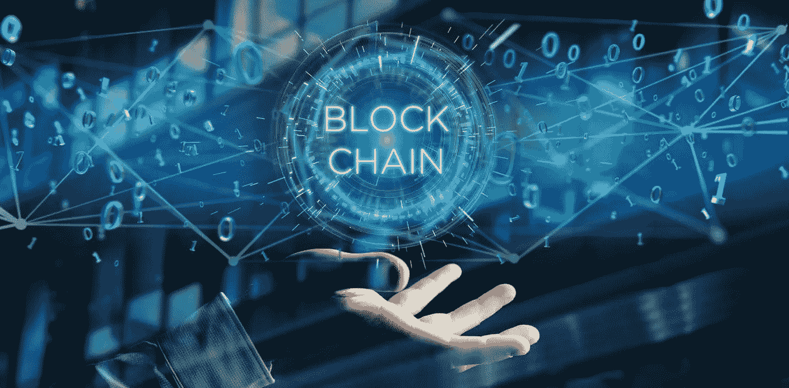
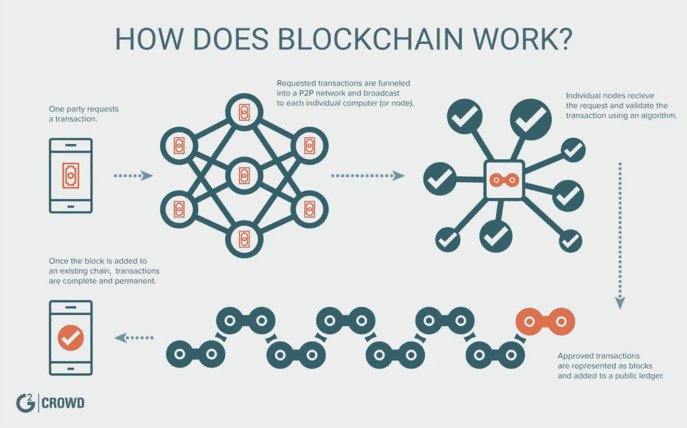
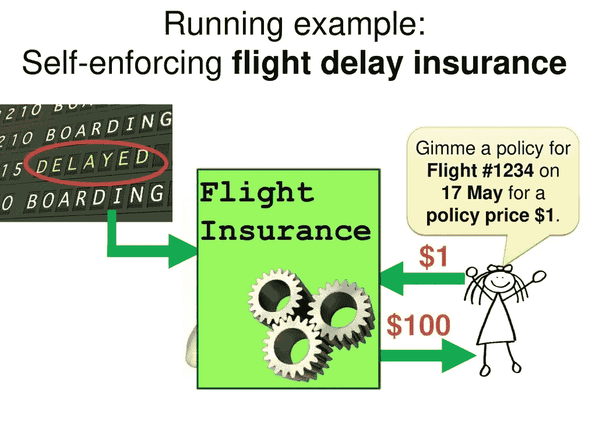
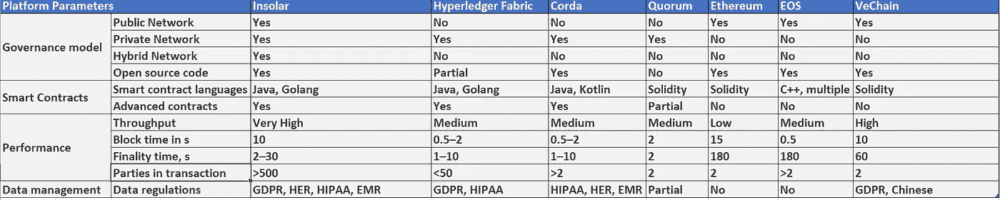
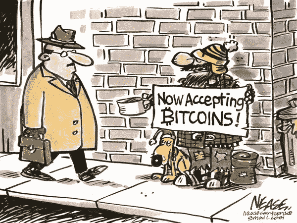

# 区块链围绕比特币的热潮

> 原文：<https://medium.com/hackernoon/blockchain-a-buzz-around-bitcoin-9672ca2f17c6>

Image by [TheConversation](https://theconversation.com)

最近一段时间，比特币这个词引起了热议，人们认为比特币就是区块链，区块链就是比特币。在这里，我将谈论一些开源社区，他们现在是区块链这个词的先驱，并向世界证明了 T2 比特币不是唯一的 T4 区块链 T5。

Image by [G2crowd](https://www.g2crowd.com/)

中本聪关于点对点电子现金系统的论文向世界介绍了区块链的概念。区块链为比特币而生，并开始了挖掘比特币以获得激励的竞赛。

另一方面，各行业也开始将区块链技术视为一种福利，以及他们如何利用它来解决他们面临的问题。基于区块链的技术向软件行业展示了一种构建更安全、可互操作、值得信赖的应用程序的新途径。区块链提供的信任框架承诺无摩擦交易、互操作性、速度、可伸缩性、治理，并降低入职成本。

即使比特币在公共分布式账本上工作，它也能够保持交易的高度匿名性，并提供不变性。反过来，这也使得软件行业能够探索提供智能合同的区块链。

# 智能合同:

运行在包含一组规则的区块链之上的简单编程代码被称为智能合约。当满足特定条件时，它就会被执行。它是参与方之间的一种协议，当满足预定义的规则时会自动执行。让我们举一个例子来考虑一下，如果你的航班延误了，但你买了航班保险，智能合同可能会在从可靠的航班时间来源获得更新后立即支付给你。

Image by [SlidePlayer](https://slideplayer.com/)

智能合约使我们能够编写一段代码来满足我们的需求，并帮助我们将现有的基础设施与区块链集成。

让我们看一些可以使用区块链的简单用例。

# 用例

1.  你有没有去过商店，怀疑你选择的商品是否是真的？一瓶昂贵的葡萄酒真的是仿冒品吗？这种情况在当今社会经常发生。幸运的是，区块链技术可以帮助我们追溯任何商品或物品的历史，以这种方式篡改它是不可能的。在区块链技术的帮助下，人们可以很容易地找到产品是在哪里制造的，由谁制造的，以及所述产品或物品的质量和状况是否是可接受的质量。
2.  以钻石为例。钻石经过开采、分类、切割、抛光、装箱、镶嵌、出售和转售。在这些事件之间有交通事件发生。钻石足够珍贵，也足够独特，可以追踪。在一个追踪钻石的私人区块链网络中，网络中的每一方都有相同的区块链分类账，记录每个阶段的钻石情况。这样，我们可以利用区块链跟踪钻石

> 因此，我们可以把区块链分类账看作是与资源相关的所有交易的简单历史记录

金融公司、用于预测性维护的机器学习、供应链管理、文档流和工业物联网(IoT)数据收集都是可以通过区块链实现的领域的例子。啊，但是没有区块链标准。

> 社区正在努力开发一些开源区块链技术的标准化，如 Hyperledger、[insole ar](https://insolar.io/)、Ethereum 等。上面提到的所有开源社区都已经开始在云计算(PaaS，IaaS，SaaS)的路线上提供区块链即服务(BaaS)

# 区块链即服务(BaaS):

建立测试和研究区块链的环境需要一个具有多个系统的生态系统，以便能够开展研究和测试。亚马逊(Amazon)、微软(Microsoft)、IBM(BlueMix)等云行业的巨头已经看到了在云中提供区块链服务的潜在好处，并开始向他们的客户提供某种程度的 BaaS。用户将受益于不必面对配置和设置工作区块链的问题。也不需要硬件投资。开发者将拥有一个基于一键式云的区块链开发者环境，这将允许快速开发**智能合同**。

**不同区块链平台对比**:

Image by [Insolar](https://insolar.io/)

区块链的核心优势是大幅减少组织之间的连接和交互摩擦，这是去中心化和非中介化商业网络、新型资产数字化和新形式的价值交换等创新性破坏的核心。

然而，当前的区块链平台仍处于发展阶段，并且正在快速适应现实世界的场景。到目前为止，当前基于区块链技术的解决方案在与现有企业基础设施和业务模型的集成方面面临着几个障碍。

尽管区块链提供了许多功能，但人们经常看到，大多数基于区块链的应用程序的开发都没有考虑到现实世界的企业需求，缺乏熟练的开发人员，最重要的是昂贵的安装成本。因此，在解决明确定义和理解的业务问题方面，区块链平台不如许多传统数据技术有吸引力。因此，区块链一直是比特币的热门话题。