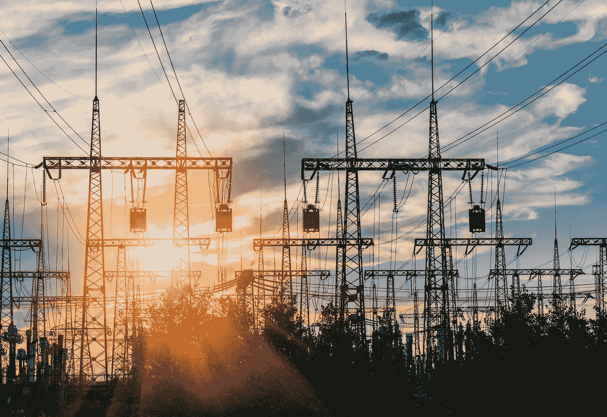

# 区块链——对传统能源供应商的威胁？

> 原文：<https://medium.com/hackernoon/blockchain-a-threat-to-traditional-energy-providers-6ce3d490e486>

## 点对点能源交易是机会还是威胁？

能源行业的一些公司出售区块链技术，但其他公司(更具体地说是公用事业公司)——嗯，没那么多。很难理解为什么公用事业公司会对区块链感兴趣，因为它们往往是电力生产商和消费者之间的中间人。因此，大多数零售商对去中介化的概念并不感兴趣。

区块链正在重新定义数字信任，形成一种新的管理范式，可能会破坏传统的治理形式。**颠覆性在于以共识取代自上而下控制的潜力，也在于分布式共识、透明度和基于群体的决策的基本理念。**

**点对点(P2P)能源交易**

随着能源消费的增长，人们对能源共享越来越感兴趣。像 [SunContract](https://medium.com/u/ee5756c1cf02?source=post_page-----6ce3d490e486--------------------------------) 这样的基于区块链的先驱公司正在创造一个世界，在这个世界中，拥有电表后发电能力的客户可以在当地的能源市场上将多余的电力出售给邻居。消费者也可以购买当地生产的可再生能源，这可能比从他们的公用事业购买更便宜。

区块链相对较低的交易成本允许较小的能源生产商参与其中，直到个体太阳能家庭。智能合同有助于实时协调太阳能电池板和其他装置的生产数据，并执行销售合同，允许整个网络的双向能源流动。

但是这种创新不能威胁到公用事业。原因如下:

> **区块链有助于协调整个能源价值链中利益相关者的动机**

区块链不必让初创公司与公用事业公司对立，也不必让供应商与消费者和专业消费者对立。事实上，区块链是仅有的有潜力支持一个平台的技术之一，该平台将能源系统中各种利益相关者的激励结合起来。

**通过实时交易平衡供需**

随着太阳能和风能的扩大，能源市场越来越面临供需平衡的挑战。人们需要灵活的服务，这种服务可以调整需求以更好地匹配供应，也可以在短时间内提供供应以满足不断增长的需求。

需求响应和其他灵活服务对电力供应商来说是一种宝贵的资源，在某些情况下，可以替代对新发电容量的投资，以满足高峰需求。

消费者可以选择接受一些补偿，作为交换，比如说，允许公用事业公司在高峰期将灯光调暗 5%，或者从他们的家用电池中取出几千瓦时，所有这些都通过智能合同实现自动化，并由同一个基于区块链的网络提供支持，从而实现交易能源。

## 结论

通过将区块链应用于公用事业公司的大量数据，他们不仅可以为能源客户创造价值，也可以为自己创造价值。公用事业公司可以从更协调的市场、更智能的硬件和更广泛、更高效的电气化中释放新的收入流。

[*Winfred k . Mandela*](https://www.linkedin.com/in/winfred-k-mandela/)*是区块链领域卓有成就的营销人员和业务开发人员。她负责将各公司产品团队的创新与业务部门以客户为中心的运营联系起来，以建立区块链品牌，在实施项目的地区创造消费者意识，并每天通过他们的渠道推动客户对品牌的偏好。Winfred 喜欢在户外骑自行车，喜欢分析市场，并且总是喜欢读一本好书！*