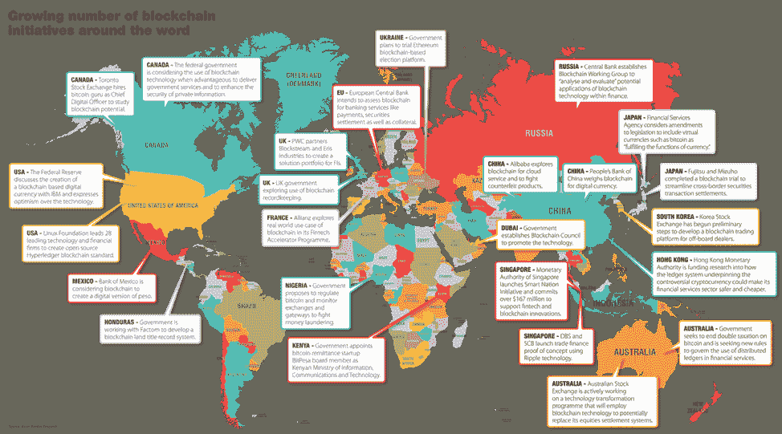
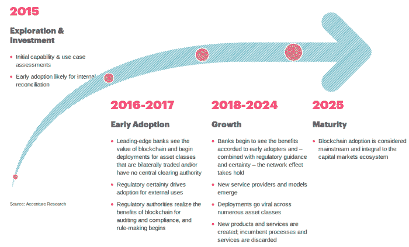
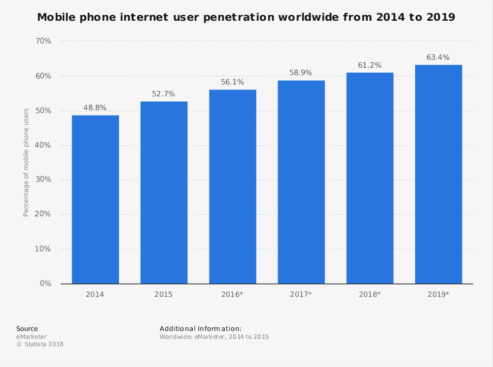
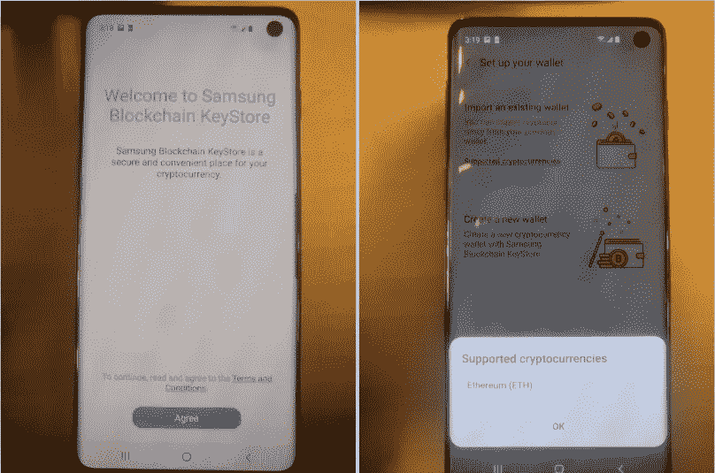

# 区块链的采用可能比我们想象的更近

> 原文：<https://medium.com/hackernoon/blockchain-adoption-could-be-closer-than-we-think-e68bebaebca4>

当我们说[区块链](https://hackernoon.com/tagged/blockchain)领养是什么意思？2017 年，这一切都是关于首次公开募股如何破坏传统的融资或筹款方式。再加上所有主要加密货币的天文数字增长，每个人都对他们在这个硬币和那个硬币上的投资欣喜若狂。

然后是 2018 年，这一年被称为加密冬天。散户阵营和机构中都弥漫着恐慌、泪水和厌恶。这在社交媒体上很明显。任何在 2017 年末投资的人，都会在投资中陷入困境。它来的很快，炒作就消失了，关于从 Crypto 致富的讨论也停止了(或者说推迟了)。

焦点从赚钱转移到采用底层的[技术](https://hackernoon.com/tagged/technology):区块链。在 2017 年/2018 年初，任何关于合作或收购的消息都会受到极大的期待。大多是由于价格上涨的行动，购买谣言和出售新闻战术。如今，它几乎不被庆祝。

缺乏炒作和过度兴奋起初让人感到不安，但这为真正的技术进步创造了一个环境。

让我们从三个角度来看看区块链技术采用的关键驱动因素

1.  **公共部门**
2.  **私营部门**
3.  **一般人群**

# 公共部门趋势

似乎每周都会有政府宣布启动或支持一项区块链倡议。值得注意的是，政府的采纳可以被视为对区块链巨大潜力的认可。

*整合政府对区块链技术的参与*

以下是一些国家支持区块链技术的例子:

## 意大利

意大利政府宣布了第一套区块链技术法规。法律规定，现在区块链上的任何记录都可以被认为是合法的。尽管仍然需要总统的批准，这是政府合法化区块链技术的一个重大举措。

## 泰国

泰国国家电子和计算机技术中心(NECTEC)是科技部的一个部门，它正在开发一种可以应用于多种选举的电子投票系统。该系统目前处于小规模测试模式。电子投票的好处是巨大的，因为选民只需要互联网连接就可以参与投票，而不需要亲自到场投票。

## 美利坚合众国

[华盛顿州参议院提出了一项法案](http://lawfilesext.leg.wa.gov/biennium/2019-20/Pdf/Bills/Senate%20Bills/5638.pdf#page=1)，鼓励分布式账本和区块链技术的发展。该法案在数字签名和许可证方面提供了法律承认，试图验证区块链作为一个加密安全的数据库。

[据 Coindesk](https://www.coindesk.com/wyoming-lawmakers-advance-blockchain-sandbox-bill) 报道，怀俄明州已经提出一项法案，允许使用区块链技术发行令牌化股票。该法案旨在明确数字资产的合法性，并允许通过银行托管数字资产。

## 克罗地亚

萨格勒布当局正在寻求采用区块链技术，并将其整合到国家的日常运作中，特别是在保护敏感文件和监控当地公司的业务流程方面。区块链技术被认为是保存官方文件和数字证书的安全手段。

## 中东

据报道，中东国家，特别是沙特阿拉伯和阿联酋，正在推出一种官方的银行间加密货币。到目前为止，该项目还处于试验阶段，没有给出太多的信息。他们在这个实验阶段的目标是更好地理解区块链技术在促进跨境支付方面的影响。

## 新加坡

新加坡有很多自豪地宣称自己是区块链支持者的例子。其中一个特别引起了我的注意:由新加坡政府所有的淡马锡控股公司(Temasek Holdings)和新加坡证券交易所(Singapore Stock Exchange)投资了一个平台，该平台允许通过发行证券代币来筹集资金。STO 本质上是资产的象征化，而新加波在区块链整合的立场上做出了重大声明。

新加坡公共服务部门还可以采用区块链来核实供应商在新加坡政府电子采购门户网站 GeBiz 上的跟踪记录，跟踪公职人员的职业发展和审计过程。Ubin 项目也是新加坡参与采用区块链技术的另一个显著例子。

# 私营部门趋势

除了政府机构对区块链感兴趣之外，下一个推动区块链采用的是大型私人机构。将世界塑造成今天这个样子的人。这些大公司最终会鼓励小企业尝试区块链技术。

1.  亚马逊网络服务已经与 Kaleido 合作，在云上提供一个[全栈区块链企业平台](https://aws.amazon.com/blockchain/)，集成区块链服务和 AWS 服务
2.  [腾讯和华为正在领导一个由 100 多家不同的中国公司组成的区块链财团，名为 Fisco](https://thenextweb.com/hardfork/2018/10/18/tencent-huawei-coinless-blockchain/) ，它正在推出自己的区块链，专注于快速交易，同时为政府监管机构和审计机构提供“观察”节点
3.  [中国支付服务支付宝的母公司蚂蚁金服与渣打银行(Standard Chartered)](https://www.bankingtech.com/2018/06/ant-financial-turns-to-standard-chartered-for-blockchain-payments/)合作，推出了一项总部位于区块链的汇款服务，可以实现港菲之间的实时资金转账
4.  德国保险巨头[安联保险公司证实](https://www.coindesk.com/insurance-giant-allianz-testing-token-move-money-internally)他们正在测试一种代币，用于在其全球分支机构之间转移资金，以降低货币转换成本和其他单位之间的低效率
5.  沃尔玛、克罗格、雀巢和联合利华与 IBM 合作，使用[区块链通过增强供应链跟踪来提高食品安全](https://techcrunch.com/2018/09/24/walmart-is-betting-on-the-blockchain-to-improve-food-safety/)
6.  马士基与 IBM 合作开发[区块链航运解决方案](https://www.maersk.com/en/news/2018/06/29/maersk-and-ibm-introduce-tradelens-blockchain-shipping-solution)
7.  UPS 提交了一项技术的美国专利申请，他们将使用[区块链来有效地跟踪和管理运送的包裹](https://multichannelmerchant.com/operations/ups-looks-solve-supply-chain-issues-blockchain-patent/)
8.  联合国正在探索用于气候行动和可持续性的区块链技术。因此，发起了气候链联盟。

这些是大公司投入资源研究和试验区块链技术的一些例子。可以认为，这些区块链即服务解决方案将会进入小型企业。很快，这项技术可能会在普通人不知情的情况下被他们使用。

按照这个时间线，距离区块链成为我们日常生活的一部分，我们只有 7 年时间(包括 2019 年)。虽然我更倾向于稍微保守一点，也许再过十年就可以了。

随着教育成为主要焦点，未来几年对区块链倡导者来说可能至关重要。教育来自政府、公众和企业主的所有阶层的人。类似的比较是一条简单的文本消息。

# 总体人口趋势

我相信这是另一个很大的迹象，表明区块链的采用会有多快。

上述统计数据显示，全球手机网民的数量一直在增长。

在短短 5 年内，Whatsapp 的用户数量增长了 7 倍，达到 15 亿，占全球人口的 20%。这一统计不包括 Whatsapp 的竞争对手 Telegram、Hangout 或微信。今天，对于一个人来说，没有这些消息应用是不可想象的。随着互联网的普及，世界继续相互联系，我们应该能够看到区块链被每个人所接受。

三星 Galaxy S10 的泄露显示内置加密货币支持。随着三星区块链密钥库的推出，用户将能够设置私钥并访问他们的加密货币钱包。毫无疑问，这个功能可以通过指纹、pin 码和密码来进一步保护。这可能会导致加密货币采用的大幅增加，因为新用户会对这一新功能感兴趣，而当前的加密爱好者可以享受更轻松的加密货币体验。

# 收养就在眼前

从技术上讲，由于区块链开发者的缺乏，我们仍然远远落后。尽管随着越来越多的大学将资源和注意力放在区块链的发展上，解决方案似乎已经解决了这个问题。鼓励现有开发者探索区块链的技术细节。传播意识只是开始。接下来是实验。但随着政府和大公司站在区块链进步的最前沿，请放心，它可能就在眼前。:)

感谢您的宝贵时间！周三快乐！

# 关于我:

**Iliya Zaki 是**[**moonwale Ventures**](https://moonwhale.io/)**的业务开发和营销官。**

Moonwhale Ventures 是一家 [STO 金融咨询公司](https://moonwhale.io/investment-platform/#third)，为公司提供关于 STO 进程&结构的战略建议，以及代币发行，包括其项目的生命周期管理和二级市场参与。Moonwhale 还在建立一个端到端证券令牌(STO)投资平台，该平台将迎合寻求投资 STO 项目的投资者，以及寻求通过 STO 筹集资金以资助业务扩张或新企业的公司。

更多信息，请访问:[月鲸 STO 解决方案](https://moonwhale.io/investment-platform/#third)

[推特](https://twitter.com/MoonwhaleBV) | [领英](https://www.linkedin.com/company/moonwhalebv) | [脸书](https://www.facebook.com/MoonwhaleBV/) |

