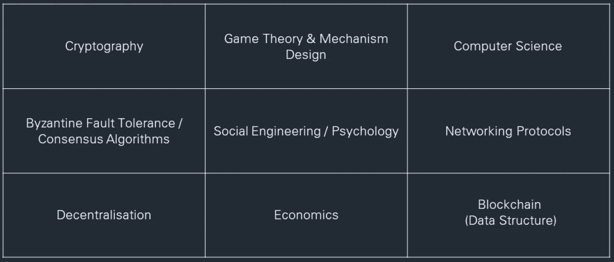
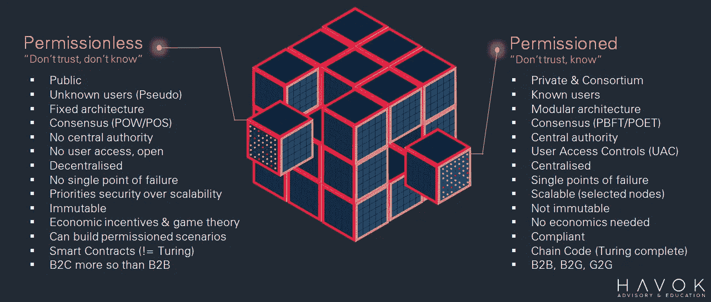
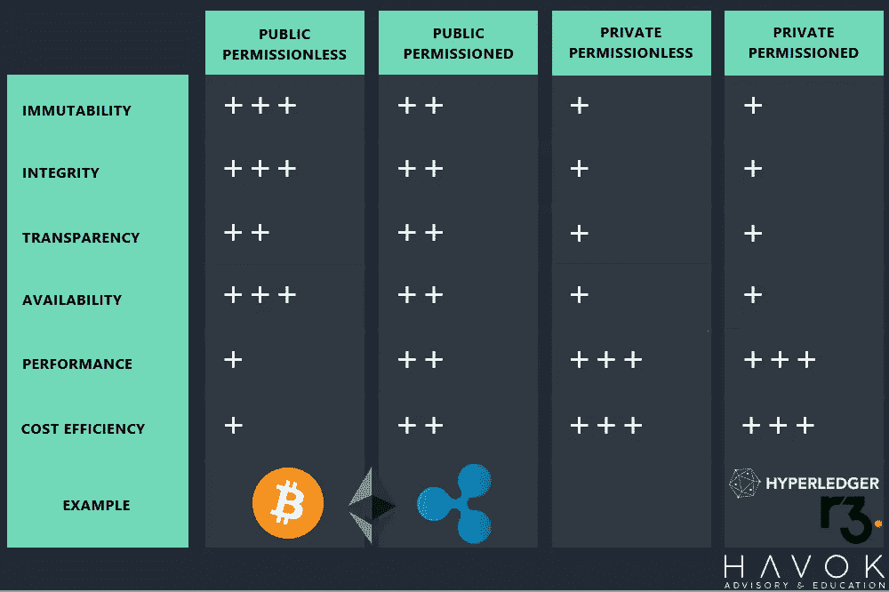
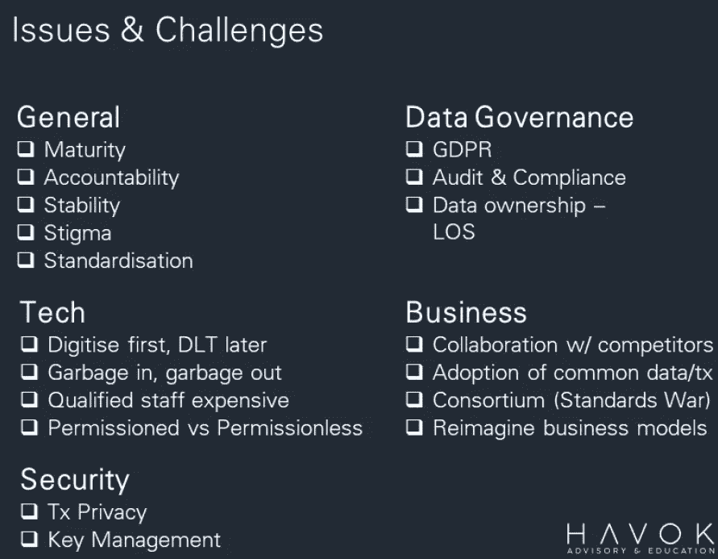
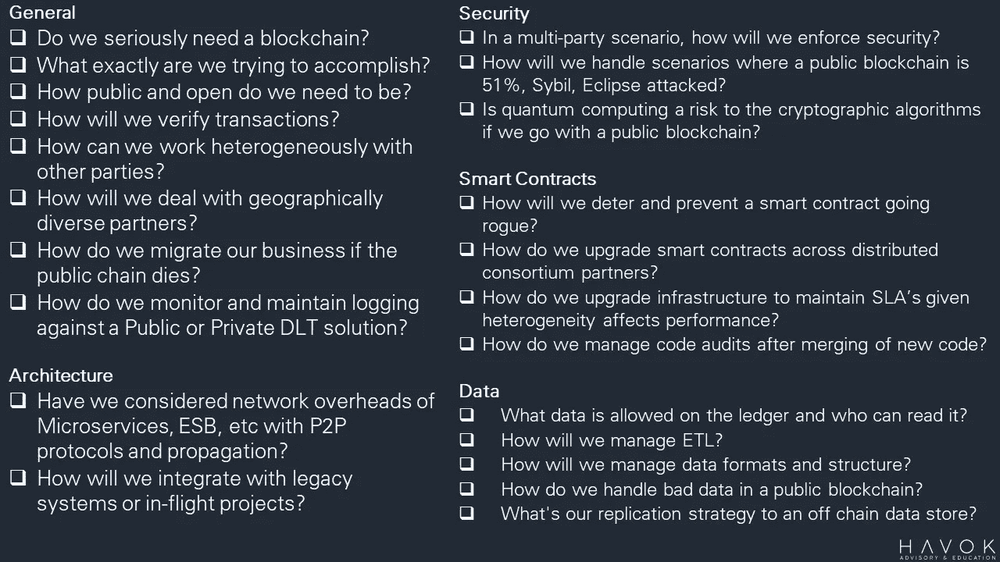
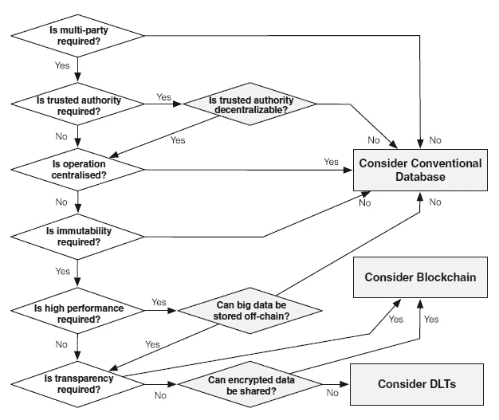

# 区块链:企业现实

> 原文：<https://medium.com/hackernoon/blockchain-an-enterprise-reality-47235811e382>

## 概述你没有被告知的，或者还没有发现的

## 摘要

本文是我于 2019 年 5 月 9 日在澳大利亚布里斯班为澳大利亚计算机学会(ACS)发表的一次演讲的后续。这是对任何想使用区块链技术和 T2 技术的人所需要知道的事情的一个现实的描述，除了由大公司制作的夸张的报道和媒体的广泛报道。

它概述了人们在全球未定义的“区块链”技术的浑水中工作时需要询问和认真考虑的风险、挑战和问题，这种技术缺乏标准、互操作性和定义良好的治理机制。

*注:图片直接来自当晚展示的幻灯片。*

## 介绍

分布式账本技术(DLT)现在非常普及，几乎不可能被忽视。如果你在网上阅读文章甚至新闻，你可能会认为每一个垂直行业都将被提升并取代“区块链技术”。

网上的文章和信息，虽然在总体概念上没有错误，但肯定不够全面，不足以让你做出任何明智的决定。事实上，我还没有读到任何文章/报告提供了为企业集成和考虑区块链的真实全面的现实。更不用说如何衡量部署解决方案可能带来的潜在投资回报(ROI)或总拥有成本(TCO)的宝贵指标了。公平地说，许多人不知道，顾问仍然在销售过于积极的叙事，其余的人没有接触过大规模的企业，以了解更多。

更有趣的是，4 天前发布的德勤洞察-2019 年全球区块链调查显示，83%的受访高管认为区块链有令人信服的商业案例。然而，这些高管中有 43%表示区块链被过度炒作了。折叠之间的并列尖叫教育是必要的，以消除不良通知群众和拉直箭头更现实的叙事。

我的看法是，无论规模大小，如果您要解决这项技术带来的新范式，都有一些不变的基本原则和必须考虑的事项。下面的文章希望在你作为一个技术专家开始“企业区块链”之路之前，为你提供一个强大的起点。

## 现实核查

事实是，区块链作为一项技术一点也不具有破坏性。这是一项基础技术，它采用了长期工作的成分(*下面提供了一个非详尽的列表)*，并以这样一种方式对其进行烘焙，即提供一个**不可变的**、**无边界的**、**开放的**、**抗审查的**、**安全的**和**无信任的**平台，以消除当前的商业垄断。

1.  CERF & Kahn(1974)——分组网络互通协议(TCP/IP)
2.  diffie & Hellman(1976)——密码学的新方向(公钥密码学)
3.  莱斯利·兰波特(1978)——分布式系统中的时间、时钟和事件排序(兰波特时间戳)
4.  Ralph Merkle(1980)——公钥密码系统协议
5.  Haber & stor netta(1991)——如何给数字文档打上时间戳
6.  Adam Back (1997) — Hashcash: DOS 反措施与工作证明
7.  中本聪(2008)——比特币:一种点对点的电子现金系统

然而，需要理解的重要部分是，上面**粗体**中的组合属性仅在去中心化的无许可生态系统中成立，如比特币或以太坊。

许多人没有意识到，并不是技术让比特币成为令人印象深刻的壮举。正是博弈论和经济激励与去激励，通过确保非理性的自利行为者在不付出巨大代价的情况下无法推翻网络，来强化全球秩序。这项技术只是实现这一目标的工具，而区块链只是数据存储这个难题的一部分。

Puzzle Pieces of a DLT Solution

不幸的是，由于多年来对“区块链”一词的夸张和曲解，许多人将区块链的无许可(公共)和有许可(私人/财团)视为同义词。因此，每一个垂直领域都会被一举触及、改变和取代。简而言之，这是非常不正确和不明智的。

## 许可 vs 无许可

企业对中小企业、初创公司有着明显不同的要求，当然还有许多开源比特币最大主义者信奉的自由主义观点，即让大银行去中介化，恢复人民的权力。

企业(公司和政府)不断寻求效率和成本节约机制。有鉴于此，自从比特币(作为一种协议)扩散到主流媒体以来，他们(企业)一直在修补构成比特币生命血液的技术成分，以寻求给股东、公民、董事会和商业伙伴留下深刻印象的结果。

实验的结果是，现在区块链实现不只是一种风格，它们已经适应了企业的需要，而它们的公共(无许可)对应方可能不适合业务或行业的要求。因此，理解许可的和无许可的区块链实现之间的区别(从你的业务、企业或初创公司的角度)是很重要的，这样可以看出你的潜在用例的价值所在。

许多人正在使用或探索区块链，希望这个词本身能够带来他们所寻求的好处，却不知道为什么。虽然肯定没有意识到，一般来说，许可品种抛弃了大多数高管用来向投资者推销的所谓好处。反直觉没有？

它是这样工作的:

**无权限—不信任，不知道**

你不需要信任任何人，也不需要关心知道谁是网络的一部分，因为由全球成千上万个异构节点(计算机)运行的共识算法(网络规则)强制执行游戏状态，让你“信任”代码，而不用担心试图篡改书籍的 Bob、Dan 和 Dave。

**许可——不信任，知道**

然而，这正是你的私人和财团实体发挥作用的地方。一个更可能由商业伙伴甚至竞争对手组成的网络。反过来，在这个共享的分布式网络中，你不信任你的竞争对手，因此你需要知道——谁、什么时候、为什么以及什么，以确保他们的行为在网络上受到控制。

> **本质上，这归结为谁能够在什么情况下将数据写入总账。**

然而，这还没有结束。作为一名开发人员到首席执行官，在全面启动预算之前，有一些重要的考虑事项需要分析。下面演示中插入的幻灯片详细介绍了一些需要查看和理解的要点的比较。

Permissionless (Public) vs Permissioned (Private) Comparison Points

让我们讨论一些:

1.  **固定架构与模块化架构** 企业习惯于根据技能组合、合作关系或行业定义自己的架构模式和堆栈。然而，当我们引入开放、无许可架构的概念时，重要的是要记住企业需要遵守全球规则。这些规则不容易更改，这是系统安全的原因。因此，我们的价值主张必须尽早考虑到这一点。
2.  **安全性 vs 可伸缩性** 分布式数据库中有一个众所周知的概念叫做[上限定理](https://towardsdatascience.com/cap-theorem-and-distributed-database-management-systems-5c2be977950e)，它推断你在任何时候只能拥有三个属性中的两个。这在国际经济学中也被称为[不可能的三位一体。区块链也有一个规定，你可以从速度、安全或分散化三个属性中选择两个。未经许可的平台选择安全性&去中心化优先于速度，而经许可的平台选择速度和安全性优先于去中心化。这对企业来说很重要，要认识到仅仅因为许可的链对于 MVP 来说部署起来更快，并不能给你相同级别的保证，另一个实现可能基于用例。](https://en.wikipedia.org/wiki/Impossible_trinity)
3.  **智能契约 vs 链码** 这里暴露了一个相同但不同的技术挑战，即在一个无许可的网络中，尽管像 [Solidity](https://solidity.readthedocs.io/en/v0.5.3/) 这样的语言库是图灵完全的(以[Alan Turing——计算机科学家](https://simple.wikipedia.org/wiki/Turing_complete)命名),但它们的实现却不是。这是因为以太坊是一台必须具有容错机制的全局计算机。这仅需要根据 smart 契约运行一定量的计算，以确保其符合区块大小限制(气体限制)。这意味着你不能编纂复杂和广泛的逻辑，而在一个许可的网络中，你可以随心所欲地拥有或租用专门用于业务的基础设施(云)。

然而，没有简单的答案来解释你为什么选择一个而不是另一个，因为它是用例驱动的。在这篇文章中，我想回避的是，尽管看似私有的许可种类抛弃了让“区块链”变得非常有价值的东西(如下所示)。需要的是用例驱动的、消费者或业务流程优先的方法的实际考虑，而不是技术。

> 当我们审视现有的商业模式时，区块链在许可模式中的实际应用很少，这是现有技术无法实现的。如果要做到这一点，我们必须采取一种设计思维方式，仔细检查我们现在的工作方式，然后考虑技术是否符合要求。如果它不继续前进。

## 问题和挑战

为了消除误会，并开始产生有价值的结果，我们必须进行没有人公开进行的对话，即通过讨论有经验的从业者在*允许和不允许*建造**中面临的*问题&挑战*。**

目前困扰行业的高级考虑因素包括:

*   **治理——反公地的悲剧&数据** 在这两种运营模式中，如何确保分布式网络中不发生通信故障都缺乏明确性。包括个人身份信息的监管障碍(PII)和一般数据保护规则(GDPR ),这些都会对架构和治理模式产生重大影响。要求规则涵盖:

1.  连接程序
2.  退出过程
3.  最低安全要求
4.  会员委员会
5.  改变技术环境的程序(私人/财团)

*   **垃圾输入，垃圾输出** ICT 开发中一个众所周知的构造是 GI，GO，如果您输入未经验证的数据，您的业务流程将不会为您修复它，从而导致不正确的输出。这一概念也适用于区块链解决方案，其中有一个可怕的情况正在展开，即个人使用“不变性”和“信任”的概念来推断区块链将解决所有问题。这个假设是错误的，你需要解决它，否则你将存储数据到区块链不变性，拼写错误，舍入错误等。却没有能力改变它。
*   **财团的** 这些都是呼吁组织加入，向各种行业团体和潜在合作伙伴学习。然而，在合作交付的背景下，如果这些联盟成员是使用共同框架的银行等竞争对手，联盟可能会以标准战争告终。因为网络中的每个参与者都想得到对他们最有利的东西，而不是更大的利益。因此会主张支持他们意图的规则。小心点！
*   **下面的附加内容:**

上面的列表绝不是一个详尽的列表，但是它触及了许多人没有讨论的话题，这正是你应该讨论的原因。它要求企业以不同的方式思考，这取决于你的组织、你的团队、你——可能具有挑战性。这不是一个简单的“我们有一个问题，区块链似乎是一个可能的解决方案”的修复。

解决方案很少是用‘区块链’解决的，如果给它开了绿灯。在决定选择 DLT 还是选择 DB 时，有更多的担忧，这些担忧与现有的:

*   业务流程
*   变更和发布管理(沟通/缺陷等)
*   分析和监控
*   数据存储、迁移(提取、转换、加载)
*   飞行中的项目
*   非功能性需求
*   审计、合规性和报告

为了进一步分解这些问题，我提供了一些问题，希望大家思考一下。

# 最后的想法

如果您想了解这项技术的皮毛，以上只是您需要开始关注的一部分。从用户那里抽象出复杂性比什么都重要。我们不想听到你使用区块链，就像我们不说我们使用 TCP/IP，MongoDB 等。消费者和商业伙伴根本不在乎，他们只希望能够做到 A、B、c。

然而，在教育方面，我们还有很长的路要走，我们要透明地展示我们的成功和学习机会(失败),不仅要改善技术，还要改善全球商业格局。

不要急于求成，使用现有的工具来试水，记住它只是技术专家工具箱中的一个工具，需要适合目的。因此，在冒险了解“企业现实”之前，请花时间梳理出任何问题、疑问或疑点。

## 推荐

1.  **用例** 要让用例有价值，需要发生思维的根本转变。我们需要采取业务流程、用户驱动的方法，而不是像德勤(Deloitte)Insights 建议的那样，以技术为先。如果你的主管是他们的统计数据之一，他现在问**“我们如何让区块链为我们工作？”**你做错了，注定要失败。这是一个自我实现的预言，永远不会带来最佳结果。所以至少你的想法必须有:

*   一个需要解决的业务问题，无法用更成熟的技术来解决
*   具有参与者、资产和交易的可识别业务网络
*   对信任的需求(共识、不变性、最终性或出处)。

或者利用如下流程:

To blockchain or not?

2.**企业集成** 即使您的 POC/MVP 不打算集成，也要尽早考虑这一点。使用跨不同文件格式、集成接触点甚至语言的单片大型机和现有中端系统将需要比预期更多的思考。

3.**非功能性需求** 【it lities】通常在现有解决方案中与定义明确的服务水平协议很好地集成和迎合。但是，迁移到分布式分类帐体系结构将需要您重新考虑这些问题:

*   易接近
*   可审计性
*   容量
*   灾难恢复
*   容错
*   可积性
*   可维护性
*   可靠性
*   可测试性等等…

4.**从小到大
这不会容易，不会。即使使用来自微软 Azure BaaS 的模板化解决方案——流程变更、工具、技能组合和思维定势的混合将需要承诺和毅力，因为你会面临许多挫折。所以从小处着手，测试这个想法是否有价值。**

Blockchain is a tool in your toolbox (Kris Bennett)

如果您有任何问题或建设性的批评，请通过下面的频道告诉我。

感谢阅读，

本杰明·霍尔

HAVOK 咨询和教育

 [## Benjamin Hall -助理总监(ICT) -澳大利亚公共服务| LinkedIn

### 澳大利亚布里斯班公共服务部助理总监(ICT ),澳大利亚主要系统分析师，负责跨关键领域的工作

www.linkedin.com](https://www.linkedin.com/in/benjaminhall-aus/)  [## 加密追赶

### 教育、新闻和评论，涵盖分布式账本、区块链和加密货币的所有内容！

www.youtube.com](https://www.youtube.com/channel/UCQOI9gH7hLiDtJHMnYcUGew)  [## 本杰明·霍尔(@ crypto _ catchap)|推特

### 本杰明·霍尔的最新推文(@ crypto _ catchup)。🖥️ IT 系统分析师🔗区块链和分布式系统📒…

twitter.com](https://twitter.com/crypto_catchup?lang=en) 

**参考文献:**

1.  德勤洞察:全球区块链调查 2019
    [https://www2 . Deloitte . com/Insights/us/en/topics/understanding-区块链-潜力/全球-区块链-调查. html](https://www2.deloitte.com/insights/us/en/topics/understanding-blockchain-potential/global-blockchain-survey.html)
2.  区块链:坐过山车走向标准——阿德里安·麦卡勒博士
    [https://ssrn.com/abstract=3362100](https://ssrn.com/abstract=3362100)
3.  拼图块幻灯片& Rube Goldberg 概念借鉴自 Amber Labs 的 Aleksandar Svetski。