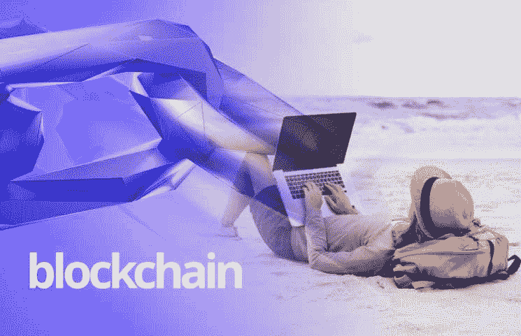
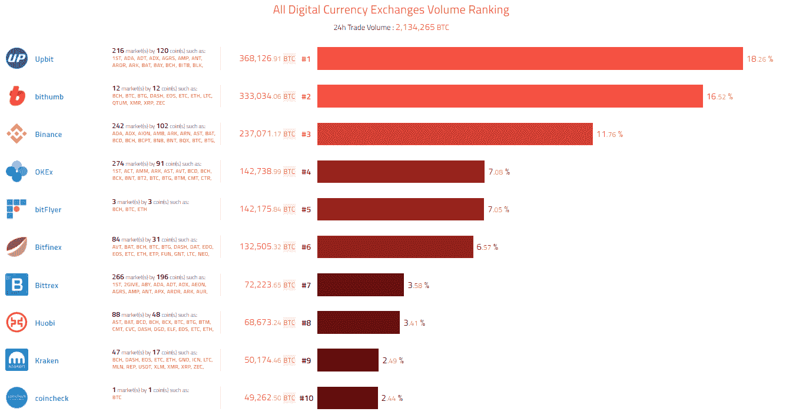
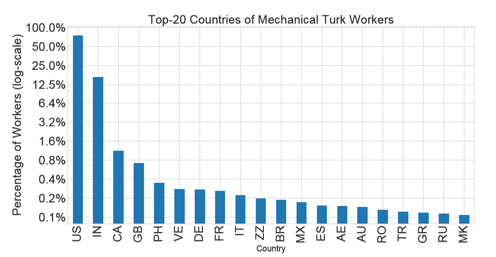
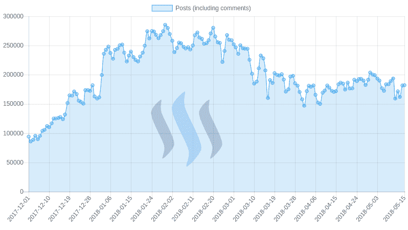
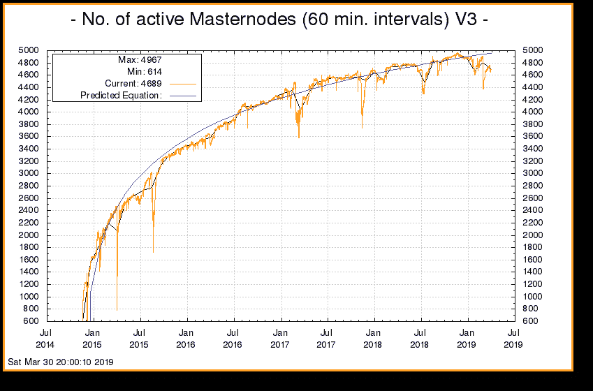

# 区块链和加密货币保护自由职业者社区的方方面面

> 原文：<https://medium.com/hackernoon/blockchain-and-cryptocurrency-securing-the-facets-of-freelancing-community-7725db89a48b>

互联网带来了一个通讯方式的新时代。它不仅以更快的速度传递信息，而且它本身也开创了一个全新的行业。自从营销在互联网上展开翅膀，网络世界充斥着无数的网上赚钱技术。

虽然大多数被证明只是点击诱饵和骗局，但很少有被证明是真的。结果，多达 30%的欧洲人和美国人最终成为了自由职业者群体中的独立合同工。此刻，全世界都参与进来，在自己家里做自己擅长的事情，赚取一些额外的钱。

但有一个问题，随着自由职业者群体的增长，充当平台的公司数量也在增长。Upwork、Freelancer、Toptal 和其他几个软件作为一种媒介出现，让自由职业者与需要完成工作的人交流。

唯一的缺点？这并不像看起来那么简单。门户网站向自由职业者收取巨额佣金，在某些情况下高达 40%。故事并没有到此结束，他们必须将收入的一小部分交给中间人或支付网关。这个选择很糟糕，但却是唯一的选择。

随着加密货币和区块链的出现，这一切似乎都变了。随着世纪的进步，越来越多的人**辞职。他们中的大多数人要么尝试创业，要么尝试自由职业。**

**随着区块链和加密货币从中间抹去佣金，这种情况将会改变。现在，有初创公司直接用加密货币向自由职业者支付他们所做的工作。**

**如今，在网上赚合法的钱相当容易，多亏了区块链，交易保持透明。但是你实际上如何赚取这种区块链特有的加密货币是你将在前面学到的。记住，这不是点击诱饵，也不是促销。**

****自由职业者****

**现在，传统的门户网站可以考虑，只是不是所有的任务。有些公司用加密货币支付你的工作。无论如何，让我们跳过这一部分。自由职业者社区是进入障碍最少的社区，你可以根据你的专长或爱好开始几乎任何种类的工作。随着加密市场的崛起，这些公司正在寻求外包他们的工作，以换取可观的加密报酬。其中一个平台是 [**硬币自由职业者**](http://freelanceforcoins.com) ，它对行业来说相对较新，但由于其支付透明性、区块链实现和加密支付，有可能扰乱 Upwork 市场。在这里，客户直接在 P2P 平台上与求职者见面，讨论他们的要求和费用，而没有第三方干预。最棒的是这个平台本身不收一分钱，所有人都可以免费使用。这不是唯一一个众包门户网站。然而，如果加密支付让你怀疑，看看一天的加密交易统计。**

****

***Img Src:* [*Coinspeaker.com*](https://www.coinspeaker.com/cryptocurrency-ico-market-analysis-january-15-21-2018/#)**

**如果你正在寻找开始的地方，这里有一些很酷的网站值得期待，它们很有前途。**

**[比特吉格斯](http://bitgigs.com)**

**[自由职业者](http://freelanceforcoins.com)**

**[以太网](http://ethlance.com)**

**[枪骑兵](http://blocklancer.com)**

**通过一些挖掘，你也可以找到其他相关的网站。**

****微任务****

**是的，Mturk 仍然很受欢迎，是的，微任务可以给你很好的报酬。微任务者社区其实挺大的。仅 Mturk 就有超过 100，000 名 Mturkers，其中超过 2，000 名在任何给定时间都处于活动状态。然而，问问你自己，微任务能在 crypto 中给你报酬吗？嗯，几年前，这可能是一个很大的不，只是现在不是同样的情况。你可以通过做同样的调查和看一些广告来获得加密货币。数额说起来不大，但总的来说，相当不错，而且你不用流汗。像 [**Gems 这样的网站正在给亚马逊的老 Mturk 一个艰难的时期**](https://www.wired.com/story/this-startup-is-challenging-mechanical-turkon-the-blockchain/) ，而所有的新进入者 [**Taskopus**](https://taskopus.io/) 正在以不同的方式追随同样的领导，当奖品是加密货币时为什么不呢。每个人都知道加密是未来，现在投资总比不投资好。**

*****注意:*** *这里的目的不是投资密码，使用类似*[***HODL***](https://www.investopedia.com/terms/h/hodl.asp)***或*** [***倒票***](https://www.investopedia.com/terms/s/scalping.asp) *的方法，冒险获利。唯一的动机是在 crypto 工作并获得报酬，而不是投资。***

****

****加密货币博客****

**不，你不必写关于密码的博客。概念完全不同，同时又很相似。就像你使用 blogger 或 medium 来发布博客，喜欢它的人可以鼓掌或“喜欢”，也有一些平台可以奖励你加密支付。这种情况不是假设的，并且已经被 [**Steemit**](https://techcrunch.com/2019/01/23/steamit-reddit-new-boss-rebuild-elizabeth-powell/) 很好地检验过了。对于每一次向上投票或类似投票，作者都会收到一部分加密货币。Steemit 的每日数据令人震惊，用户数量是该平台实际工作的具体证据，而不是胡说八道。**

****

****主节点****

**在加密货币世界，Masternodes 还是比较低调的。熟悉它的人不多，但这让它变得更加神奇。如果学会了，它会成为一个很大的收入来源。对于不熟悉 [**主节点**](https://www.investopedia.com/terms/m/master-node-cryptocurrency.asp) 的人来说，它们负责通过区块链网络验证块。类似于采矿，这个概念要求你把你的计算机变成一个使用你的计算机处理的网络媒介。允许用户，在这种情况下，你，为运行区块链网络的核心共识赢得激励。年度 [**Dash 奖励**](https://docs.dash.org/en/stable/masternodes/understanding.html) 的百分比吸引了更多的玩家，包括骗子。**

****

**区块链和密码作为未来早已被预言。聪明的用户正在衡量这两者在未来生活中的存在程度，并参与其中，以在竞争更加激烈的市场中维持下去。许多人在银行里没有太多钱投资加密货币，这是事实，许多人对此持怀疑态度，但如果你可以工作一段时间并赚取加密货币，那是不是更糟糕，因为你没有支付自己的口袋？**