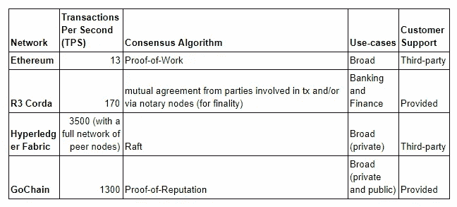
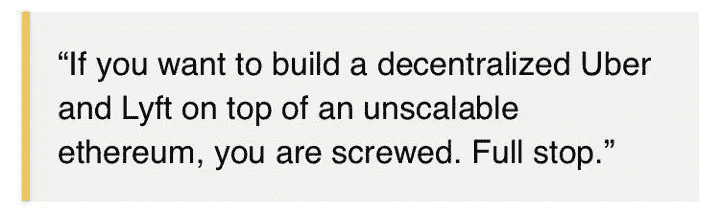

# 区块链和企业——天作之合

> 原文：<https://medium.com/hackernoon/blockchain-and-entertprises-a-match-made-in-heaven-4b067654ae21>

随着世界变得越来越数字化，当你看到越来越多的企业将其数据库升级到区块链架构时，不要感到惊讶。这种新兴技术不仅比传统的数据存储方法更高效、更安全，而且扩展速度更快、更好，通常可以在事务吞吐量增加的同时将网络延迟降低数倍。

有几个面向企业的现有区块链基础设施协议，从以太坊这样的公共链到 GoChain、R3 Corda 和 Hyperledger Fabric 这样的私有区块链。然而，并不是所有这些区块链都具备企业构建程序和平台所需的规格。事实上，当 [EventChain](https://eventchain.io/home) 开始构建他们的票务平台时，他们发现以太坊区块链无法处理他们的业务运营和他们所需的技术参数。

"我们很快增加了音乐会和节日的门票销售，达到 1 万张。"EventChain 的创始人阿什顿·艾迪森(Ashton Addison)说，“这导致成千上万的人试图同时购买门票，[这]可能会破坏以太坊网络，该网络每秒只能进行约 13 次交易。我们知道以太坊正在努力解决未来几年的可扩展性问题，但是，我们需要一个即时的解决方案，于是转向了 GoChain”

这表明，即使是市场上最受欢迎的区块链，如以太坊，也有技术限制，阻止一些企业使用它来构建他们的市场解决方案。

因此，为了更多地了解区块链地区的企业级区块链能够做什么——或者不能做什么——对于那些寻求创建企业、软件和其他行业问题解决方案的人来说，我们仔细研究并比较了三家不同许可(私人)的区块链公司: [R3 Corda](https://www.r3.com/corda-platform/) 、 [GoChain](https://gochain.io/) 和 [Hyperledger](https://www.hyperledger.org/) ，看看哪家网络为企业提供了最好的资源。

**引擎盖下**

作为一家企业，根据您所处的行业、您提供的服务以及您着手解决的问题类型，您将需要能够支持您面临的任务的基础架构。无论这意味着选择一种可以处理软件或服务技术参数的编程语言或基础设施协议，还是选择可以帮助您克服潜在障碍的合作伙伴，您都需要业务或服务的基础来支持您的构建。

在商业和区块链的世界里，很难找到一个基础设施协议或网络包含你所有的技术需求；然而，当我们把这些需求归结为一个平台中企业需要的必需品时，我们只剩下几个关键参数；每秒事务数、用例、可伸缩的一致性算法和网络支持等等。因此，让我们更深入地了解一下企业区块链网络的统计数据，以及它们能让您的企业做什么，或不能做什么，以及为什么。

**每秒事务数**

您最终选择构建的区块链的一个决定性因素将是每秒事务数(TPS)。每秒事务数是指数据库每秒在网络上传输的数据包数量。对于大企业来说，你很可能需要你的网络来处理大量的交易——这就是为什么公共的区块链以太坊不适合作为企业数据库的原因。例如，以太坊网络每秒只能处理大约 15 笔交易，这就是为什么 EventChain 无法构建必须同时处理数百笔交易的票务平台。

Source: Coindesk

也就是说，如果你想开发一个软件或服务，需要同时处理成百上千甚至上万的交易，你将无法在以太坊上完成——至少不能在每秒只能处理 15 个交易的以太坊上完成——因为由于网络技术的限制，这是不可行的。

就我们正在研究的三个商业区块链而言——Corda、Hyperledger fabric 和 Gochain，每一个在每秒交易量方面都超过了以太坊。据说 Hyperledger 甚至可以处理 3500 tps，然而，这是在最佳条件下，使用最好的硬件和完整的对等节点网络。

GoChain 以 1300 tps 排名第二，如果我们考虑硬件要求和实现这一目标所需的节点网络规模，则排名第一，R3 Corda 排名最后，只能处理 170 tps。

一个网络每秒可以处理的事务数量是至关重要的，并且通常是公司首先关注的网络规格之一。因为如果网络无法处理、操作和传输您计划通过数据库发送的数据量，那么该网络将无法支持您的应用程序、软件解决方案或服务

**共识**

另一个对企业很重要的特性——或者对任何有兴趣在区块链上构建软件、解决方案或服务的人来说——是区块链使用的共识算法。共识指的是网络上的所有参与者如何能够达成一致意见，即所发生的交易以及期望被添加到链中的块是有效的(合法的)。

由于我们只检查许可的区块链，这些网络使用的共识算法不像在公共网络中那样紧迫——在公共网络中，参与者本质上是匿名的，没有理由相互信任。

在许可网络上，网络上的每个参与者都是已知的可信实体；否则，他们不会获准进入私人区块链。由于每个参与者都是已知和可信的，许可网络使用的共识算法往往与大多数现有公共网络上使用的流行的工作证明共识算法略有不同。

**go chain:**go chain 网络使用信誉证明共识算法。如上所述，在私有网络中，你知道网络参与者背后的身份，也就是说，如果有人将无效信息冒充为有效信息，你将知道哪一方的行为不诚实。这可能严重损害公司的声誉，因此，诚实行事符合每个网络参与者的最大利益——特别是因为每个验证节点都连接到一个受尊敬的企业；这就是 GoChain 的信誉证明共识算法背后的逻辑。

**R3 Corda:** R3 Corda 节点能够通过参与交易的参与者就交易达成共识。参与者可以通过独立地对照网络上的验证逻辑检查合同代码来确认交易的有效性。

**Hyperledger Fabric:**Hyperledger Fabric 网络使用一种称为“Raft”的崩溃容错一致算法。Raft 使用一种选举的、可信的领导者到追随者的关系模型，其中可信的领导者将信息传递给完全对等的节点集群(连接到网络中的每个节点)。Raft 共识算法确保只要系统中的大多数参与者是诚实的，就可以就所交换的信息的有效性达成共识。

**支持服务**

请记住，区块链技术相对较新。就在今年，比特币——第一种使用区块链账本的加密货币——迎来了十岁生日。也就是说，目前这个领域缺乏区块链工程师。一些公司想要区块链数据库，但是在寻找专业技术来建立或维护他们的系统时遇到了困难。也就是说，你要考虑你决定建立的私人区块链提供什么样的技术支持。

**GoChain:** GoChain 以多种形式提供客户支持。他们提供了一个在线聊天室，可以快速方便地联系到他们的工程团队成员，并且可以全天候访问文档、白皮书、支持论坛和社区聊天室。此外，GoChain 还为企业网络参与者提供研讨会、教育课程以及如何维护其解决方案的咨询。

**R3 Corda:** 如果您在与 Corda 区块链合作时遇到技术障碍，Corda 团队将为其企业网络参与者提供全天候支持。

Hyperledger Fabric: 与 R3 不同，R3 是一个更像商业运作的私人区块链，Hyperledger Fabric 由 Linux 基金会管理，这是一个非营利性的技术联盟。也就是说，如果一家在 Hyperledger 区块链运营的公司遇到了技术障碍，并且他们没有任何区块链内部工程师，那么他们将不得不联系第三方来帮助 HyperLeder 网络。

**用例**

最后但同样重要的是，作为一家希望使用区块链数据库的企业，您将需要考虑您感兴趣的区块链网络的预期用途，它当前的用例是什么，以及目前有多少公司正在该网络上运行。

如果网络是根据特定的用例或行业设计的，那么该网络的特性和参数很可能是针对该特定行业的业务、软件和解决方案的。询问目前正在开发软件和解决方案的公司和个人，或者曾经开发过软件和解决方案的公司和个人，他们使用网络的体验如何，以及他们在使用网络时是否遇到了任何障碍，这也是很有帮助的。

**R3 Corda:** Corda 的私人区块链面向银行和金融机构以及商业行业。此外，Corda 是与金融机构、监管机构和贸易协会合作开发的，强调了他们在银行和金融解决方案方面的专长。

**GoChain&Hyperledger Fabric:**与 Corda 不同，go chain 和 Hyperledger 都是为各种各样的行业设计的——两个网络都不针对某个特定的行业。

**哪个区块链适合我？**

根据你新发现的知识，你可能会想——我应该在哪个区块链网络上构建我的软件或市场解决方案。嗯，首先，你的思路是对的！区块链数据库是比大多数传统数据库更有效的数据库，在未来十年内，你很可能会数字化你的一些业务运营、办公室或[最终完全使用区块链数据库。](https://www.wsj.com/articles/why-blockchain-will-survive-even-if-bitcoin-doesnt-1520769600)

现在，当谈到选择适合你的区块链，没有一刀切的答案。你会发现，不同的区块链适用于不同的情况、不同的解决方案和服务。例如，如果您正在构建一个与金融相关的解决方案或服务，您可能会倾向于 R3 Corda，因为这是他们的专业领域，但是，如果您需要一个提供强大客户支持和高交易吞吐量的网络，您可能会跟随 EventChain 的脚步，选择构建 GoChain。

最终，您选择构建的区块链应该是一个能够处理您正在构建的业务、软件或解决方案的技术参数的区块链——这就是为什么了解网络的重要特性很重要——并且希望我们为您提供了足够的关于 TPS、用例、客户支持和一些商业区块链的共识算法的信息，以便您能够继续您的研究！