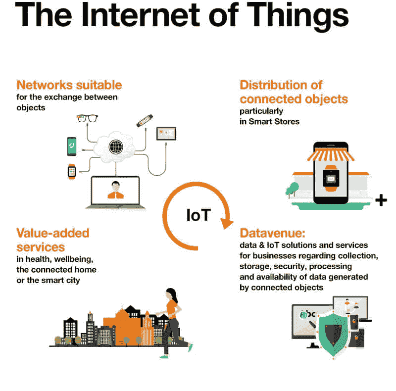
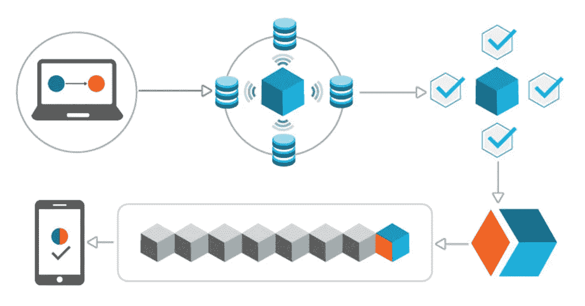
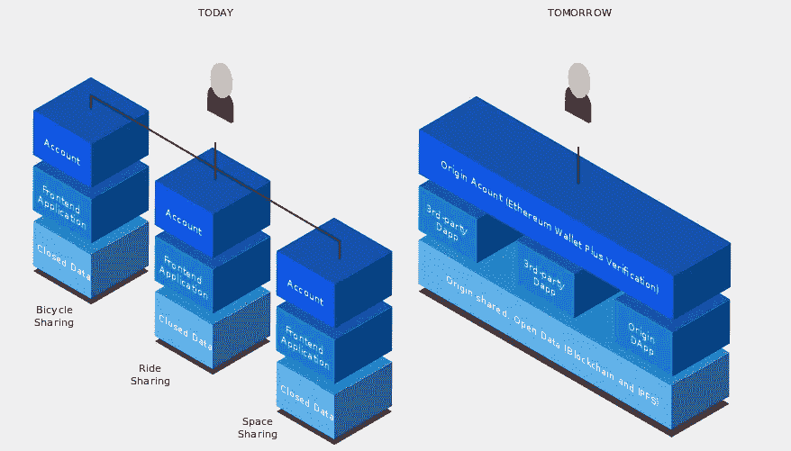
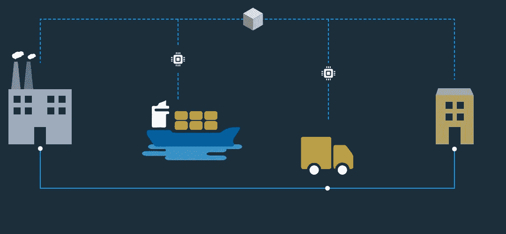
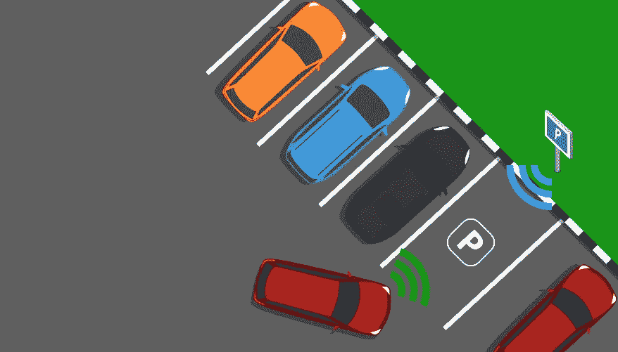

# 区块链和物联网——为世界带来变革

> 原文：<https://medium.com/hackernoon/blockchain-and-iot-bringing-transformation-to-the-world-2f69cb0c498a>

区块链和物联网的结合已经成为技术时代最令人兴奋的用例之一。大众和博世这两家大公司认为，分散的数据和物联网市场应该共存。此外，IDC 的研究表明，到 2019 年，20%的物联网部署将支持区块链服务。

在了解区块链和物联网如何结合起来给世界带来变革之前，让我们先解释一下什么是物联网，[什么是区块链](https://www.leewayhertz.com/what-is-blockchain/?utm_source=medium)。

# IoT 是什么？

Image Source mitoconnect

我们将以智能手机为例来理解物联网的基础知识。智能手机是唯一可以满足你许多需求的设备——从听音乐、查看电子邮件或信息、与同事交流、看电影和玩游戏。

几年前，手机没有这么多功能。早些时候，人们只能用手机发信息或打电话。然而，如今手机已经变得更加智能，因为它们连接到了互联网。

这是物联网的基本原理，物体或设备可以通过连接到互联网而变得更智能。物联网可以分为以下几类:

*   **接收数据并根据数据采取行动的东西**
    例如，从传感器收集数据并根据数据采取行动的 3D 打印机、可穿戴设备和智能电视。
*   **收集信息并发送信息的设备**
    例如，运动传感器、湿度传感器和光线传感器，它们会发送相关数据，以便做出更好的决策。
*   **兼具两种功能的东西** 基于物联网的农业包括收集土壤湿度信息的传感器，以确定作物需要多少水。

由于物联网的有效性依赖于系统中可用的信息，因此在信息的整个生命周期中保护信息至关重要。这就是区块链参与物联网的原因。

现在已经很清楚什么是物联网，以及它与日常活动的关系。现在，我们将解释什么是区块链，它可以集成到物联网解决方案中。

# 什么是区块链？

Image Source Antra

区块链技术基于分散式网络的概念，能够透明、安全地记录和处理交易。这是一个包含带时间戳的数字记录的数据块链，一旦添加到区块链中，就无法更改或删除。

保存在区块链中的记录分布在网络中的所有节点上，其中每个节点在任何时候都有分类账的更新副本。

人们脑海中总会有一个问题，区块链与现在的场景有什么不同。目前，每一家科技公司，无论是 Airbnb 还是优步，在处理支付或保存数据时，都假装是一个集中的实体。

基于去中心化的概念，区块链保护数据不落入少数中央机构之手，从而降低信息窃取或黑客攻击的风险。

正如我们上面提到的，物联网的成功取决于其保持数据机密和安全的潜力，将区块链引入物联网可以重塑行业。

# 物联网为什么需要区块链？

Image source LeewayHertz

物联网最大的缺点是依赖集中式通信模型与系统进行交互。也可以说，物联网设置中的所有设备都是通过集中式云服务器进行识别、连接和验证的。

然而，现有物联网解决方案中使用的集中式云和网络设备具有较高的维护和基础设施成本。随着物联网系统通过这些服务连接起来，可扩展性可能会成为一个重大问题。

随着物联网设备数量的增加，服务器和设备之间的交互次数增加了成本。这就是当前系统无法支持大型物联网网络的原因。

此外，云服务器容易受到单点故障的影响，这意味着一点的故障会影响整个生态系统。因此，使用对等模型而不是客户端/服务器模型可能是当今物联网行业需要的正确解决方案。

随着分散化的实施，存储需求和计算可以分布在数百万个物联网设备上，中央故障不会对整个网络产生影响。

因此，在物联网中使用[区块链可以帮助物联网设备高效地扩大规模。](https://www.leewayhertz.com/blockchain-iot-use-cases-real-world-products/?utm_source=medium)

# 区块链如何在物联网方面提供帮助？

由于区块链是防篡改和分散的，它可以做物联网确切需要的事情。在物联网中使用区块链可以帮助您跟踪网络中数十亿台联网设备。

将区块链集成到物联网设备中还可以降低安装和管理物联网网络服务器的成本。区块链使用加密算法，确保物联网网络上数据的机密性和安全性。物联网中的区块链也可以保护网络免受中间人攻击，因为它没有单一的通信线程。

使用智能合约，可以创建在满足特定条件时执行的协议。例如，温度传感器可以获取数据并将其发送到区块链。根据获取的记录，智能合约可以触发特定的逻辑添加到其中。

# 以下是区块链在物联网中的一些令人兴奋的用例

*   **供应链&物流**

Image source LeewayHertz

区块链结合物联网可以提高供应链网络的可追溯性。连接到车辆的物联网传感器，如温度传感器、运动传感器或 GPS，提供有关装运状态的信息。从传感器获取的数据存储在区块链中，为系统带来可追溯性、可审计性和透明度。

*   **智能家居** 物联网设备允许从智能手机远程控制家庭安全系统。但交换物联网传感器生成的信息的集中式模型缺乏数据所有权和安全标准。通过将从物联网设备收集的数据移动到区块链，可以解决安全问题。
*   **停车解决方案**

Image Source LeewayHertz

一家名为 NetObjex 的公司提出了一个与物联网和区块链合作的智能停车解决方案的想法。使用物联网传感器，可以更容易地找到空闲的停车位，并使用加密钱包自动支付。

*   安装在停车场的物联网传感器可以获取信息，如汽车停放的时间和车辆号码，以获得关联的钱包地址。这些数据存储在区块链中，并触发智能合约来实现支付自动化。

许多行业已经开始尝试区块链在物联网网络中的潜力。作为一家区块链开发公司，我们可以帮助您了解区块链物联网结合如何改变各个行业。

请访问我们的 [**网站**](https://www.leewayhertz.com) 了解更多我们区块链的工作和我们所了解的技术。在[脸书](https://www.facebook.com/LeewayHertz/)、 [LinkedIn](https://www.linkedin.com/company/leewayhertz-technologies/) 和 [Twitter](https://twitter.com/LeewayHertz) 上关注我们，了解区块链的最新发展。