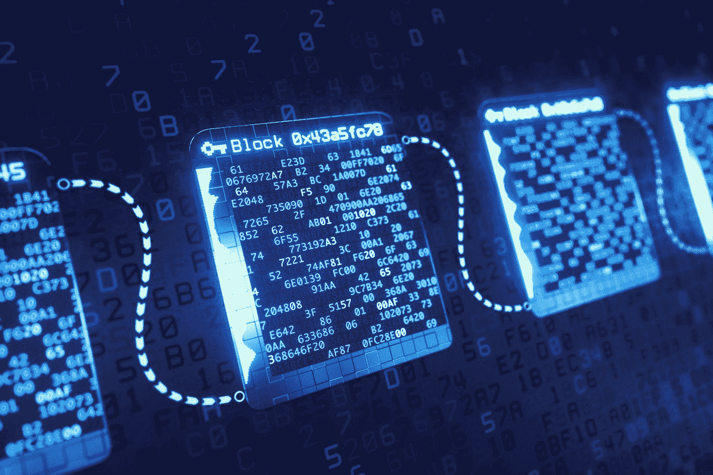

# 超越 2020 的区块链

> 原文：<https://medium.com/hackernoon/blockchain-beyond-2020-9d469c863070>

区块链还处于婴儿期，但是一旦它变得更加成熟，它将如何在经济、环境和社会方面重塑世界呢？

**希望金融民主**

金融行业是区块链最初产生最大影响的领域，这种影响可能会持续下去。随着加密货币带来它们一直承诺的金融民主，机构和个人银行业务将发生变化，银行将不得不彻底改造自己，或者为新一代银行风格让路。部分原因是纯数字银行的增长，这些银行没有实体分行，接受来自任何国家的客户。你想要一个欧洲的 IBAN，那么你要做的就是在 N26 或者 Monero 开一个账户。

**我们深陷债务之中**

此外，世界正背负着债务。全球有 250 万亿美元的未偿债务，四倍于此的无准备金负债和堆积如山的金融衍生品。加密货币可以为建立在信贷和法定货币基础上的债务大山提供一个解决方案。数字货币可以避免银行的一种方式是填补借款人的需求和贷款人的盈余之间的缺口——随着经济变得更加分散，银行的传统主食，汽车和住房贷款的需求将会减少。

**年轻人不信任银行**

正如安德鲁·吉利克在他的 [Medium](/@andrew.gillick/beyond-2020-how-blockchain-is-reshaping-our-economic-environmental-and-social-orders-pt-i-a3abff723227) 文章中所说，去中心化和共享经济是未来的关键组成部分，去中心化货币也是如此:

“这些货币将降低央行存款利率对我们生活的影响，甚至会从目前的正无风险利率挤压商业银行的利润，以更低的负利率放贷，这是我们以前见过的(想想-2%或-3%)，因为央行被迫对存款收费。”

年轻一代也将有助于让传统银行变得多余:他们已经远离传统银行，在银行存钱的想法对他们来说就像没有智能手机的生活一样奇怪。引用吉利克的话:“根据一项研究, [67%的“年轻的千禧一代”——年龄在 18 至 24 岁之间的人——他们的储蓄账户中不到 1000 美元，46%的人 0 美元。年龄在 24-35 岁之间的千禧一代也好不到哪里去，他们中 41%的人没有存款。](https://www.cnbc.com/2017/09/14/how-much-money-the-average-millennial-has-in-savings.html)

**社区和城市货币**

我们也可能会看到更多的本地化货币，如共同体货币。这种硬币有助于刺激当地经济，各城市也在考虑发行这种硬币。其中一些有激励制度，通过奖励志愿服务、参与公民活动或用数字货币购买当地产品等社会行为，来促进居民的积极行为。

其他定制硬币可能会为行业发行，例如用于咖啡种植的咖啡硬币，这种硬币已经存在，用于连接印度尼西亚特种咖啡生产商和最终买家，以及为从农场到杯子的整个链条中的人提供咖啡交易平台。

这些例子只是冰山一角——我们将会看到区块链技术的更广泛应用和货币种类的增长，从本地到全球。也许它应该被称为安静的革命，因为它从根本上改变了每个人的世界；从富有的银行家到没有银行账户的人，而后者将获益匪浅。