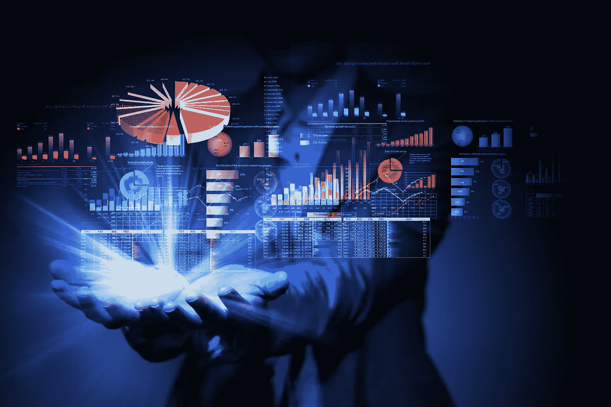

# 区块链公司正在以前所未有的方式使用大数据:原因如下

> 原文：<https://medium.com/hackernoon/blockchain-companies-are-using-big-data-like-never-before-heres-why-8d34dfb05b45>

数据是新的石油，除了一个重要的方面。石油的价值与市场供求规律相关联。当石油短缺时，价格就会上涨。与每天变得越来越少的数据相反。

仅在过去两年中， [90%的现有数据都是由](https://www.forbes.com/sites/bernardmarr/2018/05/21/how-much-data-do-we-create-every-day-the-mind-blowing-stats-everyone-should-read/#af94cc260ba9)生成的。社交媒体、流媒体、物联网——随着我们的联系越来越紧密，我们会创造更多的数据。与石油不同，管理数据的最大挑战不是维持不断减少的供应。相反，它要弄清楚如何处理和利用每天产生的 2.5 万亿字节的新数据。

# 大数据带来了巨大的挑战

新数据创建的庞大数量带来了最大的挑战。不断增长的数据量解释了向云计算的转变。云计算允许科技公司通过购买大量存储和处理能力来利用规模经济，这使得对非科技公司来说，比维护自己的服务器更具成本效益。

现在，云计算公司正在竞相跟上客户的需求。超过一百万平方英尺的“巨型数据中心”[现在变得越来越普遍](https://www.cbinsights.com/research/future-of-data-centers/)。这些建筑不仅占用空间，还需要大量能源来存储和处理大规模数据。

还有其他挑战。鉴于消费者数据的高价值，集中式服务器可能成为黑客和攻击的牺牲品，提供商必须确保数据始终可供其客户访问。

外包这些挑战使数据的最终用户变得更容易，但云计算提供商无法确保他们存储的数据是准确的。这个特殊的问题与数据所有者息息相关。

# 区块链给大数据带来了什么

区块链技术的几个特点非常适合解决处理大数据的问题。首先，区块链是基于权力下放。使用分散的网络来管理数据存储和处理允许潜在的无限扩展，因为任何具有计算能力的机器都可以对网络做出贡献。

分散化还提供了一层抵御外部攻击的保护。分散式网络需要接管 51%或更多的网络散列能力，这使得它比存储在中央服务器上的数据更不容易受到黑客攻击。

区块链还基于共识方法将交易添加到分类账中。将此应用于数据意味着网络可以在验证数据的真实性和来源方面发挥作用，减少不准确的情况。因为区块链是不可变的，所以存储在其上的数据永远不会被任何人更改或操纵。

最后，使用大数据面临的最大威胁之一是政府对公民隐私和数据安全的监管。区块链本身无法克服这一点，但部署密钥加密意味着个人可以对如何使用他们的数据以及如何将其传递给第三方进行更多控制。

这些特征证明了区块链有望在 2030 年控制 20%的大数据市场的预测。

# 将区块链应用于大数据

尽管该领域仍有大量发展，但一些先行者项目已经在融合区块链和大数据以用于各种用例方面取得了长足进步。

# 预测分析

[Endor](https://www.endor.com/) 开发了一个分散平台，该平台使用大数据为其预测分析引擎提供动力——企业可以利用这些强大的洞察力来帮助获得超越竞争对手的优势。例如，零售商可以预测哪个消费者可能会购买一周前推出的产品，谁会转化为优质产品，或者哪个消费者是特定新产品的理想消费者，算法将提供所请求消费者的列表，预测他们的未来行为。

Endor 协议是基于麻省理工学院对一个叫做“社会物理学”的学科的广泛研究而开发的。它从大量来源获取大数据，并使用它来创建快速准确的预测，而无需任何数据科学家或研究分析师的参与。因此，Endor 有潜力为目前因价格过高而无法进入大数据市场的小型企业创造公平的竞争环境。

# 存储和处理

数据存储和处理是当今大数据面临的两个最基本的挑战。区块链领域的几家初创公司正致力于利用世界各地家庭和办公室中的大量闲置计算资源来应对这些挑战。

例如， [Storj](https://storj.io/) 提供点对点文件存储网络。通过使用加密和分片，用户可以保证网络上的任何机器都不能访问他们的文件。[假人](https://golem.network/)提供了类似的解决方案，但是针对处理能力。作为一台分散的超级计算机，任何人都可以以比使用 AWS 等提供商更低的成本出租多余的 GPU 或 CPU 来执行特别计算。

# 分散式人工智能

人工智能(AI)算法需要大量数据，需要大量数据来构建模式和识别算法，为机器的智能提供动力。SingularityNET 旨在为人工智能算法、智能和服务创建一个全球市场。

原理是通过去中心化的人工智能，所有的学习在整个去中心化的网络中共享。这意味着每台机器或算法都有可能访问网络中所有可用的数据、信息和智能。人工智能机器第一次可以相互学习，而不是从其创造者提供的单一数据源中学习。

虽然将数据比作“新的石油”是一个糟糕的经济类比，但它在说明数据如何推动这些用例及新兴技术方面确实有一些价值。如果这些新技术是载体，那么区块链就是基础设施。它正在建设道路和铁路，以便在未来顺利和可扩展地处理数据雪崩。