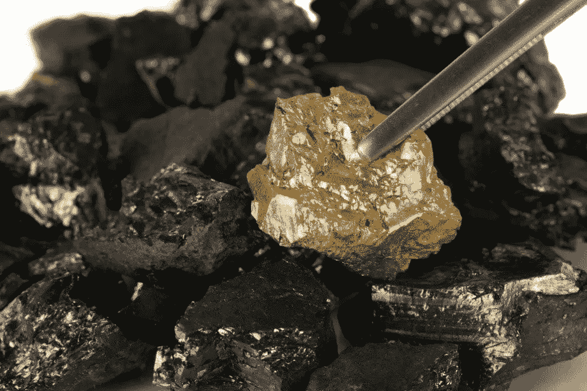
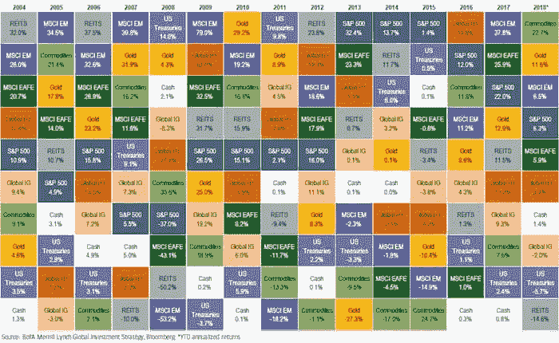
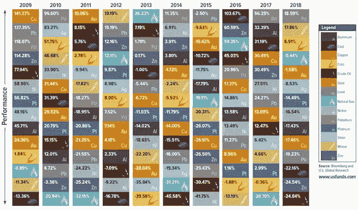
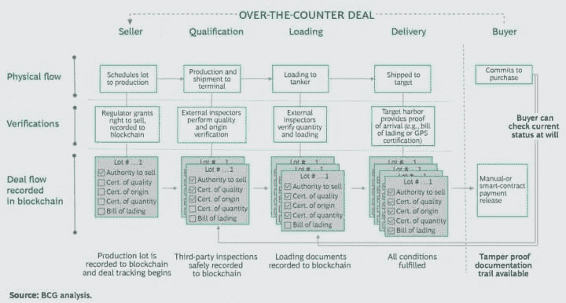

# 区块链可以让投资大宗商品变得更简单

> 原文：<https://medium.com/hackernoon/blockchain-could-make-investing-in-commodities-simpler-cbe1c93f0882>

对投资者来说，投资煤炭、黄金或石油等大宗商品可能很困难。一个主要原因是，与股票和债券不同，大宗商品不容易转让，普通投资者也不容易获得。此外，他们通过期货和期权市场进行交易的复杂方式可能是一个障碍。换句话说，投资者不能只买一桶石油。随着[区块链](https://hackernoon.com/tagged/blockchain) [技术](https://hackernoon.com/tagged/technology)的兴起，将商品令牌化可以成为现实。

# 什么是商品？

商品通常是生长或开采的原材料或货物。商品市场是它们可以买卖的地方，比如贵金属、黄金、咖啡豆、石油、谷物、能源等。纵观历史，世界各地的人们一直使用实物商品作为代表和储存财富的形式。今天，大公司在股票交易所进行商品交易，价值数百万美元的交易经常换手。

# 交易所交易基金

普通人更容易获得黄金，因为从交易商或在某些情况下从银行购买金条(实物形式的黄金)很容易。

一个解决方案是交易所交易基金(ETF ),它反映了基础商品的走势，为投资者提供了直接投资的机会。然而，并不是所有的商品都有 ETF。例如，黄金——ETF 的每份份额代表十分之一盎司的黄金，因此如果黄金目前为每盎司 1300 美元，黄金 ETF 的交易价格将为每股 130 美元。这种投资产品是进入黄金市场最简单、最便宜的方式之一。值得注意的是，跟踪特定行业或部门的 ETF(如石油服务 ETF)容易出现高波动性，代表相关的潜在风险。流动性也是一个需要考虑的因素。

**总结传统的工业工程投资。黄金可能面临挑战，但越来越有吸引力(2018 年顶级资产类别):**

**还有一些更深入的商品市场:**

# 区块链技术如何惠及大宗商品市场？

区块链有可能彻底改变商品的开采/收获、交付、融资和交易方式。例如，一个金块要沿着供应链走很长一段路，从我的手中到最终消费者手中。法律框架、地区法规、制造业和零售业，每一个都可能有自己的分类账系统、成本和潜在的安全缺陷。

基于区块链的平台和加密货币有望改善商品交易行业的运营方式，解决信任、效率低下和交易复杂性等问题，交易通常涉及多方。区块链技术允许透明记录复杂的交易，跟踪商品，减少欺诈，这似乎使其成为商品业务的天然选择。

区块链的分权保证了供应链的防篡改和完全透明。这种信任的提供和效率的提高是不可低估的。

 [## 全球钻石和珠宝市场使用 IBM 区块链追踪真实性——想想博客

### 全国零售联合会去年估计，消费者计划在珠宝上花费 43 亿美元，用于…

www.ibm.com](https://www.ibm.com/blogs/think/2018/04/global-jewelry-ibm-blockchain/) 

# 用区块链标记商品

此外，通过对商品进行[令牌化](https://hackernoon.com/should-commodities-be-tokenized-f16238143865)或[安全令牌](https://moonwhale.io/security-token-offerings-stos/)(加密货币)，获得部分资产所有权的机会。这样一来，大宗商品可以接触到更广泛的投资者群体。硬币产品允许公司将资产所有权或其他权利转化为支持区块链的虚拟或可交易令牌。这些可以提前出售，为投资融资。此外，二级市场的流动性可以让投资者在短期内兑现回报。值得一提的是，商品和资产被认为是[波动性较小的投资手段](https://moonwhale.io/end-crypto-funds/)。因此，与其他数字资产相比，加密中的对冲解决方案是一种投机性较低的投资。

我们可以预计，大宗商品将对全球金融、区块链和数字货币领域产生深远影响。

为采矿业务提供资金也是一个挑战。一个项目可以提供商品支持的代币与利润/收入分成模式。他们也可以简单地承诺价格。兑换成一盎司黄金，并在筹资期间折价出售。一个项目还可以为农民提供一个买卖平台，使他们能够通过区块链和加密进行无边界、无银行的交易，解决货币挑战，抗击通胀，同时增强新兴市场的农业和贸易。

# 关于我:

**伊利亚·扎基是美国一家名为** [**STO 咨询公司**](https://moonwhale.io/) **的公司——moonwale Ventures 的业务开发和营销主管。**

在我们的各种社交媒体平台上关注我们—

[推特](https://twitter.com/MoonwhaleBV) | [领英](https://www.linkedin.com/company/moonwhalebv) | [脸书](https://www.facebook.com/MoonwhaleBV/) | [电报](https://t.me/moonwhaler)