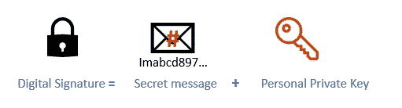
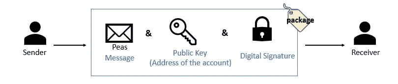
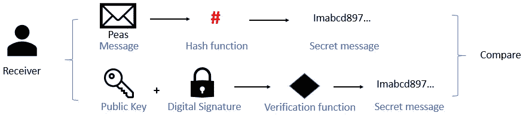

# 区块链加密向一个 9 岁的孩子解释

> 原文：<https://medium.com/hackernoon/blockchain-cryptography-explained-to-a-9-year-old-8275c6eab6fa>

## 区块链密码术入门指南

C[ryptoccurrency 是 2018 年排名最高的谷歌科技搜索](https://www.verdict.co.uk/top-google-searches-of-2018-technology/)。这应该不足为奇，因为比特币是第一种也是最知名的加密货币，大约在 2015 年开始流行。随着区块链科技的迅速崛起，它的炒作也紧随其后。

区块链是比特币赖以建立的底层概念和框架。与依赖于中央系统(如使用银行、社交媒体公司和云存储)相反，区块链是一个分散的系统，利用分布式账本进行记录。**美国财政部制作的这段 2 分钟的视频******很好地概述了区块链。****

> **简而言之，区块链的定义特征使其成为加密货币等创新的推动者，这些特征是**分布式、去中心化、仅附加、基于共识的**，也许最关键的是**由密码术保护**。**

**如果区块链是加密货币的底层骨骼系统，那么密码学就是它的神经系统——它使信息和身份能够在广泛的网络中的参与者之间安全地交换。密码学是应用数学的一个广阔领域，为了在几个段落中提炼出它的工作原理并将其重要性与区块链应用联系起来，我将开发一个经典社交游戏的类比。**

****想象玩破电话游戏** …**

****

**与此相关的有几个问题:**

1.  **原始邮件已经更改**
2.  **接收者不知道消息已经改变**
3.  **接收者不知道消息是否来自预期的发送者**

**为了解决这些问题，区块链密码术利用**数字签名(像包装上的封条)**来验证和认证网络上的交易。**

**数字签名实现了以下目的:**

1.  **确保消息没有被篡改**
2.  **验证签署文件(交易)的人是否正确**
3.  **没有其他人伪造或复制签名**
4.  **一旦签名，就不能否认**

## **数字签名是如何工作的？**

****

**为了在电话游戏的场景中应用密码术，如果人 A 想要发送消息“豌豆”给人 B，他/她将使用私钥来“锁定”该消息。这里锁定消息意味着用**非对称加密技术加密消息。****

> **非对称加密使用一对公钥和私钥，它们在算术上成对但不完全相同。公钥可以与每个人共享，但私钥对是保密的。该对密钥中的一个密钥用于锁定消息，只有相反的密钥可以用于解锁消息。**

****我听过的描述这个过程的最好的比喻** **就像把一只鸡变成鸡块——它不能被逆转来找出最初的信息。**然后，A 的消息变成一组随机字母，在上图中表示为秘密消息，因为随机字母在字面上没有意义。**

**如图所示，用个人的唯一私钥签署消息创建了数字签名。**

## **发送消息**

****

**当 A 准备好共享消息时，他/她将把原始消息、公钥(另一对私钥)和数字签名作为一个包发送给目标接收者 b。**

## ****接收消息****

****

**当人 B 收到并打开包裹时，他/她将从人 A 处获得公开消息，并通过相同的加密函数运行该公开消息以获得秘密消息。B 保存这个秘密消息用于以后的验证目的。**

**然后，人 B 将从人 A 处获得公钥和数字签名，并通过加密验证功能运行它们，以获得嵌入在数字签名中的秘密消息。由于私钥和公钥在算术上是成对的，所以任何其他人的公钥都无法解开发送者的数字签名。**

**现在，接收者 B 有两个秘密消息——一个通过加密函数加密，另一个通过数字签名解锁。他/她可以比较它们是否相同。**

**同样，我们这里不比较原始消息，因为鸡块不能转换回鸡肉。如果两个秘密消息是相同的，那么接收者知道该消息，并且发送者如预期的那样被验证。否则，接收者知道在这个过程中的某个地方，某些东西已经被改变了。**

**我希望我简化区块链加密概念的尝试能为理解这项技术提供一个有用的概述。**

****感谢阅读！****