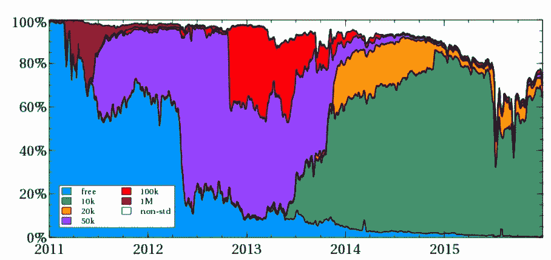
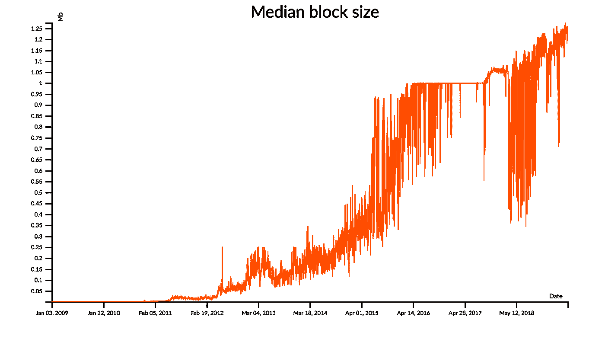
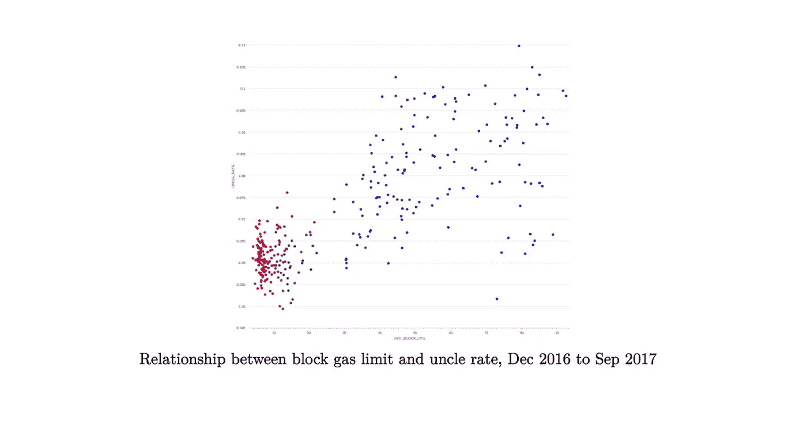
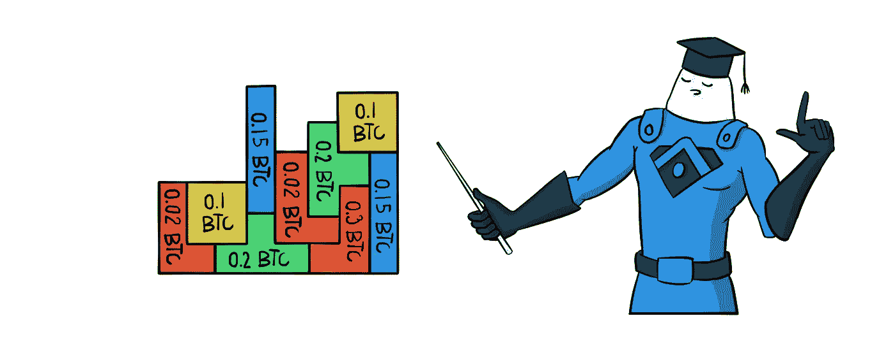
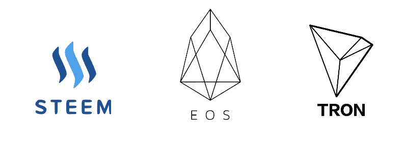
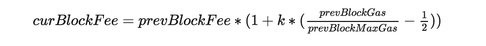
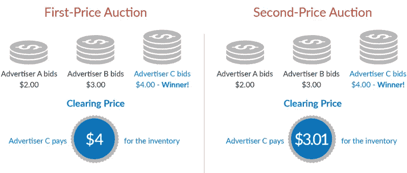
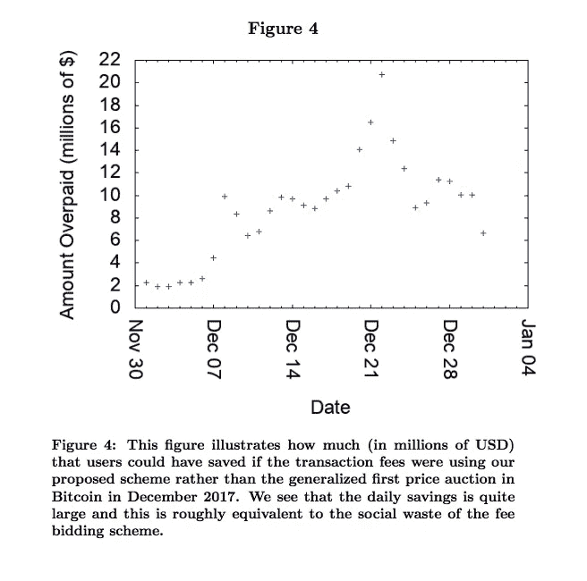

# 区块链收费断了。这里有 3 个建议来解决这些问题。

> 原文：<https://medium.com/hackernoon/blockchain-fees-are-broken-here-are-3-proposals-to-fix-them-1f772e1530dd>

当中本聪设计比特币协议时，他洞察到交易费用的概念。这些费用激励矿商将交易纳入大宗交易。但最初，从任何有意义的意义上来说，比特币都没有一个*费用市场*。

很大一部分早期比特币交易直到 2013 年都是完全免费的(上图中的蓝色)。钱包开发者最终将小额固定费用硬编码到他们的客户身上，被认为是对矿商的捐赠。起初，这些费用默认为 0.1 BTC，但随着比特币价格的上涨，它们被压低了。

第一批比特币真正达到饱和将是在 2014 年末。2015 年将会看到很长一段完整的区块，到 2016 年，比特币区块链将继续以或多或少的满负荷运行。

只有在区块满了之后，比特币区块才真正开始发挥收费市场的功能。程序员开发了动态费用估算器，它检查内存池并预测在任何给定时间支付的最佳费用。由于对有限区块空间的竞价战，交易费用有时会飙升。

这让我们走到了今天。比特币费用再次攀升[接近每笔交易 3 美元](https://cryptobriefing.com/bitcoin-fees-scaling-debate/)，随着天然气用量接近历史新高，以太坊的费用也在上涨。

Satoshi 有先见之明，意识到了交易费的重要性。但我们现在对收费市场在竞争下的表现有了更多的了解。Satoshi 实施的收费市场从根本上被打破了，是时候探索其他市场设计了。

在这篇文章中，我解释了为什么在几乎所有加密货币中使用的块空间的第一价格拍卖最终对用户不利。然后，我概述了 3 个最突出的替代收费模式的建议。

第一种是 EOS 和 Tron 使用的“免费”模式，我认为这种模式并不像看起来那样有效。第二种模式由 Vitalik 提出，很快将在以太坊硬分叉中采用，这是一种新的每块固定费用，它被烧掉，而不是支付给矿工。第三种模式是康奈尔大学研究人员提出的一个更为激进的提议，他们将多单位二级价格拍卖适用于区块链环境。

我的目标是用最简单的语言解释所有这些设计。

有很多要讲的。但是在我们[拆除这个围墙](https://en.wikipedia.org/wiki/Wikipedia:Chesterton%27s_fence)之前，我们应该首先确定我们首先明白它为什么在这里。

# 为什么我们需要一个收费市场？

交易费既烦人又昂贵，而且构成了一个复杂的 UX。为什么不能让矿工免费包含交易呢？毕竟互联网是免费的，路由器路由数据包不收任何费用。为什么区块链不能像那样？

但是互联网本身并不是免费的。这种感觉只是因为互联网的发展程度。但是你实际上为你发送的每个包付费。

对于互联网，你可以通过你的 ISP 或运营商的每月带宽计划提前批量购买这些包。这种计划在区块链还不存在，很大程度上是因为需求如此不稳定，以至于承保这样的计划是不可行的。也许有一天，我们会看到类似的计划用于区块链。

但是区块链的环境有更多的限制:机会成本。如果你不给矿商一个经济激励，让他们把你的交易纳入他们的区块，他们就不会这么做。这是因为处理交易需要时间和计算，这侵蚀了矿工的底线。较大的块也需要较长的传输时间，这增加了该块被孤立的可能性。一个空的比特币块在今天的纯块奖励中价值约为 10 万美元，而一个空的以太坊块约为 600 美元。这对任何一家矿商来说都是重大损失。只要交易费用相对来说可以忽略不计，矿商们就会非常乐意[开采一个没有任何交易的空区块](https://www.blockchain.com/btc/block/000000000000000000138250dba2adb1715ff6f84441b03b18db2258910c8c96)。

(实际上，这些空块中的大部分都是在收到最新的块后很快就被挖掘出来的，这是在可以准备具有唯一事务的块模板之前。)

此外，事务创建的任何新状态都必须永久存储在区块链中。这是你强加给系统中每个节点的永久成本。为什么你可以免费做那件事？

你可能会提出抗议:但如何保护加密货币作为公共产品的完整性呢？难道矿工们不想遵循聪的禁令吗:

> *他应该会发现，遵守规则[……]比破坏体系和自己财富的合法性更有利可图。*

嗯，不，不是真的。自私和忽视低收费交易符合任何矿商的个人利益。这是为什么到目前为止，每 6 个比特币块中就有 1 个是完全空的。

好吧，好吧。我们需要对矿商进行补偿，让他们觉得交易是值得的。为什么不对每笔交易收取固定费用(或者说，每字节/气体收取固定费用)？这似乎会使事情变得更简单，我们可以避免费用飙升。

但问题是:一名矿工如何在潜在候选人中进行优先排序，以进入一个区块？如果块中的候选事务比槽多，我们如何决定什么去哪里？你可能会认为平等主义的方法是理想的:每个人都受到平等对待，矿商根据先来先服务的原则将交易纳入区块。

这种设计有几个问题，但最重要的一个是:我们如何为真正更高优先级的事务设置例外？例如，我可能在懒洋洋地整合我的一些钱包，而你却在拼命地为你的即将被清算的制造商 CDP 再融资。我不在乎我的交易什么时候通过，但是你急需进入这个街区。固定费用机制不能为高优先级事务提供例外。

在一个理想的设置中，我们想实际算出*谁现在最需要块空间*，然后将它授予那个人。

事实证明，市场恰恰是这个问题的解决方案。市场擅长将稀缺资源分配给最具生产力/利润的用途。谁对块空间的使用效率最高，最好的信号就是谁愿意为此支付最高的价格(因为他们希望获得更多的价值来抵消成本)。在经济学中，这一概念被称为**配置效率**——基本上，将资源分配给那些最能利用它们的人。

但市场只是起点。我们这里需要什么样的*市场？为此，我们必须着眼于丰富的拍卖设计领域。*

# 拍卖设计

几乎所有的区块链费用市场都是一级价格拍卖。在第一价格拍卖中，所有投标人都提交密封的投标，出价最高的人支付他们出价的任何东西。这基本上是设计密封投标拍卖最显而易见的方式。(当然，从技术上来说，区块链费用并不是密封的，它们通常可以使用 [RBF](https://en.bitcoin.it/wiki/Replace_by_fee) 或 [CPFP](https://bitcoinelectrum.com/how-to-do-a-manual-child-pays-for-parent-transaction/) 进行更新，但它们在大多数情况下仍像一级价格拍卖一样)。

因为每个被拍卖的区块在其区块空间中都有多个位置，这被称为*多单元拍卖*。该块中的第一个位置属于出价最高者，第二个位置属于出价第二高者，依此类推。(以太坊稍微复杂一些，因为“槽”可以相互影响，比如在 [DEX 套利](https://arxiv.org/abs/1904.05234)。)

尽管无处不在，但第一价格拍卖被广泛认为是最糟糕的拍卖方式之一。理解原因相当简单。

首先，第一价格拍卖迫使竞标者变得更有战略眼光。换句话说，在你出价之前，你必须考虑其他竞标者会怎么做。如果其他人出价都很低怎么办？你不想出价过高，即使这件物品对你来说很值钱。但是如果你出价太低，也许你会被抢先。每个人都在试图利用这个系统，这意味着有时对资产最有效利用的竞标者会意外出价过低，其他人可能会赢得拍卖。这损害了配置效率。

因为投标人采用复杂的策略(通常体现在区块链费用估算中)，他们往往不会准确地衡量市场条件，这通常会导致总体超额支付(由拍卖人捕获——在这种情况下，是矿商)。你可以在 2017 年末看到这种情况，当时设计不良的费用估算器导致比特币平均费用上涨至每笔交易 20 美元以上。

最后，首价拍卖机制导致长期拥堵，即使在最初的竞标者蜂拥而至已经过去之后。毕竟，如果其他人的费用估算者都很困惑，仍然多付了，即使你*知道他们多付了*，如果你想进入一个街区，你也别无选择，只能多付。这导致费用飙升持续的时间超过了必要的时间。

费用估算员一般都很挑剔。大多数费用估算者是某种[指数移动平均线(EMA)](https://en.wikipedia.org/wiki/Moving_average#Exponential_moving_average) ，比如在[比特币核心](https://bitcointechtalk.com/an-introduction-to-bitcoin-core-fee-estimation-27920880ad0)。但是这些费用估算者容易被矿商操纵——矿商可以通过排除低价值交易或在他们的区块中填充虚假的高费用交易来单独提高均线。此外，不同的费用估算算法经常以不可预测的方式相互作用，这可能导致费用估算的波动。大多数高级用户最终会训练自己的直觉来进行更好的费用选择。

然后是*支付*费用的实际 UX。比特币的情况没那么糟糕，因为它只是对每一笔比特币汇款征税。但是，在像以太坊这样的智能合约平台上，如果用户获得了一个 NFT 或一些戴，他们突然也需要获得一些以太网来支付费用。现在，你的加密的[魔法时刻](https://alexiskold.net/2016/06/01/what-is-the-magic-moment-for-your-startup/)被口吐白沫的 MetaMask 打断，并指引你去比特币基地买一些 ETH。

每个人看到的问题都是一样的。有可能确定区块链费用吗？在那个问题上意见不一致。但以下是试图重新设计区块链收费的团队提出的三个最重要的提议。

# 提议 EOS“免费”模式

丹·拉里默(Dan Larimer)发明了一个关于区块链费用模型的激进创新，首先在 Steem 中实现，现在在 EOS 中实现(后来被 Tron 借用)。

丹·拉里默知道处理波动的费用是多么令人沮丧。他设想了一个系统，在这个系统中，用户不再以块为单位竞标空间，而是被授予系统吞吐量的一部分。毕竟，区块链应该是一种公共产品，为用户群服务。

因为 EOS 是一个 DPOS 系统，它不像 PoW 那样没有权限。为了成为一名街区制作人，你需要被足够多的硬币持有者投票选举。因此，EOS 不需要担心块生产者不包括事务:如果一个块生产者正在创建空块，他们可能会被硬币持有者投票淘汰。此外，孤儿风险也很小，因为 EOS 的 DPOS 共识就像每个区块生产商之间的循环一样，每个人都有很长的时间来做他们需要的工作。这给了 EOS 对块生产者行为的一致检查。

但即使如此，基本问题仍然存在:给定有限的块空间，我们应该如何在竞争事务之间分配它？

EOS 采取了完全取消交易费的大胆立场。耶！但是如果区块链很拥挤，我们仍然需要一些方法来决定谁进入街区。

这里，EOS 采用了一种看似简单的启发式方法:用户锁定他们的 EOS 令牌，他们锁定的令牌数量给予他们相应的权利来阻止空间。利益相关者也可以自由地将他们多余的资源分配给其他人。这使得 Dapp 开发者可以购买大量 EOS，进行投资，并将投资委托给他们的用户，让他们免费与 Dapp 互动。

*(注意:我在这里掩盖了很多复杂性。EOS 实际上有三种计算资源，称为“RAM”、“带宽”和“CPU”，不像以太坊将所有资源消耗都计为“gas”。与存储相对应的 RAM 吸引了更多的需求和投机。这导致 EOS 团队在发布后修补 RAM，以便根据基于 Bancor 的市场机制* *分配现在的* [*。“CPU”和“带宽”仍然基于锁定的 EOS 令牌进行分配。为了简单起见，我将 EOS 模型视为专门指“CPU”和“带宽”是如何分配的，因为 RAM 在 EOS 上不再有效地空闲。)*](/eosio/introducing-eosio-dawn-4-0-f738c552879)

那么，我们应该如何看待 EOS 免费设计呢？

首先，它有很多令人喜欢的地方。当系统未满负荷时，事务确实是自由的，我们不需要担心块生产者拒绝包含事务。当系统在低容量下运行时(EOS 和 Tron 自诞生以来都是如此)，它运行得很顺畅。这真的很简单明了。

但是这里也有很多不喜欢的地方。

传统的第一价格拍卖试图通过以下方式有效地分配资源:我们将看看谁愿意为这个区块空间支付最多。相反，EOS 说:我们将会看到此时谁拥有最多的 EOS，这个人将获得这个块空间。

这太奇怪了。

首先，EOS 的最大持有者很可能是 Block.one 团队本身、大型 Block 生产商、托管人、交易所和 whales。但是他们不太可能做大部分的交易。当然，普通用户可能可以通过委托从与如此大的 EOS 持有者的交互中获得自由块空间。但是现在我们希望这种偶然的资源分配(由富有的 Dapp 开发者赞助的免费交易)以某种方式接近分配效率。

如果你不想使用一个由大型 EOS 持有者赞助的应用程序，该怎么办？在以太坊，你需要花少量的货币来支付交易费用。在 EOS 中，你需要购买并锁定一些 EOS 代币——本质上，迫使你*做多基础货币*以获得交易权。这真是一个奇怪的约束。当然，如果你不想要那么长的风险敞口，你可以构建一个对冲 EOS 价格的工具。但是你仍然要支付“交易费”，但是现在是给提供你对冲的人。

EOS 支持这种模式，因为它声称这有效地消除了费用市场。但在均衡中，我不认为我们真的应该期待收费市场随着这种设计而消失。

一旦区块达到最大容量，区块空间变得稀缺，持有 EOS 的大股东将坐拥未使用的区块空间权。在这种情况下，与其让他们对宝贵资源的权利白白浪费，他们为什么不干脆，你知道，*把它们拍卖给出价最高的人？*

这让我们回到了起点。哪里有对稀缺资源的需求，哪里就有市场。它们是经济复杂性不可阻挡的特征。因此，只要*对块空间的权利分配偏离了对块空间的需求*，市场最终将会出现以纠正这种偏离。

因此，虽然这种类型的设计一开始听起来不错，但如果你用游戏理论来解决它，它看起来就像一个糟糕的解决方案。当供应(块空间)持续超过需求时，在*所有区块链*的交易接近免费。但是，试图迫使交易自由将不可避免地导致市场在被压制的地方重新崛起。

# 提议 2:以太坊的新收费市场，EIP-1559

我们要看的第二个提议是由 Vitalik Buterin 提出的，在 2018 年 8 月在 [ethresear.ch](https://ethresear.ch/) 上的[立场文件](https://ethresear.ch/t/draft-position-paper-on-resource-pricing/2838)中首次全面阐述。这一提议将在即将到来的伊斯坦布尔硬分叉会议上进行审议，因此它可能会成为以太坊费用的未来工作方式。(到目前为止，以太坊的收费市场和比特币一样。)

Vitalik 用不同的设计理念来解决这个问题。他不是从一张白纸开始，试图揭示理论上最佳的设计。相反，他优化了最向后兼容和最小破坏性的协议变化，改善了收费市场。这让他来到了现在的 [EIP-1559](https://github.com/ethereum/EIPs/blob/master/EIPS/eip-1559.md) 。

你可以把 EIP-1559 背后的大想法想成是把费用估算直接移植到协议中，而不是把它放在费用估算器中。假设所有关于交易、阻塞和费用的信息完全是协议内部的，为什么不能在区块链内部完成呢？

所以 EIP-1559 正是这样尝试的。它引入了每笔交易必须支付的固定费用。该固定费用根据前一个数据块的满度上下浮动，目标是平均数据块利用率为 50%。当前一个块的使用率超过 50%时，固定费用会按比例增加(上限为每块+12.5%)，当使用率低于 50%时，费用会降低。在某种意义上，这使每个人都在同一个协议内费用估算器上同步。

EIP-1559 的另一个特点是，这些固定费用实际上并没有支付给矿工。相反，他们被烧伤了。这产生了两个重大后果:首先，矿商操纵这一机制的难度加大了，因为他们无法在不消耗费用的情况下，将自己的交易打包。第二，因为这种费用燃烧必须在以太中进行，它巩固了以太作为支付以太坊使用的唯一方式，阻止了经济抽象。现在，费用不再是从用户到矿商的价值转移，而是通过较低的通货膨胀从用户到所有 ETH 持有者的价值转移。

到目前为止，一切顺利。除了最后一个问题:如果费用只是被烧掉，那么矿商就没有动力实际计入交易！因此，这种设计的最后一个组成部分是，每笔交易都有一个小“小费”，用户可以将它添加到交易中，以激励矿工。tips 中仍有少量第一价格竞价的空间，但假设费用调整机制正常运行，拍卖的范围应该很小。

这应该使费用估算变得非常简单:你应该能够只消耗当前的固定费用，加上一些小的提示(补偿矿工的计算成本+孤儿风险)。

当然，如果突然出现拥塞(例如在 ICO 期间)，费用调整算法将无法及时适应。在这种情况下，市场将回归第一价格拍卖，每个竞标者都以高额小费进行竞争。但这不会比现状更糟。Vitalik 还建议，当以乙醚计价时，这些固定费用不太可能特别不稳定，因为交易需求和乙醚价格在实践中往往高度相关。

这种变化还将伴随着气体限制的加倍(从大约 8M 到大约 16M)，从而系统可以在当前块大小下有效地达到 50%的使用目标。

EIP-1559 的一个结果是更简单的费用估算。除非突然出现拥堵，否则费用估算员应该只需要出价`current_fee + ε`。从均衡角度来看，这消除了区块链费用中的第一价格拍卖机制，并避免了策略性投标。竞标者只需要问自己:“对我来说，进入区块链值得吗？如果没有，现在就不要出价。”

总而言之，EIP-1559 描述了一个非常实际的演变，从简单的第一价格拍卖，区块链历来使用。这不是一个雄心勃勃的政权更迭。但是从工程的角度来看，这是一个简单且破坏性最小的改进，可能会在今年登陆以太坊。

# 提议#3:多单位第二价格拍卖

读完所有这些，你可能会想:肯定有某个默默无闻的学术部门在研究拍卖，并知道一个解决所有这些问题的聪明机制。你几乎是对的。拍卖理论是应用经济学和博弈论的一个分支，至少从 60 年代开始研究拍卖设计。不幸的是，它并没有完全转化为加密货币。这让我们看到了由 Soumya Basu、David Easley、玛琳·奥哈拉和 Emin Gün Sirer 撰写的一篇精彩论文:[走向加密货币的功能性收费市场](http://hackingdistributed.com/2019/01/22/doing-fees-right/)。

先说一些背景。

或许拍卖理论皇冠上的宝石是维克瑞拍卖，威廉·维克瑞因此获得了 1996 年的诺贝尔奖。这种拍卖通常被称为**二价拍卖**。

第二价格拍卖是一个简单的想法。就像在一级价格拍卖中，所有的出价都是秘密的，出价最高的人获胜。但赢家不支付他们的出价；相反，他们支付第二高出价者出价的*(有时是+ 1 美分)。*

设计上的这一微小变化最终会改变一切。

第二价格拍卖是**激励相容**。这意味着，与第一价格拍卖不同，第二价格拍卖不需要策略。相反，你应该“诚实”地出价，不管这件物品对你来说值多少钱。毕竟，如果你的出价太高，你不会有任何损失——如果你赢了，无论你出价多高，都会退还给你。因此，你不需要猜测其他人会出价多少，或者试图智胜。

因此，我们应该期待每一方对他们认为的资产价值进行投标。按照博弈论的说法，在二价拍卖中,“如实”出价是一种优势策略。

因为第二价格拍卖不鼓励战略出价，这也意味着拍卖产生了配置效率:由于每个人都只出价自己的价值，平均而言，出价最高的人将是资产价值最高的人。没有投标人的认知负荷，没有怪异的费用估算游戏，也没有系统性的过高支付。

这种设计简单、优雅、功能强大。这就是为什么它在许多场合被作为拍卖设计的黄金标准，从易贝到谷歌和脸书的广告市场。

然而，第二价格拍卖不太适合区块链。

首先，区块链不是在拍卖一件物品:他们实际上是一场多单位的拍卖。为了适应这一点，你需要使用一个多单位的第二价格拍卖。在这个变体中，区块空间的所有投标人提交投标，并且每个人支付被该区块接受的最低投标。

例如，假设一个区块中只有 3 个时段，但有 5 个出价:`<$10, $8, $6, $5, $3>`。在这种情况下，只有`<$10, $8, $6>`被包括在内，但他们每个人支付的中标金额最小，所以最后一块的费用是`[$6, $6, $6]`。

在这个例子中，10 美元的投标人不需要*猜测*网络拥塞会是什么样子。他们只需要决定，“我最多愿意为这笔交易支付 10 美元，”但如果他们遇到障碍，他们几乎总是会支付低于该金额的金额。

现在，如果你像一个优秀的密码经济学家一样思考，你可能已经注意到了一些对此的攻击。

假设内存池看起来像`<$100, $20, $10>`。贪婪的矿工可以忽略其他较小的交易，只让他们的区块成为`[$100]`，而不是将该区块中的所有交易都作为`[$10, $10, $10]`收入 30 美元。记住，在战俘制度中，我们不应该相信拍卖人是诚实的。如果没有诚实的假设，第二价格拍卖背后的保证就会失效。

这就把我们带到了[一个面向加密货币的功能性收费市场](http://hackingdistributed.com/2019/01/22/doing-fees-right/)。在他们的论文中，作者试图适应多单位第二价格拍卖的无许可区块链设置。

他们分两步扩大第二价格拍卖。首先，它们引入了每个块*必须*完全充满事务的要求。这阻止了矿工执行我们之前演示的单次交易 100 美元的块技巧。但由于矿工只是支付自己，他们总是可以通过创建自己的*合成*高费用交易来作弊，填充`[$100, $20, $10]`块，就像这样:`[$100, *$99, *$99]`(其中`*`交易是自我支付)。

为了防止这种古怪的行为，作者增加了第二个补充:不是矿工被授予他们自己区块的交易费，而是他们收到过去许多区块(比如 10 个)的平均交易费。因此，他们将只收到其所在区块 1/10 的交易。如果他们创造了合成的自我支付，他们实际上是将 90%的交易费用支付给了接下来的 10 家矿商。当区块满负荷运行且系统中有许多用户时，这促使矿工避免任何恶作剧。

除了降低费用之外，这一方案还有平滑交易费用波动的好处。这避免了许多费用狙击攻击，并在区块奖励逐渐减少后增加了比特币的稳定性。在他们的论文中，作者估计，在 2017 年比特币费用上涨期间，他们的设计可以节省约 2.7 亿美元的交易费用。

他们的设计理论上很吸引人。但这与目前为区块链设计的收费市场有很大不同。采用这样的系统需要一把硬叉子，并且会打破几乎所有的钱包和交易所。对于用户来说，考虑如何付费也是一个全新的范例，毫无疑问，在实践中会出现无法预见的问题。也就是说，从长远来看，多单位二级价格拍卖可能会使费用更简单，矿商的波动性更低，总体社会盈余更大。

# 包扎

我在这里还谈到了费用市场中的许多其他重要概念，包括类似于[替代费用](https://en.bitcoin.it/wiki/Replace_by_fee)、[孩子为父母付费](https://bitcoinelectrum.com/how-to-do-a-manual-child-pays-for-parent-transaction/)、[领先竞争](https://arxiv.org/abs/1904.05234)等机制。

最后，我在这篇文章中做了一个很大的假设，我想承认:不是每个人都想降低交易费用。

在比特币社区，人们对最大化支付给矿工的交易费很感兴趣，这样比特币就可以安全地过渡到零通胀。毕竟，矿工获得的剩余越多，网络就变得越安全。另一方面，在智能合约平台中，最大限度地降低费用对于大规模采用至关重要。这两个目标直接对立，并可能导致不同的方法。

如今，支付区块链费用的 UX 相当糟糕。但这只会通过市场设计、更多的第 2 层原语以及通过[元交易和中继](/@austin_48503/ethereum-meta-transactions-90ccf0859e84)的费用委托变得更好。( [Dapper Labs](https://www.meetdapper.com/) 是为数不多的真正推动这一前沿的公司之一。)随着像 [DFINITY](https://dfinity.org/) 、 [Spacemesh](https://spacemesh.io/) 和 [AVA](https://avalabs.org/) 这样的新平台进入市场，我预计我们会看到支付区块链费用的体验会有进一步的迭代。就目前而言，在市场设计方面，区块链仍处于起步阶段。

(感谢 [Tarun Chitra](https://medium.com/u/40c4641af2ed?source=post_page-----1f772e1530dd--------------------------------) 、 [Ivan Bogatyy](https://medium.com/u/1ff4cbafc96f?source=post_page-----1f772e1530dd--------------------------------) 和 [Rachel Diane Basse](https://medium.com/u/c82ccdf60bb9?source=post_page-----1f772e1530dd--------------------------------) 校对本文。)