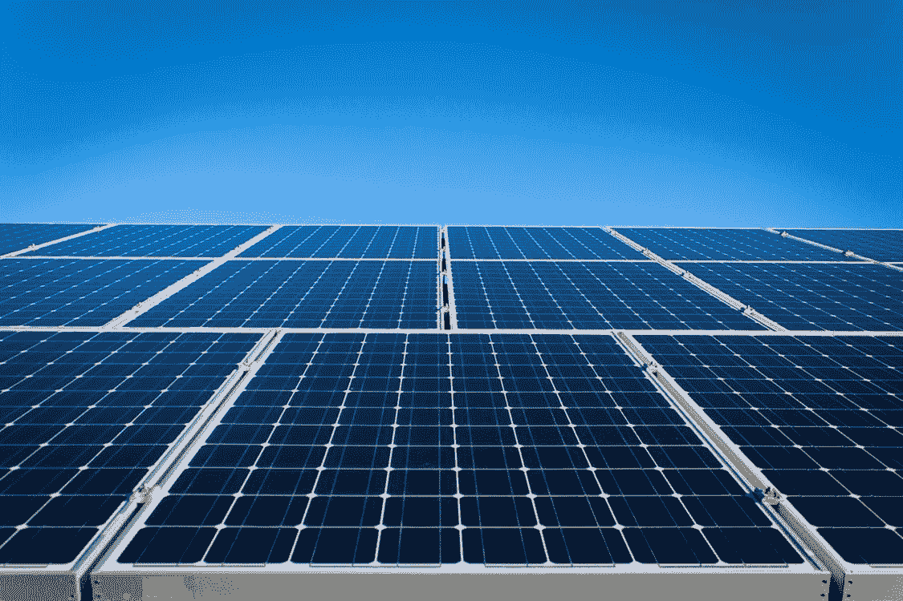
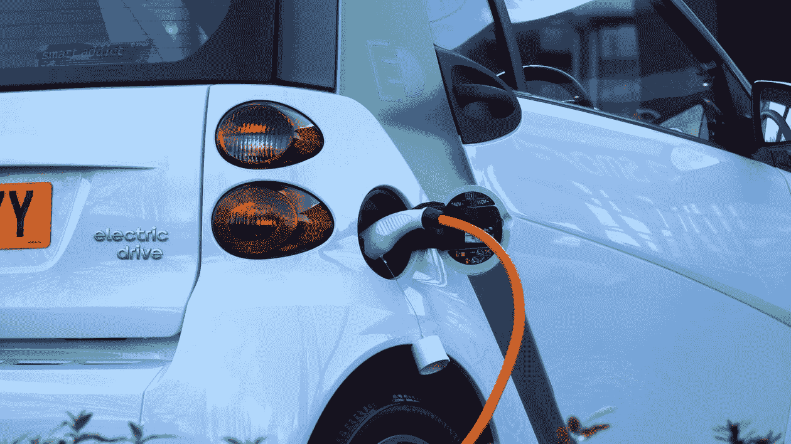

# 多伦多全球能源转型区块链联盟

> 原文：<https://medium.com/hackernoon/blockchain-for-global-energy-transformation-64763e82885c>

## ***让我们来揭开区块链技术如何有潜力颠覆价值 1.3 万亿美元的全球能源市场！***

Solar panels. Source: [https://www.pexels.com/photo/alternative-alternative-energy-blue-eco-411592/](https://www.pexels.com/photo/alternative-alternative-energy-blue-eco-411592/)

没有能源，我们今天生活的现代生活方式是不可能的，事实上，对更多能源的需求正在快速增长。这种不断增长的需求的负担落在了中央集权的单一电力生产商的肩上。自大约一个世纪或更久以来，能源行业的当前价值链没有经历太多变化。另一方面，从那时起，世界的运作方式已经完全改变了。

> ***显然，这里需要从第一原则来思考。***

# **戴上区块链的帽子**

[区块链](https://hackernoon.com/tagged/blockchain)的基本特征描述如下。这些特征将引导我们从最初的原则开始思考。

*   **高效的 P2P 交易平台:**区块链[技术](https://hackernoon.com/tagged/technology)利用去中心化存储实现点对点通信，记录所有交易数据。这种通信可以由智能合同自主管理。网络中发生的任何冲突将通过群集，即通过使用一致算法来解决。
*   **可自我审计的记录:**区块链本身不需要任何明确的审计员。所有数据都是按时间顺序记录在区块链上的，这使得区块链自动负责。
*   **快速流程、高度灵活性、低成本:**区块链有可能消除交易对手，从而大幅降低成本并加快流程。

上述这些特点有助于为区块链在能源工业中的应用创造有利的环境。因此，可以编排各种各样的用例来满足不同的需求。

# **对当前系统的评估**

全球能源市场目前充满了垄断和寡头垄断，有严格的进入壁垒。因此，内部流程不透明，市场上也没有健康的竞争。这些因素直接影响价格和信任。区块链技术可以为 prosumers(同时也是生产者的消费者)创造机会。这些消费者不仅能够消费和生产能源，而且能够以 P2P 方式高度自主地买卖能源。

目前，能源产业的价值链是多层次的。它由能源生产商、输电基础设施运营商、配电基础设施运营商和与终端消费者有联系的供应商组成。所有这些方面相互通信，从而卷积系统。区块链有能力通过消除中间商并直接将消费者与生产者联系起来，从根本上简化这一价值链。

这种多层能源基础设施不再可靠或高效，因为电网仍在使用老式技术。在灾难发生时，首先倒下的是电力，由于一切都依赖于电力，该地区的整个基础设施就像多米诺骨牌一样倒塌。在这个时代，大部分工作都是在网格上手工完成的；从改变电力路线到计算发电量。未来学家设想像“智能电网”这样有弹性和高效的模型，在电网上安装智能传感器和软件。完成生态系统所需的其他组件包括智能电表、电动汽车(EV)等智能设备和智能手机应用程序。可再生能源可以很容易地与这个智能电网连接，产生清洁燃料。这场电网革命将彻底改变我们消耗能源的方式。

困扰能源行业的另一个问题是网络攻击。由于能源部门在现代经济的运行中发挥着关键作用，它成为网络攻击的一个有吸引力的目标。这些攻击可能导致停电、经济和金融中断，甚至可能导致生命损失。由于区块链理工大学标榜自己的记录存储分散，因此可以肯定的是，与能源相关的数据将保持安全可靠。

目的是从集中的价值链转变为完全分散的能源价值链，在这种价值链中，合同是自主执行的，直接约束在消费者和生产者之间。这将催生共享经济和新的商业模式，不再需要任何控制机构。

# **用例与未来**

可以在区块链上构建各种各样的应用程序。让我们逐一探索这些应用程序。

## **1。电力买卖公开市场**

今天，任何人都可以通过安装太阳能电池板来生产能源。区块链使这些生产商能够将生产的多余能源出售给他们的邻居、朋友或家人。这将导致一个开放市场的出现，拥有太阳能电池板的个人可以参与社区驱动的市场。对于消费者来说，这是一个机会，他们可以将多余的能源卖给邻居，或者输入智能电网，或者储存起来以备后用。这些决策可以由运行在任何区块链平台之上的智能合约来管理。

## **2。记录所有权和当前电力状态**

迄今为止，最稳健的会计系统是区块链系统。在能源领域，电子是资产，可以在区块链上管理这些资产。

## **3。可再生能源认证**

目前，可再生能源在实际使用前必须获得认证。获得认证的过程有时需要几周时间。如果区块链技术付诸实践，这个时间可以缩短到几分钟。

## **4。电的来源**

今天，很难说电是从哪里来的，因为电线中的电子不管来自哪里，看起来都是一样的。使用区块链技术，电力的来源可以很容易地追踪。为了快速做到这一点，区块链提供了快速群集算法。

## **5。计量和计费用电量**

可以安装智能电表来端到端管理用电。电价全天都在波动。高峰时间贵，午夜便宜。人们可以安排他们的智能洗衣机在午夜运行，以节省水电费。随着功能的增加，人们甚至可以用加密货币支付水电费。除此之外，可以在一段时间内生成不可变的和全面的电费数据档案。

## **6。电动汽车**

只有当电动汽车可以在任何地方接入充电站时，电动汽车才会变得普遍。电动汽车可以配备加密钱包，这将使电动汽车能够使用智能合同与充电站(M2M 通信)自主通信。

# **放眼世界…**

最近在多伦多成立了一个财团，包括区块链平台，多伦多和区域保护局，约克大学和英雄工程，以测试区块链的智能能源系统。这一合作伙伴关系的目标是将 Insolar 平台集成到全市范围的电动汽车和充电站车队中，支持车辆(EV)到电网充电(V2G)，这将是世界上首批基于区块链的 V2G 区块链试点项目之一。

Electric Vehicle getting charged. Source: [https://pexels.com/](https://www.pexels.com/photo/alternative-auto-automobile-battery-110844/)

Insolar 区块链平台将成为在多伦多运行的交易能源系统中实现无缝交互和智能合同履行的骨干技术。Insolar 平台已经过测试，显示每秒 19，000 笔交易的能力。最近，该平台背后的公司 Insolar 被能源行业的[100 强](https://www.startup-energy-transition.com/)高科技创业公司评为创业能源转型。所有上述使用案例都可以利用区块链平台的开源特性来开启未来。

> 最终，在能源领域率先采用区块链取决于社区。

区块链在转变全球能源市场方面的成功取决于 R&D 在区块链领域的成功，R&D 在人工智能等其他技术领域的成功，以及技术和法律法规的成功。除此之外，应用程序应该快速，易于使用，具有良好的用户体验。在区块链领域，用户体验直接依赖于群集。

这种鼓励良好行为的文化可能会间接影响该地区的社会经济刺激。更多的就业机会将出现在管理和运营领域。区块链有能力减轻传统多层价值链中可能普遍存在的腐败。最重要的是，区块链赋予人们以高度的自治权，按照自己的意愿进行交易。