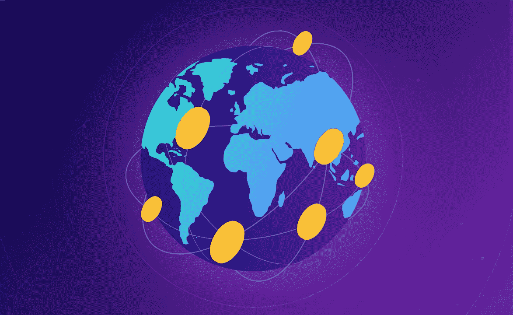

# 区块链造福社会。回顾 2018 年顶级用例。

> 原文：<https://medium.com/hackernoon/blockchain-for-social-good-reviewing-top-use-cases-in-2018-85b6b36f4c3d>

大多数区块链项目旨在通过毫无意义的产品筹集资金和创造利润，但其中一些项目旨在通过社区的共同努力，帮助有需要的人解决尖锐的社会问题，并在生态、健康和教育领域开展非商业性活动。

区块链技术和智能合同使参与解决全球问题成为可能，包括将捐款转移到世界任何地方，使这一过程相对透明和公平。随着 2018 年的结束，我有足够的时间来反思我们在所有垂直行业遇到、看到或接触的所有项目，但专注于社会公益。从加密货币捐赠如何影响世界海洋保护区的拯救，到对抗审查和阻止老化。

# 区块链技术与慈善

这个主题特别贴近我，因为它高度反映了 Humaniq 中所有团队成员的共同努力。这就是为什么我们的项目将不会在本文中提及，更多地关注市场，而不是自尊。慈善是我们这个世界不可或缺的一部分，帮助我们的邻居或一起解决全球性问题的自然愿望是高水平精神和人性的标志。毫不奇怪，来自各个领域的许多基金使用加密货币或开发自己的平台，专注于为慈善家创造一个诚实透明的环境。这种方法是解决非营利组织的两个主要问题的好方法:确保公众对资金支出的控制，以及保持捐赠者的匿名性，因为他们中的许多人希望保持匿名。

在慈善领域使用区块链的支付工具并不总是一个积极的因素。欺诈者经常利用高度匿名和无法跟踪交易来欺骗容易受骗的慈善家。他们不开展对社会有益的活动，而是从捐助者那里收集资金，利用区块链技术的主要优势为自己谋利。

解决这一问题的关键是在慈善链的每个环节引入区块链报告。秘密基金或社会组织在收到用户的资金后，可能会报告他们去了哪里，但随后就失去了踪迹。为这些基金买了什么，它们流向哪里——到目前为止，所有这些都是通过“经典”方法证实的。为了让区块链的慈善事业真正发挥作用，所有参与者不仅要熟悉这项技术，而且要在诊所、基金会、孤儿院和慈善组织中实际使用它。当然，随着时间的推移，这将成为可能，新的机制将会出现，但这将需要一年以上的时间。

然而，区块链技术的引入为慈善组织志愿者的艰难工作提供了便利。许多全球性问题可以通过有爱心的公众的共同努力来解决，为监督非营利组织的活动创造一个透明的环境将有助于吸引新的参与者。

关于这一主题的更多内容，请参见最新的《区块链与贫困》(可点击此链接获取相关内容):[https://goo.gl/tWpLqV](https://goo.gl/tWpLqV)

# 保护权利和信息自由

非营利基金会[新闻自由基金会](https://freedom.press/)开始接受比特币、以太坊、莱特币和 ZCash 的捐款，这些货币会自动转换成法定货币。这一倡议得到了 FPF 执行董事埃沃·蒂姆的积极支持。他认为，权力下放是打击审查和当局压迫记者的一个极好的工具。世界各地的记者都在某种程度上受到权力限制，其中许多人受到逮捕和迫害的威胁。FPF 基金会允许他们应对困难:它支付律师费用，提供保护个人信息的软件，并吸引权威出版物关注与侵犯媒体工作者权利有关的重大丑闻。

保护互联网上的公民权利和自由也参与了[电子前沿基金会](https://www.eff.org/)——自 2013 年以来接受比特币捐赠的最古老的专门组织之一。从慈善家那里获得的资金用于支持公司的主要工具和开发新的解决方案，以确保在全球网络中的匿名性。

互联网档案基金会是由布鲁斯特·基尔在旧金山创立的一家非盈利公司，它将网页、图片、音频、视频和软件的副本归档。该基金的主要任务是提供免费访问存储信息，其容量已经达到数十 Pb。尽管互联网档案馆没有使用区块链技术来组织如此庞大的数据阵列的存储，但它接受比特币、比特币现金、以太坊和 ZCash 的捐款，用于开发和支持该项目。

# 帮助那些处于困境中的人

旨在解决尖锐社会问题的项目占据了密码行业非营利部门的很大份额。一些基金和组织的工作可以帮助那些受制于环境和极端生活状况的人。例如，[Common Collection](http://commoncollection.com/)接受比特币捐赠，以帮助来自热点地区的灾难受害者和难民，定期提供关于获救生命的实时报告。

世界粮食计划署也可以得到比特币的支持。这就是区块链项目[积木](https://datarella.com/tag/building-blocks/)启动的原因。对慈善基金的捐款旨在帮助约旦的叙利亚难民。他们不再需要使用纸质凭证:他们可以去杂货店，那里安装了生物扫描仪，并从基金中提取产品。所有关于购买的信息都将输入区块链。

[最后一扇门](https://lastdoor.org/)是位于温哥华的康复中心。他接受比特币和比特币现金加密货币的捐赠。最后一扇门不仅帮助酗酒者和吸毒者戒除毒瘾，还尽一切可能让他们加入社会。工作人员致力于病人的精神和情感健康。除了社会支持，该中心还帮助受监护人寻找工作。

Giftcoin 和 Humancoin 项目并不直接开展慈善活动，而是旨在促进顾客与非政府组织的互动。该平台结构允许慈善组织吸引资金，其他项目参与者控制收到的资金流动。加密货币向士官的分阶段转移是通过智能合同实现的。

# 社会和非商业项目

除了专门的项目，值得注意的是以加密货币收集和分发捐款的基金。例如[bit give 基金会](https://www.bitgivefoundation.org/)收集比特币，将数字货币发送给生态、健康、教育等领域的项目。用户可以查出钱到底花在了哪里。

另一种筹集资金的方式是由 [WHIRL 社交平台](https://whirl.com/)提供的:每个参与者都可以开始为科学、教育、艺术、慈善领域的任何事件或项目筹集资金，或者为他的个人需求、旅行或支付昂贵的教育费用。要开始筹款活动，用户必须首先支持任何现有的活动，并赢得 Karma——在平台上信任的数字等价物。你可以通过支持当前正在进行的活动来获得因果报应。用户的业力越高，能收的钱就越多。WHIRL 专注于几个项目，而其他人则排队等待:由于这一点，社区资金不会分散到数百个活动中。

一个由化名 Pine 的不知名人士组织的加密项目[菠萝基金](https://pineapplefund.org/)，在这一年向 60 个活动领域(医疗保健、教育、对受害者的紧急援助、环境保护)的慈善平台捐赠了 5057 个比特币。菠萝基金有着实至名归的声誉，是一个诚实开放的基金，为解决具体的社会问题做出了重大贡献。

名人不会远离慈善事业。因此，知名模特兼慈善家娜塔莉亚·沃佳诺娃(Natalya Vodyanova)在 Elbi 手机应用中推出了价值 1 美元的 [LoveCoin](https://www.lovecoin.online/) 令牌。当用户捐款时，他会获得一种加密货币作为奖励。可以用来在内置商店 LoveShop 购买设计师单品。

世界身份网络是玛丽安娜·达汗的一项倡议，她主张国家参与区块链护照的创建，并将个人数据转移到“块”中。计划该平台将帮助在识别和恢复基本个人文件方面有问题的人。

SENS 资助的研究人员正在研究这个问题:有可能阻止衰老吗？他们开发药物和治疗与衰老有关的疾病。接受法定货币、比特币、以太币和莱特币的财政援助。该团队在加州自己的实验室进行研究，研究心脏和眼睛疾病的治疗，基因变化和细胞衰老。

# 教育

许多非营利项目旨在使教育更加普及。[Social Alpha Foundation](https://www.socialalphafoundation.org/)成立于 2017 年，接受加密货币的物质援助:筹集的资金用于向从事区块链技术社会支持和培训的项目提供资助。资助金额从 10，000 美元到 100，000 美元不等，取决于对申请人进行面试的评审团的决定。

据福布斯报道，社会阿尔法基金会在不到一年的时间里筹集了大约 100 万美元。其中一笔 30，000 美元的奖金授予了影响力峰会上的社会影响力黑客马拉松获胜者。来自 It 部门的 350 名学生参加了会议:他们展示了他们的技术知识如何帮助解决社会问题。

Code to Inspire 是一个来自阿富汗的基金会，成立于 2015 年。用筹集到的钱，他为阿富汗妇女组织了[培训小组](http://digitalcitizenfund.org/about/)，这些妇女希望获得编程和在线商务方面的知识。自成立以来，该基金会已帮助数百名妇女接受技术教育，女学生的人数还在继续增长。捐赠接受法定货币，以及比特币和广播。有趣的是，Code to Inspire 并不局限于基础 it 教育:2018 年 7 月，该基金会与 Bounties Network 合作，推出了一个旨在教学生使用以太坊和基于 IT 的智能合约的项目。

# 生态学

世界上数百万人无法获得干净的水:这必然导致流行病的爆发和高死亡率。[净水硬币](http://www.cleanwatercoin.org/)旨在帮助非洲和世界其他地区需要帮助的人。这个项目是一个用于加密货币的常规多货币钱包，但使用该应用程序执行的每笔交易的 0.1%被发送到 CharityWater.org 慈善基金会。该基金向非洲干旱地区和地球上其他难以获得淡水的地区提供清洁饮用水。

BANKEX 平台向用户推出了 WaterCoin token，最初价格为 0.02 美元，相当于一升清洁饮用水的价格。现在唯一的分发点在肯尼亚的纳罗克市:它为大约 1000 名居民提供数万升饮用水。主要优点是没有中间人:所有物质援助都直接到达要点。

蓝色使命是在海洋生物学家西尔维亚·厄尔利的指导下创建的，旨在对海洋的珊瑚礁生态系统进行研究。收集的数据将存储在区块链上，并允许您分析和保存各种独特的、未被触及的地方。在捐赠和加密货币投资的帮助下，该项目实施了各种环境保护计划，并保护了世界海洋的关键保护区。蓝色使命的任务之一是使用加密货币小额投资筹集资金，用于实施世界海洋几个保护区的环境计划，这些保护区的破坏将对全球物种多样性产生非常负面的影响。