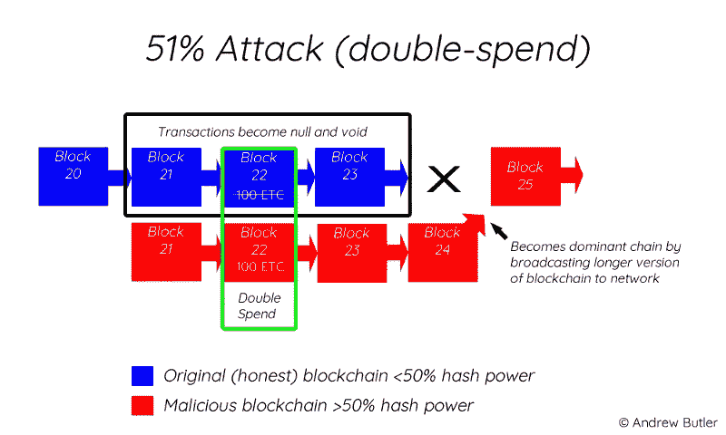

# 区块链:“安全的游戏改变者”怎么会这么不安全？

> 原文：<https://medium.com/hackernoon/blockchain-how-can-securitys-game-changer-be-so-insecure-637b27b797c5>

仅仅几年前，许多人认为区块链是个怪人，是一种时尚或泡沫。他们的对手声称，这是一种防黑客技术，将解决现代世界一直在努力解决的所有信任和安全问题。

没用多少时间就证明双方都错了。现在很明显，区块链不仅将成为所谓的新互联网的基础，而且将成为经济和银行系统以及绝大多数企业、工业和商业部门的巨大游戏规则改变者。

但是，它也有其弱点，了解这些弱点对于实现和使用这项技术以获得最大利益是至关重要的。

狂热的拥护者和非信徒都可能被区块链的复杂性所误导，它的快速发展和更新速度使其很难掌握甚至完全理解。这种非常相同的复杂性可以被认为是提供更多安全性的一个因素。

另一方面，它允许将区块链视为一套混合良好的工具和学科(如计算机软件、密码学、博弈论和分布式网络),这些工具和学科本身是脆弱的，从而在整个系统中单独形成弱点。

# **一罐虫子**

这可能是一件非常简单的事情，从互联网诞生之初就已经众所周知，就是代码中的缺陷。区块链越复杂，正确设置它就越困难，没有任何错误对黑客来说是最容易实现的。当然，这是执行的问题，而不是技术本身的问题，但这仍然很常见，因为在实时区块链上部署的许多代码行都没有经过充分的测试。

这种威胁最著名的例子可能是道案。道首先创造了历史，创下了有史以来最大规模的众筹活动纪录，筹集了 1.5 亿美元。不久之后，又一次被黑客攻击，他发现代码允许在更新帐户余额之前从同一个帐户转移令牌 40 次。没有人知道为什么黑客在决定中止他的任务之前，以这种方式用“只有”5500 万美元的加密货币充实自己，但这个故事肯定带来了一些严重的安全问题。还有一些答案。

# **代码审查、渗透测试和智能合同审计的重要性**

例如，避免这种利用的解决方案之一可能是，不仅在部署之前对智能合同代码进行严格的同行审查，而且由专业人员进行审计。专注于此的公司不久前才开始出现，但已经以防止类似上述攻击而闻名(例如，Petar Tsankov 的 ChainSecurity 使以太坊免于今年早些时候一次重大软件升级后可能发生的 DAO 式灾难)。

Blockhunters 的 Radoslav Kobus 指出了像他这样的公司提供的服务可能非常有用的两个主要原因。

**第一个**:由于源代码对公众开放，所以通常可以在区块链上看到。

> 因此，如果有漏洞，黑客比在“旧世界”更有可能找到它。

仅在 2 月 13 日和 3 月 13 日之间，区块链平台中就发现了 40 多个漏洞，这项研究是由所谓的白帽黑客进行的，即“好人”，他们为此获得的报酬远远低于他们通过使用他们的权力为邪恶“赚取”的报酬(你可以在这里了解更多信息[)。](https://thenextweb.com/hardfork/2019/03/14/blockchain-cryptocurrency-vulnerability-bug/)

[https://thenextweb.com/hardfork/2019/03/14/blockchain-cryptocurrency-vulnerability-bug/](https://thenextweb.com/hardfork/2019/03/14/blockchain-cryptocurrency-vulnerability-bug/)

**第二件事**是区块链和传统软件的另一个关键区别。在后一种情况下，你可以用补丁来修复错误，但是就智能合约代码而言，你不能。区块链上的事务无法撤消。

你只能用与之互动的附加合同来“升级”一些合同，或者使用一个在检测到黑客攻击后停止所有活动的终止开关。但是一旦钱丢了，就永远丢了，除非你回到攻击前的状态，创造一个所谓的新区块链的硬分叉。

基本上:创造另一个现实，让每个人都同意从现在开始我们将生活在新的现实中。不是那么容易管理，甚至更有争议。不过，这是继道事件之后的以太坊事件。除了网络的一部分不同意，并坚持原来的链，现在称为以太坊经典。

# **51%的攻击**

让我们继续关注以太坊经典，因为它最近成为了另一个问题的例子。这一次，问题不在于法典，而在于区块链本身的独特结构。正如迈克·奥克特在《麻省理工技术评论》的文章中所言，

> *‘a****区块链*** *是一个由计算机网络维护的加密数据库，每个计算机都存储了最新版本的副本。区块链* ***协议*** *是一组规则，规定了网络中的计算机(称为* ***节点*** *)应该如何验证新的交易并将它们添加到数据库中*

[https://hackernoon.com/ethereum-classic-attacked-how-does-the-51-attack-occur-a5f3fa5d852e](https://hackernoon.com/ethereum-classic-attacked-how-does-the-51-attack-occur-a5f3fa5d852e)

为了证明他们这样做是可信的，节点在称为挖掘的过程中使用大量的计算能力。这种工作证明协议在大多数运行加密货币交易平台的区块链使用，这使得它们容易受到著名的(主要是由于 HBO Sillicon Valley 系列)51%攻击。

执行这样的攻击意味着获得对网络的大部分采矿权力的控制，这允许黑客在向其他用户发送付款后创建上述分叉，这在新的、替代的和权威版本的区块链中从未发生。这使得他可以不止一次地消费相同的加密货币(所谓的双消费)。

区块链越小，你需要的计算能力就越少，所以整个过程更容易，也更便宜。这就是为什么通常是较小的硬币成为这种行为的牺牲品。例如，要攻击比特币，一个人必须每小时花费超过 260，000 美元来租用足够的采矿电力(根据 [Crypto51](https://www.crypto51.app/) 网站)。

以太坊经典只是前 20 种加密货币中第一种被成功攻击的。由于区块链的安全问题，仅去年一年，攻击者就取走了超过 2000 万美元中的 110 万美元。

51%的攻击据说很快会变得更加普遍和严重，部分原因是人们可以在“哈希拉特市场”租用足够的计算能力。这要求交易平台对其支持的加密货币更加挑剔。

Ajay Chandhok 在他的博客文章[中写道:“如果你的区块链利用了一个工作证明[…]共识机制，你需要有适当的安全措施来防止 51%的攻击。”他提出了一些建议:“警惕采矿池，在具有更高 hashrate 的区块链上实施合并采矿，或者切换到不同的共识机制都是可行的选择。”。](https://ledgerops.com/blog/2019/03/28/top-five-blockchain-security-issues-in-2019)

> 因此，许多新区块链正在设计他们自己的共识算法，以保护他们自己免受 51%的攻击，并实现更短的交易时间。

有许多例子表明，利益相关证明是仅次于 PoW 的最受欢迎的方法，还有无数的组合，比如委托异步利益相关证明(你可以在这里阅读[这个区块链)、烧录证明、审计证明等等。](https://blockhunters.io/blockchain-audit-dispatch-protocol/)

# **其他漏洞**

请不要忘记，许多安全威胁关注的不是区块链本身，而是它们被人类访问的端点。后者为此使用几乎不可能破解的各种密钥和密码。

这也是它们被偷的原因。几十年来，窃取方法已经广为人知，但并没有改变太多(例如恶意软件、网络钓鱼)。还有许多 Web 3.0 骗子准备掏空最容易上当的区块链用户的加密钱包。

人们可能会想到其他可能的安全威胁，例如侵入创建密钥的随机数生成器，从而削弱加密，或者甚至对特定的区块链或任何使用它的人进行创造性的拒绝服务攻击。

随着技术的发展，还会有更多未知的东西出现。事实上，它的增长本身就可能成为一个问题。正如里克·马丁在他的[博客文章](https://igniteoutsourcing.com/blockchain/blockchain-security-vulnerabilities-risks/)中写道:

> [……]随着每十亿字节的扩张，我们正在接近未知的领域。[……]行业的有限经验意味着识别和应对问题的经验有限。正如每项技术一样，从飞机到自动驾驶汽车，体验是有代价的。区块链安全失败的代价还没有高到需要对系统进行重大改变的地步[……]”。

值得记住的是，尽管存在上述所有问题，区块链仍然是有史以来发明的最安全的技术，比它将要取代的技术安全得多。

> 愿意使用这种技术并从中受益的公司、政府和机构只需确保其智能合同设计良好，并采用最新的预防性安全措施来解决正在出现的安全问题。