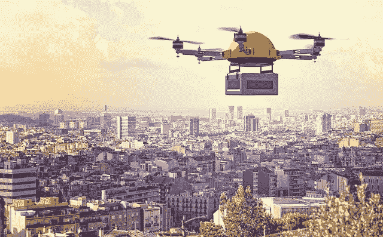

# 区块链如何改善城市生活并降低交付成本

> 原文：<https://medium.com/hackernoon/blockchain-improve-cities-reduce-cost-deliveries-ecommerce-f66c50be29e5>

## Geeba 计划利用区块链技术来提高电子商务的交付速度，减轻城市基础设施的负担。

Urban delivery is expensive due to outdated technologies and a lack of flexibility in the supply chain

区块链技术经常被吹捧为我们如何组织信息、进行经济交易甚至我们的政治结构的世界历史性转变。然而，区块链也有许多不那么引人注目的应用，没有达到根本的社会变革。这些实际应用仍然对社会公益做出积极贡献。

## “最后一英里”递送

在传统经济的许多领域，区块链技术可以在提高效率、减少浪费和缓解城市基础设施压力方面发挥巨大作用。其中之一被称为“最后一英里”递送。短语“最后一英里”指的是货物运输旅程的最后一段，包裹从配送中心或仓库运输到最终消费者的位置。

由于供应链缺乏灵活性，最后一英里配送是电子商务和货运市场的一个昂贵和资源密集型环节。这种灵活性的缺乏来自两个方面:1)少数大公司的垄断，这些公司通常依赖当地的分包商 2)使用过时的技术。这些因素的一个后果是消费者和企业的成本更高。

## 传统的运输方式正在伤害城市

然而，除了消费者和企业的成本，还有更广泛的社会影响。像汽车和卡车一样，城市货运车辆对城市环境和生活质量有着重大影响。例如，在欧洲，[传统货运占城市交通总量的 6-18%，能源使用的 9%，二氧化碳排放量的 21%](http://www.mdpi.com/1996-1073/9/2/86/pdf)*。*随着电子商务的不断普及，预计这些数字在不久的将来还会更高。巴克莱的一项研究估计，2013 年，网上订购的产品产生了超过 10 亿的交付量。到 2018 年，这一数字增长了 28.8%，达到 13.5 亿。这意味着最后一公里的交付给城市基础设施和环境带来的压力正在增加。

结果是迫切需要新的和创新的方法来实现最后一英里的交付，而不仅仅是为企业和消费者节省成本，尽管这是一个重要的因素。从经济角度来看，解决效率低下的问题将有助于以更深远的方式造福社会，例如缓解城市基础设施的压力，帮助在线购物行业以可持续的方式发展。

## 区块链如何改善最后一公里交付

我最近遇到了一家希望实现这些目标的有趣的初创公司。 [Geeba](https://bit.ly/2Ia5XJi) 是一个分散的交付生态系统，使企业能够使用自动驾驶汽车(机器人和无人机)和智能枢纽，通过区块链技术运营交付。Geeba 是总部位于多哈的自动驾驶汽车物流公司 Airlift 和 n-Gon 的合资公司，n-Gon 是一家专门从事无人机应用的公司。Airlift 提供自主地面车辆，N-gon 提供无人机进行空中运输，新成立的 Geeba 开发区块链技术，将通过在线平台连接自主车辆。

Geeba 使用区块链来增加物流操作的透明度和可预测性，并最终通过更加自动化和无误的流程来加速货物的实际流动。通过他们的系统*，无人驾驶的 c* argo 自行车(机器人)和空中的无人机将从一个智能枢纽拾取货物，然后将其送到客户家门口。

与分包商模式不同，Geeba 希望在其运营区域内创建一个由社区驱动的分散配送中心网络，这将通过一部分配送费用来激励。这些“智能中心”中的每一个都将作为交付车队(无人机和/或机器人，取决于当地的环境和地形)的本地基地，整个交换——订单、确认和验证交付——都被记录并存储在 Geeba 的区块链上。根据 Geeba 的说法，这将解决许多与城市内最后一英里交付相关的问题，并大幅削减电子商务公司的费用。

## 结论

最后一英里的递送是一个创新时机已经成熟的经济领域的例子。区块链技术提供了实现这一目标的工具。Geeba 的计划雄心勃勃，这家初创公司明智地选择了荷兰来孵化它的想法，因为荷兰政府特别鼓励初创公司进行实验。该技术和试点将在鹿特丹的剑桥创新中心开发，平台、智能枢纽和无人驾驶汽车将在 2020 年前部署到荷兰各地。

*订阅我的频道* [*Medium*](/@minadown) *和*[*Twitter*](https://twitter.com/minad21)*如果您想了解区块链和加密货币项目。

如果您对本文有任何疑问，请在下面的版块发表评论。谢谢大家！*