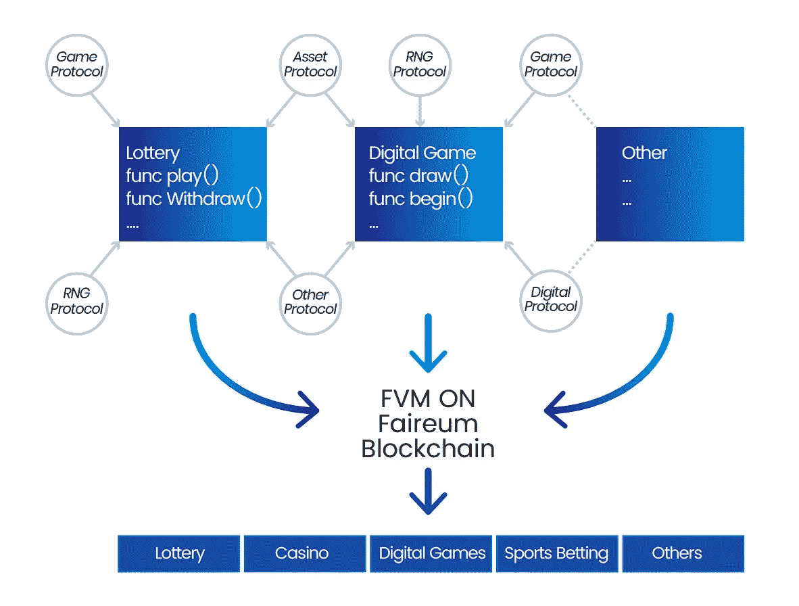
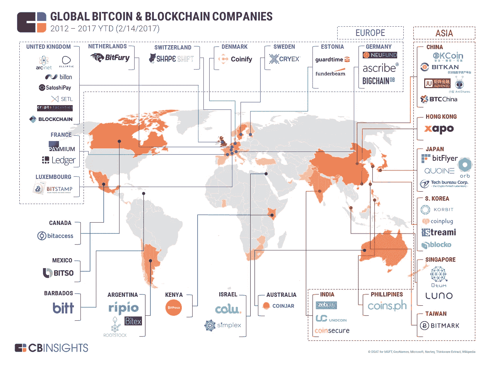

# 2019 年的区块链:趋势和未来

> 原文：<https://medium.com/hackernoon/blockchain-in-2019-trends-and-the-future-9aee88399d18>

区块链是一个只有我们当中最懒惰的人在去年和今年都没有意识到的领域。尽管事实上，这个行业比许多人意识到的要广泛得多。不仅仅是加密货币获得的收益。在这里，我将详细介绍当前相关的区块链趋势，这些趋势将在 2019 年保持影响力。

Photo by [Markus Spiske](https://unsplash.com/photos/3Tf1J8q9bBA?utm_source=unsplash&utm_medium=referral&utm_content=creditCopyText) on [Unsplash](https://unsplash.com/?utm_source=unsplash&utm_medium=referral&utm_content=creditCopyText)

# 1.诉讼

[据我们所知](https://cointelegraph.com/news/new-study-says-80-percent-of-icos-conducted-in-2017-were-scams)，有许多公司不会履行与他们自己的 ICO 项目相关的义务。因此，预计将会有一大批“受骗的投资者”试图在法庭上捍卫自己的权利。对律师来说，这将是一个相当有趣的挑战。一方面，这种现象将使法院胜诉时有可能赚到好多钱。另一方面，目前的立法在许多方面缺乏对区块链空间的管理。这些案件是否会以现有的法律先例为基础，只有时间才能证明。目前形势相当不明朗。

# 2.区块链作为一个产业的复兴

当区块链不再被那些被各种 ICO 项目欺骗的投资者口中的“恶趣味”所玷污时，将会通过能够有效监管该行业的立法。从这一刻起，我们终于有可能谈论空间的真正发展和区块链作为一个实际现实的形象的加强。一旦这种情况发生，区块链将开始一个更合理的增长趋势，投资者将感到受到保护，也更有信心。这最早将发生在 2019 年底。

# 3.安全和数据保护问题

现代世界中的网络犯罪与传统意义上的犯罪一样危险，因为人们已经习惯于这样看待它。因此，对网络安全相关项目的需求将会增加。创业公司提供真正的方法来保护加密货币免受那些有犯罪意图的人的攻击，可能会变得非常受欢迎。

# 4.区块链和赌博

解决与管理 ICO / STO 项目和计算机安全相关的问题将为博彩业的发展提供新的机遇。年复一年，在线赌场市场增长相当迅速。据分析师称，未来五年，在线赌场的总收入将从 5330 亿美元增加到 2.021 万亿美元。该行业正试图通过引入区块链来加速这种增长，这是赌博利基的理想选择，因为它允许以前使用标准方法无法达到的透明度和安全性水平。

例如， [Faireum](https://www.faireum.io) 背后的团队甚至基于比特币、以太坊和 Hyperledger 的优势开发了一个全新的独立区块链。此外，还有 Faireum 的一致性算法，该算法采用了基于拜占庭容错的委托利害关系证明(BFT-DPos)。该团队表示，正如 Faireum 的榜样所证明的那样，攻击共识实际上是不切实际和不可能的。

[Source](https://www.faireum.io/assets/files/Faireum_whitepaper2.0_En.pdf)

# 5.简化和加速

据推测，将会出现更多的区块链服务，所有这些服务都具有简化的操作机制。这将增加没有专业知识的人对它们的可访问性。至于加速，应该有更多的架构解决方案出现，这将允许改善区块链的带宽能力。用户事务将被更快地执行。

# 6.民族国家在区块链领域的竞争

各个国家和司法管辖区[将相互竞争](https://www.forbes.com/sites/startupnationcentral/2018/03/20/who-will-be-the-worlds-first-crypto-nation/#72102ae67e3d)来为区块链相关项目吸引最优秀的人才。但是，肯定不是所有人都会这么做。一些政府最初对区块链持谨慎态度，并出台了信息政策，敦促其公民避开这种技术。

# 7.物联网对区块链空间的影响

在某些领域，物联网趋势和区块链正在融合。关于这种整合的未来，有几种不同的预测。据一些研究人员称，到 2019 年，区块链技术在物联网中的渗透率将达到 5%。其他分析师看到了更多的整合前景，并认为这一数字可能达到 20%的水平。抛开百分比的争议不谈，趋势本身已经变得相当明显。也有预测称，除了物联网，区块链还将用于自动化保险领域。

# 8.各大银行对加密货币态度的转变

去年，一些大型银行表达了反对与客户购买加密货币相关的信用卡交易的激进观点。一些分析师认为，在不久的将来，银行机构将会看到区块链的潜力，并在这方面变得更加忠诚。然而，只有时间才能证明这些预言是否会实现。从许多方面来看，一切都取决于从立法的角度来看，区块链是否会受到更有效的监管。

# 9.向全面生产过渡

直到最近，区块链一直主要与实验项目有关。其中只有一些已经发展到全面生产的水平。在不久的将来，这种情况可能会有所改变。然而，在未来，区块链将帮助有效的决策，考虑到给定项目的盈利能力。

# 10.在新行业中使用区块链

许多人都说，区块链将为众多行业的发展做出贡献。其中，最重要的将是保险和金融。也许这项技术将会涉及到货物运输的组织，以及国际货币的支付。

就保险而言，专家表示，区块链将允许改善对索赔管理相关问题的监管。将有可能减少欺诈。区块链在教育、交通、医疗甚至政府中的应用也在预测之中。

# 11.进入亚洲和中东市场

区块链技术在中东和亚洲的流行是一个明显的趋势。当地消费者对这项技术表现出相当大的兴趣。顺便说一下，上面提到了各大银行目前对这项技术的态度是多么谨慎。也有一些例外。即日本和韩国的银行机构。他们正在试验性地使用区块链，它已经帮助实现了一些成本节约。

# 总而言之…

尽管存在疑虑，但区块链空间正在发展，许多公司看到了其实施的前景。概括目前的趋势，它们是:

●在一波欺诈性项目之后，将行业加强到更高的水平。与技术有关的人的意识更强。

●对网络安全相关项目的需求增加。开发量子区块链项目，如果开发量子计算机，该项目将得到高度支持。

●现代区块链服务的简化和加速。

●民族国家在区块链空间竞争的可能性。与此同时，将会有一些国家对这项技术保持敌意。

●从试点项目过渡到全面生产。

●区块链已经进入亚洲和中东市场。在不久的将来，我们将有可能看到这些预期趋势中哪些仍是假设，哪些将在实践中得到真正的发展。