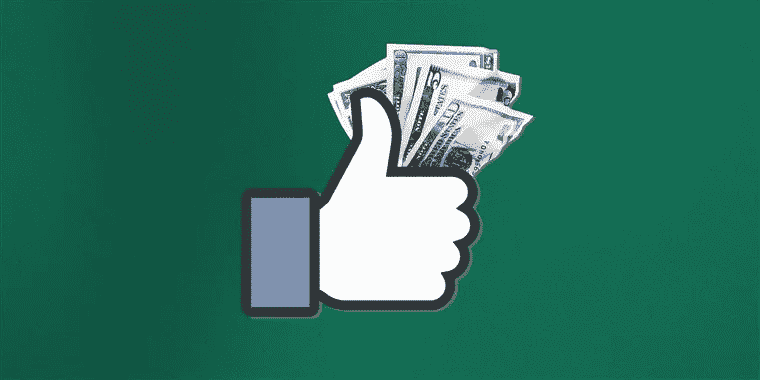
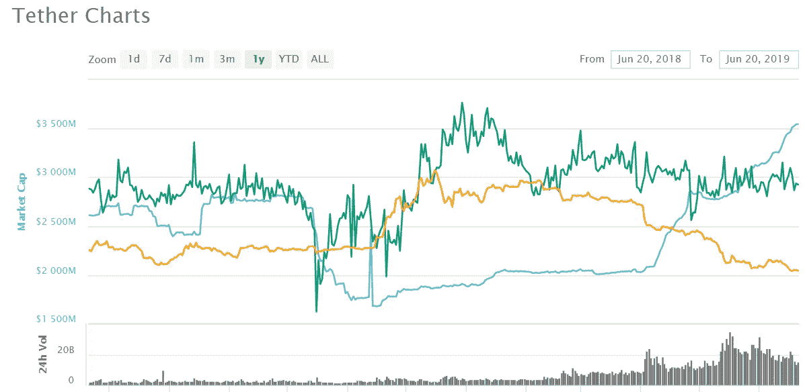

# 2019 年区块链行业回顾

> 原文：<https://medium.com/hackernoon/blockchain-industry-review-for-2019-h1-facebooks-cryptocurrency-libra-binance-abandons-the-us-224fb040b453>

# 脸书加密货币 Libra，币安放弃美国，IEO 超越 ICO

在区块链和数字资产的世界里，今年上半年充斥着大量的发展、令人兴奋的消息、丑闻和疯狂的价格预测。随着 6 月底的临近，回顾今年以来，我们相信 2019 年的前 6 个月将因行业中出现的三个突出趋势而被铭记:

*   ***加密资产价格的回升，尤其是比特币。***
*   ***全球最大的企业透露计划支持区块链应用或开发自己的数字资产。***
*   ***首次公开募股(IEOs)作为一种初创企业融资模式的戏剧性出现。***

公开可用的证据表明，这些趋势不是孤立的，而是具有强化效应和相互关联。从上到下看，长达 12-14 个月的熊市(取决于你如何计算)的结论引起了人们的兴趣，并给生态系统带来了一些信心，因为新进入者和新初创企业去年重新安排、推迟或延长了他们的 ICO 筹资活动。

炒作开始回归的形式有所改变，尽管新的向上运动引入了一种现象，也称为首次公开募股或简称 IEO。通常，ieo 是通过加密货币发射台进行的筹款活动，如 [**【币安】**](https://launchpad.binance.com/)**[**【火币】**](https://www.hbg.com/en-us/exchange/)**[**ex markets**](https://exmarkets.com/launchpad)等，这些发射台作为零售用户的额外安全层，有助于防止网络钓鱼企图和诈骗退出。****

****IEO 相对于 ICO 的优势已经在多个场合讨论过，甚至我自己也讨论过，不再赘述。****

******新生的加密初创企业和散户投资者基本上有两条路可以选择:**
——要么试图挤进像币安或 OKEx 这样拥有最大行业参与者的“大型”ieo，这些 ieo 需要巨额预付款，对他们合作的项目非常挑剔，但代表着少数选定的即时社区；
-或与快速增长的 IEO 发射台合作，如 ExMarkets，该发射台以合理的成本托管筛选出的具有高上升潜力的项目，并为其现有用户群和市场新来者提供机会，在初始阶段访问各种经过审核的项目，并有机会在这些项目在未来增长时获得财务收益。****

********

****然而，这些新的发射台必须首先建立自己来赢得用户的信任。这种需求推动其背后的公司获得监管并获得运营牌照，反过来，使整个市场成为一个更加透明和可信的环境。没有人希望又是一年像 2018 年这样的黑客攻击。****

****增长的另一个迹象是，主要的全球技术和通信公司正在将区块链技术集成到他们自己的框架中。最初，[三星宣布计划在他们即将推出的手机中支持](https://www.coindesk.com/samsung-unveils-cryptocurrency-wallet-dapps-for-galaxy-s10-phone)加密钱包，随后是[苹果和即将引入 iOS 的“加密工具包”](https://www.theblockcrypto.com/tiny/apple-set-to-introduce-cryptokit-in-ios-13/)。但毫无疑问，最大的炸弹来自脸书的 Libra 加密货币 Calibra 数字钱包。****

********

****关于世界上最大的社交网络 stablecoin 的新闻只能被归类为盛大。据说脸书的网络中有超过 20 亿用户，Libra 可能会成为很多人的真正推动者，尤其是那些被认为没有银行账户的人。****

****一些大型支持者已经宣布，他们的名字包括 Paypal，Visa，Mastercard 和许多其他知名品牌将帮助传播脸书的数字货币。但我们应该称之为数字货币，而不是加密货币。从目前的形状来看，它将只是一个由私人公司发行的代币，与比特币或其他分散货币毫无相似之处。****

****此外，鉴于他们最近在剑桥分析和数据隐私方面的问题，西方社会如何看待脸书的新努力仍然是一个问题。就我个人而言，我会三思而后行，我将与谁互动发送和接收天秤座，但它可能会证明是一个非常有用的方式发送/接收日常业务的小额付款。最终，对于大多数人来说，在琐碎的小额支付方面，可用性胜过了隐私。****

****一些专家声称，Libra 可能是有争议的 Tether 的巨大竞争对手，可能会夺走其大部分市值[目前的 35 亿美元](https://coinmarketcap.com/currencies/tether/)。在这一点上它只是猜测。****

********

****我确信天秤座会得到很多关注，这将波及到区块链和密码行业，这是一件好事。然而，如果你重视你的隐私，并且相信货币去中心化是一个更大社会的特征，比特币和其他无许可的交换手段仍然是比天秤座更好的赌注。****

*****特别感谢* [*迪伦·夏基*](https://www.linkedin.com/in/dylansharkey/) *，他帮助我共同撰写了这篇文章，提供了对行业的见解，总体来说，他是一个可以集思广益的杰出人物。恭喜你，迪伦。*****

*****喜欢我们的工作？在 LinkedIn 上与我们联系，让我们看看如何互相帮助。*****

****[**迪伦的领英**](https://www.linkedin.com/in/dylansharkey/) **|** [**我的领英**](https://www.linkedin.com/in/gytis-trilikauskis-b0120883/) **|******