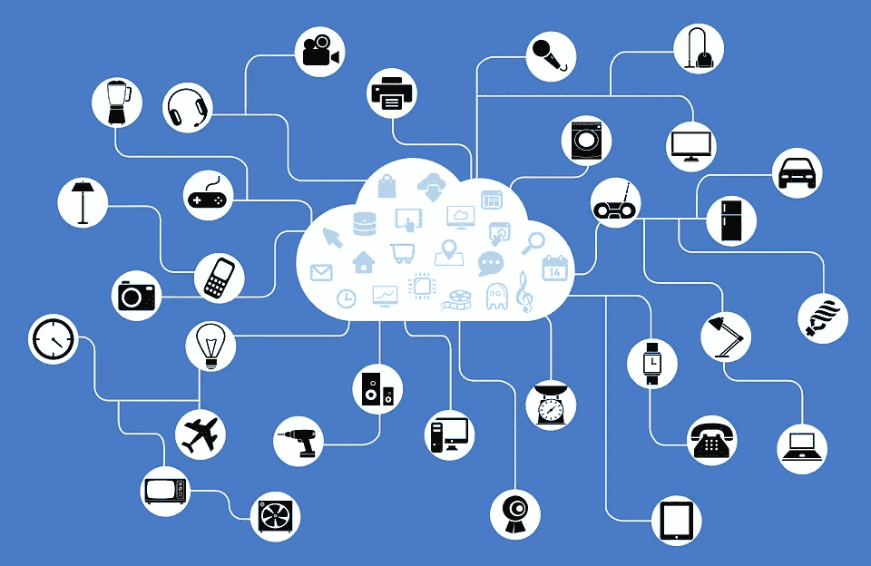
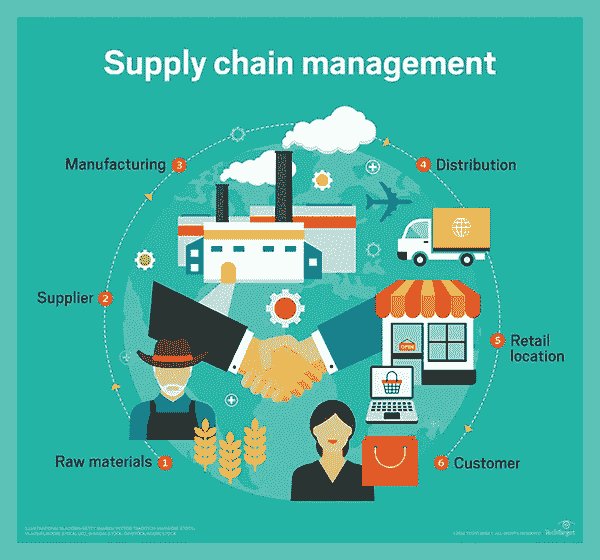
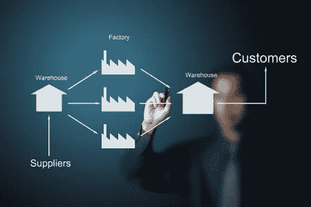
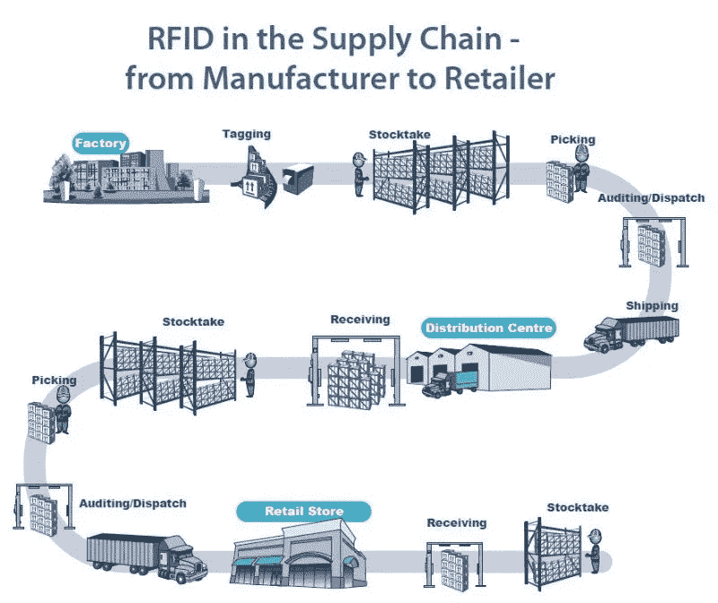

# 供应链的区块链+物联网

> 原文：<https://medium.com/hackernoon/blockchain-iot-for-supply-chain-1b07d4afd614>

随着时间的推移，供应链管理(SCM)正变得混乱不堪，因为目前使用的技术已经过时了。

仍然有大量的手工工作需要花费大量的时间和金钱。例如，目前端到端的支付需要几天时间。在某种程度上，这种手工工作在本质上是无用的，因为不同的利益相关者之间几乎没有任何信任。

每个利益相关者都以集中的方式管理他们自己的账本，这使得事情比他们应该的更加模糊。所涉及的合同信息必须通过律师或银行家等第三方的参与来管理。因此，管理供应链显然是一件令人头疼的事情。尤其是当世界越来越走向全球化的时候。

Source: [https://www.ecommerce-nation.com/future-iot-devices-ecommerce/](https://www.ecommerce-nation.com/future-iot-devices-ecommerce/)

“[区块链](https://hackernoon.com/tagged/blockchain)和‘物联网’的组合目前正在颠覆很多行业。这种结合变得如此强大。区块链使交易记录防篡改，物联网通过设备、传感器等手段在物理世界和数字世界之间建立联系。

这种结合将通过主要消除中央第三方实体和加强直接 P2P 连接来有效地减少 SCM 中的摩擦。简单的交易目前通过冗长的程序完成，这些可以通过智能合同实现自动化。例如，**如果**一个条件被满足**，那么**仅支付被释放。智能合同的概念不仅可以扩展到金钱，还可以扩展到其他方面，如温度控制或位置可追溯性。这种智能合约是自动执行的，有助于提高 SCM 的效率。合同是公开记录的，不能被篡改，这说明了区块链的可靠性。

Source: [http://searcherp.techtarget.com/definition/supply-chain-management-SCM](http://searcherp.techtarget.com/definition/supply-chain-management-SCM)

考虑这个简单的故事，一批冰淇淋被记录在区块链上。货物中的这个集装箱支持物联网。这批货必须从码头运到冰淇淋店。支持物联网的容器在本地记录并持续传输关于容器当前位置和温度的消息到运行区块链即服务的云端。假设智能合同中只有一条规则:“如果容器的温度上升到-2 摄氏度以上，那么冰淇淋店将不接受该容器”。如果违反了这一规定，供应商将承担责任。假设每 30 秒记录一次容器的温度。这些数据存储在所有人都能看到的区块链上。在这个分类账上，可以跟踪冰淇淋的时间历史，这保证了项目的出处。

Source: [http://www.jacquesraud-consulting.com/fr/plm-et-supply-chain-pour-une-industrie-textile-plus-efficiente/](http://www.jacquesraud-consulting.com/fr/plm-et-supply-chain-pour-une-industrie-textile-plus-efficiente/)

物联网区块链也有能力打击食品欺诈问题。在这种情况下，顾客的健康安全受到威胁。因此，企业对供应链管理更加谨慎。即使是一个小小的错误也会给公司的声誉带来数百万美元的损失。如果最终客户能够检查资产的可追溯性，并且在区块链上一切都是透明和清晰的，那么客户就会感到高兴和满意。这一切都要感谢区块链，它的平台像这些平台一样，通过消除中间商的集中基础设施来建立对系统的信任。

Source: [https://www.impactbnd.com/blog/the-importance-of-keeping-your-customers-happy](https://www.impactbnd.com/blog/the-importance-of-keeping-your-customers-happy)

## 物联网和区块链在供应链中的应用

1.  食品可追溯性:如果我告诉你，你可以检查你的肉到底来自哪里？如果顾客能够洞察到他/她所消费的产品的来源，那肯定会大大提升顾客体验。人们可以简单地扫描条形码，获得产品的整个历史。这是一个打击食品欺诈的好方法。

 [## 假冒加工食品正在成为非洲城市生活中的一种流行病

### 二月下旬，14 岁的 Nahima 和 Yayaya 在一个同学的生日会上吃了受污染的饼干后死亡…

qz.com](https://qz.com/1226112/fake-food-or-fraud-food-in-nigeria-kenya-and-other-african-countries/)  [## 每个产品都有一个故事|出处

### 我们帮助大企业建立对其商品和供应链的信任。来源驱动的数据帮助购物者…

www.provenance.org](https://www.provenance.org/) 

2.RFID 驱动的合同:这是伟大的，使物流更有效率。集装箱的 RFID 标签存储位置、日期、时间等信息。这些数据被发送到云端进行进一步分析。智能联系人也可以对该数据进行操作。

Source: [https://steemkr.com/cryptocurrency/@yuz/what-is-waltonchain-wtc](https://steemkr.com/cryptocurrency/@yuz/what-is-waltonchain-wtc)

这些应用可以扩展到冷供应链监控或汽车零部件供应链监控。同样，这种想法也可以用在成百上千的地方。

区块链和物联网可以改变供应链。这种转变不会在一夜之间发生。这将是一场漫长的演出。公司可能会在引入阶段对供应链的一小部分进行区块链和物联网试验，然后根据经验进行扩展。智能合同有助于消除目前因人工处理文书工作而造成的代价高昂的延迟和浪费。这为更智能的供应链打开了大门。