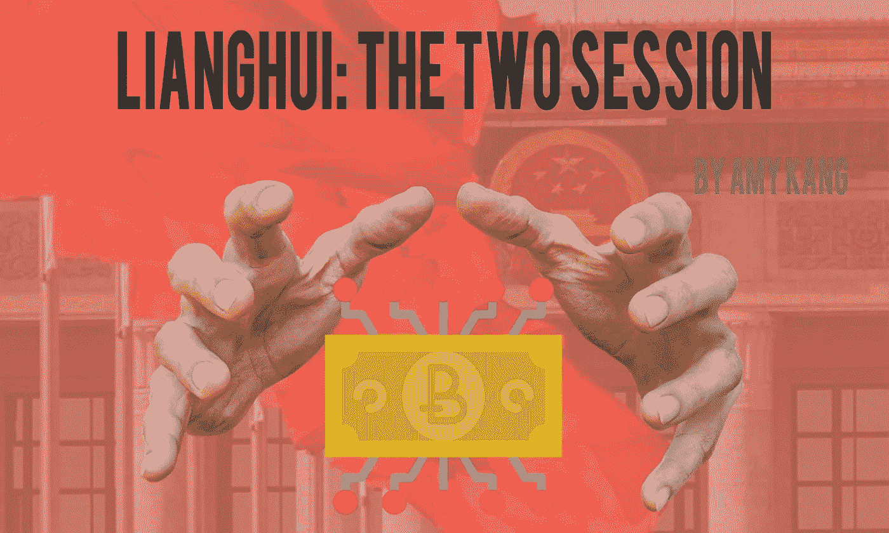
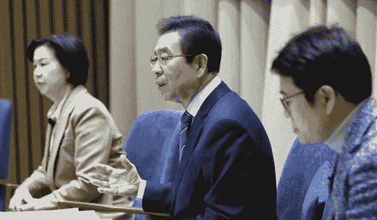
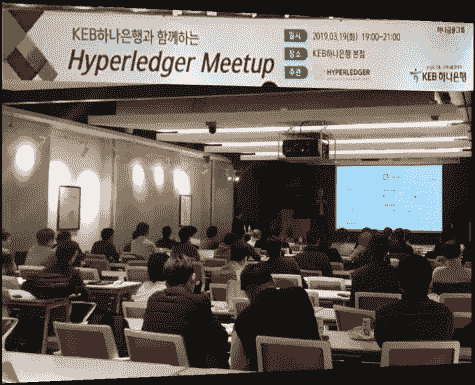
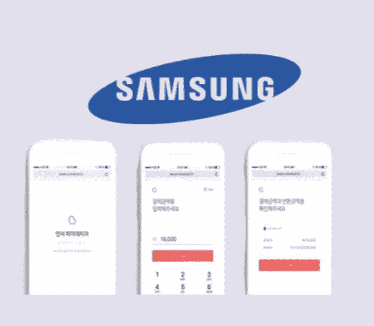
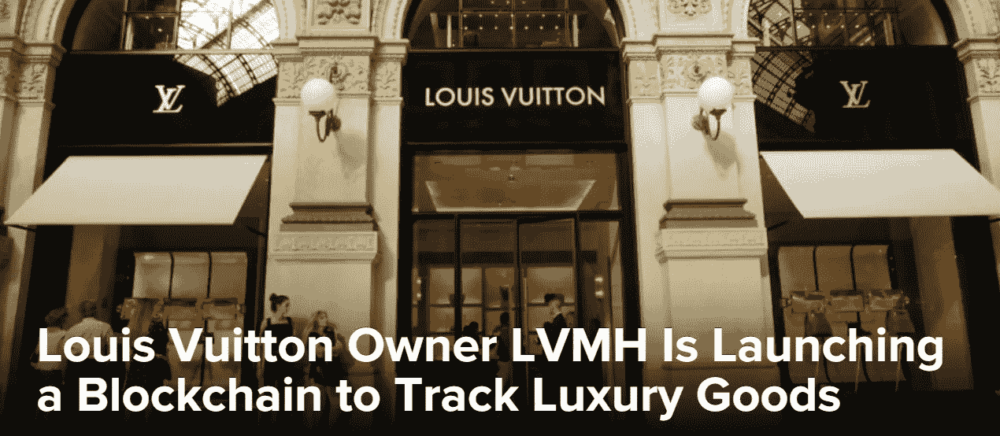

# Blockchain is not put to “Rest”, Heading to the Mass Adoption

> 原文：<https://medium.com/hackernoon/blockchain-is-not-put-to-rest-heading-to-the-mass-adoption-92c6536becf7>

**In the spring of 2019, the whole blockchain and crypto industry is emerging again.**

Various Projects, Financial Institutions, corporates, and governments have started to stretch themselves to hop on to the next level in 2019 and broke the ice of long term bear market behind.

Especially, governments, such as Korea and China, who were very skeptical and had a conservative attitude towards blockchain and crypto industries, are likewise pushing back “blockchain card”.

**Firstly, The one who has been getting magnificent attention from the world, China.**

On March 15, the largest political festival of China was held in the capital city of China, Beijing, where there have been in-depth conversations on the most innovative technology, blockchain and [A total of 34 agendas related to blockchain has been submitted during the Lianghui, the number of agendas increased by about 62% trumping the previous Lianghui period when all of the cryptocurrencies’ price has been pumped up.](https://www.redpulse.com/research/20190322/china-all-hands-on-blockchain-again--2f1819cc82)

[https://medium.com/sincerelyblockchain/china-all-hands-on-blockchain-again-439419b6886c](/sincerelyblockchain/china-all-hands-on-blockchain-again-439419b6886c)

[Last year on April, Xi Jinping officially announced that Chinese Hawaii, Hainan will be next biggest free trade zone (free trade zone + free trade port) of China, And this new government project will be actively supported by the central government and will be a crucial step for the development of China that meets the characteristics of China.](https://brunch.co.kr/@sincerelyamy/8)

Hainan Free Trade Zone will mainly be built upon blockchain, IoT, and big data so that local government has encouraged many blockchain enterprises, Huobi, Baidu, and Ant Financial etc to open their offices and branches in Hainan. Now, they are getting solid and promising from local and central governments and expanding at a rapid pace.

**Second, A country that can not be missed when discussing the blockchain and the crypto in the world, Korea.**

On March 15, Korea, Seoul City Mayor Park Won-soon announced that Seoul City will make its way to the forefront of ‘Smart City’ based on Big Data, ICT technology, and blockchain.

[https://medium.com/sincerelyblockchain/china-all-hands-on-blockchain-again-439419b6886c](/sincerelyblockchain/china-all-hands-on-blockchain-again-439419b6886c)

Seoul city has been providing some various services such as “Owl buses” which have been running for 24/7 for the citizens’ safety and public wi-fi so far. Now the city government is trying to integrate new innovative engines such as the IoT and blockchain to provide new other services like DID(Digital Identity) and etc.

This great example of this city scheme is the digital parking system. More than 50,000 ‘IoT (Sensor Internet) Sensors’ are installed in Seoul city, and IoT sensors detect the presence of parking vehicles in real time so that citizens can check parking spaces with smartphone apps.

韩国最大的银行之一 KB 金融集团最近在区块链举办了一次研讨会，再次表明了它的兴趣。

[https://medium.com/sincerelyblockchain/china-all-hands-on-blockchain-again-439419b6886c](/sincerelyblockchain/china-all-hands-on-blockchain-again-439419b6886c)

参加此次研讨会的另一家主要银行，韩国外换银行(KEB Hana Bank)也申请了总共 47 项区块链技术专利，这些专利已经过内部审查，正在商业化过程中。

他们将不断介绍韩国外换银行韩亚银行的各种真实区块链用例，并加入一个财团，实时识别最新的技术趋势，并与全球金融公司一起发现新的商机。

众所周知，韩国也被称为“三星共和国”。三星是影响韩国整个产业的主要因素。那么，现在的三星怎么样？

[三星最近宣布推出 Galaxy S10，同时也正式宣布他们将与 CryptoWallet Dapp 建立战略合作伙伴关系，名为 Coin Duck。](https://www.redpulse.com/research/20190314/blockchain-wallets-for-mobile-samsungs-coinduck-and-kakaos-bitberry--7c2ff8186d)

[https://medium.com/sincerelyblockchain/](https://medium.com/sincerelyblockchain/)

韩国的智能手机拥有量很大，89%的韩国人都在使用智能手机。

在韩国，三星的智能手机市场份额超过 50%，如果三星用户在其产品中使用像 CoinDock 这样的加密钱包应用程序，它对加密和区块链领域的影响和作用将是巨大的。

**下一个也是最后一个赛跑者将是美国，它也在各方面引领着全球社会。**

3 月 26 日，据 CoinTelegraph 报道，市场研究数据平台“Research and Market”近日公布了《美国区块链商业机会和预测数据丛书(2016–2025)》，该书对美国区块链 pf 的现状进行了分析和预测。

[https://www.researchandmarkets.com/research/fs2pbr/blockchain_in_the?w=12](https://www.researchandmarkets.com/research/fs2pbr/blockchain_in_the?w=12)

这是一份数据驱动的分析报告，由 185 个图表和 150 个表格组成，提供了对市场动态的详细了解。[该报告涵盖了区块链应用、区块链类型和技术领域的国家级市场规模/支出预测(2016–2025)](https://www.researchandmarkets.com/research/fs2pbr/blockchain_in_the?w=12)。该报告坚持认为，美国 11 个行业中超过 75 个领域，如银行、金融、保险、医疗和制药、零售、汽车、航空航天、建筑、公共部门、专业服务，正在积极整合区块链技术，流向该领域的资本比去年增加了 110%，达到 16.512 亿美元。

最知名的奢侈品牌路易威登(Louis Vuitton)将美国定为关键市场，也开始在区块链发力。

[https://www.coindesk.com/louis-vuitton-owner-lvmh-is-launching-a-blockchain-to-track-luxury-goods](https://www.coindesk.com/louis-vuitton-owner-lvmh-is-launching-a-blockchain-to-track-luxury-goods)

据 coin desk 3 月 26 日报道，LVMH 集团宣布，他们将在其供应链中引入一个基于区块链的跟踪系统。代号为 AURA 的加密出处平台预计将于 5 月或 6 月与路易威登和另一个 LVMH 品牌克里斯汀迪奥(Parfums Christian Dior)一起上线。

这样，他们可以很容易地防止他们的仿制产品在世界各地流通。

区块链和密码行业的知名 kol 提到，长期熊市正在过去，我们已经很好地忍受了它。

剩下要做的是打破许多机构、政府和监管者的界限，这样不仅是个人，全世界的企业都将实现“大规模采用”，这是我们一直希望的。