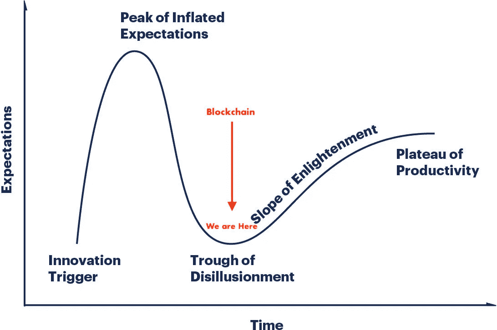

# 区块链没用。不是。

> 原文：<https://medium.com/hackernoon/blockchain-is-useless-not-516ac84094a7>

我想在传言的八月牛市到来之前花点时间，谈谈这个行业目前正在应对的这波毒性。

***“区块链只是一个缓慢的数据库”——比特币最大化者***

是的，2017/18 的 ICO 浪潮很大程度上令人失望。大约筹集了 68 亿美元，但收效甚微。在许多人眼里，区块链科技是一大败笔，许多项目根本就没有成功。

这是否意味着他们是对的？这是否意味着这项技术不适用于任何东西？**我不这么认为。**

The Gartner hype cycle for emerging technologies. The blockchain is in the trough of disillusionment.

伙计们，请允许我提醒你们，新技术总是慢得要命，因为它是全新的。今天，区块链最适合那些离不开去中心化的应用——加密货币就是一个主要的例子。这些是这项技术的早期采用者。但这种情况不会永远存在。

**区块链是消费科技。不仅仅是针对企业。不仅仅是加密货币。这是给所有人的。**

# 区块链为什么伟大

不管人们怎么说，构建任何类型的去中心化应用都有好处。

看看今天的终极去中心化 app:比特币本身。它本质上是一个金钱应用——一个巨大的区块链上的一个用例应用。当你看到比特币时，这种形式的软件的优势是显而易见的，但一旦生态系统足够成熟，dApps 也可以享受同样的优势:

**数据所有权:**在传统系统中，用户数据由服务存储和拥有。例如，脸书，谷歌，苹果。区块链正在改变这一点。虽然数据存储在分散的云上，因此可以从任何地方访问，但数据的唯一所有者是持有私钥的人，这将等式转向自我保管和自我拥有，这对消费者来说非常好，因为没有人可以在未经他们允许的情况下操纵或出售他们的数据。这为人们自我管理和货币化自己的数据提供了机会，并开启了未来民主化数据经济的大门

**安全性:**区块链本质上是安全的，因为一旦数据被写入，就无法更改。没有办法欺骗协议或入侵系统。如果你拥有 10 个比特币，除非你的私钥被盗，否则没人能黑掉区块链并改变这个数字。

**冗余:**区块链网络遍布全球，按照设计是 24/7 在线。他们必须这样，否则，他们不会工作，并会招致数十亿美元的损失。您将在分散的云上运行的任何应用程序都将是健壮的，并且不会受到本地化数据中心断电的影响。

抵制审查:分散式网络是用户不可知的。一个公司或政府不能决定谁可以或不可以使用这些网络。如果你在一个分散的网络上部署一个应用程序，它不可能被大玩家关闭。

一旦它变得便宜(甚至可能比传统云更便宜)，我们将会看到许多开发人员选择利用这些优势。

**记住我的话，我们迟早会在区块链和其他 DLT 上运行大量应用。**