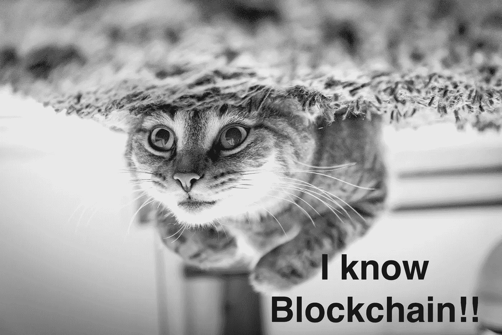

# 区块链，全是替代品！

> 原文：<https://medium.com/hackernoon/blockchain-its-all-about-alternatives-5ef3ee980659>

## 替代方案使伯纳斯-李的网，而不是 GAFAM 的网。

There is always an other door to open! — On [pexels](https://www.pexels.com/photo/choices-decision-doors-doorway-277615/)

当我发现区块链时，就像这个词的任何新手一样，我迷失在定义中，幸运的是没有到我看如何购买一个的地步，但这很难。

一个全新的概念，不那么容易吸收。我设法理解了这是一个分布式的分类账，在这里我们可以有效地以一种可验证和永久的方式记录几乎所有事情的历史。它是比特币加密货币背后的技术。我还看到了一个无处不在的词:“权力下放”，这似乎是区块链所拥护的。但这就是全部，在一段时间内，这就是我所有的“区块链”，尽管我有自己的感受。我当时想:

on [pexels](https://www.pexels.com/photo/close-up-of-cat-248280/)

文章一直将它描述为一项革命性的技术，但是，坦率地说，我对此有一点小问题。我看不到它。我看不出一堆密码术和——在我看来，像发明那样的链表——有多大的力量来改变 IT 行业。直到有一天我发现了这个，自由主义者，比特币相关创业公司的早期投资者 Roger Ver 在谈论这种加密货币(独立于对他的不同看法)。

超过 50 万儿童死亡，这位政治官员说这是值得的。多恶心啊。

这里最吸引我的是罗杰的自信。他似乎对比特币的功能非常有信心。他确信比特币有能力做一些甚至政府和国际协会都无法做到的事情。老实说，这是惊人的！所以我研究和阅读，直到我开始理解为什么比特币在一开始名声不好，即使区块链得到了大力宣传。我也明白，这种情况的根源可能是某些部分认为这是一种威胁——对他们来说。

# 需要有所改变

这个视频让我想到，如果有人愿意带来改变，与大公司和他们的政治斗争，他们需要什么？我认为他们需要勇气和一个好的工具——一个向全世界传播思想并接触到其他有相同想法的人的工具。这个工具是存在的，它非常适合这样一个目标。它是互联网，更准确地说是万维网。

不幸的是，就目前的状态来看，网络还没有准备好完成这个使命。当前的结构、协议和工具无法对抗所有的审查和少数公司控制的大部分。中央政府可以在他们想要的任何时候篡改他们想要的任何东西，当然他们已经准备好对抗任何企图，因为这将减少他们的影响，从而削弱他们的帝国。

# 当前的网络是如何工作的？

谈到当前的 web，让我们评估一下它的当前状态，并尝试突出主要问题。

在服务器-客户端方法中，服务器是系统的中心，每当客户端在网上冲浪时，整个过程都在运行:

*   **DNS:** 使用 DNS 服务解析网站的 URL。我们知道，我们有 13 个根域名服务器充当在线访问的主干。它们由世界各地的一些组织维护。这里的第一个问题是，DNS 由特定的机构控制，它可以用来跟踪用户的行为或审查内容。
*   **HTTP 服务器:**一旦知道了资源的位置，web 服务器就会处理请求。你猜到了吗？确切地说，服务器是一个单点故障。如果它关闭了，所有东西都会挂起。即使使用最先进的技术来尝试和补救，我们仍然会看到这个问题。最近的一个例子是 2018 年 6 月 27 日的 slack。
*   **不可审计后端:**客户端接收网页。浏览器与后端通信，后端代表任何 web 应用程序的业务逻辑。这里的问题是，这部分是不可审计的，完全不受用户的控制。我们无法检查幕后发生的事情。即使代码是开源的，也很难保证执行的是同一个版本。
*   **数据存储:**最后，数据需要存储在某个地方。因此，我们使用由一些提供商托管的传统数据库，这意味着，用户既不能控制它，也不能防止第三方访问它或非法使用它。这是一件大事…

所有这些都意味着当前版本的网络不适合利用任何大的变化。因此，我们需要彻底地替换它，而不是试图添加一些错误修复和增强建议；取代协议、架构…所有会阻碍(让我称之为)“革命”的东西。当然，试图一下子改变这一切是不合理的。我们需要分而治之。每个组件都可以被视为一个独立的问题，这样我们就可以一次只关注一个。

# 区块链如何介入？

让我们感谢 Satoshi 发表了比特币白皮书，因为这改变了一切。

区块链带来了新的概念和方法，允许以不同的方式处理常见问题，首先是财务问题，但它被扩展到更普遍的用例。它的构思方式使它具有革命性。而这一次，我对这个词没有任何意见。事实上，它的力量在于它的原则。区块链是一个点对点的网络。因此，没有一个参与者能控制它。它是分散的，没有任何一个权力机构可以关闭它。由于它的分布式机制，它没有任何黑客或欺诈。

问题是:如果没有中央权威，如何作出决定？

在网络中，所有成员都有参与决策的权利，并通过协商一致，选择正确的方向。当然，用户会被激励使用不同的机制来保持系统的完整性。经济激励是最常用的。例如，随着比特币和以太坊区块链，加密货币被用来鼓励网络成员，至于学习成绩，以敦促学生努力学习。由于人类追求利润的倾向，所有这些都是可能的。另一个极其重要的激励因素是安全性。区块链通过先进的加密技术为用户提供了高度的安全性和真实性。

有了这些特点，区块链没有单点故障，它允许我们重新分散原本不应该集中的权力。它取消了中央权威，并且抵制审查。它将控制权交还给用户，而不是服务提供商。

# 区块链提供的替代方案

有了所有这些优势，如果我们不利用它们为用户创造替代方案，那将是毫无意义和纯理论的。我们不就是干这个的吗？这是自由软件社区成员的核心使命。这是为了将用户从现有的约束中解放出来，给他们控制权并为他们提供选项，以便他们可以做出自己的选择。

回到 web，我们前面解释的工作流中的每一步都需要替换或至少修改，而大部分工作已经完成了。这就是为什么这个社区很特别。DNS、存储、浏览器……所有这些已经存在或正在开发的分散版本，可能不会像集中解决方案那样成熟，但它们会成熟的。

*   [**以太坊名称服务(ENS)**](https://ens.domains/) 提供了一种安全的&分散方式，使用人类可读的名称来寻址区块链内外的资源，这就是 DNS 所做的。 [**Namecoin**](https://namecoin.org/) 是一项尝试做同样事情的实验性技术。 [**IOV**](https://www.iov.one/) 也在研究类似的方法，他们正在开发**区块链名称服务**。ENS 可能是目前最先进的。
*   [**【IPFS(星际文件系统)**](https://ipfs.io/) 是一个极具野心的牛逼项目。这是一个对等超媒体协议，旨在取代 HTTP。网页不会因为服务器故障而消失，因为它们分布在多个节点上。
*   **【以太坊】区块链可以作为应用程序的一种可审计后端(或部分后端)。智能契约可以以透明和可验证的方式实现不同用例所需的逻辑。**
*   **iExec 正在为云资源(数据集、计算资源、应用程序……)创建一个位于区块链的分散市场。用户能够以一种不可信的方式安全地控制他们的数字资产并从中获利。**
*   **[**meta mask**](https://metamask.io/)**:**是一个“将以太坊带入你的浏览器”(Chrome、Brave 和 Firefox)的插件，这样你就可以运行以太坊 DApps，而无需运行一个完整的以太坊节点。**

**这些组件可以组装在一起，创建下一代网络。其中一些还不成熟，性能不如集中式解决方案，但是由于社区的贡献，他们正在朝着这个目标前进。**

# **这种改变不会很容易，也不会一蹴而就**

**区块链不仅仅是一项技术，它是一种重新设计我们对 it 行业看法的方式。它改变了我们处理问题的方式。它有助于将网络转变成一个更加透明和尊重隐私的环境。这不会是瞬间的，需要一段时间。这完全取决于我们和我们对它的反应。毫无疑问，走出舒适区并不容易，但这是必须的。这是实现目标改变的代价。但是作为技术社区成员，我们的角色是减少最终用户眼中的差异，从而使迁移更加顺利。**