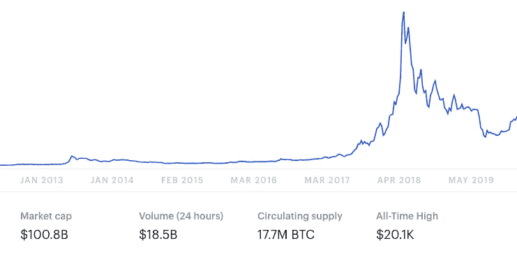
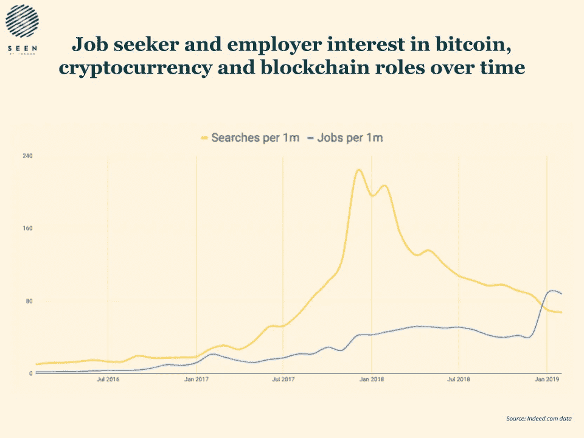
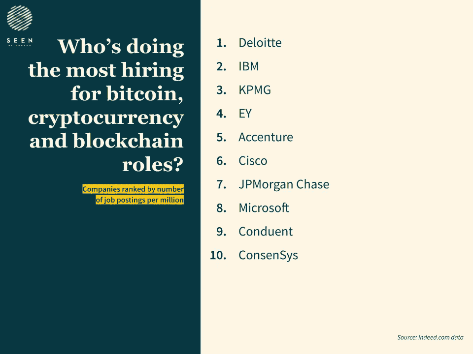
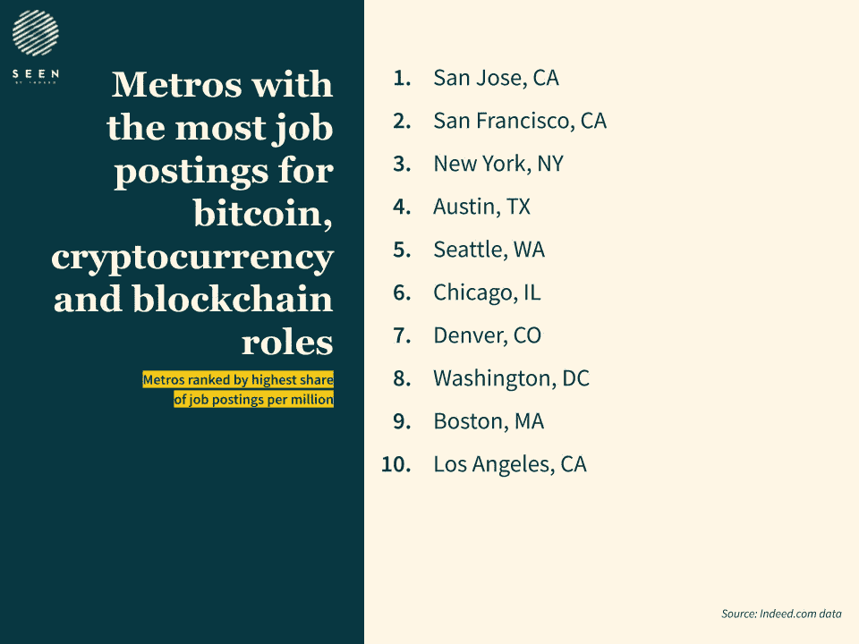

# 加密和区块链工作:2019 年的供需

> 原文：<https://medium.com/hackernoon/blockchain-jobs-supply-and-demand-dde19b9b4240>

根据各种记者和分析师的说法，比特币已经死了——而且它已经死了 350 多次。(在这个列表中，你还会发现区块链和克罗密的一些讣告。)自 2010 年以来，这些文章每年都会出现，或许分析师们有点不正常。虽然关于加密货币的优点以及区块链是否只是一些行业的时尚的辩论仍在继续，但我们看了看 US Indeed 的数据，以了解科技人才是否仍对该领域感兴趣——以及雇主是否仍在招聘。

那么，随着对加密、区块链和比特币工作的搜索从 2018 年到 2019 年下降了 67%，区块链和加密的就业市场实际上已经开始靠边站了吗？

# 向上搜索，向下搜索

[根据我们的数据](https://www.beseen.com/blog/talent/crypto-and-blockchain-jobs/)，加密和区块链市场远未消亡——事实上，它仍在快速增长。从 2018 年 2 月到 2019 年 2 月，我们看到美国与加密、区块链和比特币相关的职位发布份额增长了 **90%** 。

那么，为什么从 2018 年 2 月到 2019 年 2 月，求职者的兴趣下滑了这么远？嗯…

*Trend of bitcoin price (January 2013 to May 2019). [*[*source*](https://www.coinbase.com/price/bitcoin)*]*

比特币不仅在 2017 年 12 月达到历史新高，在 2019 年 2 月，它的价值是前一年的 37%。求职者对比特币价格见顶的反应是搜索与比特币、加密和区块链相关的职位:

因此，尽管自去年以来，随着比特币价格下滑，求职者的兴趣有所下降，但从 2016 年到 2019 年，与加密和区块链相关的搜索份额仍上升了 **553%** 。

虽然职位发布的份额有所下降，但自 2016 年以来，加密和区块链角色稳步增长。尽管比特币于 2009 年推出，但公司只是在几年后才开始认真考虑在货币之外实施区块链。

我们看到雇主兴趣的份额在 2016 年中后期上升，在 IBM 宣布其“Bluemix Garage”后不久，为区块链即服务(BaaS)市场做准备。事实上，从 2016 年到 2019 年，区块链和 crypto 的职位发布份额增长了 4，086%。这在很大程度上要归功于银行业在区块链的投资，因为这降低了成本，同时提高了透明度以及存储和传输数据的速度和安全性。截至 2018 年末，四分之三的银行正在采用或考虑区块链。

第一次，每百万的工作数量超过了每百万的搜索数量。可以合理地假设，如果比特币再次大幅下跌，寻求区块链职位的候选人将比大幅上涨后面临更少的竞争。随着企业项目在过去三年中逐渐成熟，似乎也出现了技能短缺。

# 招聘最多的公司

随着雇主的兴趣接近顶峰，我们研究了哪些美国雇主拥有最多与比特币、加密和区块链相关的清单。银行可能会从区块链获益最大，但只有一家银行进入了我们的前十名:摩根大通(JPM)。

本月早些时候，微软通过 Azure 区块链服务将 JPM 的 Quorum 区块链(其四年前推出的以太坊企业版)打造成[第一个分布式账本平台。微软位列第八，仅次于 JPM。](https://www.coindesk.com/microsoft-makes-jpmorgans-quorum-the-preferred-blockchain-for-azure-cloud)

榜单上还有两家科技巨头(IBM 和思科)和六家咨询公司，包括四大会计师事务所中的三家。名单上的十家公司是唯一一家专注于区块链的公司，Consensys。这些排名表明，尽管银行业正在区块链大举投资，但咨询公司迄今为止拥有业内最高的机会集中度。

# 区块链专业人士应该在哪里

接下来，我们看看在加密和区块链，哪些大都市的职位空缺比例最高:

这份名单接近于 2019 年的[最大的科技中心(科技职位发布份额最大的大都市)，但有一些显著的差异。例如，纽约不被认为是“科技中心”,尽管它有很多科技工作——它只是有很多工作。然而，它在区块链/加密工作中排名第三，接待了许多咨询公司，当然还有华尔街。芝加哥和丹佛也有很大一部分工作在区块链或加密领域，但也不是“科技中心”。](https://www.hiringlab.org/2019/04/18/tech-hubs-2019/)

另一方面，虽然巴尔的摩的和罗利的*是*“科技中心”，但它们并没有进入区块链/密码角色的前十名。总而言之，如果你想换一个新的角色和新的家，确保你去的不仅仅是“热门技术职位”，而是一个适合你的职位。

现在投资比特币可能会有回报，也可能不会有回报，但随着整个行业朝着正确的方向发展，这是投身区块链职业生涯的绝佳时机。求职者的兴趣可能变化无常，但从咨询公司到银行再到政府，雇主们仍在全力以赴地招聘那些准备好迎接这个机会的人。

*方法:Indeed 分析了在指定时间段内，与比特币、加密货币和区块链相关的职位在每百万人中的职位发布份额和职位搜索份额的百分比变化。*

*从 2018 年 2 月到 2019 年 2 月，上市公司和大都市地区在与比特币、加密货币和区块链相关的职位发布中所占份额最高。*