# 区块链变得简单:使用 Hyperledger Fabric 和 Joget 的无代码应用

> 原文：<https://medium.com/hackernoon/blockchain-made-simple-no-code-apps-with-hyperledger-fabric-and-joget-17323824c105>

# 1.介绍

[Joget](https://www.joget.org/) 是一个开源的低代码/无代码应用平台，用于更快、更简单的数字化转型。在本文中，我们将研究如何使用无代码方法将[【区块链】](https://hackernoon.com/tagged/blockchain) [技术](https://hackernoon.com/tagged/technology)，特别是 [Hyperledger Fabric](https://www.hyperledger.org/projects/fabric) 网络集成到一个成熟的 web 应用程序中。

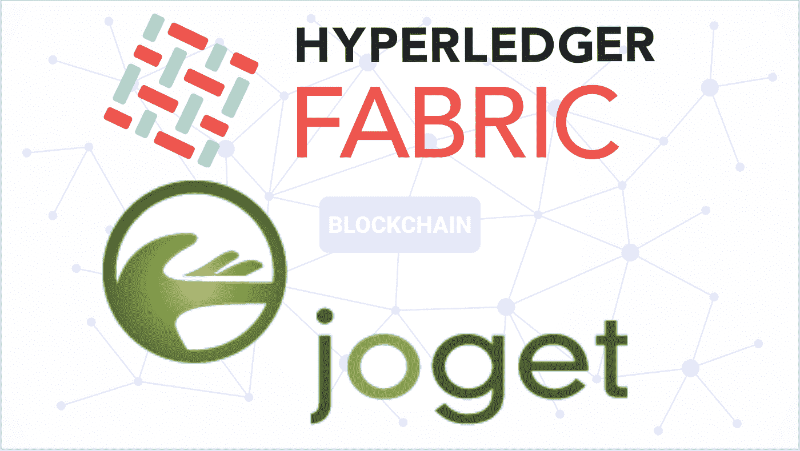

# 1.1 区块链和数字账本技术(DLT)

最近有很多关于区块链技术革新世界的预测，从银行业到供应链甚至政府都将发生变化。即使你不熟悉这个术语，你也可能听说过加密货币的兴起，比如利用区块链技术的比特币。那么到底什么是区块链呢？

首先，最好理解一个更宽泛的术语，叫做[数字账本技术(DLT)](https://searchcio.techtarget.com/definition/distributed-ledger) 。DLT 只是一个分散的数据库，数据存储在没有中央权威的计算机网络中。[区块链](https://www.worldbank.org/en/topic/financialsector/brief/blockchain-dlt)是一种特定类型的 DLT，其中网络中的记录使用加密技术进行链接，并且不可更改。这有助于解决由于中央集权导致的信任问题和低效率问题。

有许多区块链实现，大致分为[无权限或有权限](https://www.investopedia.com/news/public-private-permissioned-blockchains-compared/)。无许可的区块链网络本质上是公开的，因此任何人都可以参与，而有许可的网络则是有限制的私人使用。无许可网络在加密货币等公共领域工作良好，但在企业环境和许多行业中，私有网络是必不可少的。

企业区块链网络通常可能跨越整个行业的多个组织。由于需要许可的私有网络和多个组织的参与，区块链解决方案如何获得足够多的采用才能成功？这就是 Hyperledger 的用武之地。

# 1.2 超级分类帐和超级分类帐结构

[Hyperledger](https://www.hyperledger.org/) 不是一个公司，也不是一个特定的产品，而是一个企业用例的[开源](https://opensource.com/resources/what-open-source)区块链项目的保护伞。由 [Linux 基金会](https://www.linuxfoundation.org/)主办，有超过 250 个组织参与，这些项目被分为框架和工具。框架是区块链技术的不同实现，每一种对于不同的用例都有不同的优势。另一方面，工具是帮助管理或补充框架的工具。

目前最流行、最成熟的框架是 [Hyperledger Fabric](https://www.hyperledger.org/projects/fabric) 。Fabric 最初由 IBM 提供，现在已经成为企业区块链平台的事实上的标准，商业实现和支持来自包括 IBM、Oracle 和 SAP 在内的主要供应商。

# 1.3 超级分类帐结构概念

如果你是区块链技术的新手，有相当多的概念需要学习和理解。出于示例应用程序的目的，这里有一些用于配置区块链集成的更重要的术语。

*   [区块链账本](https://hyperledger-fabric.readthedocs.io/en/release-1.3/glossary.html#ledger)是存储在分布式网络中的所有交易和数据的日志。
*   [对等节点](https://hyperledger-fabric.readthedocs.io/en/release-1.3/glossary.html#peer)是托管区块链总账副本的网络组件。
*   成员是区块链网络的一部分
*   [证书颁发机构(CA)](https://hyperledger-fabric.readthedocs.io/en/release-1.3/glossary.html#hyperledger-fabric-ca) 颁发证书以标识属于某个组织的用户。
*   [会员服务提供商(MSP)](https://hyperledger-fabric.readthedocs.io/en/release-1.3/glossary.html#membership-services) 将证书映射到会员组织。
*   [事务](https://hyperledger-fabric.readthedocs.io/en/release-1.3/glossary.html#transaction)是在分类账中读取或写入数据的请求
*   [订购服务](https://hyperledger-fabric.readthedocs.io/en/release-1.3/glossary.html#peer)是将交易订购成块写入分类账的节点
*   [信道](https://hyperledger-fabric.readthedocs.io/en/release-1.3/glossary.html#channel)是私有通信机制，用于保持网络成员之间的机密性。
*   [智能合同](https://hyperledger-fabric.readthedocs.io/en/release-1.3/glossary.html#smart-contract)(在结构中称为链码)是区块链网络中的代码，被调用来查询或更新分类帐

下面由 Hyperledger Fabric 项目提供的图表显示了应用程序如何通过智能合约与区块链网络集成:

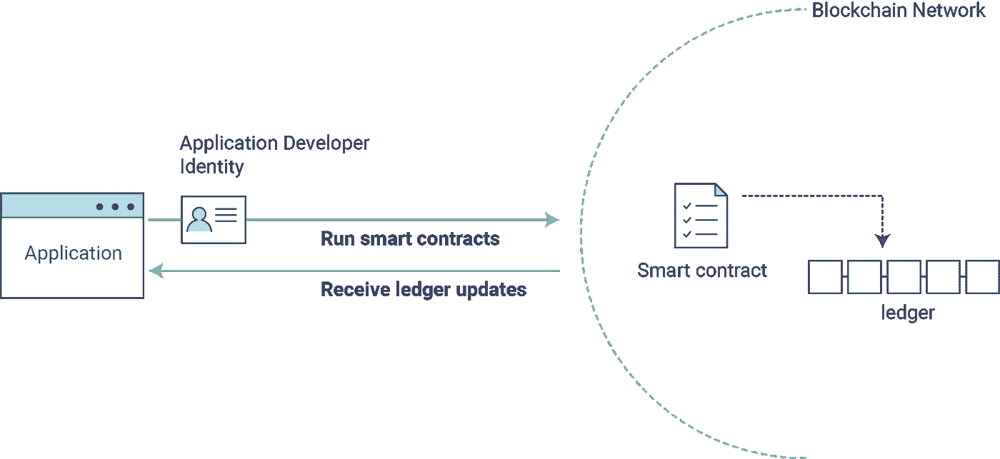

更多详细信息可在 [Hyperledger 结构文档](https://hyperledger-fabric.readthedocs.io/en/release-1.3/whatis.html)中找到。

# 2.应用程序概述

为了演示区块链技术在应用程序中的结合，让我们设计一个 Joget 应用程序，它利用 Hyperledger Fabric 提供的[样本 Fabcar 网络](https://hyperledger-fabric.readthedocs.io/en/release-1.3/understand_fabcar_network.html)。Fabcar 示例基本上是一个用于学习目的的最小化的结构网络。

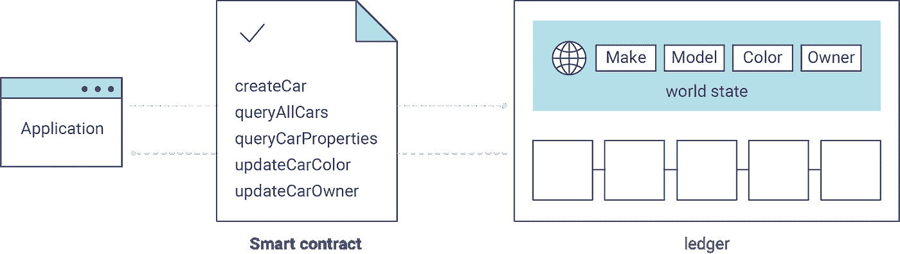

为了演示读取和写入区块链网络，该应用程序支持以下用例:

*   来自区块链网络的所有记录的查询和列表
*   从区块链网络查询和查看特定记录
*   经过审批流程后，将新记录写入区块链网络

有了 Joget，无需编码就可以开发区块链应用程序。表单是可视化设计的，之后应用生成器用于快速创建一个完整的工作应用。然后，只需配置一组 Joget Hyperledger Fabric 插件，即可集成到 Hyperledger Fabric 区块链网络。

要安装并试用最终的工作应用程序:

1.  确保 Hyperledger fab car 结构样本网络已启动并正在运行。
2.  确保 [Joget 企业版](https://www.joget.org/download/)的一个实例已经启动并正在运行。
3.  下载 [Hyperledger Fabric 插件 jar 文件](https://dev.joget.org/community/display/KBv6/Blockchain+Hyperledger+Fabric+Plugins#BlockchainHyperledgerFabricPlugins-Installation)，通过系统设置下的[管理插件](https://dev.joget.org/community/display/KBv6/Manage+Plugins)上传下载的 JAR 文件。
4.  下载 [Joget jwa app](https://dev.joget.org/community/display/KBv6/Blockchain+Hyperledger+Fabric+Plugins#BlockchainHyperledgerFabricPlugins-Installation) 和[导入](https://dev.joget.org/community/display/KBv6/Import+and+Export+Apps#ImportandExportApps-ImportinganApp)它。
5.  配置 **fabric_host** [环境变量](https://dev.joget.org/community/display/KBv6/Environment+Variable)以指向适当的 IP/主机名。
6.  [发布](https://dev.joget.org/community/display/KBv6/App+Versioning+and+Publishing)应用，并从[应用中心](https://dev.joget.org/community/display/KBv6/Apps+and+the+App+Center)访问。

以下是该应用的一些截图:

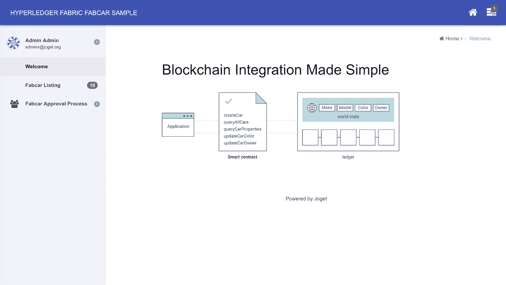

Welcome: Home page

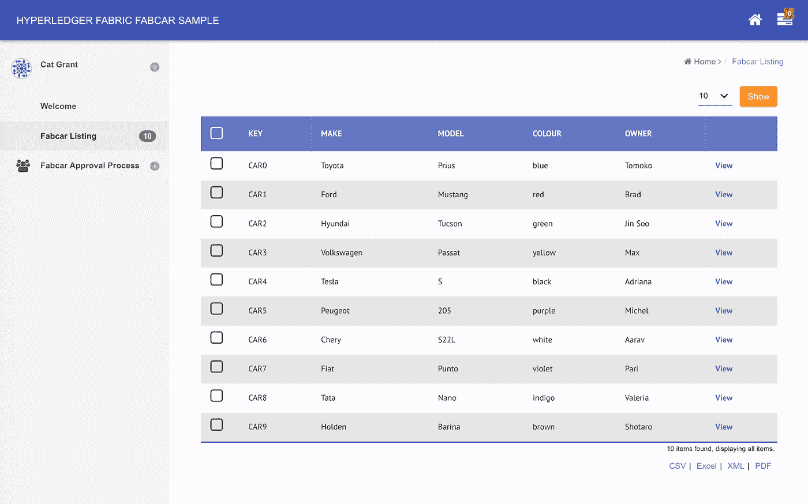

Fabcar Listing: List of all records from the blockchain network

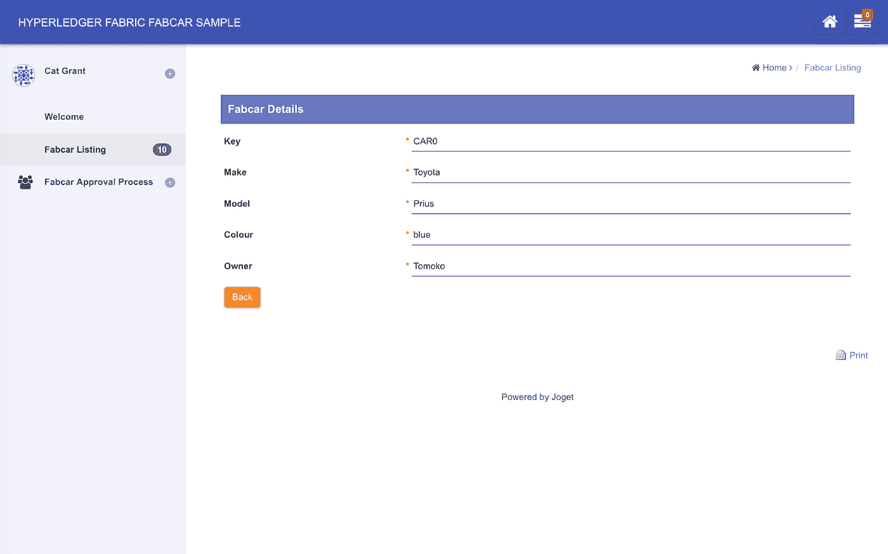

Fabcar Form: View specific record from the blockchain network

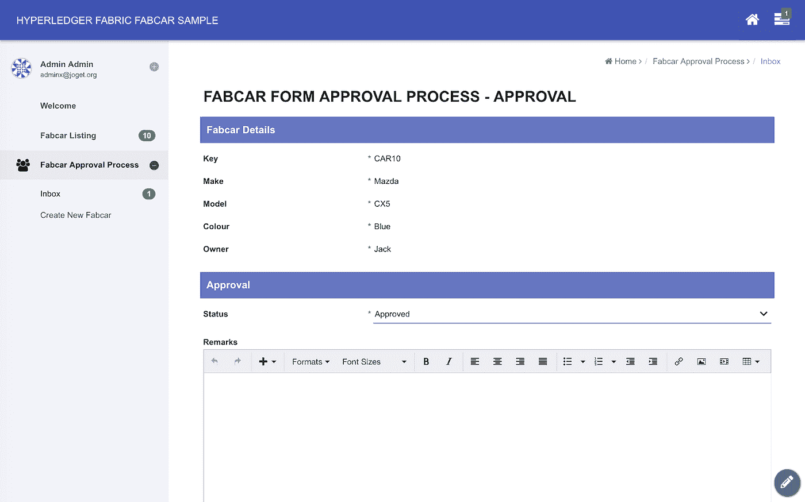

Approval Process: Approve a creation of a new record

接下来的几节提供了设置示例 Hyperledger 结构网络以及开发和配置应用程序的更多详细信息。

# 3.安装和设置 Hyperledger 结构网络

首先，安装 Hyperledger Fabric v1.3 版和 Fabcar 网络示例。

下面总结的安装步骤是在 Ubuntu 18.04 上测试的。

# 3.1 安装先决条件

([https://hyperledger-fabric . readthedocs . io/en/release-1.3/prereqs . html](https://hyperledger-fabric.readthedocs.io/en/release-1.3/prereqs.html))

安装卷曲:

> sudo 易于安装-y 卷曲

安装 Docker 和 Docker Compose(在 usermod 命令后注销并登录):

> sudo apt install-y docker . io
> sudo apt install-y docker-compose
> sudo usermod-aG docker $ USER
> #在 usermod 命令后注销并登录

安装 Go:

> sudo apt 安装-y golang

安装节点:

> sudo apt install-y nodejs
> sudo apt install-y NPM

# 3.2 安装 Hyperledger Fabric 示例、二进制文件和 Docker 映像

([https://hyperledger-fabric . readthedocs . io/en/release-1.3/install . html](https://hyperledger-fabric.readthedocs.io/en/release-1.3/install.html))

> curl-sSL[https://raw . githubusercontent . com/hyperledger/fabric/release-1.3/scripts/bootstrap . sh](https://raw.githubusercontent.com/hyperledger/fabric/release-1.3/scripts/bootstrap.sh)| bash-s 1 . 3 . 0

# 3.3 设置样本 Fabcar 网络

([https://hyperledger-fabric . readthedocs . io/en/release-1.3/write _ first _ app . html](https://hyperledger-fabric.readthedocs.io/en/release-1.3/write_first_app.html))

> cd 织物-样品/fabcar
> npm 安装
> 。/startFabric.sh
> 节点 enrollAdmin.js
> 节点 registerUser.js
> 节点 query.js

成功安装并执行最后一个命令后，您应该会收到来自区块链网络的查询响应，即

> 查询已完成，正在检查结果
> 
> 回应为[{"Key":"CAR0 "，" Record":{"colour":"blue "，" make":"Toyota "，" model":"Prius "，" owner ":"外川智子" }}，{"Key":"CAR1 "，" Record":{"colour":"red "，" make":"Ford "，" model":"Mustang "，" owner":"Brad"}，{"Key":"CAR2 "，" Record":{"colour":"green "，" make":"Hyundai "，" model":"Tucson "，" owner":"Jin Soo

# 4.设计 Joget 应用程序

既然已经建立并运行了 Fabcar 网络，让我们开始设计 Joget 应用程序，它将查询并更新区块链总账中的记录。Joget 平台提供了一个模块化的[动态插件架构](https://dev.joget.org/community/display/KBv6/Developing+Plugins)来扩展功能。在这种情况下，我们将使用一组带有 [Joget 企业版](https://www.joget.org/download/)的 Hyperledger Fabric 插件。

# 4.1 设计新应用

第一步是[设计一个新的 Joget app](https://dev.joget.org/community/display/KBv6/Designing+a+New+App) 。在 Joget [应用中心](https://dev.joget.org/community/display/KBv6/Apps+and+the+App+Center)，以管理员身份登录，点击**设计新应用**按钮。输入相关细节，例如

*   应用 ID: fabcar
*   应用程序名称:Hyperledger fab car 示例

# 4.2 设计 Fabcar 表单

使用 Joget [表单构建器](https://dev.joget.org/community/display/KBv6/Form+Builder)，设计一个具有与 Fabcar 记录中的属性相匹配的字段的表单。

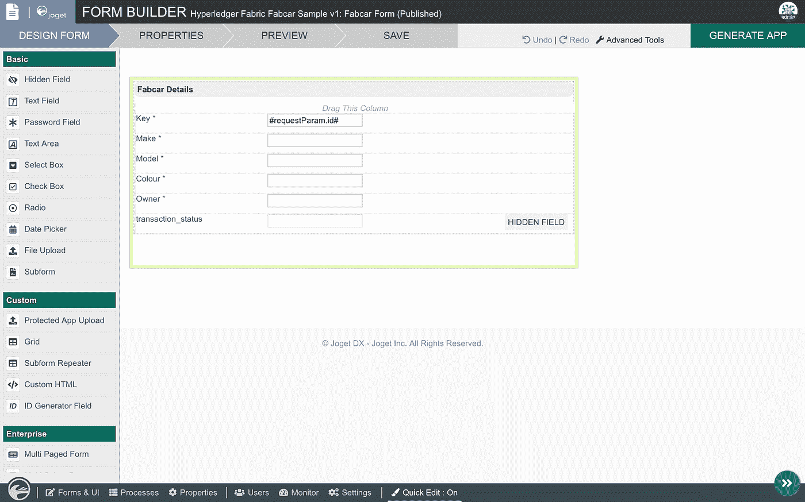

在这种情况下，创建 id 与 Fabcar 记录相匹配的文本字段

*   **键**
*   **制造**
*   **型号**
*   **色彩**
*   **所有者**

点击**保存**按钮保存表格。

# 4.3 使用应用生成器创建应用

保存表格后，点击**生成应用**按钮，使用[应用生成器](https://dev.joget.org/community/display/KBv6/Generate+App)。勾选**生成数据表、生成 CRUD 和生成流程—审批流程**选项，然后**生成**选项。

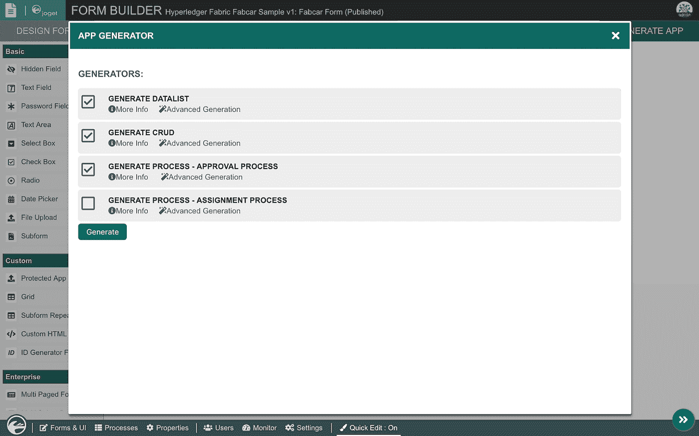

**注意**:App Generator 是 Joget 企业版的一个特性，但是您也可以在 Community Edition 中手动创建列表、流程和 UI。

# 5.配置 Joget Hyperledger 结构插件

至此，已经创建了一个管理记录的完整应用程序，以及一个创建新记录的审批流程。这些记录在内部 Joget 数据库中，所以现在我们将开始配置 Hyperledger Fabric 插件以直接与区块链网络集成。

# 5.1 上传 Joget Hyperledger 结构插件

下载 Hyperledger Fabric 插件 jar 文件，通过系统设置下的[管理插件](https://dev.joget.org/community/display/KBv6/Manage+Plugins)上传下载的 JAR 文件。

# 5.2 配置列表以查询 Hyperledger 结构分类帐

在应用程序中，启用[快速编辑模式](https://dev.joget.org/community/display/KBv6/Using+Quick+Edit+Mode)，以便您可以查看可编辑的元素。浏览至 Fabcar 列表，点击列表的快速编辑链接，打开[数据列表生成器](https://dev.joget.org/community/display/KBv6/Datalist+Builder)。

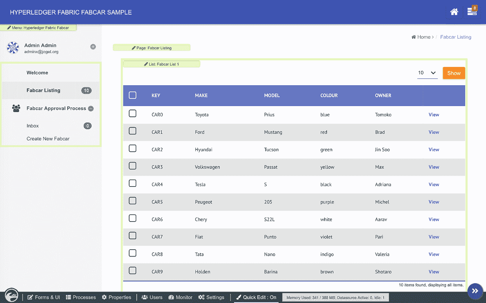

切换到**源**选项卡，选择 **Hyperledger Fabric 数据表活页夹**，然后点击**下一个**。在插件配置中，输入相关的详细信息。

此处显示的值适用于默认的 Fabcar 示例网络，但是将 **fabric_host** 更改为您环境中的正确主机名或 IP:

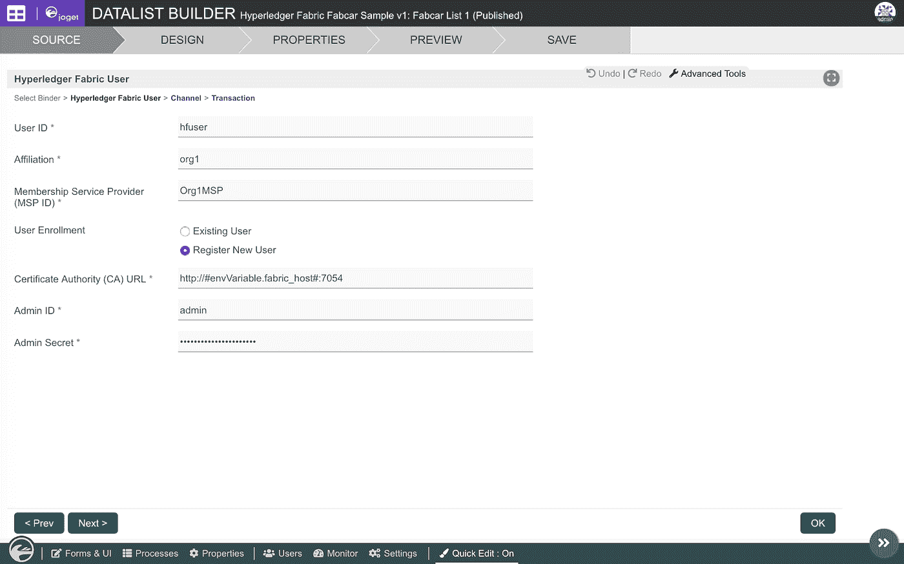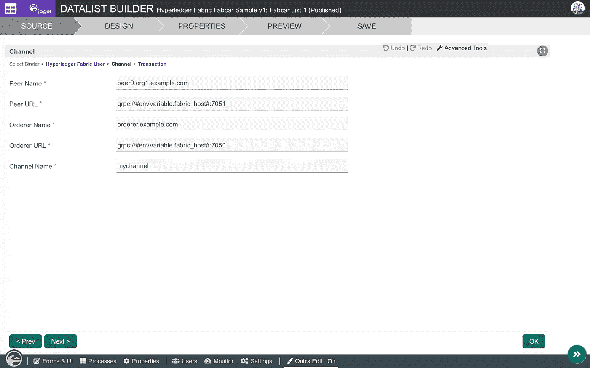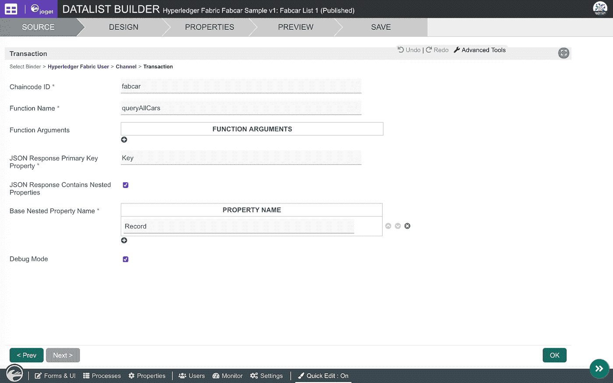

如果配置正确，**设计**选项卡将显示数据表中要使用的适当的 Fabcar 列。根据需要添加要显示的列，然后**保存**。

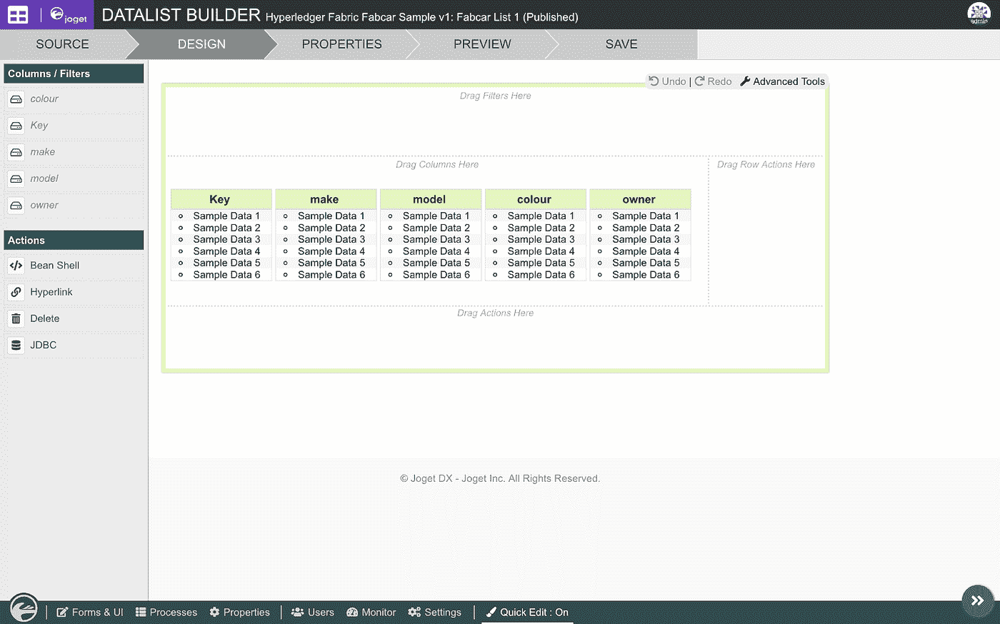

# 5.3 配置表单以查看 Hyperledger 结构分类帐记录

在 Fabcar 清单中点击**查看**条记录。点击 Fabcar 表格快速编辑链接，打开表格生成器。

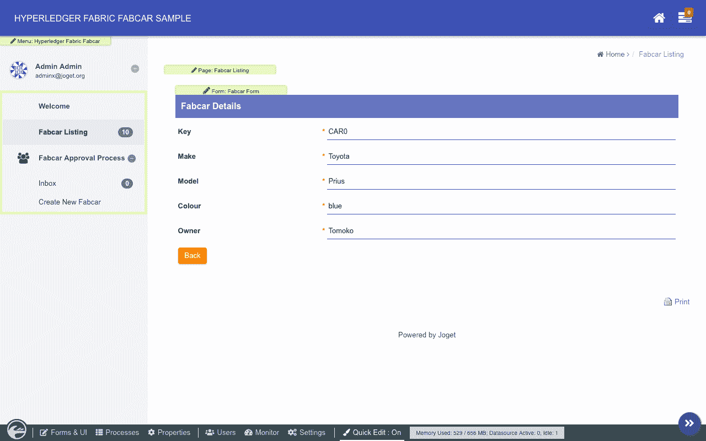

切换到**属性**选项卡，选择**Hyperledger Fabric Form Binder**作为装订机，然后点击**下一步**。

在插件配置中，输入相关的详细信息。Hyperledger Fabric 用户和渠道值类似于之前用于数据列表绑定器的配置。

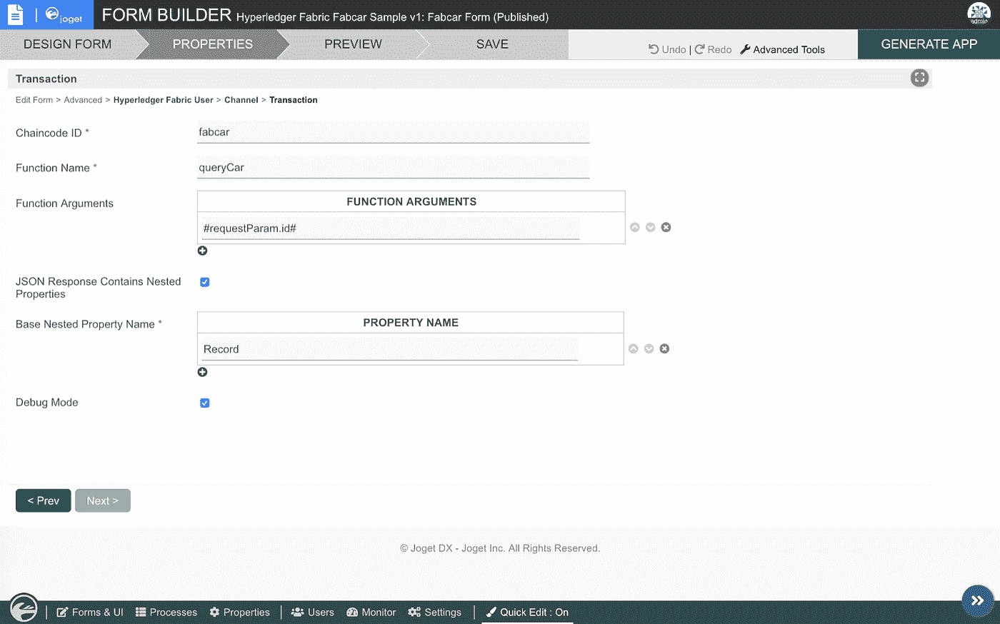

注意:#requestParam.id#是一个[请求参数散列变量](https://dev.joget.org/community/display/KBv6/Hash+Variable#HashVariable-RequestParameterHashVariable)，用来表示 URL 中的 **id** 参数。

点击**保存**。

# 5.4 配置流程以更新 Hyperledger 结构分类帐

在设计应用>流程屏幕中，点击**设计流程**以启动[流程构建器](https://dev.joget.org/community/display/KBv6/Process+Builder)。

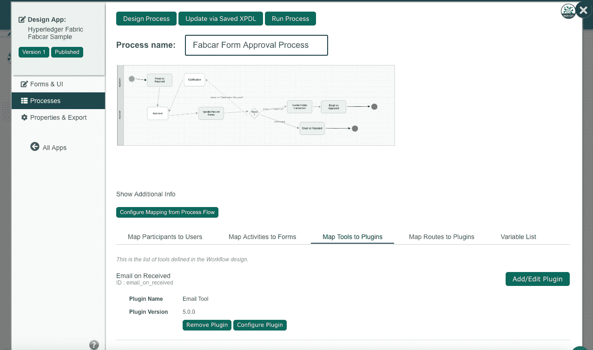

在状态为**已批准**的过渡中，增加一个名为**调用架构事务**的工具。

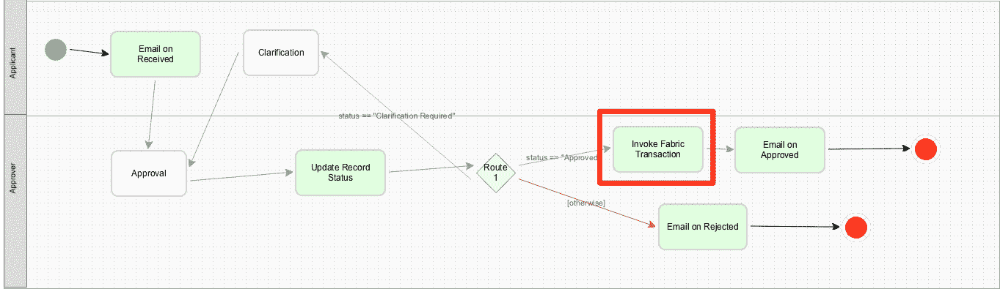

在[将工具映射到插件](https://dev.joget.org/community/display/KBv6/Map+Tools+to+Plugins)页面中，选择该工具的 **Hyperledger Fabric 工具**。在插件配置中，输入相关的详细信息。Hyperledger Fabric 用户和渠道值类似于之前用于数据列表绑定器的配置。

注意:#form.fabcar.field#是一个代表表单字段值的[表单散列变量](https://dev.joget.org/community/display/KBv6/Hash+Variable#HashVariable-FormDataHashVariable)。

# 6.下一步是什么

这个例子展示了使用 Joget 平台构建区块链应用程序的简单性，无需编码。

下载此示例的[应用程序和插件，并开始使用 Hyperledger Fabric 和 Joget。](https://dev.joget.org/community/display/KBv6/Blockchain+Hyperledger+Fabric+Plugins)

使用 Joget 开始数字化转型之旅:

*   [下载 Joget 工作流](https://www.joget.org/download)或[注册 Joget 云](https://www.jogetcloud.com/)
*   在[知识库](http://community.joget.org/)中了解更多信息
*   在[社区加入社区 Q & A](http://answers.joget.org/)
*   [查询 Joget 工作流企业版](https://www.joget.org/enterprise-pricing)