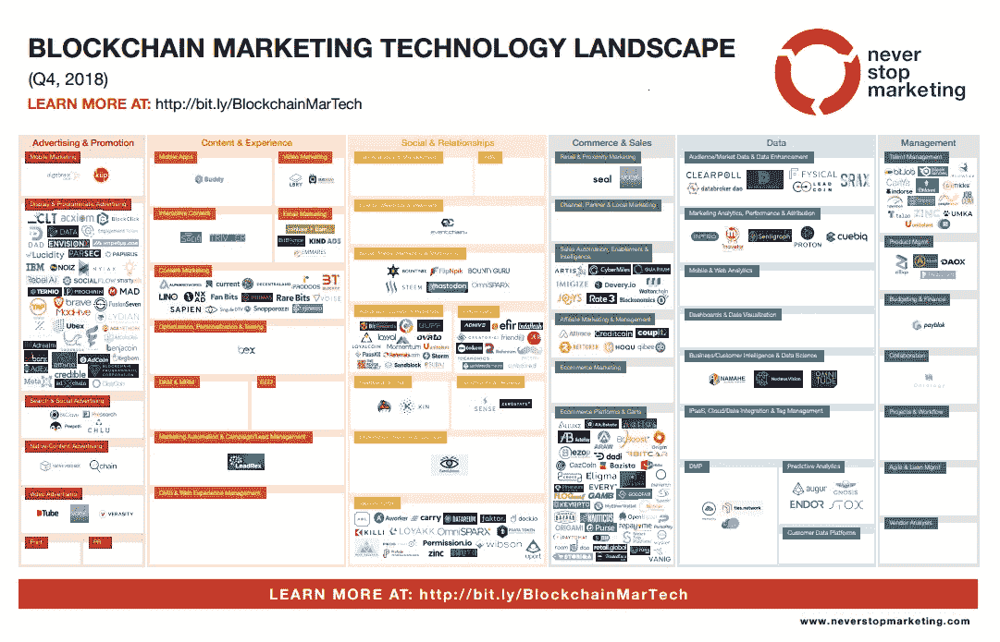

# 2018 年区块链营销

> 原文：<https://medium.com/hackernoon/blockchain-marketing-in-2018-59e8b611c169>

Blocks, of course. Photo by [Esther Jiao](https://unsplash.com/photos/FKZwWLWgGyM?utm_source=unsplash&utm_medium=referral&utm_content=creditCopyText) on [Unsplash](https://unsplash.com/search/photos/block?utm_source=unsplash&utm_medium=referral&utm_content=creditCopyText)

在整个 2018 年，我试图跟上区块链营销的发展。在这篇文章中，我将分享我这一年中读过的一些最好的文章。

虽然这个话题对我来说很重要，但我意识到，大多数营销人员将区块链视为幻想的产物，或者是一个有趣但模糊的利基市场。不管怎样，希望这能帮助一些(或更多)对过去一年感兴趣的人了解发生了什么。

## 区块链营销成功案例

每个营销人员都明白一个好的案例研究的力量。不幸的是，对于 2018 年的区块链营销来说，没有那么多可以指出的。

在关于区块链营销的对话中，有一个领域得到了很多关注，那就是程序化广告购买，这也是一些积极消息出现的地方。10 月，世界上最大的两个品牌发布了关于区块链如何改进其广告购买流程的消息:

[丰田发现，通过对程序化广告进行区块链优化，业绩提升了 21%](https://www.marketingdive.com/news/toyota-sees-21-performance-lift-with-blockchain-optimization-for-programma/539831/)

[百威英博看中区块链广告的好处](https://www.warc.com/newsandopinion/news/ab_inbev_sees_blockchain_ad_benefits/41226)

从本质上来说，两家公司似乎都从使用共享账本(我想是单独的账本)中受益，共享账本记录了广告空间被购买的时间，这意味着记录不会被一方操纵。虽然这些正面的新闻故事很值得一看，但经常伴随着它们的未经证实的评论——“*区块链被视为围绕程序化广告购买的问题的解决方案”*——不太可能说服许多营销人员，他们应该在技术上投入时间和精力。

即便如此，随着全球市场领导者涉足区块链营销和其他相关领域，2018 年也出现了其他积极迹象:

[广告控股公司加大对区块链的支持](https://www.marketingdive.com/news/ad-holding-companies-ramp-up-support-for-blockchain/541722/)

[营销集团(RYVL)令€480 万区块链北欧收购](https://www.thedrum.com/news/2018/12/07/the-marketing-group-ryvl-makes-48m-blockchain-nordic-acquisition)

[哈瓦斯与区块链通信部门进入加密货币领域](https://www.thedrum.com/news/2018/03/30/havas-moves-cryptocurrency-space-with-blockchain-comms-division)

## **营销界眼中的区块链**

由于很少有大的“新闻”报道，成熟的营销和广告出版物没有定期探讨区块链营销的话题。今年年初，人们关注 explainer 的文章，这可能是为了应对 2017 年底爆发的加密货币热潮。

经济咨询以二月份的一篇[向专家提问](https://econsultancy.com/ask-the-experts-blockchain-and-its-use-in-marketing/)的文章拉开序幕，随后是今年晚些时候的[揭秘区块链指南](https://econsultancy.com/demystifying-the-hype-around-blockchain-for-marketers/)。Emarketer 对[区块链采取了类似的方式——营销人员需要知道的事情](https://www.emarketer.com/content/blockchain-what-marketers-need-to-know-now),然后在 10 月份报道了[广告商对区块链](https://www.emarketer.com/content/advertisers-have-mixed-confidence-in-blockchain)的信心喜忧参半。数字机构安索帕也以其针对营销人员的[区块链剧本](https://www.isobar.com/jp/en/news/isobar-launches-blockchain-playbook-to-help-marketers-embrace-technology/)参与进来。

Drum 在三月份的文章《如何辨别某人在谈论区块链》中的谎言》中采取了一种更加逆向的方法。这最后一篇文章中有一段很棒的引言，总结了区块链的程序化广告现在可能的处境:

> “我经常听到的一件事是‘区块链将解决欺诈问题’区块链不是驱蚊剂，你不能只是在东西上喷区块链，然后说‘哦，看，所有的欺诈都消失了’。"

## **营销中的区块链**

2018 年，区块链在营销方面的许多最佳报道(与区块链的营销不同，如后所述)都聚焦于该技术的未来潜力。

当谈到水晶球凝视，我发现一般管理出版物往往有优势。《哈佛商业评论》一直对区块链有很好的理解，并公平地评估了它的潜力和局限性。三月份，它解决了区块链对市场营销意味着什么的问题，很好地概述了这项技术将如何被利用。

虽然你可能带着对这些区块链营销应用程序实际如何工作的同样的困扰和沮丧完成这篇文章，但它应该有助于扩展你的理解。它还解释了在与区块链总账发生任何互动之前，如何处理最小的广告购买交易链外，可能是事情实际解决的方式(几乎就像广告的闪电网络)。

另一个突出的内容是杰里米·爱泼斯坦的[区块链营销技术前景](https://www.neverstopmarketing.com/first-ever-blockchain-marketing-technology-landscape/)，它在 2018 年更新而不是推出。2017 年底首次发布，2018 年底的地图显示了大多数活动是如何在程序化广告和 CRM 解决方案中进行的。

## **区块链的营销(上)**

在了解了区块链如何影响营销之后，我们有必要看看营销是如何影响区块链的。最好的起点之一是维塔利克·布特林 9 月份对彭博的评论。

以太坊的联合创始人表示，他认为 1000 倍增长的机会已经结束，因为[营销加密货币](https://www.bloomberg.com/news/articles/2018-09-08/crypto-growth-nears-ceiling-ethereum-co-founder-buterin-says)并试图获得更广泛采用的战略正接近死胡同。在对 Quartz 的单独评论中，他还[将一些大机构的区块链活动](https://qz.com/1471152/ethereums-vitalik-buterin-says-ibms-corporate-blockchain-is-missing-the-point/)斥为“营销炒作”。

他的观点可能会让你认为他并没有高度重视营销在行业中的作用。就我个人而言，我认为他只是实话实说，因为有很多炒作，没有太多的实质内容。然而，我去年确实读过一些在区块链工作的有经验的营销人员的文章，其中包含一些有用的建议。

ico 可能不会像 12 或 18 个月前那样受到关注，但它们并没有完全消失。对于那些想了解 ICO 营销最佳实践的人来说，AJ Agrawal 在 8 月份为《企业家》写了以下文章:

[营销 70 个 ico 后，我见证了最常见的错误。他们来了。](https://www.entrepreneur.com/article/318835)

成长型黑客是 2017 年牛市期间 ICO 营销的魔术师，他们中最优秀的人召唤参与社区的能力仍然是业内的需求。对我们这些凡人来说，约阿尔·维尔纳为《福布斯》提供了一个有用的指南:

[区块链和加密货币初创公司的增长黑客 101](https://www.forbes.com/sites/yoavvilner/2018/09/25/growth-hacking-101-for-the-blockchain-and-cryptocurrency-startup/#715968d64ab7)

Shipchain 的 from Brian D. Evans 也提出了一些不那么引人注目但仍然有用的建议。他在 8 月份的以太坊世界新闻上写了关于耐心和坚持在区块链营销中的重要性的文章:

[Brian D. Evans:耐心点，坚持区块链营销](https://ethereumworldnews.com/brian-d-evans-be-patient-be-persistent-at-blockchain-marketing/)

9 月份的这篇 Hackernoon 文章提供了更多来自行业内部的观点，其中包括与区块链知名企业的高级营销人员的对话:

[如何用 Consensys 和 Lisk 营销区块链](https://hackernoon.com/how-to-market-blockchain-with-consensys-and-lisk-dzone-security-eecd9a7a2a90)

我在这里包括的最后一个链接有望帮助任何正在努力寻找合作伙伴的区块链营销或通信专业人士(或创始人，就此而言)。这是一份由 Tech Bullion 编制并于 9 月份发布的名单，其中突出了业内最好的代理商:

[最佳区块链技术和加密货币营销公司和公关机构](https://www.techbullion.com/best-blockchain-technology-and-cryptocurrency-marketing-companies-and-pr-agencies/)

## **一些最后的想法**

希望你对 2018 年区块链营销的简要总结有所帮助。

我长期从事这项工作，因为我相信区块链网络和协议将成为未来互联网的重要组成部分。这项技术面临的巨大挑战并没有让我太担心，因为很多聪明的人正在研究这些挑战，他们有大量的资金支持。事情注定会变得和我们现在想象的不一样，这将是一个迷人的旅程，无论我们最终去哪里。

就 2019 年的区块链营销而言，我希望看到更多的营销人员通过讲述他们如何回答明确的用户需求的故事来解释他们的项目为什么重要。现在，我看到了关于下一个大型加密货币和“区块链是什么？”的大肆宣传风格解说。

然而，回答各种利基用户查询的常青树和长尾内容很少，这些内容在其他金融科技垂直领域表现得非常好。还需要更多的案例研究、用户故事和业务改进指标，这样营销人员才能讲述引人入胜的故事，让更多人相信区块链的好处。

如果你觉得自己对区块链技术了解不够，那么这里有很多东西可以帮助你。我总是建议先阅读比特币白皮书，但是，如果这听起来有点令人生畏的话，[会用这些带注释的版本来指导你完成它。](https://genius.com/Satoshi-nakamoto-bitcoin-a-peer-to-peer-electronic-cash-system-annotated)

然后拿起一本关于这个主题的书([数字黄金](https://www.google.com/search?q=digital+gold+nathaniel+popper&rlz=1C5CHFA_enGB757GB757&oq=digital+gold+na&aqs=chrome.0.0j69i57j0l4.3576j0j4&sourceid=chrome&ie=UTF-8))，如果你想要一本引人入胜的书。[货币互联网](https://www.google.com/search?safe=strict&rlz=1C5CHFA_enGB757GB757&ei=APssXIXeNK-n1fAPj8K3oA4&q=the+internet+of+money+andreas+antonopoulos+&oq=the+internet+of+money+andreas+antonopoulos+&gs_l=psy-ab.3..0l2j0i22i30l3.20721.28739..29371...0.0..1.179.1951.19j2......0....1..gws-wiz.......35i39j0i67j0i131j0i131i67.8FKIm4VNHsw)或[比特币标准](https://www.google.com/search?safe=strict&rlz=1C5CHFA_enGB757GB757&ei=UvssXJOjJ-OL1fAP3s2dgAY&q=the+bitcoin+standard+saifedean+ammous&oq=the+bitcoin+standard+saifedean+ammous&gs_l=psy-ab.3..35i39j0j0i22i30l2.498.1023..1250...0.0..0.110.363.3j1......0....1..gws-wiz.wRGbklzXeOM)如果你对经济学更感兴趣的话)并通过 [Jameson Lopp 的比特币资源](https://lopp.net/bitcoin.html)进行研究。

[www . block chain copywriter . io](https://www.blockchaincopywriter.io/)