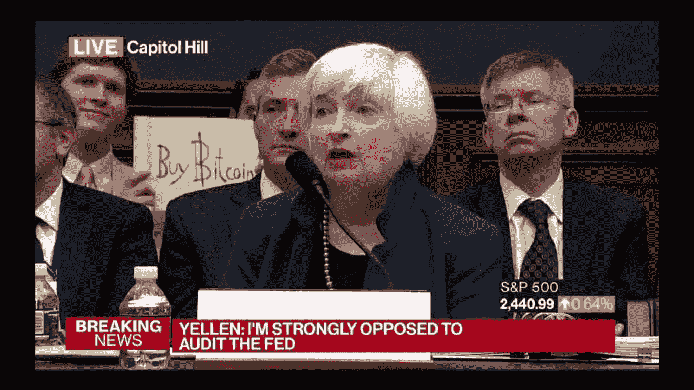

# 区块链大规模采用:专家承担所需

> 原文：<https://medium.com/hackernoon/blockchain-mass-adoption-expert-takes-on-what-is-needed-5ae43dc9edb9>

Growth hacking to mass adoption

随着认知度和合法性的提高，区块链行业在 2019 年达到了新的高度。行业巨头如[脸书](https://www.coindesk.com/facebooks-cryptocurrency-wants-to-take-on-banks-not-bitcoin)、[沃尔玛](https://www.coindesk.com/walmart-china-teams-with-vechain-on-blockchain-food-safety-platform)和[销售力量](https://www.forbes.com/sites/michaeldelcastillo/2019/06/25/salesforce-explores-blockchain-to-stop-racist-sexist-robots-from-ruining-1-trillion-opportunity/)都公开表示他们打算在日常运营中使用区块链技术。

虽然批评者可能会认为区块链旨在防止通常嫌疑人的垄断行为或主导地位，但很难认为自 2017 年以来，公众对区块链的看法发生了巨大变化。

据预测，到 2023 年，区块链产业将达到 230 亿美元的规模[，如今，它正作为许多问题的切实可行的解决方案，吸引着传统企业、企业家和政府的关注。](https://www.statista.com/statistics/647231/worldwide-blockchain-technology-market-size/)

尽管如此，该行业仍处于萌芽阶段，有许多挑战需要克服。这些包括可伸缩性、安全性、教育、互操作性、成本、速度等等。

为了更多地了解这些挑战以及实现大规模采用需要什么，我们采访了那些不断为世界构建区块链解决方案的企业家:

# 1.科林·佩普，Presearch 的创始人

在我看来，区块链项目面临着多重重大挑战。其中包括来自脸书、谷歌和亚马逊等现有竞争对手、银行卡特尔和支付处理商的巨大网络效应。第二，由于使用区块链技术作为货币，持续的安全问题无处不在。最后，将积累的区块链价值转化为有形的现实世界价值是非常困难的。

我们正处于互联网下一个价值交换和参与范式的早期，将会有重大的成长烦恼。

也就是说，那些想出如何将无缝用户体验、激励使用的游戏化奖励和保护货币价值的反滥用机制与实际消费者效用相结合的项目，将能够很好地引领大众走向这样一个未来:用户控制他们的数据，并在他们积极参与制作值得信任和依赖的服务时不断获得回报。

找到更多关于科林项目的信息:[https://presearch.io/](https://presearch.io/)

# 2.肯·迪克罗斯，Airwire 的创始人

我认为有三个关键因素将打开大众进入大众空间的闸门。首先，个人的财务收益主张。第二，易用性与他们想要颠覆的传统经济不相上下甚至更好的应用。最后，老牌公司使用前两个组件将其主要后端系统转换到区块链

区块链将通过转换大型盟友和他们目前在场外建立的网络来增长最快。这可以说是上面提到的 3 个过程中最慢的一个。公司，即使面对新系统和流程的明显优势，通常也不愿意扣动扳机。教育、安全保证和节省大量成本的优势将加快转换时间。在过去的几个月里，全食超市、脸书和其他公司发生了对我们有利的巨大转变

我们在这个领域的所有人都应该把重点放在个人用户上。我们要问自己，“是什么让一个人每天下载使用一个 app？”很简单。它给他们的生活增加了可感知的价值，而且它的功能如此之好，以至于用户不需要或不关心应用背后的技术是在哪里产生的。就是管用！我们需要与传统竞争对手没有区别的用例与平台，这些竞争对手迫使用户评估某些东西，而不是产品的易用性。评估需要基于对用户有吸引力的财务激励，而不是传统的大公司获取大部分利润的业务。

上面讨论的未来是一种经济，在这种经济中，用户受到前所未有的经济激励。分布式经济将是一颗难以下咽的药丸，因为公司利润将大规模减少。公司，就像菲亚特，将不得不遵守这些规则，否则他们将会灭绝。加密货币和区块链的发展速度如此之快，以至于这种模式的转变指日可待。

找到更多关于肯的项目:[https://airwire.io/](https://airwire.io/)

# 3.Vid 联合创始人兼首席执行官贾格·辛格

为了让区块链大规模采用，该行业需要普通消费者和主要行业的认可。我们看到像 IBM、亚马逊、JP 摩根和其他大公司不仅在使用区块链技术，而且开始向他们的客户和合作伙伴提供区块链支持的服务。然而，由于可用性和信任障碍，普通消费者不会使用任何基于区块链的应用或服务。

为了大规模采用，市场需要“区块链隐藏”的应用程序，这些应用程序要么内置于现有的消费产品中，要么作为当今产品/服务的替代产品。一个即将被区块链颠覆的行业是社交媒体行业。社交媒体在全球每月有近 30 亿活跃用户，近年来面临着重大的数据隐私和审查问题，消费者正在寻找替代产品，而不是脸书和 YouTube 等巨头。

由于使用区块链科技带来的安全性、透明度和信任，合法的区块链社交网络开始看到主要影响者及其追随者从传统的社交媒体转向区块链的替代品。

区块链行业目前面临的挑战包括监管不确定性、采用问题和加密货币的波动性。在这个或许是我们所见过的增长最快、最全球化的行业，各国的监管正在形成。更糟糕的是，不同国家的监管差异很大，未来也不确定，这使得初创公司很难完全理解将公司设在一个国家与另一个国家的影响。考虑到手头的官僚机构，政府天生决策迟缓。

找到更多关于 Jag 的项目:[https://vid.camera/](https://vid.camera/)

# 4.高级区块链创始人 Robert Küfner

自从 2010 年挖掘比特币以来，我已经看到加密货币和区块链的世界从提供替代货币解决方案发展到被纳入大公司的路线图。我共同创立的公司 Advanced Blockchain AG 是一家德国上市咨询公司和软件即服务公司，成立时的使命是带领企业客户进入去中心化世界。

ABAG 正在与多个企业客户合作，包括德国最大的汽车公司之一。为了推进去中心化的愿景，我们认为需要对这些公司如何实现分布式账本技术进行大量的调查。为此，我们正通过政府资助的项目德国加速器(German Accelerator)向美国扩张，将德国科技公司带到美国。

这种标准化的缺乏促使我们公司开发了 peaq.io，这是我们对困扰当今更广泛的区块链生态系统中现有协议的低效率的回应。到目前为止，还没有太多由区块链支持的分散式应用进入公共市场，因此在设计 peaq.io 的 DaGChain 系统时，我们优先考虑确保协议尽可能可用。

正如我们在脸书看到的那样，一些企业公司正试图找到让区块链变得可用的方法，为其用户提供便利，同时提供巨大的收入潜力。这些举措带来了新的创新可能性，ABAG 通过在德国最大的行业工作已经掌握了这一点，并将继续支持德国，帮助区块链成为主流。

找到更多关于罗伯特项目的信息:[https://www.advancedblockchain.com/](https://www.advancedblockchain.com/)

# 5.肯·米苏马，古兰经的 CMO

我们认为区块链是继互联网时代之后的下一次技术革命。为了让区块链获得全球的采用，我们的行业需要让人们能够方便地使用构建在区块链上的日常应用。借鉴数字金融、全球支付和在线游戏等成功的技术驱动型行业的大规模采用经验，我们需要让区块链技术融入人们日常活动的背景。区块链技术需要超越当前的技术限制，为普通消费者增加新的价值。

一个经常被强调的使用案例是，区块链如何通过快速、可验证且安全的支付网络，为全球超过 20 亿没有银行账户的人提供金融普惠。就像任何新的服务、产品或技术一样，如果消费者发现它为他们的生活增加了价值，它就会被大众所采用。

由于区块链市场只有 10 年的历史，仍处于萌芽状态，该行业面临着许多挑战。尽管数字货币市场在去年的大部分时间里经历了熊市，但越来越多的人、公司和政府相信区块链技术。

该行业面临的最大挑战之一是监管。监管平衡对于支持行业发展和促进采用非常重要，但是监管作为一个整体相对于这个市场的速度而言进展缓慢。如果监管过严，会毁掉有前途的创业公司。如果监管过于宽松，将允许欺诈者参与市场而不承担后果。监管可被视为挑战和机遇，因为监管平衡和灵活性是行业发展的关键，同时也能赢得全球民众的信任和支持。

找到更多关于肯的项目:【https://quras.io/en/ 

# 6.Alesandro Toumi，Neutro.io 首席执行官兼创始人

区块链有时会让人觉得，它是第一种有望被大规模采用的技术，而不像它所取代的技术或系统那样丰富和可用。虽然菲亚特系统在可访问性方面有很多问题，但区块链还没有做到真正的分散化、多样化、高效和易于任何人使用。

区块链本身效率低下，在协议内进行权衡，这意味着可扩展性、安全性和分散化被视为相互排斥 Vitalk Buterin 强调的所谓“三难困境”。区块链通常是内省的，如果不遵从神谕，就无法从现实世界中吸收价值，并有效地集中整个系统。

我创建了 Neutro 协议，使分散系统的大规模采用和大规模可用性成为可能。第一步是创建一个有效的解决三难问题的协议。这意味着一个更快、更安全、更高效、可扩展且完全去中心化的区块链。它可以利用一种新颖的投票结构，就外部价值观达成自己的共识。这具有巨大的影响，因为几乎任何真实世界的市场都可以以完全分散的方式存在于区块链上，从金融市场到保险，再到简单的交易。

最后一步必须是技术的可用性。在 Neutro，我们相信大规模采用会带来可扩展性和多样化的使用案例，区块链几乎与当前的金融系统一样多样化。

找到更多关于 Alesandro 项目的信息:[https://neutro.io/](https://neutro.io/)