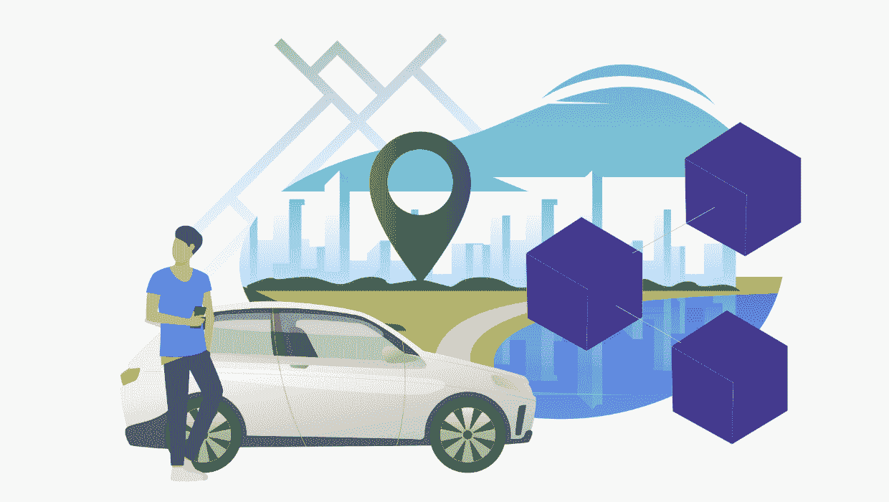
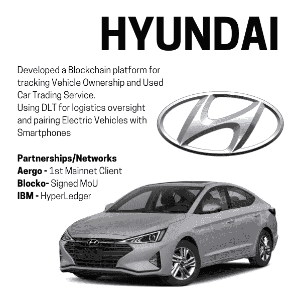
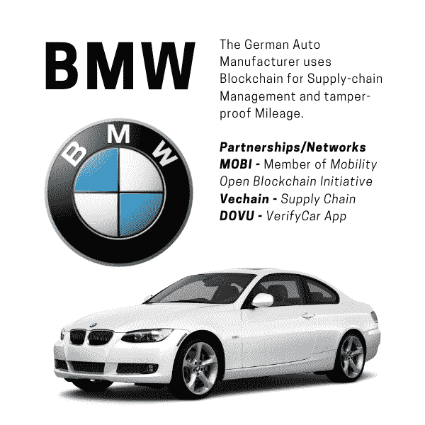
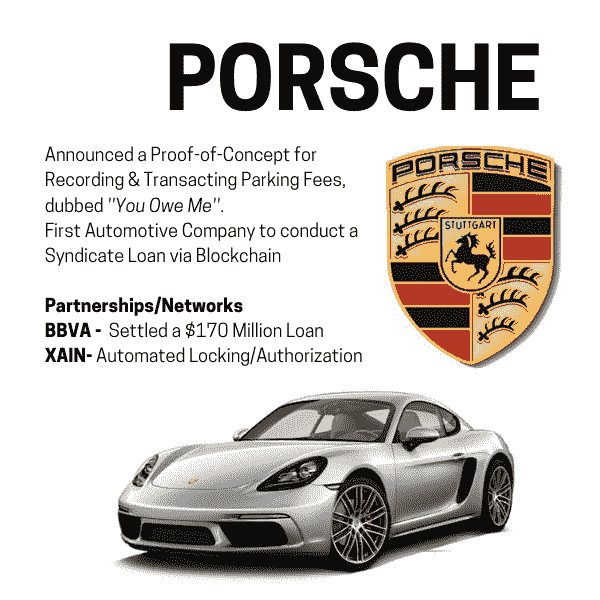
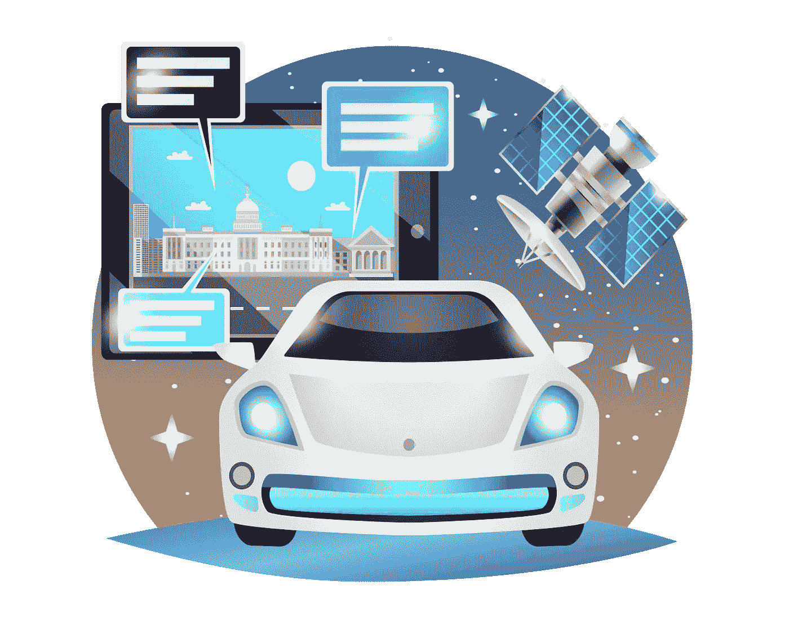

# 区块链符合汽车行业及其颠覆性影响

> 原文：<https://medium.com/hackernoon/blockchain-meets-the-automotive-industry-and-its-disruptive-implications-1991e182182d>

根据 IBM 商业价值研究所的[报告，预计到 2021 年，62%的汽车行业将在各种用例中使用区块链技术。一些最知名和最受欢迎的汽车品牌正在进军 DLT，区块链为该行业谱写了新的篇章，布道者相信，汽车行业将是下一个被这项新生技术颠覆的行业。](https://public.dhe.ibm.com/common/ssi/ecm/29/en/29022329usen/29022329usen-00_29022329USEN.pdf)

更有甚者，95%的汽车制造商正计划通过捐赠初创公司来帮助开发潜在的区块链解决方案，从而对企业技术进行“适度到显著”的投资。

驱动*【联网汽车】*服务的将是汽车技术&区块链的联姻。这项技术将提供“急需的”改变，能够解决苦苦挣扎的汽车行业面临的关键问题。目前，企业正忙于测试区块链试点项目，其明确意图是在整个生态系统或最适用的地方推动创新和解决方案。

**为了更好地了解 DLT 的颠覆性影响，这里有几个区块链将重塑汽车行业的用例:**

**商业:**由于数据完整性在现代金融中起着至关重要的作用，当手动数据输入、促进贸易和数据管理出现错误时，就会出现问题。分布式账本技术(DLT)旨在简化这些流程，允许独立方准确记录车辆的寿命。

**供应链:**制造一辆汽车需要成千上万的零件，这是一个涉及个人、组织、资源&活动的广泛网络的过程。由于管理大型供应链的复杂性，零件本质上存在被损坏、被盗和被替换的风险。通过实施 DLT 来进一步管理供应链，公司将拥有一个有效的&高效的手段来跟踪所有组件，从它生产的那天，到它作为最终产品被运输。

**移动性:**保险、维护甚至清洁服务等第三方的参与要求车主披露机密信息。区块链的使用允许客户管理个人数据，并与第三方服务提供商共享这些信息。通过集成区块链，按需移动服务(MaaS)允许将各种形式的运输服务整合为一个可按需访问的单一移动服务。MaaS 通常用于描述从个人拥有的交通模式向移动解决方案的转变，作为服务消费的解决方案(如拼车)就是一个很好的例子。

然而，有一个领域区块链将产生最大的影响，并将带来颠覆，这与联网汽车技术有关。对汽车行业产生深远影响的下一场数字革命将完全与通信和自动驾驶汽车有关。目前，有几个趋势似乎正在塑造联网汽车的未来。术语“联网汽车”用于描述物联网兼容汽车的数字化和技术进步，使车辆能够通过网络相互通信和连接。

诚然，连通性将是推动联网汽车发展的主要因素之一，而区块链将在提高车辆通信的质量和速度方面发挥至关重要的作用。DLT 有能力存储资产所有权，作为全球化支付系统的一部分结算交易，并允许更透明的供应链管理

# 为了让你更好地了解区块链在这种情况下是如何应用的，让我们来看看一些开始实施这种技术来解决现有问题的公司&使用区块链来引入一系列新的应用程序。

# 现代公司

现代汽车集团(Hyundai Motor Group)的子公司现代汽车(Hyundai AutoEver)宣布与一家专注于区块链即服务(BaaS)提供商的韩国公司 Blocko 正式合作。Blocko 已经与现代汽车集团的 ICT 平台签署了谅解备忘录，旨在合作开发这个汽车巨头的内部平台。在 Blocko 的帮助下，现代正在应用区块链来保护车辆的所有权，允许跟踪里程、服务历史和年龄等机密车辆信息。BaaS 提供商还专注于开源解决方案，推出了 Aergo，这是 Blocko 的最新项目，旨在通过引入独特的混合区块链，让企业更好地利用去中心化技术，而不必组成。现代汽车公司已经宣布，它的平台将迁移到 Aergo Mainnet，让我们看到未来汽车巨头们热衷于利用一个更加开放和公开的区块链。

目前，现代汽车打算将区块链驱动的平台用于汽车生命周期管理、移动即服务(MaaS)和保险。现代集团的附属公司，负责管理现代汽车集团所有 54 个系统的 IT。你可以在这里阅读更多相关信息[。](/aergo/hyundai-autoever-presents-blockchain-based-used-car-trading-service-at-posco-tower-mentions-aergo-1f485521325)

# 德国宝马汽车公司(Bavarian Motor Works)

这家德国汽车品牌早在 2018 年就支持区块链，公开宣布将使用该技术作为在网络参与者中共享自动驾驶汽车数据的一种方式。为了利用自动驾驶汽车收集的宝贵数据，宝马计划使用区块链来克服阻碍自动驾驶汽车大规模采用的最大障碍之一，方法是从本质上解锁存储在孤岛中的数据。

过去，宝马曾与 Vechain 等基于区块链的初创公司合作，开发该公司的 VerifyCar 应用程序，旨在为每位车主提供他们车辆的数字护照。该公司还计划使用这项技术来打击操纵里程表，据估计，仅在德国每年就要花费 67.8 亿美元。宝马还加入了“移动开放区块链倡议”(Mobility open block chain initiative)，该组织旨在实施区块链，使移动更安全、更环保、更便宜、更便捷。在未来几年，宝马将成为汽车行业中率先在从供应链管理到互联自动驾驶汽车的一系列概念中实施 DLT 的公司之一。

# 保时捷

一家专门生产高性能豪华跑车的汽车制造商与柏林初创公司 XAIN 合作，测试将集成到保时捷汽车中的区块链应用。根据公司的声明，保时捷据说是第一家实施并成功测试区块链的汽车制造商。多年来，据说保时捷一直在试验锁车和开锁的技术，其宏伟的想法是让车主暂时让别人进入他们的汽车

除了测试之外，保时捷过去还通过与 Banco Bilboa Vizcaya Argentaria's(BBVA)达成协议，利用区块链完成了一笔 1.7 亿美元的贷款，Banco Bilboa Vizcaya argent aria ' s 是一家以倡导区块链和发放企业银团贷款而闻名的西班牙银行。保时捷正式成为第一家完全通过分布式分类账完成收购定期贷款的非西班牙公司

**汽车行业区块链产业化**

预计汽车行业将受益于多年来的新技术进步，甚至可能为该行业谱写新的篇章。随着电动汽车、全自动驾驶和共乘服务的推出，有可能发生翻天覆地的变化，这可能导致区块链成为数据管理的理想解决方案的未来。

让汽车公司通过引入人工智能和联网汽车等令人兴奋的新概念来完善和重新定义现有技术，最终目标是给我们带来前所未有的驾驶体验。

预计未来五年内会出现一个转折点，因为有几个因素，如汽车所有权变化的影响，销售模式的发布以及区块链的更大接受和采用。目前，DLT 正在寻找在汽车领域应用具体应用的方法，提供广泛可行的解决方案。这是一个试点和试验的时期，在大规模采用技术之前，因为我们处于早期阶段。