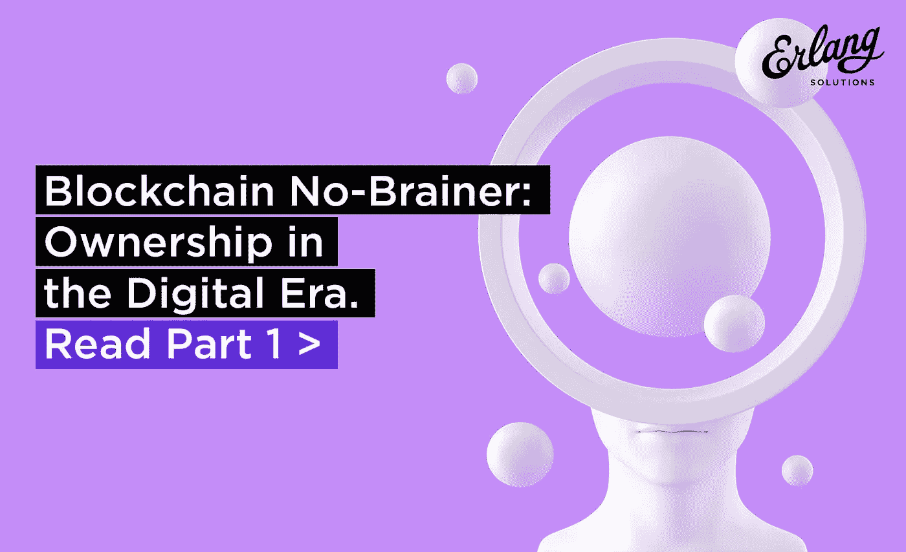
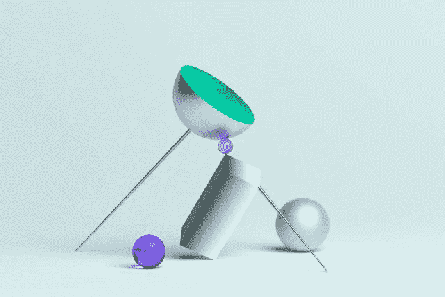

# 区块链:数字时代的所有权

> 原文：<https://medium.com/hackernoon/blockchain-no-brainer-ownership-in-the-digital-era-d2c3bcdd28bc>

# 介绍

自[区块链 2018 神话与现实文章](https://www2.erlang-solutions.com/blockchainmyths)发布以来，七个月的紧张活动已经过去。作为那篇博文的后续，我想借此机会进一步详细分析这种新技术对我们对资产所有权和价值的看法的影响，以及我们如何不断探索新形式的事务自动化，然后以提供安全和公平治理的挑战作为结束。

由于要涵盖的主题非常广泛，我决定将它分成两篇独立的博文，第一篇将涵盖所有权的意义和认知如何发生变化，而第二篇将讨论智能合同自动化如何帮助实现安全、公平、快速、低成本、透明和可审计的交易互操作性。

我的意图是提供一个抽象和可理解的总结，描述区块链技术的最新发展水平，以及是什么样的动机把我们带到了目前的发展阶段。虽然这些帖子不会关注未来的创新，但它们将作为我打算在未来发布的更大胆的出版物的前奏。

# 数字资产所有权、来源和处理

# 我们如何评价数字资产和物理资产

为了了解目前社会上对所有权概念的看法，我提议简要分析一下使我们达到目前阶段的历程以及促成我们看法演变的因素。

历史上，人们主要倾向于拥有和交易实物。这可能最好的解释是，物理对象刺激我们的感官，不需要抽象能力，例如，与服务相反。所有权通常是占有的同义词。

让我们试着分解并提取实物商品经济的基本面:我们最初来到这个世界，没有任何东西是属于任何人的；于是，个人占有产生了所有权“权利”(通过劳动支出——寻找或创造财产获得)；后来，我们成立了行使领土控制权的组织，并支持所有权的概念(通过演变成法律框架的规范和道德)，作为保护实物的一种形式。土地和原材料是我们这方面经济的基础。

当我们交易(购买或出售)商品或其他实物商品时，我们所拥有的是原材料的组合，这些原材料的供应是有限的，再加上将它们转化为可供使用和/或消费所需的人工/机器工作。历史上，价值是基于资源的内在价值(稀缺性是一个指标)加上将资源转化为资产所需的工作成本。特殊资产类别(如艺术品)很快出现，其价值与来源、时尚、技能(相对于劳动力数量)等无形因素相关。

我们可以观察到，即使是实物商品也包含一个抽象的元素:设计，塑造它的能力，包装它并使它对所有者或消费者有吸引力。

相比之下，数字资产具有更强的定义其价值的抽象元素，而其物理元素通常可以忽略不计且可替换(例如，软件可以存储在磁盘上、转移或打印)。这些类型的资产通常会刺激我们的智力和想象力，因为我们的感官通过视觉、听觉或触觉的呈现形式被激活。文件、绘画、照片、雕塑和音乐符号在任何基于电子的模拟或数字表现形式之前就有了历史等价物。

数字商品的独特之处在于，它们可以以非常低的成本精确复制:例如，由于我们存储它们的离散性质(使用简化的二进制格式)，它们可以在异构的物理平台或基底上以多种表现形式轻松再现。这种可感知的形式可以从这些相等的表象中无数次地重建和推导出来。这一特性极大地影响了我们对数字资产的估价。创造复制品的机会意味着应该重视的不是复制品或渲染，而是原始的数字作品。事实上，这是区块链通过其数据结构固有的散列锁引入的主要成就之一。

如果正确使用，克隆数字项目的能力可以增加其将无限期存在并因此保持其价值的信心。然而，正如我在之前的博客文章[(block chain 2018-神话与现实)](https://www2.erlang-solutions.com/blockchainmyths)中提到的那样，数字商品的不变性和永久存在并不能免于面临毁灭，因为目前存在对物理介质(例如硬盘存储)的依赖，而物理介质可能会被更改、退化或过时。

区块链，如比特币网络，代表了一种通过所谓的分布式账本技术(DLT)大量复制和强化数字信息的模式。修复机制可以进行干预，以便在数据被降级的物理支持(即硬盘故障)或恶意行为者破坏的情况下恢复完整性。数据的有效性由大多数对等参与者(分类帐)通过一个称为共识的过程达成一致(不同 DLT 实施中的多数级别各不相同)。

这是朝着正确方向迈出的一步，尽管对保存数字资产的日益先进的平台的探索有望进一步发展。正如基因进化所表明的，由于引入了一个使环境不适合以特定形式生存的因素，具有相同特征的克隆体都可能面临灭绝。因此，引入不同类型的分类账可能是明智的，以确保它们在各种物理平台上的持续保存，从而提高信息留存的可能性。

# 服务及其自动化的发展

在上一段中，我们简要介绍了抽象元素占主导地位的物理资产和货物之间的区别。在这里，我打算分析我们如何开始重视服务，以及我们如何对服务的性能和质量提出越来越高的要求。

服务是一种抽象的有价值的形式，通常在市场上交易。它们代表了受合同条款约束的动作，在这些动作下发生了转换。这种转变可以应用于实物商品、数字资产、其他服务本身或个人。在这种情况下，我们交易的是行使转换的潜力，这在某些情况下可能已经应用了。例如，一种转化的商品，如精炼油，已经经历了从其原始形态的转化。

另一个例子是人工制品，其中特定的形状可以是有用的或者触发情感反应，例如具有艺术价值的人工制品。艺术世界中的服务转换可能是高度个人化的(取决于进行转换的人的身份(艺术家；评论家；画廊等)或观众。因此，杜尚将一个陶瓷小便器提升(或者，可能是退化)为艺术品，依赖于许多相关的元素(即艺术界内外的演员的转化行为)才能使转化成功——这些元素通常只有在转化受到影响后才能被认识和/或理解。

即使是抽象形式的表现，比如音乐符号或唱片，实际的声音也是一种我们认为有价值且通常交易的转换。这些转变可以由人或机器来完成。随着对数字商品兴趣的激增，人们对获取服务以改变它们的兴趣也相应增加。

随着这些转变越来越自动化，人的因素逐渐消失，甚至服务也逐渐形成了自动化算法的形式，这是另一种形式的数字资产，智能合同就是这种情况。然而，请注意，为了应用转换，一个算法是不够的，我们需要一个执行者，如物理或虚拟机。

在第 2 部分中，我们将分析服务的自动化如何导致智能合约的发展，作为交付高效、透明和可追踪的转换的一种方式。

# 可持续性和获得资源

智力和想象力的刺激并不是解释人们对数字商品越来越感兴趣并因此导致其市场价值上升的唯一动力。众所周知，处理实物商品的成本相当高。为了创造、交易、拥有和保存它们，在储存、运输、保险、维护、原材料提取等方面需要大量的支出。

这涉及到竞争和环境成本，使得物质资源的获取本来就不可扩展，有时甚至令人望而却步，特别是在人口密集的城市地区。因此，人们被激励拥有和交易数字商品和服务，这被证明是一种更可持续的前进方式。

例如，让我们考虑一个艺术家，他住在人口稠密的城市，需要获得画布、颜料、画笔等等，加上工作室和存储空间，以便创作一幅画。发现这些资源很难或不可能获得，他/她决定以数字形式制作他们的作品。

传统上，服务需要交付资源(例如原材料处理)。然而，其中的一部分(如那些需要非体力劳动的工作，如股票市场交易、法律或会计服务)非常适合通过应用算法自动化以低得多的成本完成。

注:本分析假设，驱动许多 DLT 生态系统中使用的“工作证明”共识机制所需的高碳足迹可以避免，否则可持续性优势可以合法地辩论。

# 生成方法

对数字资源的可负担得起的访问，加上不断创新的算法的创造，也有助于数字资产的生成性生产的兴起。这些包括部分生成，通常通过组合和组装预制的部分来获得:例如 [Robohash](https://robohash.org/text) 从添加到 URL 的文本中导出哈希，从而导致嘴、眼睛、脸、身体和配件的固定组合。

其他方法涉及神经网络深度学习:例如，【ThisPersonDoesNotExist】使用 NVidia Research Labs 发布的名为[的生成对抗网络](https://www.lyrn.ai/2018/12/26/a-style-based-generator-architecture-for-generative-adversarial-networks/) (GAN)的技术来生成随机人脸，Magenta 使用谷歌 TensorFlow 库来生成音乐和艺术，而 [DeepArt](https://deepart.io/) 使用基于 [19 层 VGG 网络](http://www.robots.ox.ac.uk/~vgg/research/very_deep/)的专利神经网络实现。

在游戏行业，我们应该提到[无人区](https://www.nomanssky.com/)，这是一款主流的主机和 PC 游戏，展示了对[过程化生成](https://nomanssky.fandom.com/wiki/Procedural_generation)的成功使用。

项目 [DreamCatcher](https://autodeskresearch.com/projects/dreamcatcher) 还使用了一种生成式设计方法，这种方法利用了一系列模拟解决方案，这些解决方案响应了一系列材料或形状应满足的预定义要求。

就生成艺术而言，重要的是通过将数字资产的创作限制在限量版来确保稀缺性，这样自动生成的物品就可以交易，而不会有供应过剩引发价格通缩的危险。在区块链 2019 第二部分中，我们将描述在区块链上注册不可替换令牌(NFT)的技术，以便跟踪一个对象的每个单独副本，同时确保没有非法的。

与区块链技术直接相关的有趣方法最近已经推出，如来自幼虫实验室的 [AutoGlyphs](https://www.larvalabs.com/autoglyphs) ，尽管这仍然是一个有待进一步探索的开放领域。非常成功的是[明显艺术](https://obvious-art.com/)的案例，GAN 方法的另一个应用导致[产生的艺术品以 432，500 美元](/datadriveninvestor/machine-learning-generated-artwork-auctions-off-for-432-500-c377be74146f)被拍卖。

# 是什么阻止了数字产品的大规模采用

尽管预测数字资产市场在未来几年将大幅扩张是明智的，但为了在市场中获得更广泛的吸引力，目前仍有几个心理障碍需要克服，这也是事实。

主要挑战与信任有关。买方希望得到一些保证，保证交易的资产是真实的，卖方拥有这些资产或代表所有者行事。DLT 提供了一种可靠的方式来计算出注册项目的历史，而无需询问集中的可信实体。来源和所有权可以从大量复制的分类账中推断和验证，而块序列有助于确保在特定时间范围内不会发生双重支出或双重销售。

第二个挑战与特定市场环境之外的所有权的含义有关。我想举一个例子[微软电子书商店](https://www.bbc.com/news/technology-47810367)的关闭。微软退出电子书市场的决定，可能是由于缺乏利润，可能会对该平台上的所有电子书购买产生影响。显然，消费者认为拥有一本电子书和拥有一本实体书是一样的。然而，微软可能已经通过其最终用户许可协议(EULA)以合同方式同意的是，这仅在其平台的上下文存在中是真实的。

这种情况也发生在电子游戏中，狂热玩家感觉获得了一把剑或盔甲，就好像它们是真实的一样。即使游戏没有关闭其在线存在(例如，当其维护成本变得不可持续时)，缺乏兴趣或受欢迎程度降低也可能导致数字项目失去其价值。

从这个意义上来说，有一种力量在推动一种所有制形式，这种所有制形式可以突破特定市场的限制，并在更广泛的背景下得以维持。区块链的 DLT 与智能合约(可能无限期存在)相结合，可以用于实现这一目的，让人们有效地保留他们的数字物品在多个应用程序中的使用。这些项目是否在最初创建它们的环境和平台之外具有效用或价值，还有待观察。

即使是数字艺术的收购也需要一个实质性的范式转变。与实物艺术品相比，把购买的物品带回家(或带进自己的安全储藏室)没有同等的有形感觉。这已经被分布式分类账上的可验证痕迹所取代，该可验证痕迹指示注册的数字对象属于谁。

感官形式也有助于适应这种新的所有权形式。例如，可以打印数字艺术作品，可以为 VR 或 AR 体验渲染 3D 模型，或者进行 3D 打印。事实上，控制你可以用一个数字项目做什么是阿瑟形式的部分所有权，可以交易。这不同于部分所有权的概念，在部分所有权中，你的所有权是以一种普通但稀释的形式出现的。它更多的是一种功能性的所有权。这是一个与某些传统的非数字资产相关的概念，通常受国家法律和这些资产的物理形式的约束。例如，我可以拥有一辆经典的法拉利，并允许别人驾驶它；我可以在我的博物馆里展示，并向参观者收取入场费；但是我将被限制使用法拉利的名字和徽章。

当涉及到数字不可替代资产时，向这些所有权新概念的过渡尤为艰难。与此同时，对于已经习惯于与金融工具相关的客户来说，接受加密货币等可替代资产变得更加容易。这可能是因为可替代资产具有独特的支付功能，而在不可替代资产的情况下，有一系列功能定义了它们在数字或物理空间中的意义。

# 结论

在本帖中，我们讨论了区块链技术在过去两年中显著影响的一项重大新兴创新——数字资产的所有权。在区块链 2019-第二部分中，我们将详细介绍如何通过日益强大的智能合同来自动处理资产。

我们正在见证的是一个新时代，它可能会彻底改变所有权的观念以及对可信和不可信自动化形式的依赖。这是由提高互操作性、成本压缩、可持续性、性能(如事件发生的速度)和定制化的需求驱动的，这些都是传统集中式金融科技系统无法提供足够解决方案的方面。然而，值得提醒我们自己的是，在对这些要求作出反应的过程中，不应以牺牲安全和保障为代价。

隐私和分享也是争论激烈的领域。数字资产的所有者通常更喜欢匿名，而社会共享信息的好处得到了广泛认可。例如，一个艺术收藏家可能不想公开他或她的个人身份。当然，还有很多东西有待探索，因为我们显然才刚刚开始一个更广泛的旅程，这个旅程将重塑全球数字和实物市场。

在 Erlang Solutions，我们与合作伙伴一起研究创新和高性能的服务，以支持广泛的客户。这包括从构建核心区块链技术到由智能合约支持的更具体的分布式应用。这项工作的一部分已经在我们的网站上分享了，在那里你可以找到一些关于我们在金融科技领域的合作伙伴的信息和一些有趣的案例研究，其他的仍然在 NDAs 的范围内。

这篇文章旨在提供一个最新的分析。我们很快就会发布更具体的、可能有争议的文章，展示更大胆的愿景。当更多内容发布时，您可以收到通知，只需注册我们的[金融科技简讯](https://www2.erlang-solutions.com/blockchainnl)——你知道程序，我们需要你的联系方式——但我们不是垃圾邮件发送者！

[别忘了在推特上关注我们！](https://twitter.com/ErlangSolutions?ref_src=twsrc%5Egoogle%7Ctwcamp%5Eserp%7Ctwgr%5Eauthor)

**…**

*最初发表于*[*www.erlang-solutions.com。*](https://www2.erlang-solutions.com/blockchainnbm)