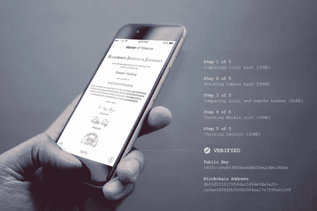
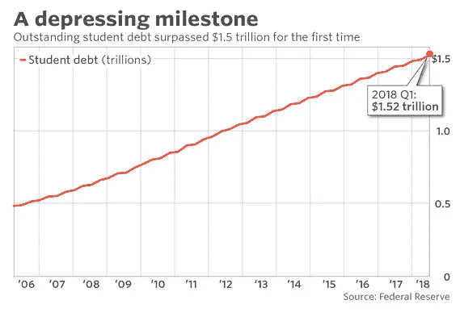
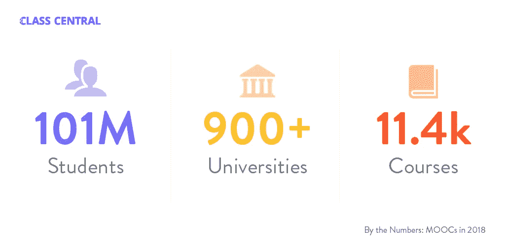

# 区块链准备颠覆教育行业

> 原文：<https://medium.com/hackernoon/blockchain-poised-to-disrupt-education-industry-f41d6f415a3f>

区块链无疑是一项巧妙的发明。这项技术最初是作为虚拟货币的基础，但很快就变得很明显，区块链不仅仅是比特币。

为比特币提供动力的加密账本技术将重塑许多行业的未来。无论是医疗保健、金融、媒体还是政府，区块链技术都将改变一切。

这项技术肯定会颠覆包括教育在内的所有行业。不可否认的事实是，教育系统离它需要的地方还很远。利用这项技术，教育部门可以有很大的改进。

教育技术领域非常庞大。预计到 2020 年将达到[937.6 亿美元。像人工智能和虚拟现实这样的技术已经进入了教育领域。区块链技术成为主流也只是时间问题。](https://soeonline.american.edu/blog/the-future-of-education-technology)

让我们看看这项颠覆性技术如何给教育部门带来变革。

# 数字证书

2017 年，[麻省理工学院向毕业生发放虚拟文凭](http://news.mit.edu/2017/mit-debuts-secure-digital-diploma-using-bitcoin-blockchain-technology-1017)。学生们通过智能手机收到了这些邮件。它在许多方面不同于普通的纸文凭。与纸质文凭不同，区块链文凭永远不会丢失。也是永远无法证伪的。

无论你去哪里，你的证书将永远伴随着你。使用数字化的区块链文凭，也不需要传统的票据交换所或大学作为中介来发布成绩单。

现在，如果学生们开始将他们所有的证书和徽章存放在区块链上，在大学之间转移将变得容易得多。像转学分这样的障碍不会阻碍他们的教育之旅。区块链非常安全。一旦数据被添加，几乎不可能改变它。因此，您的所有证书都是安全可靠的。你可以通过点击一个按钮来访问它。

# 让教育负担得起

据《T4》报道，美国学生债务高达 1.52 万亿美元，4400 万借款人欠下这笔债务。学生贷款债务危机已经变得非常严重，他们在毕业后的几年里对预算造成了严重破坏。这都要归功于高昂的教育成本。强大的区块链是救世主。这项技术有助于让所有人都能负担得起教育。

事实上，2017 年有 81 个教育-区块链 ico 开始解决这个问题，但他们消失在空气中。来自 EIU 的爱德华医生。AC 表示，区块链拥有改变行业的应用，LOL 令牌可以解决诸如可移植性和可负担性等实际问题。

区块链具有成本效益和可扩展性。这些记录是高度安全的，因为它们是分散的。其体系结构中固有的灵活性允许支持和存储记录、文档和数字资产，而无需任何额外的基础架构和安全性成本。

机构还节省了数据管理成本和随之而来的法律责任。该技术还允许参与者拥有来自开源共享数据的个人所有权，从而节省大量数字系统成本。

# 扩展 MOOC

大规模开放在线课程一直在增加。截至 2018 年，有[1.01 亿注册](https://www.classcentral.com/report/mooc-stats-2018/)用户使用大规模开放在线课程和 500 个基于 MOOC 的证书。MOOC 提供商 Udacity 拥有 5 万名付费用户，而 Coursera 的付费用户在 2017 年增长了 70%。

这足以证明 MOOCs 为用户提供了巨大的价值，他们实际上愿意为这些课程付费。区块链技术也可以帮助 MOOC 服务，并为其提供更高水平的合法性，只需为这些课程的小额支付交易提供便利。

# 俄亥俄州立大学(Ohio State University)

随着教育费用的上涨，有必要寻找更便宜的选择。高昂的教育成本是开源大学(OSU)概念流行的原因之一。OSUs 允许您存储所有的教育证书，为更实惠的替代教育方式增加了合法性，这些教育方式仍然受到雇主的青睐。

此外，OSUs 有自己的课程，学生可以选择他们喜欢的课程。此外，它们非常实惠。通过在统一的区块链数据库上存储通过 OSUs 获得的证书和凭证，凭证将易于验证和访问。因此，它消除了文凭市场的欺诈机会。

# 人才管理

大学花了大量的钱来传授训练给学生，但保持他们的成就记录是一项艰巨的任务，因为这些记录要保持和维持一辈子。

目前用于人才管理的技术容易受到网络攻击，并且不太安全。区块链为人才管理提供了一个开放、安全的系统。学生们即使在毕业和参加工作后也能接触到它。

# 智能合同

一旦满足一组指令或条件，区块链也可以用于执行协议。智能合同可以减少教育部门的文书工作。例如，一旦满足一组条件，就可以使用它来验证出勤或任务完成情况。智能合同还有许多其他方式可以帮助教育转型。

分布式账本技术有望彻底改变教育体验。区块链仍处于早期阶段，该技术还有很长的路要走。看看这项技术为教育部门带来了什么将会很有趣。