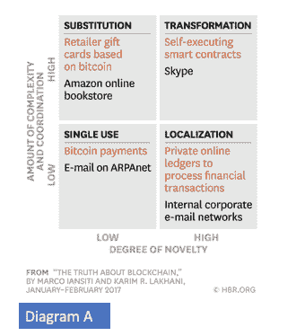
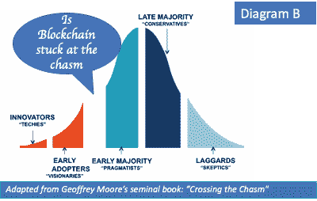
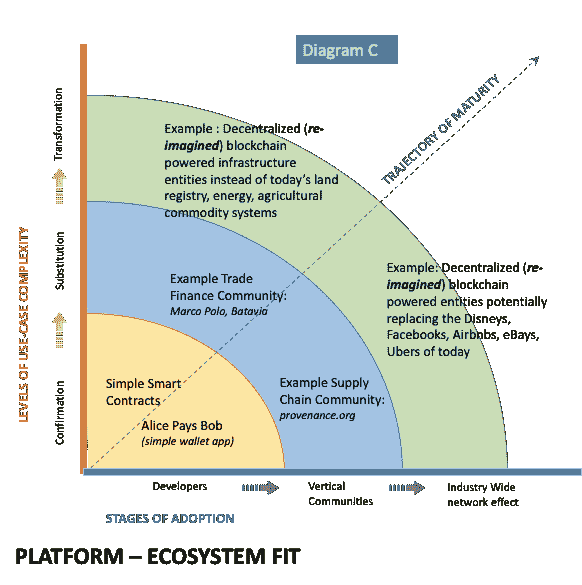

# 区块链产品-市场匹配:重新构建哈佛模型

> 原文：<https://medium.com/hackernoon/blockchain-product-market-fit-re-framing-the-harvard-model-c6a008f2a84b>

Photo by [Jessica Ruscello](https://unsplash.com/@jruscello?utm_source=medium&utm_medium=referral) on [Unsplash](https://unsplash.com?utm_source=medium&utm_medium=referral)

随着对区块链的兴趣持续增长，越来越多的公司、产品经理、投资者等试图在市场中找到自己的立足点，需要回答的关键问题是该行业的趋势是什么，该技术将带我们走多远。一个参考是《哈佛商业评论》模型([此处为完整参考文章](https://hbr.org/2017/01/the-truth-about-blockchain))，该模型从用例的两个维度分析了区块链的采用情况——新奇程度和复杂程度。如象限图所示，这种采用被认为经历了 4 个阶段，利用互联网的发展作为区块链技术扩散建模的基础。我们中的许多人需要一种可靠的方法来评估**是否适合区块链，并帮助假设和思考市场需求和发展重点，问题是这种哈佛模式是否真的是一个很好的参考？或者，我们会不会错过关注正确的事情，或者更糟，我们会不会在着手构建我们认为的区块链业务及其未来时被蒙在鼓里？**

****哈佛模式如何功亏一篑？****

**哈佛模型(图 A)通过使用技术采用的互联网和 TCP/IP 模型提供了一个很好的背景。它也认识到区块链的采用可能会受到行动缓慢的组织系统和障碍的影响。**

****

**但是，哈佛模型至少在五个方面存在不足，让我们寻找另一种工具来更好地评估区块链转型将如何发生。**

*****哈佛模式的五大弱点:*****

1.  **忽略了“平台”效应，而是假设通过用例处理新颖性和复杂性的某种线性管道式进展。虽然这是两个关键方面， ***网络效应*** 是采用和扩展的基本驱动力。尤其是像区块链这样的开源项目。**
2.  **忽略了社区 ***和*** 区块链社区成员之间的互动所创造的价值，形成了一个正反馈循环，进一步增强了平台的吸引力。**
3.  **忽略了区块链的“颠覆性”价值。事实上，哈佛模式拒绝颠覆性效应，指出“这是因为区块链不是一种‘颠覆性’技术，它可以用更低成本的解决方案攻击传统商业模式，并迅速超越现有企业。”这完全忽略了一点，我们知道区块链实际上可以通过取消中介来降低成本，可以瞄准新的消费者(弱势群体、无银行账户者等)。)，并通过自动化、不可信的(即没有昂贵的中央机构)数字资产的强制执行、法规和合同遵从性以及安全性。**
4.  **忽略了“整体”产品的概念，杰弗里·摩尔在其关于技术传播的开创性工作中将其视为关键驱动力。我们将从一些当代的实证例子来看这个问题，并在后续文章中讨论它们如何适用于区块链产品。**
5.  **通过将“智能合同”作为其变革例子的上限，低估了真正的变革效果。真正具有变革性的区块链项目可能只会将智能合同用作基线构建模块，而区块链的全面影响将具有更大的根本性变革意义。新的尚待构思的商业模式和商业类别将在区块链涌现，比如从互联网的转型平台化发展而来的拼车、零工经济和社交媒体业务。如果说资产数字化是引发这种经济变革的互联网的核心，那么处于这一新平台核心的智能合约将开启更多有趣的经济里程碑。**

****区块链的采用挑战****

**现实情况是，区块链在采用方面面临挑战，主流观点是我们被困在了鸿沟上(图 B)。我们需要一个机制，一个框架来帮助我们理解如何实现产品与市场的契合，从而帮助我们跨越这个鸿沟。这不是一种理论上的追求，而是一种务实的方法，可以正确地应对挑战，了解业务历史以获得正确的经验，并部署正确的手段来加速使用。**

****

**这个行业有很多发展，其中一些确实遵循这样的重叠路线，因此淘汰可能是不可避免的。因此，我们确实需要越过“早期采用者”——可以说，比特币和当今行业中的其他概念试验是“早期采用者”的证据——并设计出让“实用主义者”感兴趣的正确市场模型，以便我们能够汇聚能够通过市场测试的网络和协议，并以正确的经济模型快速跨越鸿沟并实现增长。**

**这将需要大量的试验和实验，以及构建大量高影响力的“杀手级”用例及应用程序。 ***这让我们意识到需要一个合适的框架来推动产品市场适应区块链生态系统*** 。**

****区块链采用的平台-生态系统契合模型****

**所提出的是一个新的模型(图 C ),它重新构建了哈佛模型并解决了前面讨论过的缺点。我在纵轴上保留了用例，或者更确切地说，对它们进行了修改，但是增加了一个全新的维度，在横轴上称之为“采用的阶段”。这个轴从开发者开始，然后添加他们所属的垂直行业社区，最后是整个行业生态系统。**

****

**这样做允许模型有意地将区块链视为一个多边技术基础设施平台，其中有技术的贡献者和消费者。在这里，用户采用和用例采用最初在各种子生态系统中进行，通过开源工具和论坛进行积极的社区参与，然后在更广泛的生态系统中作为一个整体展开更多的协同作用。“互动”可以是彼此之间的，而不仅仅是与平台的互动，因为开源 GitHubs 往往会看到许多思想和技术的交叉授粉。我们可以认为这些交互是表明生态系统“丰富性”的关键因素，也是衡量整体平台创新采用情况的标准。我们很快就会看到，通过在生态系统中植入假设的 ***密码原语*** 或其他此类构建模块，并在社区中开放对其应用和有用性的访问和讨论，可以激发互动。这有助于加速进一步的互动，强化积极的行为，推动产品契合度。对这些交互进行建模并考虑社区事件，可以更好地理解生态系统中平台的采用曲线。因此该框架的名称为“**平台-生态系统契合模型”****

**开发人员的采用是关键的第一步，以播种更多的概念证明，并在这一重要群体中建立信心。我将这些初始用例称为“确认”用例，因为这些用例本质上是为了理解开发工作和挑战，以及技术能力而执行的。这些是能够升级到“替代”用例的基础，在“替代”用例中，当前技术可能会在类似于或反映当前部署的用例中被区块链替代。例如，数据库应用程序需要某种程度的不变性或公共可访问性(非集中化)，因此现在可能被区块链应用程序所取代。诸如此类，最终导致更具变革性的模式。**

**在这个版本的框架中，我列出了市场成熟度的三个径向区域，黄色是最不具变革性的，绿色是最具变革性的。显然，这是一个可以根据需要进行调整和版本控制的框架。我使用弧线来表示允许流体相互作用的区域，并认识到这些是相对于线性进展的刚性象限而言的自由流动的工作“区域”。arc 不应被视为严格的划分，而是在能够将链(双关语)推向市场之前，在每个区域达到一定成熟度临界质量的阈值。例如，当处于黄色区域时，供应链社区可以定义 MVP 或 POC 的数量；在蓝区中，设置参与者在向其他社区开放(仍在蓝区)或成为绿区中更广泛、更具变革性的生态系统的一部分之前，能够在社区内工作所需的部署或其他 KPI 的最小数量。**

**当我们沿着成熟度曲线的对角线移动，沿着标记为“成熟度轨迹”的向量向上移动时，随着开发人员社区和用例在复杂性、深度和多样性方面的成熟，我们逐渐解锁了适合区块链的产品市场。此外，在使用案例的范围和参与程度方面，无论是在开发人员级别、垂直社区级别还是整个行业。向量的长度可能因不同的行业和/或行业内的应用而异，这反过来决定了跨越鸿沟 ie 的 ***时间。，达到产品与市场的契合*****

**作为一个行业，我们正处于黄色区域，有一些早期的实验努力开始进入下一个成熟的蓝色层。蓝色区域中有许多许多垂直领域，这里显示了其中的两个作为示例，它们每天都在形成，大量关注标准和关键用例的识别，有时是非常垂直的开发方法。我们离定义绿色层的最终用例还很远。然而，今天由许多区块链远见者描绘的转型用例对于通知和加速整个平台、技术和整个生态系统是至关重要的。**

**产品营销人员通过这种**平台-生态系统匹配**模型获得的有趣优势是，看到了需要在开发人员社区内驱动的用例与参与度之间的相互作用。这迫使商业模型和真正产生价值的应用程序与需要构建和验证它们的社区内的积极参与相融合。在采用的每一个阶段，或者用例复杂度的每一个级别，都有一定程度的产品市场匹配，或者团队很快失败并重新启动。随着我们开发和突破这些适用于不同级别用例以及不同开发人员和垂直社区的单个产品-市场匹配，我们将推动创新扩散过程向前发展。**

**在后续文章中，我们将进一步发展这个主题。关注其他讨论，包括:**

*   **登上开发商，区块链市场验证的第一步。**
*   **什么是区块链的“整体产品”，或者杰弗里·摩尔的模型如何应用于区块链的“产品”。来自工业的例子。**
*   **建立垂直社区和原始市场经济的概念。**

**关键阅读:**

1.  **通过释放破坏性创新建立新市场的六个关键(克莱顿·M·克里斯坦森，哈佛商学院)**
2.  **区块链技术将如何影响数字经济，(麻省理工学院，克里斯蒂安·卡塔利尼)**
3.  **Pipes to Platforms readings &麻省理工学院平台战略峰会 2015 (Sangeet Paul Choudary)**
4.  **建立在以太坊的分散式应用生态系统上的协同效应(Preethi Kasireddy)**
5.  **平台革命(Geoffrey Parker、Marshall Van Alstyne 和 Sangeet Paul Choudary)**