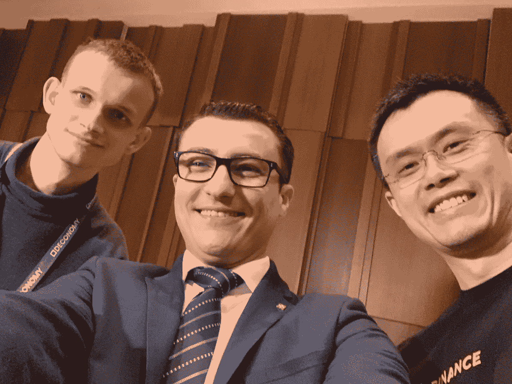

# 美国和马耳他的区块链监管——领先者和落后者

> 原文：<https://medium.com/hackernoon/blockchain-regulation-in-the-u-s-and-malta-leader-and-laggard-7d841713062c>

本文探索了加密货币监管的无数世界；具体来说，ICOs、美国(以及 SEC)和马耳他。

## 落后

> *“我们认为 SEC 可以做得更多来澄清其立场”* —美国国会议员对 SEC 主席([消息来源](https://www.cnbc.com/2018/09/28/congress-ask-sec-chairman-for-clarity-on-cryptocurrency-regulation.html)

这一简单的国会要求反映了该国对美国加密货币监管的更广泛的情绪——对监管透明度的直言不讳的需求。从 2017 年年中开始，首次公开募股(ico)的快速出现和退出，到 2018 年年中显著放缓，这只会加剧这种不确定性。

ICO 是区块链项目(即创业公司)筹集资金的一种方式，目的是换取与项目相关的硬币或代币。这些硬币或代币是数字资产，在项目提供或计划提供的产品或服务的上下文中具有价值。只要项目表现良好，只要它们在牛市的背景下兑现承诺，监管就不会受到重视。

然而，随着 2018 年加密货币市场的崩溃，总市值从约 8200 亿美元跌至约 1200 亿美元，许多区块链项目开始[挣扎](https://bitcoinist.com/diar-ico-70-percent-underwater-2018/)，或者干脆[失败](https://cryptobrowser.io/news/over-260-icos-fail-to-survive-the-2018-bear-market/)，一些人甚至放弃了项目，但保留了资金(“退出骗局”)。随后的集体诉讼和投资者投诉使人们重新关注 ico 及其代币的合法性。

## **SEC 如何落入事物的方案中？**

证券交易委员会(SEC)是美国股票和证券化工具的监管机构。尽管加密货币目前未被归类为证券，但监管机构将继续进行监管，直到指导方针或框架正式确定。这是因为，作为一种资产类别，加密货币不受监管，很少或没有针对欺诈的消费者保护措施。

虽然美国证券交易委员会已经澄清比特币和以太坊不是证券，但对其他加密资产的裁决仍然存在。被归类为证券为投资者创造了进入某一资产类别的壁垒，并因此导致进展停滞，更进一步说，导致创新停滞。

迄今为止，美国证券交易委员会一直在 1933 年和 1934 年的《证券法》范围内行事，这比互联网的发明至少早了 50 年。因此，调整“投资合同”相关法规的活动最活跃，最新更新发布于 2019 年 4 月 3 日[。](https://www.sec.gov/corpfin/framework-investment-contract-analysis-digital-assets)

这伴随着定期向投资者发布[风险建议](https://www.sec.gov/news/public-statement/statement-clayton-2017-12-11)。

就联邦政府而言，它没有在全美范围内实施任何一揽子法规，而是允许各州制定自己的法律。这使得几个州为加密制定了有利于 T4 的法规。然而，由于 SEC 在逐案的基础上审查项目，至少在美国，我们要达到法律清晰化还有很长的路要走。

Funds raised through ICOs in 2018 ([source](https://www.icodata.io/stats/2018))

在接到 SEC 的[电话后，几个项目已经停止了象征性出售的计划。像“](https://icoexaminer.com/ico-news/now-phone-call-will-sec-maintains-ico-observe-policy/)[我见过的每一个 ICO 都是证券](https://www.coindesk.com/sec-chief-clayton-every-ico-ive-seen-security)”这样笼统的说法也无助于建立开发商或投资者的信心。正如卡托研究所(Cato Institute)的一篇论文(T11)所指出的，虽然在制定法律时消费者保护应该是最重要的，但不确定性加剧了波动性，过度监管扼杀了创新。

我们已经看到了这一点:2018 年的 ICO 冻结。为了安全起见，一些项目已经直接将美国投资者排除在代币销售之外。已经向国会提交了提案，以便在为时已晚之前实施审慎的监管。已经到了美国国会议员不得不写信给 SEC 寻求监管澄清的地步。

尽管方法落后，但在州一级还是取得了一些成果。亚利桑那州、伊利诺伊州、内华达州和特拉华州已经通过了维护区块链利益的立法。夏威夷州[众议院 1481](https://legiscan.com/HI/text/HB1481/2017) 法案甚至考虑了采用比特币的好处。

这带来了一个在美国联邦法律与州法律之间并不罕见的问题，并经常与大麻行业的监管状况相提并论。从长远来看，法律倾向于拥抱创新，但这一主题仍然是一个灰色地带，这对美国国内的创新造成了真正的伤害。因此，美国当前的法律发展速度导致许多项目寻找采用周期更快的司法管辖区。

## **输入一个领导**

2018 年 3 月，全球交易量最大的加密货币交易所币安[宣布](/binanceexchange/binance-the-worlds-largest-crypto-exchange-announces-investment-in-malta-4c7e51136563)将把总部迁至马尔他。虽然是一个人口不到 50 万的小岛国，但这个国家因其前瞻性思维和制度质量基础设施的平衡而迅速引起了全球的关注。

很长一段时间以来，马尔他一直在为成为一个“区块链岛”做准备。他们拥有欧盟最低的公司税率，并为 crypto 提供了法律确定性。2018 年 7 月，马耳他政府[提出立法](https://www.forbes.com/sites/rachelwolfson/2018/07/05/maltese-parliament-passes-laws-that-set-regulatory-framework-for-blockchain-cryptocurrency-and-dlt/#1dc4eb49ed2f)，帮助建立区块链、分布式账本技术(DLT)和加密货币的首个监管框架。

这项立法通过了三项法律:《马耳他数字创新管理局法》(MDIA 法)、《创新技术安排和服务法》(ITAS 法)和《虚拟金融资产法》(VFA 法)。《MDIA 法案》设立了一个官方机构来认证 DLT 平台。《ITAS 法》涉及相关公司和技术提供商的注册。最后，《VFA 法案》为 ico、交易所和交易制定了规则。

这种处理所有加密事务的综合框架，以及[对加密友好的管理](https://finance.yahoo.com/news/malta-pm-un-general-assembly-163842556.html)，帮助获得了企业家和投资者的信心。这些努力已经开始在[开花结果](https://twitter.com/cz_binance/status/981942399948636160?lang=en)。

Silvio Schembri, Malta’s Jr. Minister for Fin. Services, Digital Economy & Innovation, with Vitalik Buterin and CZ ([source](https://twitter.com/SilvioSchembri/status/1114064412107628544))

由于监管真空是大多数司法管辖区的常态，马耳他以法律清晰和对创新开放的形式提供救济。此外，作为欧盟的一部分并拥有高水平的生活水平对马耳他的事业有很大帮助。因此，一些项目已经开始涌向这个岛国[。VFA 法案(监管 ico/token 销售)的更详细的细节对许多项目来说是一个额外的安慰。该法案定义了代币的类别:公用事业、证券和 VFA(虚拟金融资产)。](https://www.forbes.com/sites/rogeraitken/2018/10/29/crypto-investors-flocking-to-blockchain-island-malta-in-droves/#7dde19b95ff9)

任何被归类为 VFA 的代币都不是证券。这允许比安全令牌所允许的更广泛的受众参与令牌购买。因此，项目利用这一机会为其令牌获得了 VFA 身份。

例如， [aXpire](https://axpr.io/) 最近确认 AXPR 令牌是 VFA，因此是重新确认的非安全性令牌。他们这样做的原因简单而有力:实现监管的确定性，与政府结盟，并向整个密码领域表明他们的合法性。

由于这些原因,《VFA 法案》非常重要，因为它让项目能够消除因其他司法管辖区监管和指导不足而产生的监管担忧。希望美国等落后的司法管辖区能够效仿马耳他这样的领导者，让创新自由流动，而不需要一个项目要求律师在成立的第一天就知道该把脚放在哪里——监管不是问题；问题在于缺乏监管造成的不确定性和真空。

## **接下来会发生什么**

币安首席执行官赵昌鹏(CZ)在一次采访中说，他更喜欢在马耳他工作，因为那里可以接近立法者。这是最近转移到马耳他的秘密企业家的精神——能够直接与高层官员合作，帮助带来积极的变化。

与利益攸关方的协调有助于管理部门在监管方面取得进展。对于一个新兴领域来说，企业在既定的指导方针下运营，并且没有因监管原因而被关闭的风险，这种确定性非常重要。

随着马耳他成功通过加密监管框架，我们开始看到其他司法管辖区(尤其是美国)发展出一条新的道路，我们看到在接受、理解和改变方面取得了一些进展。美国国会议员已经[接受](https://www.youtube.com/watch?v=jsPkM4505jU) 澄清是必要的，SEC 希望举办一个论坛，以增加“[对涉及 DLT 和数字资产问题的理解](https://www.sec.gov/news/press-release/2019-35)

作为一个主要的例子，我们已经看到了国家层面的[改变了](https://www.forbes.com/sites/kellyphillipserb/2018/11/26/ohio-becomes-the-first-state-to-allow-taxpayers-to-pay-tax-bills-using-cryptocurrency/)加密立法。现在剩下的只是联邦层面的变化。一如既往，这只是时间问题。

> 关注我们的:[推特](https://twitter.com/aXpire_official) | [Reddit](https://www.reddit.com/r/aXpire/) | [电报](https://t.me/AxpireOfficial)

*关于作者:*

[*Rohit chatter JEE*](/@rohitchatterjee_6181)*是德州仪器公司的模拟设计工程师。* [*阿比乔伊·萨卡*](/@SarkarAbhijoy) *是一位银行家出身的企业家。他们是多年前失去联系的高中好友。他们在 2018 年初通过 crypto 重聚，并通过相互研究和共享知识进行投资。Rohit 和 Abhijoy 通过*[*matchbx . io*](http://matchbx.io)作为自由职业者为 aXpire 撰写了这篇文章