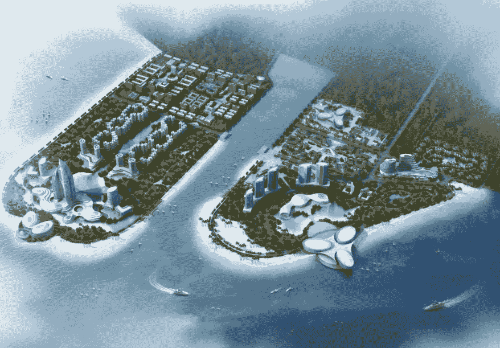
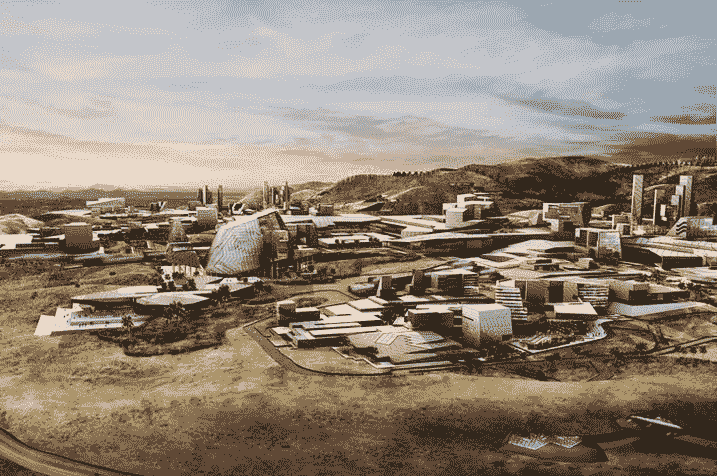
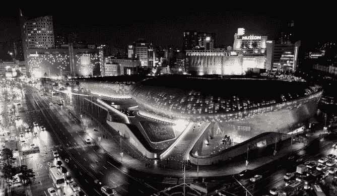
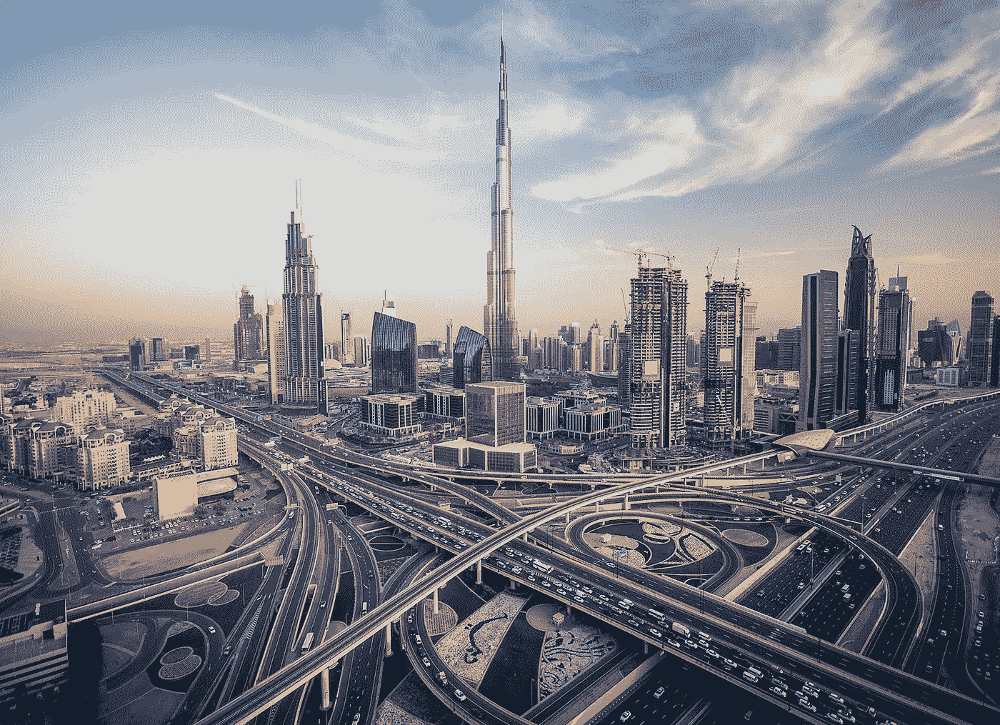
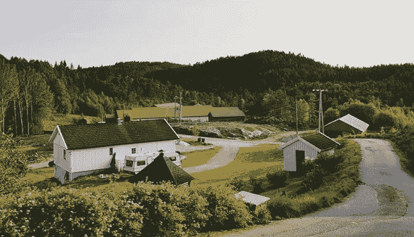

# 区块链智能城市评级——从马六甲海峡市到内华达沙漠的加密项目

> 原文：<https://medium.com/hackernoon/blockchain-smart-cities-rating-from-melaka-straits-city-to-crypto-project-in-nevada-desert-880ff49cf68e>

围绕[区块链](https://hackernoon.com/tagged/blockchain)T2 科技的 agiotage 已经急剧减少。但是现在是在现实生活中采用技术的时候了。想象一下这样一个城市，商品和服务的支付、市政机构之间的数据交换、交通工作和基础设施项目——几乎一切都基于区块链技术。你觉得这种大规模收养看起来像童话故事吗？但这实际上是一个现实，或者在不久的将来会成为现实。

我决定创建一个基于区块链的最有前途的智能城市项目的简短列表，这些项目已经在运行或即将启动。该清单不仅包括开发适用于智能城市特定工作领域的技术解决方案的项目，还包括在具体国家和城市已经开发或即将开发的项目。

# 马六甲海峡城市——马来西亚马六甲

Melaka Straits City Project

马六甲是最受欢迎的游客目的地之一，他们正在马来西亚旅游。这里 835 英亩未开发的马六甲将变成一个真正的区块链城市，叫做马六甲海峡城。该项目由 SWT 国际和中国武夷发起，并得到中国政府的支持。未来城市的建筑由 CPG 公司设计，该公司因开发新加坡国会大厦和樟宜机场而闻名。

该项目计划成为亚洲第一个区块链城市。[项目官员表示](https://malacca.io/)，区块链技术创新将用于改善基础设施条件，结合城市统计数据，高度安全和有保障的示范城市管理，以刺激传统旅游业的发展。

马六甲海峡城市区块链技术的基础将是拥有 DMI 硬币的 DMI 平台。它将主要用于支付城市的政府服务。最初，计划投资近 1.2 亿美元。该项目的合作伙伴之一是中国武夷，世界上最大的建筑控股公司之一福建建工的子公司。

# 美国内华达州区块链

Blockchain Smart City project in Nevada

区块链有限责任公司(Blockchain LLC)是著名的加密货币百万富翁杰弗里·伯恩斯(Jeffrey Berns)拥有的公司，该公司在内华达沙漠购买了 67，000 英亩土地。目标是在这里建造全新的智能城市。

根据项目官员的说法，必须有一个 1000 英亩的科技园区，世界上第一个电子竞技体育场，一个保护数字资产的核加固掩体，以及一个由区块链技术提供动力的全功能智能城市。

据说，该项目的作者伯恩斯已经花费了 2.5 亿至 3 亿美元。尽管如此，在[宣布](https://www.dezeen.com/2018/11/06/blockchain-innovation-park-smart-city-nevada-jeffrey-berns/)之后，该项目还是受到了几家媒体和有影响力的加密人士的批评，因为没有证据表明已经进行了投资，而且该项目过于雄心勃勃。

# 韩国首尔东大门时尚小镇

Dongdaemun Fashion Town

去年，区块链创业公司 Waltonchain 和东大门时尚小镇旅游区[达成了一项关于将区块链技术应用于零售配送、物流、商店管理和客户服务领域的技术协议。](/@Waltonchain_EN/waltonchian-partners-with-dongdaemun-fashion-town-to-initiate-its-first-implementation-of-588524ba5a19)

东大门聚集了包括面料、服装辅料、生产加工、服装设计、零售配送等行业的企业。产品范围从小时尚饰品到人参、器皿、服装、玩具、珠宝等。时尚小镇有 35000 多家店铺。

该项目的作者认为，区块链技术将极大地优化整个城镇的物流和零售系统。

# 智能迪拜—阿联酋迪拜

Dubai, UAE

这是不正确的，不要在候选名单中提到迪拜。如果在以前的案例中，我们谈论的是由企业或富人发起的项目，他们想要创建区块链市，在这种情况下，发起者是政府。迪拜官员推出了[智能迪拜](https://www.ccn.com/can-dubai-become-the-first-blockchain-powered-city-by-2020)，该计划是一个公私合作项目，旨在到 2020 年为市民创造无缝体验的智能城市和由区块链技术驱动的高效城市政府。

为此，他们发起了全球区块链挑战赛，这是一项与区块链相关的比赛，旨在从世界各地寻找最具创新性的区块链创业公司，并吸引他们在迪拜运营。

问题是，除了当局的大声声明，我们仍然没有看到至少在城市管理的某些领域使用区块链技术的案例。你必须承认这是奇怪的，考虑到已经在明年迪拜完全想切换到区块链。

# 城市硬币——挪威利伯斯塔德

Liberstad Smart City

这很难想象，但现在已经是 2019 年 4 月，世界上有一个地方，一整个城市已经完全改用自己的加密货币。这座城市的名字是挪威的利伯斯塔德。当然，你可能听说世界上的一些城镇开始采用某种加密货币。但是 Liberstad [声称](https://www.smartcitiesworld.net/news/norways-first-private-city-adopts-city-coin-3851)是第一个正式采用加密货币作为支付城市服务和工人工资的唯一交换媒介的智能城市。

镇上的官方货币被命名为市币。该密码基于 City Chain，这是一个智能城市平台，支持为智能城市及其居民设计、实施和使用下一代服务。City Coin 的发行者 City Chain Labs 表示，该平台为像 Liberstad 这样的现有和新兴城市提供了在私人、内部和自愿基础上建设和提供服务的机会。

城市硬币可以在交易所和利伯斯塔德的大宗交易市场交易，市内已有 100 多块土地被出售。